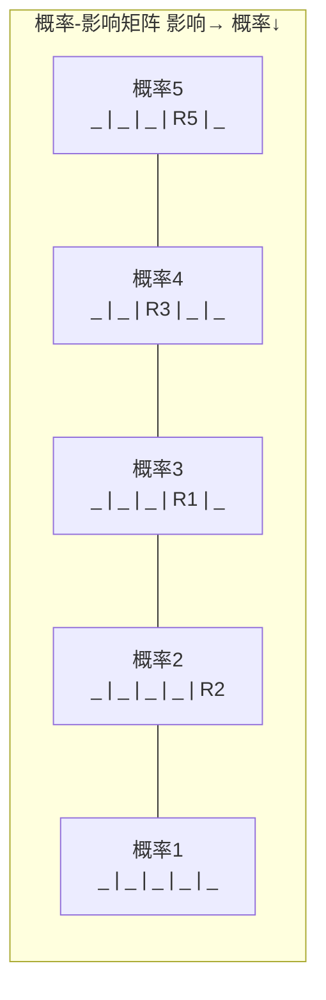
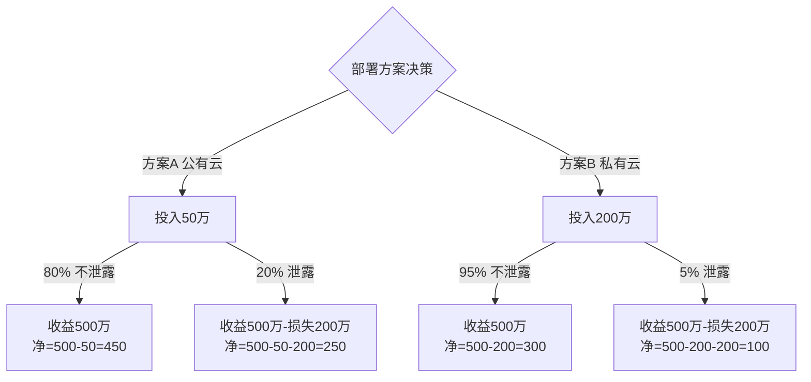

# 习题 - 第5章 软件项目风险管理

> [!info] 本章习题定位
> 第5章聚焦软件项目风险管理，习题覆盖风险分类（已知/未知、技术/管理/商业/外部）、风险识别方法（头脑风暴、检查表、SWOT、德尔菲）、概率-影响矩阵、EMV 计算与决策树、四种风险应对策略（规避/转移/减轻/接受）与应急储备。计算题要求 EMV 计算与风险应对方案选择，为后续挣值分析（[[知识点/第8章 项目跟踪挣值分析与控制/MOC - 第8章]]）的偏差分析提供风险视角。

## 知识点覆盖表

| 题号 | 题型 | 考查知识点 | 对应笔记 |
| --- | --- | --- | --- |
| 5.1 | 单选 | 风险定义 | [[5.1 风险识别与风险分类]] |
| 5.2 | 单选 | 已知风险与未知风险 | [[5.1 风险识别与风险分类]] |
| 5.3 | 单选 | 风险分类 | [[5.1 风险识别与风险分类]] |
| 5.4 | 单选 | 风险识别方法 | [[5.1 风险识别与风险分类]] |
| 5.5 | 单选 | 概率-影响矩阵 | [[5.2 风险评估与风险量化]] |
| 5.6 | 单选 | EMV 公式 | [[5.2 风险评估与风险量化]] |
| 5.7 | 单选 | 风险暴露 RE | [[5.2 风险评估与风险量化]] |
| 5.8 | 单选 | 规避策略 | [[5.3 风险应对策略与风险监控]] |
| 5.9 | 单选 | 转移策略 | [[5.3 风险应对策略与风险监控]] |
| 5.10 | 单选 | 应急储备 | [[5.3 风险应对策略与风险监控]] |
| 5.11 | 多选 | 风险分类 | [[5.1 风险识别与风险分类]] |
| 5.12 | 多选 | 风险识别方法 | [[5.1 风险识别与风险分类]] |
| 5.13 | 多选 | 风险应对策略 | [[5.3 风险应对策略与风险监控]] |
| 5.14 | 多选 | 风险管理过程 | [[5.1 风险识别与风险分类]] |
| 5.15 | 多选 | 风险监控方法 | [[5.3 风险应对策略与风险监控]] |
| 5.16 | 判断 | 风险中性论 | [[5.2 风险评估与风险量化]] |
| 5.17 | 判断 | 转移策略 | [[5.3 风险应对策略与风险监控]] |
| 5.18 | 判断 | 应急储备 | [[5.3 风险应对策略与风险监控]] |
| 5.19 | 判断 | 风险规避 | [[5.3 风险应对策略与风险监控]] |
| 5.20 | 判断 | 决策树 | [[5.2 风险评估与风险量化]] |
| 5.21 | 简答 | 风险管理过程 | [[5.1 风险识别与风险分类]] |
| 5.22 | 简答 | 四种应对策略 | [[5.3 风险应对策略与风险监控]] |
| 5.23 | 简答 | 概率-影响矩阵 | [[5.2 风险评估与风险量化]] |
| 5.24 | 简答 | 应急储备与管理储备 | [[5.3 风险应对策略与风险监控]] |
| 5.25 | 计算 | EMV 与风险排序 | [[5.2 风险评估与风险量化]] |
| 5.26 | 计算 | 决策树方案选择 | [[5.2 风险评估与风险量化]] |
| 5.27 | 计算 | 应急储备计算 | [[5.3 风险应对策略与风险监控]] |
| 5.28 | 计算 | 概率-影响矩阵分析 | [[5.2 风险评估与风险量化]] |
| 5.29 | 综合 | 风险管理综合案例 | [[5.3 风险应对策略与风险监控]] |
| 5.30 | 综合 | 风险应对方案决策 | [[5.3 风险应对策略与风险监控]] |

## 一、单选题（每题 2 分，共 10 题）

**5.1** 项目风险（Risk）是指？

A. 已发生的负面事件  
B. 对项目目标产生正面或负面影响的不确定事件  
C. 必然发生的损失  
D. 无法管理的未知因素

**5.2** "已知-未知风险"（Known-Unknowns）是指？

A. 已识别且已分析的风险，可制定应对计划  
B. 完全未识别的风险  
C. 已发生但无法解决的风险  
D. 不影响项目的风险

**5.3** 因新技术不成熟导致的项目风险属于？

A. 商业风险  
B. 管理风险  
C. 技术风险  
D. 外部风险

**5.4** 下列哪种方法通过"优点-缺点-机会-威胁"四维度分析项目风险？

A. 头脑风暴  
B. 检查表  
C. SWOT 分析  
D. 德尔菲法

**5.5** 概率-影响矩阵（P-I Matrix）的作用是？

A. 计算风险概率  
B. 按风险概率与影响的组合划分风险等级，确定优先级  
C. 消除风险  
D. 转移风险

**5.6** 期望货币价值 EMV 的计算公式是？

A. $EMV = P + I$  
B. $EMV = P \times I$  
C. $EMV = P / I$  
D. $EMV = I - P$

**5.7** 风险暴露（Risk Exposure, RE）的含义是？

A. 风险发生后的实际损失  
B. 风险发生概率与潜在损失的乘积，量化风险大小  
C. 风险的不可控程度  
D. 风险识别的数量

**5.8** "项目团队决定不采用某项不成熟的新技术，改用成熟方案"，这种风险应对策略是？

A. 规避（Avoid）  
B. 转移（Transfer）  
C. 减轻（Mitigate）  
D. 接受（Accept）

**5.9** "为关键服务器购买商业保险"，这种风险应对策略是？

A. 规避  
B. 转移  
C. 减轻  
D. 接受

**5.10** 应急储备（Contingency Reserve）主要用于？

A. 应对已知-未知风险  
B. 应对未知-未知风险  
C. 支付日常运营成本  
D. 项目团队奖金

## 二、多选题（每题 3 分，共 5 题）

**5.11** 按来源分类，软件项目风险包括？（多选）

A. 技术风险  
B. 管理风险  
C. 商业风险  
D. 外部风险  
E. 人员风险

**5.12** 常用的风险识别方法包括？（多选）

A. 头脑风暴  
B. 检查表  
C. SWOT 分析  
D. 德尔菲法  
E. 风险登记册分析

**5.13** 风险应对的四种基本策略是？（多选）

A. 规避（Avoid）  
B. 转移（Transfer）  
C. 减轻（Mitigate）  
D. 接受（Accept）  
E. 隐瞒（Conceal）

**5.14** 项目风险管理的过程包括？（多选）

A. 风险识别  
B. 风险分析（定性 + 定量）  
C. 风险应对规划  
D. 风险监控  
E. 风险隐瞒

**5.15** 风险监控的常用方法包括？（多选）

A. 风险审计  
B. 风险再评估  
C. 偏差与趋势分析（挣值分析）  
D. 应急储备分析  
E. 技术绩效测量

## 三、判断题（每题 2 分，共 5 题）

**5.16** EMV 计算假设决策者是风险中性的，即以期望货币价值最大为决策准则。

**5.17** 风险转移是将风险的责任与后果转给第三方，通常需要支付保费或合同对价，且转移后风险消失。

**5.18** 应急储备用于应对已知-未知风险，管理储备用于应对未知-未知风险，管理储备由项目经理控制。

**5.19** 风险规避是通过修改项目计划消除风险或其触发条件，是最彻底的策略，但有时需付出范围或进度代价。

**5.20** 决策树用树状图表示多个决策分支与概率节点，通过计算各分支 EMV 选择最优方案。

## 四、简答题（每题 6 分，共 4 题）

**5.21** 简述项目风险管理的过程，并说明各过程的产物。

**5.22** 说明风险应对的四种基本策略（规避/转移/减轻/接受），并各举一软件项目实例。

**5.23** 说明概率-影响矩阵的构成与使用方法。

**5.24** 比较应急储备与管理储备的区别。

## 五、计算题（每题 8 分，共 4 题）

**5.25** 某项目识别出三项风险：
- ①需求变更：概率 40%，损失 20 人日；
- ②关键技术不成熟：概率 30%，损失 50 人日；
- ③核心人员离职：概率 20%，损失 30 人日。
请计算各项风险暴露 RE 与总风险暴露，按优先级排序，并给出最高优先级风险的缓解策略。

**5.26** 某项目需开发核心模块，有两个方案：
- 方案 A（自研）：投入 100 万元；70% 概率成功，可获收入 300 万元；30% 概率失败，无收入。
- 方案 B（外包）：投入 150 万元；90% 概率成功，可获收入 300 万元；10% 概率失败，无收入。
请用决策树方法计算两方案的 EMV，并选择最优方案。

**5.27** 某项目识别出四项已知风险，概率与损失如下。请计算各风险 EMV，并确定应预留的应急储备总额。

| 风险 | 概率 | 损失(万元) |
| --- | --- | --- |
| R1 需求变更 | 30% | 10 |
| R2 技术风险 | 20% | 30 |
| R3 人员离职 | 15% | 20 |
| R4 进度延误 | 25% | 15 |

**5.28** 某项目风险概率-影响矩阵采用 5 级量表（概率 1-5，影响 1-5），风险值 = 概率 × 影响。现有四项风险：
- R1：概率 4，影响 3
- R2：概率 2，影响 5
- R3：概率 3，影响 4
- R4：概率 5，影响 2
请计算各风险值，按风险值排序，并按"高风险(≥15)、中风险(8-14)、低风险(≤7)"分级，给出高、中、低风险各应采取的应对策略。

## 六、综合题/案例题（每题 10 分，共 2 题）

**5.29** 某银行核心系统升级项目，识别出以下主要风险：
- R1：监管政策变化（外部风险，概率 30%，影响高）；
- R2：核心技术人员离职（人员风险，概率 20%，影响高）；
- R3：新技术架构不成熟（技术风险，概率 40%，影响中）；
- R4：数据迁移出错（管理风险，概率 25%，影响高）；
- R5：用户需求频繁变更（管理风险，概率 60%，影响中）。
请完成：
1. 用 Mermaid 绘制风险概率-影响矩阵示意图，标注五项风险位置。
2. 对每项风险选择合适的应对策略（规避/转移/减轻/接受），并说明具体措施。
3. 计算 R3 与 R5 的风险值（概率×影响，影响按高=5、中=3、低=1 量化），并比较。
4. 给出该项目的应急储备建议（假设总预算 1000 万，应急储备比例 5%-10%）。

**5.30** 某软件公司需选择云服务部署方案，面临两种选择：
- 方案 A（公有云）：初始投入 50 万，运行成本低，但存在数据泄露风险（概率 20%，潜在损失 200 万）；
- 方案 B（私有云）：初始投入 200 万，运行成本高，但数据泄露风险低（概率 5%，潜在损失 200 万）。
假设两方案 3 年总收益均为 500 万元。请完成：
1. 用决策树计算两方案的净 EMV（考虑初始投入、收益与风险损失）。
2. 选择最优方案并说明理由。
3. 若方案 A 增加安全防护可降低泄露概率至 10%，需额外投入 30 万，是否值得？
4. 用 Mermaid 绘制决策树。

---

## 答案与解析

### 单选题答案

点击展开单选题答案与解析

**5.1 答案：B**
解析：风险是对项目目标产生正面或负面影响的不确定事件，不仅包括负面威胁，也包括正面机会。

**5.2 答案：A**
解析：已知-未知风险指已识别且可分析的风险，可制定应对计划并预留应急储备。完全未识别的是未知-未知风险。

**5.3 答案：C**
解析：因新技术不成熟导致的风险属技术风险。

**5.4 答案：C**
解析：SWOT 通过优点(Strengths)、缺点(Weaknesses)、机会(Opportunities)、威胁(Threats)四维度分析项目风险。

**5.5 答案：B**
解析：概率-影响矩阵按风险概率与影响的组合划分风险等级，确定优先级与应对策略。

**5.6 答案：B**
解析：$EMV = P \times I$（概率 × 影响），是风险量化的基本公式。

**5.7 答案：B**
解析：风险暴露 RE = 概率 × 损失，量化风险大小，又称 EMV。

**5.8 答案：A**
解析：规避通过修改计划消除风险（如改用成熟技术），是最彻底的策略。

**5.9 答案：B**
解析：购买保险是将风险转移给第三方（保险公司），需支付保费。

**5.10 答案：A**
解析：应急储备用于应对已知-未知风险（已识别可分析）；管理储备用于未知-未知风险。

### 多选题答案

点击展开多选题答案与解析

**5.11 答案：A、B、C、D、E**
解析：按来源可分为技术、管理、商业、外部、人员等风险，五项均属于。人员风险常归入管理风险，也可单列。

**5.12 答案：A、B、C、D、E**
解析：风险识别方法包括头脑风暴、检查表、SWOT、德尔菲法、风险登记册分析等，五项均属于。

**5.13 答案：A、B、C、D**
解析：四种基本策略为规避、转移、减轻、接受。E（隐瞒）是错误做法。

**5.14 答案：A、B、C、D**
解析：风险管理过程为识别、分析（定性与定量）、应对规划、监控。E（隐瞒）是错误做法。

**5.15 答案：A、B、C、D、E**
解析：风险监控方法包括风险审计、再评估、偏差与趋势分析、储备分析、技术绩效测量等，五项均属于。

### 判断题答案

点击展开判断题答案与解析

**5.16 答案：正确**
解析：EMV 决策基于风险中性假设，以期望货币价值最大为准则。风险规避型决策者可能不选 EMV 最高但方差大的方案。

**5.17 答案：错误**
解析：转移将风险责任转给第三方，但风险本身并未消失，只是由第三方承担。转移通常需支付保费或合同对价。

**5.18 答案：错误**
解析：应急储备由项目经理控制，用于已知-未知风险；管理储备用于未知-未知风险，由高层（发起人）控制，项目经理使用需批准。

**5.19 答案：正确**
解析：规避通过修改计划消除风险或触发条件，最彻底，但可能需付出范围缩小、进度延长等代价。

**5.20 答案：正确**
解析：决策树用树状图表示决策分支与概率节点，通过 EMV 比较选择最优方案。

### 简答题答案

点击展开简答题参考答案

**5.21 参考答案**
风险管理过程及产物：
1. 风险识别：识别风险来源与事件，产物为风险登记册；
2. 定性风险分析：按概率与影响排序，产物为风险优先级清单；
3. 定量风险分析：量化风险影响（EMV、决策树、蒙特卡洛），产物为量化分析报告；
4. 风险应对规划：制定应对策略，产物为风险应对计划；
5. 风险监控：跟踪风险状态与新风险，产物为风险更新、变更请求。

**5.22 参考答案**
| 策略 | 含义 | 软件项目实例 |
| --- | --- | --- |
| 规避 | 修改计划消除风险 | 不采用不成熟的新框架，改用 Spring |
| 转移 | 将风险责任转给第三方 | 为数据泄露购买网络安全保险；外包非核心模块 |
| 减轻 | 降低概率或影响 | 增加代码评审与测试降低缺陷率；备份降低数据丢失影响 |
| 接受 | 不主动应对，预留储备 | 对影响小的需求变更预留应急缓冲，不额外行动 |

**5.23 参考答案**
概率-影响矩阵构成：
- 横轴为影响等级（很低-很高，1-5）；
- 纵轴为概率等级（很低-很高，1-5）；
- 每个单元格为概率×影响的组合，按值划分为低（绿）、中（黄）、高（红）风险区。
使用方法：将每项风险按概率与影响定位到矩阵，高风险优先应对（规避/转移）、中风险减轻、低风险接受并监控。矩阵帮助团队聚焦关键风险，分配应对资源。

**5.24 参考答案**
| 维度 | 应急储备 | 管理储备 |
| --- | --- | --- |
| 应对对象 | 已知-未知风险（已识别可分析） | 未知-未知风险（未识别） |
| 控制权 | 项目经理控制 | 高层/发起人控制，PM 使用需批准 |
| 计入基准 | 含在成本基准内 | 不含在成本基准内，属组织储备 |
| 计算 | 基于 EMV 或风险值汇总 | 按总预算百分比（如 5%-10%） |

### 计算题答案

点击展开计算题参考答案与完整步骤

**5.25 参考答案**
风险暴露 RE = 概率 × 损失：
- ①需求变更：$RE_1 = 0.4 \times 20 = 8$ 人日
- ②关键技术不成熟：$RE_2 = 0.3 \times 50 = 15$ 人日
- ③核心人员离职：$RE_3 = 0.2 \times 30 = 6$ 人日

总风险暴露 = 8 + 15 + 6 = 29 人日。

按 RE 优先级排序：②（15）> ①（8）> ③（6）。

最高优先级风险（关键技术不成熟）缓解策略：
1. 提前做技术验证 PoC（概念验证）；
2. 引入有经验的技术顾问或外部专家；
3. 准备备选技术方案（Plan B）；
4. 预留风险缓冲时间与资源；
5. 加强技术评审与监控。

**5.26 参考答案**
决策树计算：
方案 A（自研）：
- 成功：收入 300 - 投入 100 = 盈利 200 万，概率 70%
- 失败：收入 0 - 投入 100 = 亏损 100 万，概率 30%
- $EMV_A = 0.7 \times 200 + 0.3 \times (-100) = 140 - 30 = 110$ 万元

方案 B（外包）：
- 成功：收入 300 - 投入 150 = 盈利 150 万，概率 90%
- 失败：收入 0 - 投入 150 = 亏损 150 万，概率 10%
- $EMV_B = 0.9 \times 150 + 0.1 \times (-150) = 135 - 15 = 120$ 万元

比较：$EMV_B (120) > EMV_A (110)$，选择方案 B（外包）。

**5.27 参考答案**
各风险 EMV：
- R1：$0.30 \times 10 = 3$ 万元
- R2：$0.20 \times 30 = 6$ 万元
- R3：$0.15 \times 20 = 3$ 万元
- R4：$0.25 \times 15 = 3.75$ 万元

应急储备总额 = 3 + 6 + 3 + 3.75 = 15.75 万元。

**5.28 参考答案**
风险值 = 概率 × 影响：
- R1：$4 \times 3 = 12$（中风险）
- R2：$2 \times 5 = 10$（中风险）
- R3：$3 \times 4 = 12$（中风险）
- R4：$5 \times 2 = 10$（中风险）

排序（相同则并列）：R1=R3 (12) > R2=R4 (10)。

分级：四项风险值均在 8-14 之间，均为中风险。无高风险（≥15）与低风险（≤7）。

应对策略：
- 高风险（≥15）：优先应对，采取规避或转移；
- 中风险（8-14）：采取减轻策略，降低概率或影响，并密切监控；
- 低风险（≤7）：接受并监控，预留少量应急储备。

### 综合题答案

点击展开综合题参考答案

**5.29 参考答案**
1. 风险概率-影响矩阵示意图（Mermaid）：

注：影响等级 1(很低)-5(很高)，概率等级 1-5。R1(监管,概率3,影响5)、R2(离职,概率2,影响5)、R3(技术,概率4,影响3)、R4(迁移,概率3,影响5)、R5(需求变更,概率5,影响3)。

2. 应对策略：

| 风险 | 策略 | 具体措施 |
| --- | --- | --- |
| R1 监管变化 | 减轻/接受 | 持续跟踪监管动态，预留变更缓冲，与监管机构沟通 |
| R2 核心人员离职 | 减轻 | 关键岗位双备份（AB 角），知识沉淀文档，提高待遇留人 |
| R3 新架构不成熟 | 规避/减轻 | 做 PoC 验证，准备备选成熟架构，引入外部专家 |
| R4 数据迁移出错 | 减轻 | 多轮数据校验，灰度迁移，制定回滚预案，备份数据 |
| R5 需求频繁变更 | 减轻 | 建立变更控制流程（CCB），需求基线管理，迭代交付 |

3. R3 与 R5 风险值（影响：高=5，中=3，低=1）：
- R3：$0.4 \times 3 = 1.2$
- R5：$0.6 \times 3 = 1.8$
R5 风险值（1.8）> R3（1.2），需求变更风险高于技术风险。
注：此处概率用百分比量化，若用 1-5 量表则 R3=4×3=12，R5=5×3=15，结论一致。

4. 应急储备建议：总预算 1000 万，按 5%-10% 比例预留 50-100 万应急储备。鉴于该项目风险较多且影响高（监管、数据迁移），建议取上限 100 万，并按风险优先级分配：
- 高影响风险（R1/R2/R4）各 25 万；
- 中影响风险（R3/R5）各 12.5 万。

**5.30 参考答案**
1. 净 EMV 计算：
方案 A（公有云）：
- 风险损失 EMV = $0.2 \times 200 = 40$ 万
- 净 EMV = 收益 - 投入 - 风险损失 = $500 - 50 - 40 = 410$ 万

方案 B（私有云）：
- 风险损失 EMV = $0.05 \times 200 = 10$ 万
- 净 EMV = $500 - 200 - 10 = 290$ 万

2. 选择方案 A（净 EMV 410 > 290），因为初始投入低且即便考虑泄露风险损失，期望收益仍更高。

3. 方案 A 加防护后：
- 风险损失 EMV = $0.1 \times 200 = 20$ 万
- 总投入 = 50 + 30 = 80 万
- 净 EMV = $500 - 80 - 20 = 400$ 万
比较：加防护后净 EMV（400）< 不加防护（410），从纯 EMV 角度不值得。但若考虑数据泄露对声誉与合规的不可量化影响（如监管处罚、客户流失），加防护可能合理。建议综合非财务因素决策。

4. 决策树（Mermaid）：

净 EMV 验证：
- 方案 A：$0.8 \times 450 + 0.2 \times 250 = 360 + 50 = 410$ 万 ✓
- 方案 B：$0.95 \times 300 + 0.05 \times 100 = 285 + 5 = 290$ 万 ✓

## 考点统计表

| 考查维度 | 题量 | 分值占比 | 难度 |
| --- | --- | --- | --- |
| 风险分类与识别 | 6 | 约 20% | 中 |
| 概率-影响矩阵 | 5 | 约 17% | 中高 |
| EMV 与决策树 | 7 | 约 23% | 高 |
| 风险应对策略 | 6 | 约 20% | 中 |
| 应急储备 | 4 | 约 13% | 中 |
| 风险监控 | 2 | 约 7% | 中 |
| **合计** | **30** | **100%** | — |

## 关联

- 上一级：[[MOC - 软件项目管理]]
- 本章知识点：[[MOC - 第5章]]
- 上一章习题：[[习题-第4章-进度计划CPM&PERT]]
- 下一章习题：[[习题-第6章-配置与变更管理]]
