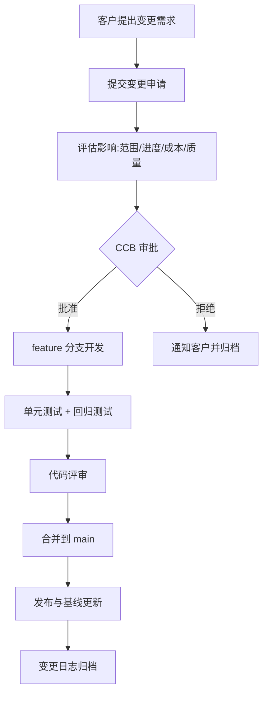
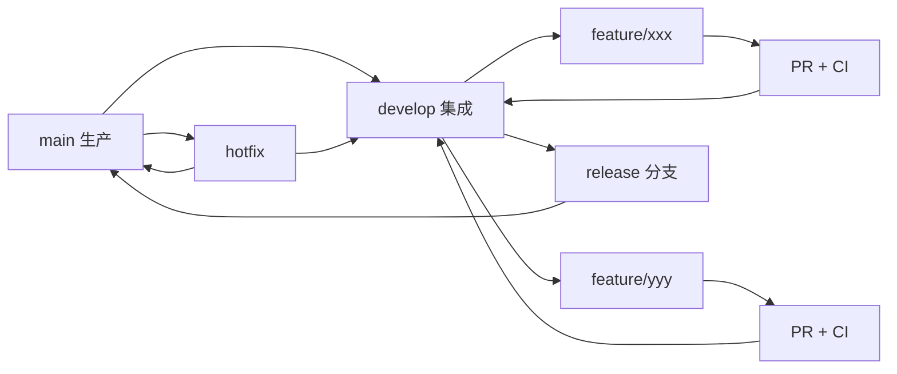

# 习题 - 第6章 配置与变更管理

> [!info] 本章习题定位
> 第6章聚焦软件配置管理（SCM）与变更控制，习题覆盖配置项与基线、Git 工作流（分支策略）、变更控制六步流程、CCB（变更控制委员会）、配置审计（FCA/PCA）与 CI/CD。综合题结合变更场景与 Git 分支策略考查实践能力，与质量管理（[[知识点/第7章 软件质量保障与评审管理/MOC - 第7章]]）的缺陷跟踪形成闭环。

## 知识点覆盖表

| 题号 | 题型 | 考查知识点 | 对应笔记 |
| --- | --- | --- | --- |
| 6.1 | 单选 | 配置管理定义 | [[6.1 配置管理基本概念与版本控制]] |
| 6.2 | 单选 | 配置项 | [[6.1 配置管理基本概念与版本控制]] |
| 6.3 | 单选 | 基线 | [[6.1 配置管理基本概念与版本控制]] |
| 6.4 | 单选 | Git 分布式特性 | [[6.1 配置管理基本概念与版本控制]] |
| 6.5 | 单选 | Git 分支 | [[6.1 配置管理基本概念与版本控制]] |
| 6.6 | 单选 | 变更控制流程 | [[6.2 变更控制流程与CCB]] |
| 6.7 | 单选 | CCB 角色 | [[6.2 变更控制流程与CCB]] |
| 6.8 | 单选 | 配置审计 FCA | [[6.3 配置审计与状态报告]] |
| 6.9 | 单选 | 配置审计 PCA | [[6.3 配置审计与状态报告]] |
| 6.10 | 单选 | CI/CD | [[6.3 配置审计与状态报告]] |
| 6.11 | 多选 | 配置项类型 | [[6.1 配置管理基本概念与版本控制]] |
| 6.12 | 多选 | SCM 核心活动 | [[6.1 配置管理基本概念与版本控制]] |
| 6.13 | 多选 | 变更控制六步 | [[6.2 变更控制流程与CCB]] |
| 6.14 | 多选 | Git 工作流 | [[6.1 配置管理基本概念与版本控制]] |
| 6.15 | 多选 | 配置审计类型 | [[6.3 配置审计与状态报告]] |
| 6.16 | 判断 | Git 集中式 | [[6.1 配置管理基本概念与版本控制]] |
| 6.17 | 判断 | 基线可变性 | [[6.1 配置管理基本概念与版本控制]] |
| 6.18 | 判断 | CCB 决策 | [[6.2 变更控制流程与CCB]] |
| 6.19 | 判断 | FCA 与 PCA | [[6.3 配置审计与状态报告]] |
| 6.20 | 判断 | CI/CD 关系 | [[6.3 配置审计与状态报告]] |
| 6.21 | 简答 | SCM 核心活动 | [[6.1 配置管理基本概念与版本控制]] |
| 6.22 | 简答 | 变更控制六步流程 | [[6.2 变更控制流程与CCB]] |
| 6.23 | 简答 | CCB 组成与职责 | [[6.2 变更控制流程与CCB]] |
| 6.24 | 简答 | FCA 与 PCA 区别 | [[6.3 配置审计与状态报告]] |
| 6.25 | 分析 | Git 分支策略选择 | [[6.1 配置管理基本概念与版本控制]] |
| 6.26 | 分析 | 变更控制案例分析 | [[6.2 变更控制流程与CCB]] |
| 6.27 | 分析 | 基线管理分析 | [[6.1 配置管理基本概念与版本控制]] |
| 6.28 | 分析 | CI/CD 流水线设计 | [[6.3 配置审计与状态报告]] |
| 6.29 | 综合 | 变更控制综合案例 | [[6.2 变更控制流程与CCB]] |
| 6.30 | 综合 | 配置管理综合案例 | [[6.3 配置审计与状态报告]] |

## 一、单选题（每题 2 分，共 10 题）

**6.1** 软件配置管理（SCM）的核心目标是？

A. 提高代码运行效率  
B. 标识、控制、记录与报告配置项的变更，保证一致性与可追溯性  
C. 增加代码行数  
D. 替代质量保证

**6.2** 下列哪项不属于配置项（Configuration Item）？

A. 源代码  
B. 需求文档  
C. 测试用例  
D. 项目团队成员名单

**6.3** 基线（Baseline）是指？

A. 项目开始时的初始版本  
B. 经过正式评审与批准，作为后续变更基准的配置项快照  
C. 最新提交的代码  
D. 测试通过的版本

**6.4** 关于 Git，下列说法正确的是？

A. Git 是集中式版本控制系统  
B. Git 是分布式版本控制系统，支持本地提交与离线操作  
C. Git 不支持分支  
D. Git 只能管理代码，不能管理文档

**6.5** 在 Git 工作流中，"Git Flow"策略的主分支通常是？

A. develop  
B. main（master）与 develop  
C. feature  
D. hotfix

**6.6** 变更控制流程的第一步通常是？

A. 执行变更  
B. 提交变更申请  
C. 通知客户  
D. 修改代码

**6.7** CCB（变更控制委员会）的主要职责是？

A. 编写代码  
B. 评审、批准或拒绝变更申请  
C. 执行测试  
D. 撰写文档

**6.8** 功能配置审计（FCA）主要验证？

A. 配置项的物理完整性（文件是否齐全）  
B. 配置项的功能与性能是否满足需求  
C. 代码风格是否规范  
D. 文档排版是否美观

**6.9** 物理配置审计（PCA）主要验证？

A. 配置项的功能是否正确  
B. 配置项的物理形态（文件、版本、结构）是否与基线一致  
C. 测试覆盖率  
D. 用户满意度

**6.10** CI/CD 中的"CD"通常指？

A. Continuous Delivery（持续交付）  
B. Continuous Deployment（持续部署）  
C. 两者均可，视上下文  
D. Continuous Development

## 二、多选题（每题 3 分，共 5 题）

**6.11** 下列哪些属于配置项？（多选）

A. 源代码与可执行程序  
B. 需求规格说明书与设计文档  
C. 测试用例与测试数据  
D. 编译器与构建脚本  
E. 用户手册

**6.12** 软件配置管理（SCM）的核心活动包括？（多选）

A. 配置标识  
B. 版本控制  
C. 变更控制  
D. 配置状态报告  
E. 配置审计

**6.13** 变更控制的六步流程包括？（多选）

A. 提交变更申请  
B. 评估变更影响  
C. CCB 审批  
D. 执行变更  
E. 变更验证与发布

**6.14** 常见的 Git 工作流包括？（多选）

A. 集中式工作流  
B. Feature Branch 工作流  
C. Git Flow  
D. Forking 工作流  
E. Trunk-Based Development

**6.15** 配置审计的类型包括？（多选）

A. 功能配置审计 FCA  
B. 物理配置审计 PCA  
C. 过程配置审计  
D. 代码风格审计  
E. 安全配置审计

## 三、判断题（每题 2 分，共 5 题）

**6.16** Git 是集中式版本控制系统，所有操作必须连接中央服务器。

**6.17** 基线一旦建立就不可修改，任何对基线的修改都必须通过正式变更控制流程。

**6.18** CCB 的决策是最终决策，项目团队与客户必须执行，不可申诉。

**6.19** FCA 关注配置项功能是否满足需求，PCA 关注配置项物理形态是否与基线一致。

**6.20** 持续集成（CI）是持续交付（CD）的前提，CI 自动化构建与测试，CD 在此基础上自动部署到生产或类生产环境。

## 四、简答题（每题 6 分，共 4 题）

**6.21** 简述软件配置管理（SCM）的五大核心活动。

**6.22** 说明变更控制的六步流程。

**6.23** 说明 CCB 的组成与职责。

**6.24** 比较 FCA 与 PCA 的区别。

## 五、分析题（每题 8 分，共 4 题）

**6.25** 比较 Git Flow、Trunk-Based Development 与 Feature Branch 三种 Git 工作流的适用场景与优缺点，并说明某互联网公司持续发布系统应选哪种。

**6.26** 某项目在测试阶段发现一个严重缺陷，开发人员直接修改代码并提交到生产分支，导致其他功能异常。请分析：
1. 该行为违反了哪些变更控制原则？
2. 应遵循的正确流程是什么？
3. 用 Mermaid 绘制变更控制流程图。

**6.27** 某项目需建立以下基线：需求基线、设计基线、产品基线。请说明：
1. 三种基线的建立时机与内容。
2. 基线建立后如何修改。
3. 基线与版本的关系。

**6.28** 某团队希望实施 CI/CD，请设计一个 CI/CD 流水线，包含代码提交、构建、测试、部署各阶段，并说明每个阶段的自动化工具与产物。

## 六、综合题/案例题（每题 10 分，共 2 题）

**6.29** 某软件项目在交付前一周，客户提出新增"数据导出 PDF"功能的紧急需求。项目经理为维护客户关系，口头同意并由开发人员直接修改代码合并到 main 分支，未经过测试与审批。结果导致原有报表功能异常，项目延期 2 周。请回答：
1. 分析该变更处理过程中存在的问题。
2. 说明正确的变更控制流程应如何执行。
3. 用 Mermaid 绘制变更控制流程图。
4. 说明 Git 分支策略应如何配合（用哪个分支开发、如何合并）。
5. 给出配置审计（FCA/PCA）在交付前的检查要点。

**6.30** 某初创公司从手工部署转向 CI/CD，团队 10 人，每周发布 2 次，主要痛点是集成冲突多、回归测试靠人工、部署易出错。请回答：
1. 设计适合该团队的 Git 工作流（用 Mermaid 绘制分支图）。
2. 设计 CI/CD 流水线各阶段及工具链。
3. 说明配置状态报告应包含哪些内容。
4. 若引入配置审计，FCA 与 PCA 分别检查什么？
5. 给出实施 CI/CD 后的预期收益与风险。

---

## 答案与解析

### 单选题答案

点击展开单选题答案与解析

**6.1 答案：B**
解析：SCM 核心目标是标识、控制、记录与报告配置项变更，保证一致性与可追溯性。

**6.2 答案：D**
解析：配置项是受配置管理控制的工件（代码、文档、测试用例、构建脚本等）。团队成员名单不是配置项。

**6.3 答案：B**
解析：基线是经正式评审批准的配置项快照，作为后续变更的基准。

**6.4 答案：B**
解析：Git 是分布式版本控制系统，支持本地提交与离线操作，支持分支与合并。

**6.5 答案：B**
解析：Git Flow 有两个长期分支：main（生产）与 develop（开发），feature 分支从 develop 拉出。

**6.6 答案：B**
解析：变更控制第一步是提交变更申请（记录变更内容、原因、影响范围）。

**6.7 答案：B**
解析：CCB 负责评审、批准或拒绝变更申请，权衡变更对范围、进度、成本、质量的影响。

**6.8 答案：B**
解析：FCA 验证配置项功能与性能是否满足需求规格。

**6.9 答案：B**
解析：PCA 验证配置项物理形态（文件、版本、结构）是否与基线一致。

**6.10 答案：C**
解析：CI/CD 中 CD 可指 Continuous Delivery（持续交付）或 Continuous Deployment（持续部署），视上下文。前者需人工触发部署，后者全自动部署。

### 多选题答案

点击展开多选题答案与解析

**6.11 答案：A、B、C、D、E**
解析：配置项包括源代码、可执行程序、需求/设计文档、测试用例与数据、构建脚本、用户手册等，五项均属于。

**6.12 答案：A、B、C、D、E**
解析：SCM 五大核心活动为配置标识、版本控制、变更控制、配置状态报告、配置审计。

**6.13 答案：A、B、C、D、E**
解析：变更控制六步为：提交申请、评估影响、CCB 审批、执行变更、验证、发布与归档。五项均属于六步中的关键步骤。

**6.14 答案：A、B、C、D、E**
解析：常见 Git 工作流包括集中式、Feature Branch、Git Flow、Forking、Trunk-Based Development，五项均属于。

**6.15 答案：A、B**
解析：配置审计标准类型为 FCA（功能配置审计）与 PCA（物理配置审计）。其他不是标准 SCM 审计类型。

### 判断题答案

点击展开判断题答案与解析

**6.16 答案：错误**
解析：Git 是分布式版本控制系统，支持本地提交与离线操作，不是集中式。

**6.17 答案：正确**
解析：基线一旦建立不可随意修改，任何修改必须通过正式变更控制流程。

**6.18 答案：错误**
解析：CCB 决策通常为最终技术决策，但重大变更可能需发起人或客户批准，且若决策违反合同或法规，干系人可申诉。

**6.19 答案：正确**
解析：FCA 关注功能是否满足需求，PCA 关注物理形态是否与基线一致。

**6.20 答案：正确**
解析：CI 是 CD 的前提，CI 自动化构建与测试，CD 在此基础上自动部署。

### 简答题答案

点击展开简答题参考答案

**6.21 参考答案**
SCM 五大核心活动：
1. 配置标识：识别配置项并赋予唯一标识与版本号；
2. 版本控制：管理配置项版本演进，支持历史追溯与回滚；
3. 变更控制：通过 CCB 审批变更，确保变更可控；
4. 配置状态报告：记录与报告配置项状态（版本、基线、变更）；
5. 配置审计：通过 FCA 与 PCA 验证配置一致性与完整性。

**6.22 参考答案**
变更控制六步流程：
1. 提交变更申请（记录变更内容、原因、提出人）；
2. 评估变更影响（对范围、进度、成本、质量的影响）；
3. CCB 审批（批准、拒绝或延期）；
4. 执行变更（按批准方案修改配置项）；
5. 变更验证（测试、评审、审计）；
6. 发布与归档（更新基线、记录变更日志、通知干系人）。

**6.23 参考答案**
CCB 组成：通常由项目经理、技术负责人（架构师）、QA 经理、客户代表、产品经理等组成，规模根据项目大小调整。
职责：
- 评审变更申请；
- 权衡变更对范围、进度、成本、质量的影响；
- 批准、拒绝或延期变更；
- 优先级排序与资源分配；
- 记录决策与依据。

**6.24 参考答案**
| 维度 | FCA 功能配置审计 | PCA 物理配置审计 |
| --- | --- | --- |
| 关注 | 配置项功能与性能 | 配置项物理形态 |
| 验证 | 是否满足需求规格 | 文件、版本、结构是否与基线一致 |
| 时机 | 测试后、交付前 | 基线建立与发布前 |
| 方法 | 运行测试、演示功能 | 比对文件清单、版本号、目录结构 |

### 分析题答案

点击展开分析题参考答案

**6.25 参考答案**
| 工作流 | 适用场景 | 优点 | 缺点 |
| --- | --- | --- | --- |
| Git Flow | 有明确发布周期、需多版本维护 | 分支清晰、利于多版本并行 | 分支多、合并复杂 |
| Trunk-Based | 持续发布、团队成熟、强 CI/CD | 集成频繁、冲突少、反馈快 | 需强自动化与特性开关 |
| Feature Branch | 中小团队、功能独立开发 | 简单、隔离性好 | 长分支易冲突 |

某互联网公司持续发布系统应选 Trunk-Based Development，配合特性开关（Feature Toggle）与强 CI/CD，实现高频集成与快速发布。

**6.26 参考答案**
1. 违反原则：
   - 未提交变更申请与 CCB 审批；
   - 未评估变更影响；
   - 直接合并到生产分支，未经测试验证；
   - 绕过变更控制流程，导致回归缺陷。
2. 正确流程：
   - 提交缺陷变更申请；
   - 评估修复对其他功能的影响；
   - CCB 审批（紧急缺陷可走快速通道）；
   - 在 feature/hotfix 分支修复；
   - 测试验证（单元、回归、集成）；
   - 合并到 main 并发布；
   - 记录变更日志。
3. 变更控制流程图（Mermaid）：

**6.27 参考答案**
1. 三种基线：

| 基线 | 建立时机 | 内容 |
| --- | --- | --- |
| 需求基线 | 需求评审通过后 | 需求规格说明书、用例图 |
| 设计基线 | 设计评审通过后 | 概要/详细设计、接口文档 |
| 产品基线 | 测试通过、交付前 | 源代码、可执行程序、用户文档、测试报告 |

2. 修改方式：基线建立后不可直接修改，必须通过变更控制流程（申请→评估→CCB 审批→执行→验证→更新基线）。
3. 基线与版本关系：基线是某一时间点的版本快照，版本是配置项的演进标识。基线由一组特定版本的配置项组成，是后续变更的基准。

**6.28 参考答案**
CI/CD 流水线设计：

| 阶段 | 触发 | 工具 | 产物 |
| --- | --- | --- | --- |
| 代码提交 | 开发者 push | Git（GitHub/GitLab） | 提交记录、分支 |
| 构建 | 提交触发 | Maven/Gradle/npm | 可执行包、镜像 |
| 单元测试 | 构建后 | JUnit/pytest/Jest | 测试报告、覆盖率 |
| 集成测试 | 单元测试通过 | Selenium/Postman | 集成测试报告 |
| 部署 Staging | 测试通过 | Docker/K8s/Jenkins | Staging 环境 |
| 验收测试 | Staging 部署 | UAT 自动化 | 验收报告 |
| 部署生产 | 审批通过 | K8s/ArgoCD | 生产环境 |

### 综合题答案

点击展开综合题参考答案

**6.29 参考答案**
1. 存在问题：
   - 客户口头需求未走变更申请流程；
   - 项目经理口头同意，未经 CCB 审批；
   - 未评估变更对进度、质量的影响；
   - 开发人员直接合并到 main 分支，未经测试；
   - 绕过变更验证，导致回归缺陷；
   - 未更新基线与变更日志。
2. 正确流程：
   - 提交变更申请（记录需求内容、紧急程度）；
   - 评估对进度、成本、质量的影响；
   - CCB 紧急审批（可走快速通道）；
   - 在 feature 分支开发；
   - 单元测试 + 回归测试 + 评审；
   - 合并到 main 并发布；
   - 更新基线与变更日志，通知干系人。
3. 变更控制流程图（Mermaid）：

4. Git 分支策略：
   - 从 develop 或 main 拉出 feature/export-pdf 分支开发；
   - 开发完成后发起 Pull/Merge Request；
   - CI 自动跑测试，评审通过后合并到 develop 或 main；
   - 紧急修复可用 hotfix 分支从 main 拉出，修复后合并回 main 与 develop。
5. 配置审计检查要点：
   - FCA：验证"数据导出 PDF"功能是否按需求实现，性能与兼容性是否满足；原有报表功能是否正常（回归）。
   - PCA：验证交付包文件清单、版本号、目录结构是否与产品基线一致；变更记录是否完整；未授权文件是否混入。

**6.30 参考答案**
1. Git 工作流（Mermaid）：

采用 Feature Branch + develop 集成 + main 生产的简化 Git Flow，适合 10 人团队、每周 2 次发布。

2. CI/CD 流水线：

| 阶段 | 工具 | 自动化 |
| --- | --- | --- |
| 提交 | GitLab/GitHub | 触发 CI |
| 构建 | Maven/Gradle | 自动 |
| 单元测试 | JUnit + JaCoCo | 自动 |
| 集成测试 | Selenium/Postman | 自动 |
| 镜像打包 | Docker | 自动 |
| 部署 Staging | K8s + Jenkins | 自动 |
| 部署生产 | ArgoCD/手动审批 | 半自动 |

3. 配置状态报告内容：
   - 配置项清单与版本号；
   - 当前基线状态（需求/设计/产品基线）；
   - 变更申请与审批记录；
   - 未解决变更与缺陷；
   - 发布历史与回滚记录。
4. FCA 与 PCA 检查：
   - FCA：功能是否满足需求规格，性能是否达标，回归测试是否通过；
   - PCA：交付包文件清单、版本号、目录结构是否与基线一致，变更记录是否完整。
5. 预期收益与风险：
   - 收益：集成冲突减少、回归测试自动化、部署出错率降低、发布频率提升、反馈周期缩短；
   - 风险：自动化脚本维护成本、全自动化部署可能快速扩散缺陷（需金丝雀发布与回滚机制）、团队需适应新流程。

## 考点统计表

| 考查维度 | 题量 | 分值占比 | 难度 |
| --- | --- | --- | --- |
| 配置项与基线 | 6 | 约 20% | 中 |
| Git 工作流 | 5 | 约 17% | 中 |
| 变更控制与 CCB | 8 | 约 27% | 中高 |
| 配置审计 FCA/PCA | 5 | 约 17% | 中 |
| CI/CD | 4 | 约 13% | 中 |
| 配置状态报告 | 2 | 约 6% | 中 |
| **合计** | **30** | **100%** | — |

## 关联

- 上一级：[[MOC - 软件项目管理]]
- 本章知识点：[[MOC - 第6章]]
- 上一章习题：[[习题-第5章-项目风险管理]]
- 下一章习题：[[习题-第7章-软件质量管理]]
