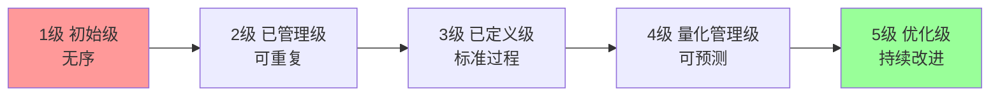
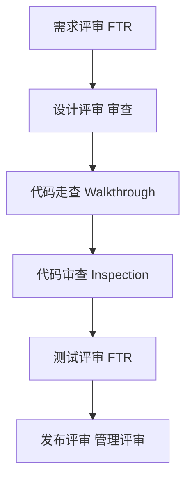
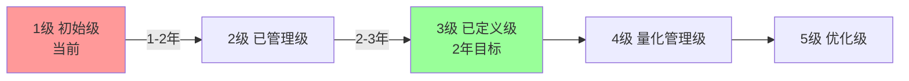

# 习题 - 第7章 软件质量管理

> [!info] 本章习题定位
> 第7章聚焦软件质量保障（SQA），习题覆盖 SQA 活动、质量成本四分类（预防/鉴定/内部失败/外部失败）、CMMI 五级模型、评审类型（FTR/走查/审查）、缺陷度量（缺陷密度、缺陷移除效率）。计算题要求缺陷度量与质量成本分析，并与 [[MOC - 软件测试技术]] 的测试用例设计形成知识关联。

## 知识点覆盖表

| 题号 | 题型 | 考查知识点 | 对应笔记 |
| --- | --- | --- | --- |
| 7.1 | 单选 | 质量定义 | [[7.1 软件质量保障体系]] |
| 7.2 | 单选 | SQA 活动 | [[7.1 软件质量保障体系]] |
| 7.3 | 单选 | 质量成本分类 | [[7.1 软件质量保障体系]] |
| 7.4 | 单选 | 预防成本 | [[7.1 软件质量保障体系]] |
| 7.5 | 单选 | CMMI 五级 | [[7.2 CMMI能力成熟度模型]] |
| 7.6 | 单选 | CMMI 级别判定 | [[7.2 CMMI能力成熟度模型]] |
| 7.7 | 单选 | 评审类型 | [[7.3 评审管理与质量度量]] |
| 7.8 | 单选 | 审查 Inspection | [[7.3 评审管理与质量度量]] |
| 7.9 | 单选 | 缺陷密度 | [[7.3 评审管理与质量度量]] |
| 7.10 | 单选 | 缺陷移除效率 | [[7.3 评审管理与质量度量]] |
| 7.11 | 多选 | SQA 活动 | [[7.1 软件质量保障体系]] |
| 7.12 | 多选 | 质量成本四分类 | [[7.1 软件质量保障体系]] |
| 7.13 | 多选 | CMMI 五级 | [[7.2 CMMI能力成熟度模型]] |
| 7.14 | 多选 | 评审类型 | [[7.3 评审管理与质量度量]] |
| 7.15 | 多选 | 缺陷度量指标 | [[7.3 评审管理与质量度量]] |
| 7.16 | 判断 | 质量成本权衡 | [[7.1 软件质量保障体系]] |
| 7.17 | 判断 | CMMI 第 5 级 | [[7.2 CMMI能力成熟度模型]] |
| 7.18 | 判断 | 走查与审查 | [[7.3 评审管理与质量度量]] |
| 7.19 | 判断 | 缺陷密度 | [[7.3 评审管理与质量度量]] |
| 7.20 | 判断 | SQA 与 QC | [[7.1 软件质量保障体系]] |
| 7.21 | 简答 | SQA 与 QC 区别 | [[7.1 软件质量保障体系]] |
| 7.22 | 简答 | 质量成本四分类 | [[7.1 软件质量保障体系]] |
| 7.23 | 简答 | CMMI 五级特征 | [[7.2 CMMI能力成熟度模型]] |
| 7.24 | 简答 | 评审类型对比 | [[7.3 评审管理与质量度量]] |
| 7.25 | 计算 | 缺陷密度计算 | [[7.3 评审管理与质量度量]] |
| 7.26 | 计算 | 缺陷移除效率 | [[7.3 评审管理与质量度量]] |
| 7.27 | 计算 | 质量成本分析 | [[7.1 软件质量保障体系]] |
| 7.28 | 计算 | CMMI 级别判定 | [[7.2 CMMI能力成熟度模型]] |
| 7.29 | 综合 | 质量管理综合案例 | [[7.3 评审管理与质量度量]] |
| 7.30 | 综合 | CMMI 改进案例 | [[7.2 CMMI能力成熟度模型]] |

## 一、单选题（每题 2 分，共 10 题）

**7.1** 软件"质量"的典型定义是？

A. 代码行数多  
B. 软件满足明确与隐含需求的程度  
C. 测试用例数量  
D. 运行速度快

**7.2** 软件质量保障（SQA）的核心活动不包括？

A. 制定质量标准与计划  
B. 评审与审计  
C. 缺陷度量与分析  
D. 直接编写代码实现功能

**7.3** 质量成本（COQ）的四个分类是？

A. 预防、鉴定、内部失败、外部失败  
B. 设计、编码、测试、部署  
C. 人力、设备、材料、外包  
D. 直接、间接、固定、可变

**7.4** 下列哪项属于"预防成本"？

A. 测试执行成本  
B. 缺陷修复成本  
C. 培训与过程改进成本  
D. 客户投诉处理成本

**7.5** CMMI 五级中，"组织已建立标准过程并裁剪应用到项目"对应第几级？

A. 第 1 级初始级  
B. 第 2 级已管理级  
C. 第 3 级已定义级  
D. 第 4 级量化管理级

**7.6** 某组织开发过程依赖个人英雄主义、无规范、结果不可预测，它处于 CMMI 的？

A. 第 1 级初始级  
B. 第 2 级已管理级  
C. 第 3 级已定义级  
D. 第 5 级优化级

**7.7** 下列哪种评审由作者主持，目的是发现缺陷并学习，过程较非正式？

A. 审查（Inspection）  
B. 走查（Walkthrough）  
C. 技术评审（Technical Review）  
D. 管理评审

**7.8** 审查（Inspection）最显著的特征是？

A. 作者主持  
B. 有正式角色（主持人、朗读者、记录员、评审员）、有检查表、有度量数据  
C. 不需要准备  
D. 不记录缺陷

**7.9** 缺陷密度（Defect Density）的计算公式是？

A. 缺陷数 / 测试用例数  
B. 缺陷数 / KLOC（或功能点）  
C. KLOC / 缺陷数  
D. 测试用例数 / 缺陷数

**7.10** 缺陷移除效率（DRE）的计算公式是？

A. $DRE = 缺陷数 / KLOC$  
B. $DRE = 测试阶段发现的缺陷 / (测试阶段发现的缺陷 + 发布后发现的缺陷) \times 100\%$  
C. $DRE = 发布后缺陷 / 测试缺陷$  
D. $DRE = 测试用例 / 缺陷数$

## 二、多选题（每题 3 分，共 5 题）

**7.11** 软件质量保障（SQA）的活动包括？（多选）

A. 制定质量计划与标准  
B. 评审与审计  
C. 缺陷度量与分析  
D. 过程改进  
E. 配置管理支持

**7.12** 质量成本（COQ）的四分类包括？（多选）

A. 预防成本（Prevention）  
B. 鉴定成本（Appraisal）  
C. 内部失败成本（Internal Failure）  
D. 外部失败成本（External Failure）  
E. 营销成本

**7.13** CMMI 五级包括？（多选）

A. 初始级（1 级）  
B. 已管理级（2 级）  
C. 已定义级（3 级）  
D. 量化管理级（4 级）  
E. 优化级（5 级）

**7.14** 常见的评审类型包括？（多选）

A. 正式技术评审 FTR  
B. 走查（Walkthrough）  
C. 审查（Inspection）  
D. 同行评审（Peer Review）  
E. 管理评审

**7.15** 常用的缺陷度量指标包括？（多选）

A. 缺陷密度（缺陷/KLOC）  
B. 缺陷移除效率 DRE  
C. 缺陷严重等级分布  
D. 缺陷发现速率  
E. 缺陷修复时长

## 三、判断题（每题 2 分，共 5 题）

**7.16** 增加预防与鉴定成本可降低内部与外部失败成本，质量管理的最优策略是找到总质量成本的最低点。

**7.17** CMMI 第 5 级（优化级）强调通过量化反馈持续改进过程，是最高成熟度级别。

**7.18** 走查（Walkthrough）由作者主持，过程较非正式；审查（Inspection）由独立主持人主持，过程正式且有度量数据。

**7.19** 缺陷密度 = 缺陷数 / KLOC，数值越低表示质量越好。

**7.20** SQA（质量保障）与 QC（质量控制）是同一概念，都指测试活动。

## 四、简答题（每题 6 分，共 4 题）

**7.21** 比较 SQA（软件质量保障）与 QC（质量控制）的区别。

**7.22** 说明质量成本（COQ）的四分类，并各举两例软件项目活动。

**7.23** 列出 CMMI 五级并说明每级的特征。

**7.24** 比较 FTR、走查（Walkthrough）与审查（Inspection）三种评审的异同。

## 五、计算题（每题 8 分，共 4 题）

**7.25** 某项目三个模块的代码行与缺陷数如下，请计算各模块缺陷密度（缺陷/KLOC），并比较质量。

| 模块 | 代码行(LOC) | 缺陷数 |
| --- | --- | --- |
| A | 8000 | 40 |
| B | 12000 | 48 |
| C | 5000 | 30 |

**7.26** 某项目测试阶段共发现 80 个缺陷，发布后用户反馈 20 个缺陷。请计算：
1. 缺陷移除效率 DRE。
2. 若目标 DRE 达到 95%，发布后缺陷应控制在多少以内（假设测试发现缺陷数不变）？
3. 说明 DRE 的工程意义。

**7.27** 某项目年度质量成本数据如下，请计算四类成本占比与总质量成本，并分析改进方向。

| 成本类别 | 金额(万元) |
| --- | --- |
| 预防成本（培训、过程改进） | 10 |
| 鉴定成本（测试、评审） | 30 |
| 内部失败成本（返工、调试） | 40 |
| 外部失败成本（保修、客户支持） | 20 |

**7.28** 某组织当前过程无序、依赖个人、缺陷率高、项目经常延期。请回答：
1. 判断该组织所处 CMMI 级别。
2. 列出从当前级别提升到第 3 级（已定义级）应做的主要改进。
3. 用 Mermaid 绘制 CMMI 五级阶梯图。
4. 说明每级提升的关键标志。

## 六、综合题/案例题（每题 10 分，共 2 题）

**7.29** 某软件项目在交付后出现大量缺陷，客户投诉率高。经统计：测试阶段发现 100 个缺陷，发布后 3 个月内用户反馈 50 个缺陷。项目代码总量 50 KLOC，质量成本中预防成本仅占 5%、鉴定成本 25%、内部失败 30%、外部失败 40%。请回答：
1. 计算缺陷密度与缺陷移除效率 DRE。
2. 分析质量成本结构是否合理，说明问题。
3. 给出改进建议（调整哪类成本投入，预期效果）。
4. 设计一个评审流程（含 FTR/走查/审查），用 Mermaid 绘制。
5. 给出缺陷度量的看板指标（至少 5 项）。

**7.30** 某公司希望通过 CMMI 改进，当前处于第 1 级，目标 2 年内达到第 3 级。请回答：
1. 用 Mermaid 绘制 CMMI 五级改进路线图。
2. 列出从 1 级到 2 级、2 级到 3 级的关键改进活动（各至少 4 项）。
3. 说明 SQA、配置管理、评审、缺陷度量在第 3 级应如何制度化。
4. 若改进后缺陷密度从 8 缺陷/KLOC 降至 3 缺陷/KLOC，项目规模 100 KLOC，计算改进前后总缺陷数。
5. 改进过程中可能遇到哪些阻力？如何应对？

---

## 答案与解析

### 单选题答案

点击展开单选题答案与解析

**7.1 答案：B**
解析：软件质量是软件满足明确与隐含需求的程度，包括功能、性能、可靠性、可维护性等。

**7.2 答案：D**
解析：SQA 活动包括制定标准、评审审计、缺陷度量、过程改进等，不包括直接编写代码（那是开发职责）。

**7.3 答案：A**
解析：质量成本四分类为预防、鉴定、内部失败、外部失败。

**7.4 答案：C**
解析：预防成本包括培训、过程改进、质量计划等。A 是鉴定成本，B 是内部失败，D 是外部失败。

**7.5 答案：C**
解析：第 3 级已定义级，组织建立标准过程并裁剪应用到项目。

**7.6 答案：A**
解析：依赖个人英雄主义、无规范、不可预测是第 1 级初始级特征。

**7.7 答案：B**
解析：走查由作者主持，较非正式，目的是发现缺陷并学习。

**7.8 答案：B**
解析：审查有正式角色（主持人、朗读者、记录员、评审员）、检查表与度量数据，是最正式的评审。

**7.9 答案：B**
解析：缺陷密度 = 缺陷数 / KLOC（或功能点）。

**7.10 答案：B**
解析：$DRE = 测试缺陷 / (测试缺陷 + 发布后缺陷) \times 100\%$，衡量测试阶段缺陷移除能力。

### 多选题答案

点击展开多选题答案与解析

**7.11 答案：A、B、C、D、E**
解析：SQA 活动包括制定质量计划与标准、评审审计、缺陷度量、过程改进、配置管理支持等，五项均属于。

**7.12 答案：A、B、C、D**
解析：质量成本四分类为预防、鉴定、内部失败、外部失败。营销成本不属于。

**7.13 答案：A、B、C、D、E**
解析：CMMI 五级为初始级、已管理级、已定义级、量化管理级、优化级。

**7.14 答案：A、B、C、D、E**
解析：评审类型包括 FTR、走查、审查、同行评审、管理评审等，五项均属于。

**7.15 答案：A、B、C、D、E**
解析：缺陷度量指标包括缺陷密度、DRE、严重等级分布、发现速率、修复时长等，五项均属于。

### 判断题答案

点击展开判断题答案与解析

**7.16 答案：正确**
解析：增加预防与鉴定成本可降低失败成本，质量管理最优策略是找到总质量成本最低点（预防成本适当增加）。

**7.17 答案：正确**
解析：CMMI 第 5 级优化级通过量化反馈持续改进，是最高成熟度。

**7.18 答案：正确**
解析：走查由作者主持、非正式；审查由独立主持人主持、正式且有度量。

**7.19 答案：正确**
解析：缺陷密度越低表示质量越好（单位代码缺陷少）。

**7.20 答案：错误**
解析：SQA 是过程导向的预防性活动（保障过程质量），QC 是产品导向的检测性活动（测试找缺陷），二者不同。

### 简答题答案

点击展开简答题参考答案

**7.21 参考答案**
| 维度 | SQA 软件质量保障 | QC 质量控制 |
| --- | --- | --- |
| 导向 | 过程导向、预防性 | 产品导向、检测性 |
| 活动 | 制定标准、评审审计、过程改进 | 测试、缺陷检测 |
| 时机 | 贯穿全过程 | 主要在测试阶段 |
| 目标 | 保障过程质量以预防缺陷 | 发现并修复缺陷 |
| 执行者 | QA 团队 | 测试团队 |

**7.22 参考答案**
| 类别 | 含义 | 软件项目实例 |
| --- | --- | --- |
| 预防成本 | 防止缺陷发生 | 培训、过程改进、质量计划 |
| 鉴定成本 | 检测缺陷 | 测试执行、代码评审、审计 |
| 内部失败成本 | 交付前缺陷修复 | 返工、调试、重新测试 |
| 外部失败成本 | 交付后缺陷处理 | 保修、客户支持、赔偿、声誉损失 |

**7.23 参考答案**
CMMI 五级：
1. 初始级（1 级）：过程无序，依赖个人英雄主义，结果不可预测；
2. 已管理级（2 级）：建立基本项目管理，过程可重复，需求与目标可实现；
3. 已定义级（3 级）：建立组织级标准过程并裁剪应用，过程一致可理解；
4. 量化管理级（4 级）：用量化度量与统计技术管理过程，质量与性能可预测；
5. 优化级（5 级）：通过量化反馈持续改进过程，不断优化。

**7.24 参考答案**
| 维度 | FTR 正式技术评审 | 走查 Walkthrough | 审查 Inspection |
| --- | --- | --- | --- |
| 主持人 | 技术负责人 | 作者 | 独立主持人 |
| 正式度 | 中 | 低 | 高 |
| 角色 | 评审员 | 作者+评审员 | 主持人/朗读者/记录员/评审员 |
| 检查表 | 可选 | 无 | 有 |
| 度量数据 | 部分 | 无 | 有 |
| 目的 | 发现缺陷、评估质量 | 发现缺陷、学习 | 严格发现缺陷、过程改进 |

### 计算题答案

点击展开计算题参考答案与完整步骤

**7.25 参考答案**
缺陷密度 = 缺陷数 / KLOC：

| 模块 | 计算 | 缺陷密度(缺陷/KLOC) |
| --- | --- | --- |
| A | 40 / 8 | 5.0 |
| B | 48 / 12 | 4.0 |
| C | 30 / 5 | 6.0 |

比较：B 模块质量最好（4.0），C 模块质量最差（6.0），A 居中（5.0）。建议对 C 模块加强评审与测试。

**7.26 参考答案**
1. $DRE = \frac{测试缺陷}{测试缺陷 + 发布后缺陷} \times 100\% = \frac{80}{80 + 20} \times 100\% = 80\%$

2. 目标 DRE = 95%，测试缺陷 = 80：
$$0.95 = \frac{80}{80 + X}$$
$$80 + X = 80 / 0.95 \approx 84.21$$
$$X \approx 4.21$$
发布后缺陷应控制在 4 个以内（取整 4 个）。

3. DRE 工程意义：衡量测试阶段缺陷移除能力，DRE 越高表示测试越有效，发布后遗漏缺陷越少。DRE ≥ 95% 通常被认为是高质量测试的标志。

**7.27 参考答案**
总质量成本 = 10 + 30 + 40 + 20 = 100 万元。

各类占比：

| 成本类别 | 金额(万元) | 占比 |
| --- | --- | --- |
| 预防成本 | 10 | 10% |
| 鉴定成本 | 30 | 30% |
| 内部失败成本 | 40 | 40% |
| 外部失败成本 | 20 | 20% |

分析：失败成本占比 60%（内部 40% + 外部 20%），过高；预防成本仅 10%，偏低。改进方向：增加预防成本投入（培训、过程改进、评审），将失败成本前置为预防与鉴定成本，降低总质量成本。预期：预防成本提升至 20%，失败成本可降至 30%，总成本下降。

**7.28 参考答案**
1. 该组织处于 CMMI 第 1 级初始级（过程无序、依赖个人、缺陷率高、延期）。

2. 提升到第 3 级（已定义级）的改进：
   - 1→2 级：建立基本项目管理（需求管理、项目计划与跟踪、配置管理、质量保证），使过程可重复；
   - 2→3 级：建立组织级标准过程库，制定裁剪指南，项目按标准过程裁剪执行，统一培训，过程一致可理解。

3. CMMI 五级阶梯图（Mermaid）：

4. 每级提升关键标志：
   - 1→2：从无序到可重复（建立基本项目管理）；
   - 2→3：从项目级到组织级标准过程；
   - 3→4：从定性到量化管理（统计技术）；
   - 4→5：从量化管理到持续改进（优化）。

### 综合题答案

点击展开综合题参考答案

**7.29 参考答案**
1. 缺陷密度与 DRE：
   - 总缺陷 = 100（测试）+ 50（发布后）= 150
   - 缺陷密度 = 150 / 50 = 3 缺陷/KLOC
   - $DRE = 100 / (100 + 50) \times 100\% = 66.7\%$
   缺陷密度偏高，DRE 仅 66.7%（远低于 95% 目标），测试有效性不足。

2. 质量成本结构分析：
   - 预防 5% + 鉴定 25% + 内部失败 30% + 外部失败 40%
   - 失败成本 70%（内部 30% + 外部 40%），过高；预防成本 5%，严重不足。
   - 问题：重检测轻预防，缺陷大量遗漏到发布后，外部失败成本高。

3. 改进建议：
   - 增加预防成本至 20%（培训、过程改进、需求评审、设计评审）；
   - 增加鉴定成本至 30%（加强单元测试、集成测试、自动化测试）；
   - 预期失败成本降至 50% 以下，总质量成本下降；
   - 引入评审前置缺陷发现（评审发现的缺陷修复成本远低于发布后）。

4. 评审流程（Mermaid）：

5. 缺陷度量看板指标：
   - 缺陷密度（缺陷/KLOC）；
   - 缺陷移除效率 DRE；
   - 缺陷严重等级分布（致命/严重/一般/轻微）；
   - 缺陷发现速率（缺陷/天）；
   - 缺陷修复时长（平均修复时间）；
   - 缺陷重开率（修复后再次出现的比例）；
   - 缺陷来源分布（需求/设计/编码/测试）。

**7.30 参考答案**
1. CMMI 五级改进路线图（Mermaid）：

2. 关键改进活动：
   1→2 级：
   - 建立需求管理与需求基线；
   - 建立项目计划与进度跟踪（WBS、甘特图）；
   - 实施配置管理（版本控制、基线）；
   - 建立 SQA 职能与质量保证活动；
   - 建立子合同管理（如有外包）。
   2→3 级：
   - 建立组织级标准过程库（OPD）；
   - 制定项目裁剪指南（OPF）；
   - 建立组织级培训计划（OT）；
   - 实施同行评审制度化（IPM）；
   - 集成项目管理（IPM）。

3. 第 3 级制度化：
   - SQA：建立组织级质量标准与 SQA 流程，项目按标准执行；
   - 配置管理：建立组织级配置管理规范，统一工具与流程；
   - 评审：同行评审制度化，纳入过程库；
   - 缺陷度量：建立组织级缺陷度量标准，项目按统一指标收集与分析。

4. 缺陷数计算：
   - 改进前：$8 \times 100 = 800$ 缺陷
   - 改进后：$3 \times 100 = 300$ 缺陷
   - 减少 500 缺陷，降幅 62.5%。

5. 阻力与应对：
   - 阻力：团队认为流程繁琐、抵触文档工作、担心影响效率、管理层短期压力。
   - 应对：高层支持与示范、渐进推进（先试点后推广）、培训沟通说明价值、量化改进收益（如缺陷下降）、工具支持降低流程成本。

## 考点统计表

| 考查维度 | 题量 | 分值占比 | 难度 |
| --- | --- | --- | --- |
| SQA 活动 | 5 | 约 17% | 中 |
| 质量成本 | 5 | 约 17% | 中 |
| CMMI 五级 | 7 | 约 23% | 中高 |
| 评审类型 | 5 | 约 17% | 中 |
| 缺陷度量 | 6 | 约 20% | 中高 |
| 综合改进 | 2 | 约 6% | 高 |
| **合计** | **30** | **100%** | — |

## 关联

- 上一级：[[MOC - 软件项目管理]]
- 本章知识点：[[MOC - 第7章]]
- 关联测试技术：[[MOC - 软件测试技术]]
- 上一章习题：[[习题-第6章-配置与变更管理]]
- 下一章习题：[[习题-第8章-挣值分析项目跟踪]]
