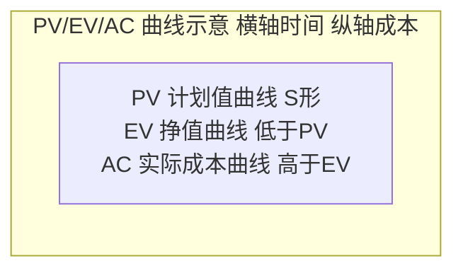
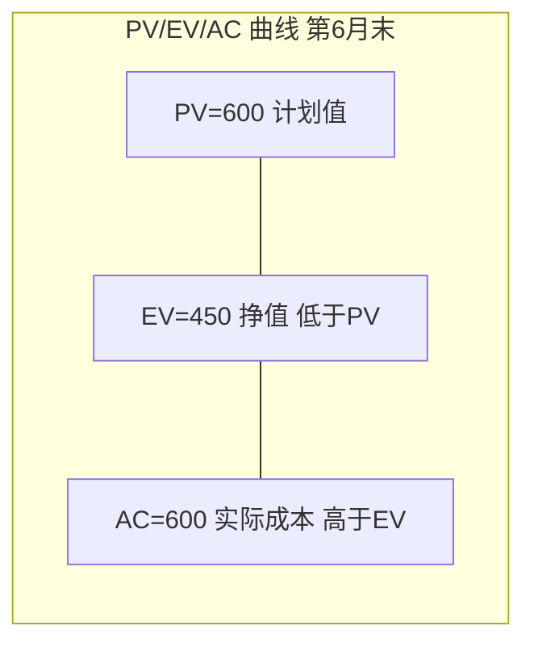
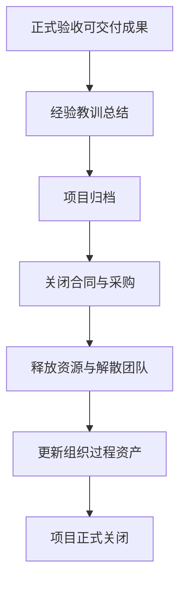

# 习题 - 第8章 挣值分析与项目跟踪

> [!info] 本章习题定位
> 第8章是计算题重点章，习题覆盖 PV/EV/AC 三基值、SV/CV/SPI/CPI 偏差与绩效指标、EAC/ETC/VAC 完工预测与项目收尾。计算题要求完整挣值分析（给定 PV/EV/AC，计算所有偏差、绩效指标与 EAC 预测），是期末与课程设计的核心考点，与第4章 CPM（[[知识点/第4章 进度规划甘特图关键路径PERT/MOC - 第4章]]）的进度基准形成监控闭环。

## 知识点覆盖表

| 题号 | 题型 | 考查知识点 | 对应笔记 |
| --- | --- | --- | --- |
| 8.1 | 单选 | PV 计划值 | [[8.2 挣值分析（EVA）核心指标]] |
| 8.2 | 单选 | EV 挣值 | [[8.2 挣值分析（EVA）核心指标]] |
| 8.3 | 单选 | AC 实际成本 | [[8.2 挣值分析（EVA）核心指标]] |
| 8.4 | 单选 | SV 进度偏差 | [[8.2 挣值分析（EVA）核心指标]] |
| 8.5 | 单选 | CV 成本偏差 | [[8.2 挣值分析（EVA）核心指标]] |
| 8.6 | 单选 | SPI 含义 | [[8.2 挣值分析（EVA）核心指标]] |
| 8.7 | 单选 | CPI 含义 | [[8.2 挣值分析（EVA）核心指标]] |
| 8.8 | 单选 | EAC 公式 | [[8.3 预测与项目收尾]] |
| 8.9 | 单选 | VAC 含义 | [[8.3 预测与项目收尾]] |
| 8.10 | 单选 | BAC 定义 | [[8.2 挣值分析（EVA）核心指标]] |
| 8.11 | 多选 | 三基值定义 | [[8.2 挣值分析（EVA）核心指标]] |
| 8.12 | 多选 | 偏差与绩效指标 | [[8.2 挣值分析（EVA）核心指标]] |
| 8.13 | 多选 | EAC 公式变体 | [[8.3 预测与项目收尾]] |
| 8.14 | 多选 | 项目收尾活动 | [[8.3 预测与项目收尾]] |
| 8.15 | 多选 | EVA 工程意义 | [[8.2 挣值分析（EVA）核心指标]] |
| 8.16 | 判断 | EV 与 AC 关系 | [[8.2 挣值分析（EVA）核心指标]] |
| 8.17 | 判断 | CPI 判断 | [[8.2 挣值分析（EVA）核心指标]] |
| 8.18 | 判断 | EAC 公式假设 | [[8.3 预测与项目收尾]] |
| 8.19 | 判断 | VAC 含义 | [[8.3 预测与项目收尾]] |
| 8.20 | 判断 | 项目收尾 | [[8.3 预测与项目收尾]] |
| 8.21 | 简答 | EVA 三基值 | [[8.2 挣值分析（EVA）核心指标]] |
| 8.22 | 简答 | 偏差与绩效指标 | [[8.2 挣值分析（EVA）核心指标]] |
| 8.23 | 简答 | EAC 公式变体 | [[8.3 预测与项目收尾]] |
| 8.24 | 简答 | 项目收尾过程 | [[8.3 预测与项目收尾]] |
| 8.25 | 计算 | 基础挣值分析 | [[8.2 挣值分析（EVA）核心指标]] |
| 8.26 | 计算 | 完整挣值分析 | [[8.2 挣值分析（EVA）核心指标]] |
| 8.27 | 计算 | EAC 公式变体 | [[8.3 预测与项目收尾]] |
| 8.28 | 计算 | 项目绩效综合分析 | [[8.3 预测与项目收尾]] |
| 8.29 | 综合 | 挣值分析综合案例 | [[8.3 预测与项目收尾]] |
| 8.30 | 综合 | 项目跟踪与收尾案例 | [[8.3 预测与项目收尾]] |

## 一、单选题（每题 2 分，共 10 题）

**8.1** 计划值（PV）的含义是？

A. 实际完成工作的预算成本  
B. 截至某时点计划完成工作的预算成本  
C. 实际花费  
D. 完工总预算

**8.2** 挣值（EV）的别名是？

A. BCWS  
B. BCWP  
C. ACWP  
D. BAC

**8.3** 实际成本（AC）是指？

A. 计划完成工作的预算  
B. 实际完成工作的预算  
C. 截至某时点实际完成工作的实际花费  
D. 完工总预算

**8.4** 进度偏差 SV 的公式是？

A. $SV = EV - AC$  
B. $SV = EV - PV$  
C. $SV = PV - EV$  
D. $SV = AC - EV$

**8.5** 成本偏差 CV < 0 表示？

A. 成本节约  
B. 成本超支  
C. 进度提前  
D. 进度落后

**8.6** SPI = 0.8 表示？

A. 进度提前 20%  
B. 实际只完成计划工作量的 80%，进度落后  
C. 成本节约 20%  
D. 成本超支 20%

**8.7** CPI = 1.2 表示？

A. 成本超支 20%  
B. 成本节约，每 1 元完成 1.2 元预算的工作  
C. 进度提前 20%  
D. 进度落后

**8.8** 最常用的 EAC 公式（假设剩余工作按当前 CPI 推进）是？

A. $EAC = AC + (BAC - EV)$  
B. $EAC = AC + \frac{BAC - EV}{CPI}$  
C. $EAC = BAC / CPI$  
D. $EAC = AC + \frac{BAC - EV}{CPI \times SPI}$

**8.9** VAC = BAC - EAC，若 VAC < 0 表示？

A. 完工时低于预算（节约）  
B. 完工时超预算（超支）  
C. 完工时符合预算  
D. 与预算无关

**8.10** 完工预算 BAC 是指？

A. 项目全部计划工作的预算总成本  
B. 实际总花费  
C. 剩余工作的预算  
D. 项目变更后的预算

## 二、多选题（每题 3 分，共 5 题）

**8.11** 挣值分析的三个基本指标是？（多选）

A. PV 计划值  
B. EV 挣值  
C. AC 实际成本  
D. BAC 完工预算  
E. EAC 完工估算

**8.12** 挣值分析的偏差与绩效指标包括？（多选）

A. SV 进度偏差  
B. CV 成本偏差  
C. SPI 进度绩效指数  
D. CPI 成本绩效指数  
E. VAC 完工偏差

**8.13** EAC 的公式变体包括？（多选）

A. $EAC = AC + \frac{BAC - EV}{CPI}$（按当前 CPI 推进）  
B. $EAC = AC + (BAC - EV)$（剩余按原预算）  
C. $EAC = AC + \frac{BAC - EV}{CPI \times SPI}$（进度与成本共同影响）  
D. $EAC = AC + ETC_{自下而上}$（重新估算剩余）  
E. $EAC = BAC \times SPI$

**8.14** 项目收尾的活动包括？（多选）

A. 正式验收可交付成果  
B. 总结经验教训与归档  
C. 释放资源与解散团队  
D. 关闭合同与采购  
E. 更新组织过程资产

**8.15** 挣值分析（EVA）的工程意义包括？（多选）

A. 综合范围、进度、成本三约束的绩效测量  
B. 解决"只看钱不看进度"或"只看进度不看钱"的盲区  
C. 提供完工预测依据  
D. 量化偏差，支持纠正措施决策  
E. 替代质量保证活动

## 三、判断题（每题 2 分，共 5 题）

**8.16** EV 与实际花费 AC 无关，只与已完成工作的预算成本有关。

**8.17** CPI > 1 表示成本节约，CPI < 1 表示成本超支。

**8.18** 公式 $EAC = AC + \frac{BAC - EV}{CPI}$ 假设当前偏差具有代表性，剩余工作按当前成本效率 CPI 推进。

**8.19** VAC = BAC - EAC，VAC > 0 表示完工时超支。

**8.20** 项目收尾时需进行经验教训总结并归档，更新组织过程资产，是项目最后一个过程组的活动。

## 四、简答题（每题 6 分，共 4 题）

**8.21** 说明挣值分析（EVA）三个基本指标 PV、EV、AC 的含义与区别。

**8.22** 列出 SV、CV、SPI、CPI 的公式与判断规则（>0/=0/<0 或 >1/=1/<1 的含义）。

**8.23** 说明 EAC 的四种公式变体及其适用场景。

**8.24** 简述项目收尾的主要活动与产物。

## 五、计算题（每题 8 分，共 4 题）

**8.25** 某项目 BAC = 200 万元，截至当前 PV = 100 万元，EV = 80 万元，AC = 90 万元。请计算：
1. SV、CV。
2. SPI、CPI。
3. 判断项目进度与成本绩效。
4. EAC（按当前 CPI 推进）、ETC、VAC。

**8.26** 某项目 BAC = 500 万元，工期 12 个月，截至第 6 月末计划完成 50%。实际数据：AC = 220 万元，EV = 200 万元。请计算：
1. PV。
2. SV、CV、SPI、CPI。
3. EAC、ETC、VAC（按当前 CPI 推进）。
4. 预测完工工期（假设剩余工作按 SPI 推进）。

**8.27** 某项目 BAC = 100 万元，EV = 40 万元，AC = 50 万元，PV = 45 万元。请用四种 EAC 公式分别计算完工估算：
1. 按当前 CPI 推进。
2. 剩余按原预算推进。
3. 进度与成本共同影响（CPI×SPI）。
4. 比较四种结果，说明哪种最保守。

**8.28** 某项目 BAC = 300 万元，工期 12 个月。截至第 6 月末（计划进度 50%），实际花费 180 万元，实际完成 40%。请完成完整挣值分析：
1. 计算 PV、EV、AC。
2. 计算 SV、CV、SPI、CPI。
3. 计算按当前 CPI 推进的 EAC、ETC、VAC。
4. 用 Mermaid 绘制 PV/EV/AC 三曲线示意图。
5. 给出项目状态判断与改进建议。

## 六、综合题/案例题（每题 10 分，共 2 题）

**8.29** 某软件项目 BAC = 1000 万元，工期 10 个月，分 5 个里程碑（每 2 个月一个）。截至第 6 月末（第 3 里程碑），计划完成 60%，实际完成 45%，实际花费 600 万元。请回答：
1. 计算 PV、EV、AC、SV、CV、SPI、CPI。
2. 计算 EAC、ETC、VAC（按当前 CPI 推进）。
3. 预测完工工期（按 SPI 推进）。
4. 判断项目状态（进度/成本），并分析可能原因。
5. 给出三项改进措施，并说明对应的指标改善目标。
6. 用 Mermaid 绘制挣值分析曲线图。

**8.30** 某项目进入收尾阶段，BAC = 800 万元，EV = 800 万元（100% 完成），AC = 880 万元，PV = 800 万元。请回答：
1. 计算 SV、CV、SPI、CPI、VAC。
2. 判断项目最终绩效。
3. 列出项目收尾的完整活动清单与产物。
4. 用 Mermaid 绘制项目收尾流程图。
5. 说明经验教训总结应包含哪些内容，如何归档为组织过程资产。
6. 若项目存在未关闭合同与遗留缺陷，应如何处理？

---

## 答案与解析

### 单选题答案

点击展开单选题答案与解析

**8.1 答案：B**
解析：PV 是截至某时点计划完成工作的预算成本，又称 BCWS。

**8.2 答案：B**
解析：EV 又称 BCWP（Budgeted Cost of Work Performed）。

**8.3 答案：C**
解析：AC 是截至某时点实际完成工作的实际花费，又称 ACWP。

**8.4 答案：B**
解析：$SV = EV - PV$，正值提前，负值落后。

**8.5 答案：B**
解析：$CV = EV - AC$，CV < 0 表示成本超支。

**8.6 答案：B**
解析：SPI = EV/PV = 0.8，表示实际只完成计划工作量的 80%，进度落后。

**8.7 答案：B**
解析：CPI = 1.2 表示成本节约，每花费 1 元完成 1.2 元预算的工作。

**8.8 答案：B**
解析：最常用 EAC 公式 $EAC = AC + \frac{BAC - EV}{CPI}$，假设剩余按当前 CPI 推进。

**8.9 答案：B**
解析：VAC = BAC - EAC < 0 表示完工超支。

**8.10 答案：A**
解析：BAC 是项目全部计划工作的预算总成本。

### 多选题答案

点击展开多选题答案与解析

**8.11 答案：A、B、C**
解析：三基值为 PV、EV、AC。BAC 是基准，EAC 是预测，不属于三基值。

**8.12 答案：A、B、C、D**
解析：偏差与绩效指标为 SV、CV、SPI、CPI。VAC 属完工预测，不属于偏差/绩效指标。

**8.13 答案：A、B、C、D**
解析：EAC 四种变体均属于标准公式。E（$EAC = BAC \times SPI$）不是标准公式。

**8.14 答案：A、B、C、D、E**
解析：项目收尾包括正式验收、经验教训归档、释放资源、关闭合同、更新组织过程资产，五项均属于。

**8.15 答案：A、B、C、D**
解析：EVA 综合三约束、解决盲区、提供预测、支持决策。E 错误，EVA 不替代质量保证。

### 判断题答案

点击展开判断题答案与解析

**8.16 答案：正确**
解析：EV = 已完成工作的预算成本，与实际花费 AC 无关。

**8.17 答案：正确**
解析：CPI > 1 成本节约，CPI < 1 成本超支，CPI = 1 符合预算。

**8.18 答案：正确**
解析：该公式假设当前偏差具代表性，剩余按当前 CPI 推进。

**8.19 答案：错误**
解析：VAC > 0 表示完工节约（BAC > EAC），VAC < 0 表示超支。

**8.20 答案：正确**
解析：项目收尾是最后一个过程组，包括经验教训总结、归档、更新组织过程资产。

### 简答题答案

点击展开简答题参考答案

**8.21 参考答案**
| 指标 | 含义 | 别名 | 口径 |
| --- | --- | --- | --- |
| PV | 截至某时点计划完成工作的预算成本 | BCWS | 预算 × 计划进度 |
| EV | 截至某时点实际完成工作的预算成本 | BCWP | 预算 × 实际进度 |
| AC | 截至某时点实际完成工作的实际花费 | ACWP | 实际花费 |

区别：PV 是"计划做多少"，EV 是"实际做了多少（按预算计）"，AC 是"实际花了多少"。EV 与 AC 无关，只与已完成工作的预算有关。

**8.22 参考答案**
| 指标 | 公式 | >0 / >1 | =0 / =1 | <0 / <1 |
| --- | --- | --- | --- | --- |
| SV | EV - PV | 进度提前 | 符合计划 | 进度落后 |
| CV | EV - AC | 成本节约 | 符合预算 | 成本超支 |
| SPI | EV/PV | 进度提前 | 符合计划 | 进度落后 |
| CPI | EV/AC | 成本节约 | 符合预算 | 成本超支 |

**8.23 参考答案**
EAC 四种公式变体：

| 假设 | 公式 | 适用场景 |
| --- | --- | --- |
| 剩余按当前 CPI | $EAC = AC + \frac{BAC - EV}{CPI}$ | 当前偏差具代表性，将持续到完工 |
| 剩余按原预算 | $EAC = AC + (BAC - EV)$ | 当前偏差是偶然的，剩余按计划 |
| 进度成本共同影响 | $EAC = AC + \frac{BAC - EV}{CPI \times SPI}$ | 进度落后影响成本（加资源赶工） |
| 重新估算剩余 | $EAC = AC + ETC_{自下而上}$ | 原估算失效，重新估算 |

**8.24 参考答案**
项目收尾活动与产物：
1. 正式验收可交付成果 → 验收单、最终交付物；
2. 经验教训总结 → 经验教训文档；
3. 项目归档 → 项目档案（计划、报告、变更日志、基线）；
4. 释放资源 → 资源释放清单、团队解散通知；
5. 关闭合同与采购 → 合同关闭单、最终付款；
6. 更新组织过程资产 → 更新过程库、模板、历史信息。

### 计算题答案

点击展开计算题参考答案与完整步骤

**8.25 参考答案**
已知：BAC = 200 万，PV = 100 万，EV = 80 万，AC = 90 万。

1. 偏差：
$$SV = EV - PV = 80 - 100 = -20 \text{ 万（进度落后）}$$
$$CV = EV - AC = 80 - 90 = -10 \text{ 万（成本超支）}$$

2. 绩效指数：
$$SPI = \frac{EV}{PV} = \frac{80}{100} = 0.8 \text{（进度落后，完成 80%）}$$
$$CPI = \frac{EV}{AC} = \frac{80}{90} \approx 0.89 \text{（成本超支）}$$

3. 判断：进度落后（SV<0, SPI<1），成本超支（CV<0, CPI<1）。

4. 完工预测（按当前 CPI 推进）：
$$EAC = AC + \frac{BAC - EV}{CPI} = 90 + \frac{200 - 80}{0.89} = 90 + \frac{120}{0.89} \approx 90 + 134.83 \approx 224.8 \text{ 万}$$

精确计算：$CPI = 80/90 = 8/9$，$120 / (8/9) = 120 \times 9/8 = 135$，$EAC = 90 + 135 = 225$ 万。
$$ETC = EAC - AC = 225 - 90 = 135 \text{ 万}$$
$$VAC = BAC - EAC = 200 - 225 = -25 \text{ 万（超支）}$$

**8.26 参考答案**
已知：BAC = 500 万，工期 12 月，第 6 月末计划 50%，AC = 220 万，EV = 200 万。

1. $PV = BAC \times 50\% = 500 \times 0.5 = 250$ 万。

2. 偏差与绩效：
$$SV = 200 - 250 = -50 \text{ 万（落后）}$$
$$CV = 200 - 220 = -20 \text{ 万（超支）}$$
$$SPI = \frac{200}{250} = 0.8$$
$$CPI = \frac{200}{220} \approx 0.909$$

3. 完工预测（按当前 CPI 推进）：
$$EAC = AC + \frac{BAC - EV}{CPI} = 220 + \frac{500 - 200}{0.909} = 220 + \frac{300}{0.909} \approx 220 + 330 = 550 \text{ 万}$$

精确：$CPI = 200/220 = 10/11$，$300 / (10/11) = 300 \times 11/10 = 330$，$EAC = 220 + 330 = 550$ 万。
$$ETC = 550 - 220 = 330 \text{ 万}$$
$$VAC = 500 - 550 = -50 \text{ 万（超支）}$$

4. 预测完工工期（按 SPI 推进）：
- 原工期 12 月，已过 6 月（计划 50%），实际完成 40%。
- 剩余 60% 工作按 SPI=0.8 推进，所需时间 = 60% / 40% × 6 月 × (1/SPI 的剩余工期估算)。
- 简化：总工期预测 = 已用工期 / SPI = 6 / 0.8 = 7.5 月（已用部分），总工期 ≈ 12 / 0.8 = 15 月。
- 完工工期 ≈ 15 个月（延期 3 个月）。

**8.27 参考答案**
已知：BAC = 100 万，EV = 40 万，AC = 50 万，PV = 45 万。
$$CPI = \frac{40}{50} = 0.8, \quad SPI = \frac{40}{45} \approx 0.889$$

1. 按当前 CPI 推进：
$$EAC_1 = AC + \frac{BAC - EV}{CPI} = 50 + \frac{100 - 40}{0.8} = 50 + \frac{60}{0.8} = 50 + 75 = 125 \text{ 万}$$

2. 剩余按原预算：
$$EAC_2 = AC + (BAC - EV) = 50 + (100 - 40) = 50 + 60 = 110 \text{ 万}$$

3. 进度与成本共同影响：
$$EAC_3 = AC + \frac{BAC - EV}{CPI \times SPI} = 50 + \frac{60}{0.8 \times 0.889} = 50 + \frac{60}{0.7111} \approx 50 + 84.4 = 134.4 \text{ 万}$$

4. 比较：$EAC_3 (134.4) > EAC_1 (125) > EAC_2 (110)$。
- 最保守（最高）是 $EAC_3$（进度成本共同影响），因假设进度落后需加资源赶工，成本最高。
- 最乐观（最低）是 $EAC_2$（剩余按原预算），假设当前偏差偶然。
- 实务中常以 $EAC_1$ 为基准，$EAC_3$ 为风险情景参考。

**8.28 参考答案**
已知：BAC = 300 万，工期 12 月，第 6 月末计划 50%，实际花费 180 万，实际完成 40%。

1. 三基值：
$$PV = 300 \times 50\% = 150 \text{ 万}$$
$$EV = 300 \times 40\% = 120 \text{ 万}$$
$$AC = 180 \text{ 万}$$

2. 偏差与绩效：
$$SV = 120 - 150 = -30 \text{ 万（落后）}$$
$$CV = 120 - 180 = -60 \text{ 万（超支）}$$
$$SPI = \frac{120}{150} = 0.8$$
$$CPI = \frac{120}{180} \approx 0.667$$

3. 完工预测（按当前 CPI 推进）：
$$EAC = AC + \frac{BAC - EV}{CPI} = 180 + \frac{300 - 120}{0.667} = 180 + \frac{180}{0.667}$$
精确：$CPI = 120/180 = 2/3$，$180 / (2/3) = 180 \times 3/2 = 270$。
$$EAC = 180 + 270 = 450 \text{ 万}$$
$$ETC = 450 - 180 = 270 \text{ 万}$$
$$VAC = 300 - 450 = -150 \text{ 万（超支）}$$

4. 挣值分析曲线（Mermaid）：

注：实际曲线需用图表工具绘制，此处示意。第 6 月末：PV=150、EV=120、AC=180，EV<PV（落后），AC>EV（超支）。

5. 状态判断与建议：
   - 进度落后（SPI=0.8）、成本超支（CPI=0.667，严重）；
   - EAC 450 万远超 BAC 300 万，VAC -150 万；
   - 改进：①赶工或快速跟进压缩关键路径；②加强成本控制，审查超支工作包；③评估是否需变更基准（如缩减范围）；④加强风险监控，防止进一步超支。

### 综合题答案

点击展开综合题参考答案

**8.29 参考答案**
已知：BAC = 1000 万，工期 10 月，第 6 月末计划 60%，实际 45%，AC = 600 万。

1. 三基值与偏差：
$$PV = 1000 \times 60\% = 600 \text{ 万}$$
$$EV = 1000 \times 45\% = 450 \text{ 万}$$
$$AC = 600 \text{ 万}$$
$$SV = 450 - 600 = -150 \text{ 万（落后）}$$
$$CV = 450 - 600 = -150 \text{ 万（超支）}$$
$$SPI = \frac{450}{600} = 0.75$$
$$CPI = \frac{450}{600} = 0.75$$

2. 完工预测（按当前 CPI 推进）：
$$EAC = AC + \frac{BAC - EV}{CPI} = 600 + \frac{1000 - 450}{0.75} = 600 + \frac{550}{0.75} = 600 + 733.33 \approx 1333.3 \text{ 万}$$
$$ETC = 1333.3 - 600 = 733.3 \text{ 万}$$
$$VAC = 1000 - 1333.3 = -333.3 \text{ 万（超支）}$$

3. 完工工期预测（按 SPI 推进）：
- 原工期 10 月，已用 6 月，计划 60%，实际 45%。
- 总工期预测 ≈ 10 / SPI = 10 / 0.75 ≈ 13.3 月，延期约 3.3 月。

4. 状态判断：
   - 进度严重落后（SPI=0.75）、成本严重超支（CPI=0.75）；
   - 可能原因：估算过于乐观、需求频繁变更、资源不足或能力不匹配、风险未控制、关键路径延迟。

5. 改进措施与目标：
   - ①赶工关键路径活动，增加资源 → 目标 SPI 提升至 0.9+；
   - ②加强成本控制，审查超支工作包，优化资源分配 → 目标 CPI 提升至 0.9+；
   - ③与客户协商范围调整或基准变更 → 目标 EAC 控制在 1200 万以内；
   - ④加强风险监控，防止进一步超支与延期。

6. 挣值分析曲线图（Mermaid）：

**8.30 参考答案**
已知：BAC = 800 万，EV = 800 万（100%），AC = 880 万，PV = 800 万。

1. 计算：
$$SV = 800 - 800 = 0 \text{（符合计划）}$$
$$CV = 800 - 880 = -80 \text{ 万（超支）}$$
$$SPI = \frac{800}{800} = 1.0$$
$$CPI = \frac{800}{880} \approx 0.909$$
$$VAC = BAC - AC = 800 - 880 = -80 \text{ 万（超支 80 万）}$$
注：项目已完成，EAC = AC = 880 万，VAC = BAC - EAC = 800 - 880 = -80 万。

2. 最终绩效：进度符合计划（SPI=1.0），但成本超支 80 万（CPI=0.909，VAC=-80 万）。项目交付完成但超预算 10%。

3. 收尾活动清单与产物：

| 活动 | 产物 |
| --- | --- |
| 正式验收 | 验收单、客户签字 |
| 经验教训总结 | 经验教训文档 |
| 项目归档 | 项目档案（计划、报告、变更日志、基线） |
| 释放资源 | 资源释放清单、团队解散 |
| 关闭合同 | 合同关闭单、最终付款 |
| 更新组织过程资产 | 更新过程库、模板、历史数据 |

4. 收尾流程图（Mermaid）：

5. 经验教训总结内容：
   - 项目目标达成情况（范围、进度、成本、质量）；
   - 成功经验（哪些做法有效）；
   - 失败教训（超支 80 万的原因：估算偏差、需求变更、风险失控等）；
   - 改进建议（下次项目如何避免）；
   - 归档方式：写入组织过程资产库，关联项目档案，供后续项目参考。

6. 未关闭合同与遗留缺陷处理：
   - 未关闭合同：与供应商对账，完成最终验收与付款，签署合同关闭单；若存在纠纷，按合同条款协商或法律途径解决。
   - 遗留缺陷：登记到缺陷 backlog，评估严重等级；轻微缺陷纳入下一版本修复；严重缺陷需评估是否暂缓收尾，与客户协商修复计划与责任；所有遗留缺陷需客户书面确认接受。

## 考点统计表

| 考查维度 | 题量 | 分值占比 | 难度 |
| --- | --- | --- | --- |
| PV/EV/AC 三基值 | 6 | 约 20% | 中 |
| SV/CV 偏差 | 5 | 约 17% | 中高 |
| SPI/CPI 绩效 | 5 | 约 17% | 中高 |
| EAC/ETC/VAC 预测 | 7 | 约 23% | 高 |
| 项目状态分析 | 4 | 约 13% | 高 |
| 项目收尾 | 3 | 约 10% | 中 |
| **合计** | **30** | **100%** | — |

## 关联

- 上一级：[[MOC - 软件项目管理]]
- 本章知识点：[[MOC - 第8章]]
- 上一章习题：[[习题-第7章-软件质量管理]]
- 下一章习题：[[习题-第9章-团队沟通管理]]
