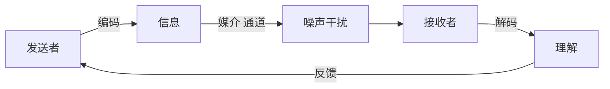
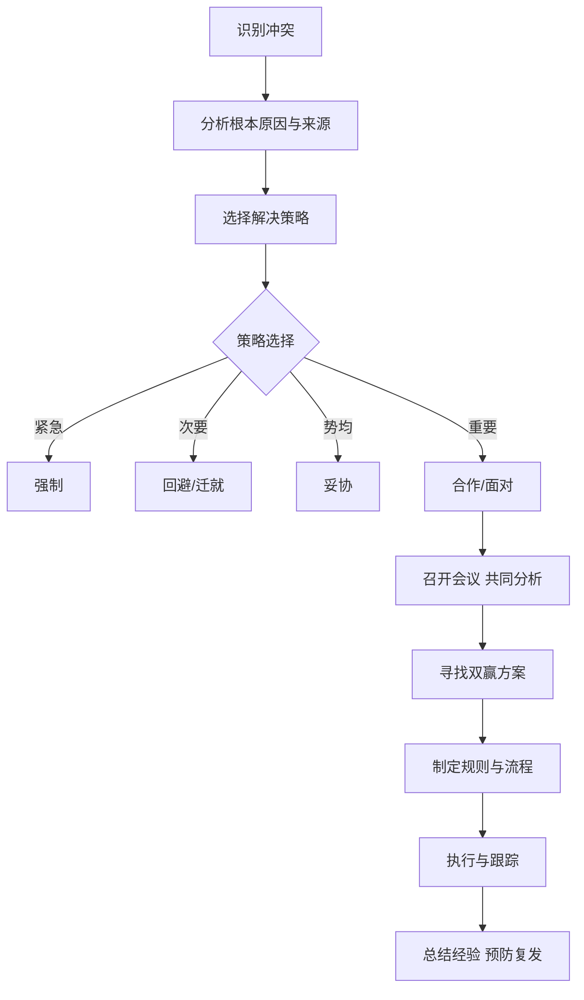

# 习题 - 第9章 团队沟通与冲突管理

> [!info] 本章习题定位
> 第9章聚焦项目沟通、团队建设与冲突管理，习题覆盖沟通模型（编码-传输-解码-反馈）、沟通渠道公式 $N(N-1)/2$、塔克曼团队发展五阶段、激励理论（马斯洛需求层次/赫茨伯格双因素/弗鲁姆期望理论）、六种冲突解决策略。计算题要求沟通渠道数计算，综合题结合团队场景考查激励与冲突管理实践。

## 知识点覆盖表

| 题号 | 题型 | 考查知识点 | 对应笔记 |
| --- | --- | --- | --- |
| 9.1 | 单选 | 沟通模型 | [[9.1 项目沟通管理]] |
| 9.2 | 单选 | 沟通渠道公式 | [[9.1 项目沟通管理]] |
| 9.3 | 单选 | 沟通方式 | [[9.1 项目沟通管理]] |
| 9.4 | 单选 | 塔克曼五阶段 | [[9.2 团队建设与激励]] |
| 9.5 | 单选 | 震荡阶段特征 | [[9.2 团队建设与激励]] |
| 9.6 | 单选 | 马斯洛需求层次 | [[9.2 团队建设与激励]] |
| 9.7 | 单选 | 赫茨伯格双因素 | [[9.2 团队建设与激励]] |
| 9.8 | 单选 | 期望理论 | [[9.2 团队建设与激励]] |
| 9.9 | 单选 | 冲突解决策略 | [[9.3 冲突管理]] |
| 9.10 | 单选 | 合作策略 | [[9.3 冲突管理]] |
| 9.11 | 多选 | 沟通模型要素 | [[9.1 项目沟通管理]] |
| 9.12 | 多选 | 塔克曼五阶段 | [[9.2 团队建设与激励]] |
| 9.13 | 多选 | 激励理论 | [[9.2 团队建设与激励]] |
| 9.14 | 多选 | 冲突解决策略 | [[9.3 冲突管理]] |
| 9.15 | 多选 | 沟通方式 | [[9.1 项目沟通管理]] |
| 9.16 | 判断 | 沟通渠道公式 | [[9.1 项目沟通管理]] |
| 9.17 | 判断 | 赫茨伯格保健因素 | [[9.2 团队建设与激励]] |
| 9.18 | 判断 | 塔克曼阶段顺序 | [[9.2 团队建设与激励]] |
| 9.19 | 判断 | 冲突来源 | [[9.3 冲突管理]] |
| 9.20 | 判断 | 期望理论公式 | [[9.2 团队建设与激励]] |
| 9.21 | 简答 | 沟通模型与障碍 | [[9.1 项目沟通管理]] |
| 9.22 | 简答 | 塔克曼五阶段 | [[9.2 团队建设与激励]] |
| 9.23 | 简答 | 三种激励理论对比 | [[9.2 团队建设与激励]] |
| 9.24 | 简答 | 六种冲突解决策略 | [[9.3 冲突管理]] |
| 9.25 | 计算 | 沟通渠道数计算 | [[9.1 项目沟通管理]] |
| 9.26 | 计算 | 沟通渠道增量分析 | [[9.1 项目沟通管理]] |
| 9.27 | 分析 | 团队发展阶段分析 | [[9.2 团队建设与激励]] |
| 9.28 | 分析 | 激励方案设计 | [[9.2 团队建设与激励]] |
| 9.29 | 综合 | 团队沟通综合案例 | [[9.1 项目沟通管理]] |
| 9.30 | 综合 | 冲突管理综合案例 | [[9.3 冲突管理]] |

## 一、单选题（每题 2 分，共 10 题）

**9.1** 沟通模型的基本要素不包括？

A. 发送者与接收者  
B. 编码与解码  
C. 媒介与反馈  
D. 项目预算

**9.2** 项目有 10 个干系人，沟通渠道数为？

A. 45  
B. 50  
C. 90  
D. 100

**9.3** 下列哪种沟通方式适合传递复杂、需讨论的信息？

A. 邮件  
B. 即时消息  
C. 面对面会议  
D. 公告栏

**9.4** 塔克曼（Tuckman）团队发展五阶段的正确顺序是？

A. 形成 → 规范 → 震荡 → 成熟 → 解散  
B. 形成 → 震荡 → 规范 → 成熟 → 解散  
C. 震荡 → 形成 → 规范 → 成熟 → 解散  
D. 形成 → 震荡 → 成熟 → 规范 → 解散

**9.5** 团队发展中"震荡阶段"（Storming）的典型特征是？

A. 成员礼貌客气，彼此试探  
B. 成员出现冲突、争论、权力争夺  
C. 团队达成共识，协同高效  
D. 团队解散，成员离开

**9.6** 马斯洛需求层次理论的最高层是？

A. 安全需求  
B. 尊重需求  
C. 自我实现需求  
D. 社交需求

**9.7** 赫茨伯格双因素理论中，"工资、工作条件、人际关系"属于？

A. 激励因素  
B. 保健因素  
C. 成长因素  
D. 成就因素

**9.8** 弗鲁姆期望理论的激励力公式是？

A. $M = E \times I \times V$（期望 × 关联性 × 效价）  
B. $M = E + I + V$  
C. $M = E \times V$  
D. $M = I \times V$

**9.9** "项目经理利用职权强制推行决定，不顾团队反对"，这种冲突解决策略是？

A. 合作（Collaborating）  
B. 妥协（Compromising）  
C. 强制（Forcing）  
D. 回避（Avoiding）

**9.10** 冲突解决中"合作"（Collaborating）策略的特点是？

A. 双方各让一步  
B. 寻找双赢方案，深入分析根本原因  
C. 一方完全让步  
D. 暂时搁置不处理

## 二、多选题（每题 3 分，共 5 题）

**9.11** 沟通模型的基本要素包括？（多选）

A. 发送者与接收者  
B. 编码与解码  
C. 媒介（通道）  
D. 反馈  
E. 噪声

**9.12** 塔克曼团队发展五阶段包括？（多选）

A. 形成阶段（Forming）  
B. 震荡阶段（Storming）  
C. 规范阶段（Norming）  
D. 成熟阶段（Performing）  
E. 解散阶段（Adjourning）

**9.13** 经典激励理论包括？（多选）

A. 马斯洛需求层次理论  
B. 赫茨伯格双因素理论  
C. 弗鲁姆期望理论  
D. 麦格雷戈 X-Y 理论  
E. 波特-劳勒模型

**9.14** 冲突解决的六种策略包括？（多选）

A. 回避（Withdrawing/Avoiding）  
B. 缓和/迁就（Smoothing/Accommodating）  
C. 妥协（Compromising）  
D. 强制（Forcing）  
E. 合作/解决问题（Collaborating/Problem Solving）

**9.15** 项目沟通方式包括？（多选）

A. 正式书面（报告、合同）  
B. 正式口头（会议、演讲）  
C. 非正式书面（邮件、备忘录）  
D. 非正式口头（交谈、电话）  
E. 社交媒体与即时通讯

## 三、判断题（每题 2 分，共 5 题）

**9.16** 沟通渠道数公式为 $N(N-1)/2$，其中 N 为干系人数量；干系人越多，沟通复杂度呈平方级增长。

**9.17** 赫茨伯格理论中，保健因素只能消除不满，不能产生激励；激励因素才能带来满意与动力。

**9.18** 塔克曼五阶段是线性不可逆的，团队一旦进入下一阶段就不会回退。

**9.19** 软件项目冲突的主要来源包括进度、优先级、人员安排、技术方案、成本与个性。

**9.20** 弗鲁姆期望理论中，激励力 = 期望值 × 关联性 × 效价，三项中任一项为 0 则激励力为 0。

## 四、简答题（每题 6 分，共 4 题）

**9.21** 说明沟通模型的基本要素与常见沟通障碍。

**9.22** 列出塔克曼团队发展五阶段及各阶段特征与项目经理应对策略。

**9.23** 比较马斯洛需求层次、赫茨伯格双因素与弗鲁姆期望理论的核心观点与软件项目应用。

**9.24** 列出六种冲突解决策略并说明适用场景。

## 五、计算题/分析题（每题 8 分，共 4 题）

**9.25** 某项目有 10 个干系人，请计算沟通渠道数。若新增 2 个干系人，沟通渠道增加多少？说明沟通渠道公式的工程意义。

**9.26** 某项目团队从 8 人扩展到 12 人，请计算沟通渠道数的变化，并分析团队规模扩大对沟通管理的影响与应对措施。

**9.27** 某新组建的 6 人项目团队，工作 2 周后出现以下现象：①成员对任务分工有异议；②技术方案争论激烈；③部分成员消极怠工；④项目经理权威受挑战。请判断团队处于哪个发展阶段，并给出项目经理的应对策略。

**9.28** 某软件团队士气低落，离职率高。经调查：工资低于行业平均；加班严重；缺乏晋升通道；技术挑战少；项目经理 micromanagement（过度干预）。请用马斯洛与赫茨伯格理论分析问题，并设计激励改进方案。

## 六、综合题/案例题（每题 10 分，共 2 题）

**9.29** 某跨地域项目团队 15 人（北京 8 人、上海 5 人、深圳 2 人），需开发一个金融系统，工期 6 个月。沟通出现以下问题：①信息传递失真；②会议效率低；③文档版本混乱；④跨地协作冲突多。请回答：
1. 计算沟通渠道数。
2. 分析沟通障碍的成因。
3. 设计沟通管理计划（含沟通方式、频率、工具、责任人）。
4. 用 Mermaid 绘制沟通模型示意图。
5. 给出提升跨地协作效率的措施。

**9.30** 某项目团队进入开发中期，测试组与开发组就"缺陷是否需立即修复"产生严重冲突：测试组认为严重缺陷必须立即修复，开发组认为可延期到下个迭代。双方各执己见，影响进度。项目经理介入后，先强制要求立即修复，引发开发组不满；后改为回避，问题持续恶化。请回答：
1. 分析冲突的根本原因与来源。
2. 评价项目经理先后采用的冲突解决策略（强制、回避）是否恰当。
3. 推荐最合适的冲突解决策略，并说明执行步骤。
4. 用 Mermaid 绘制冲突解决流程图。
5. 给出预防此类冲突的长期措施（结合团队建设与沟通管理）。

---

## 答案与解析

### 单选题答案

点击展开单选题答案与解析

**9.1 答案：D**
解析：沟通模型要素包括发送者、接收者、编码、解码、媒介、反馈、噪声。项目预算不属于沟通模型要素。

**9.2 答案：A**
解析：$N(N-1)/2 = 10 \times 9 / 2 = 45$。

**9.3 答案：C**
解析：面对面会议适合复杂、需讨论的信息，可即时反馈。邮件、即时消息、公告栏不适合复杂讨论。

**9.4 答案：B**
解析：塔克曼五阶段为形成 → 震荡 → 规范 → 成熟 → 解散。

**9.5 答案：B**
解析：震荡阶段成员出现冲突、争论、权力争夺。A 是形成阶段，C 是规范/成熟阶段，D 是解散阶段。

**9.6 答案：C**
解析：马斯洛最高层是自我实现需求。

**9.7 答案：B**
解析：工资、工作条件、人际关系属保健因素，只能消除不满，不能激励。

**9.8 答案：A**
解析：弗鲁姆期望理论 $M = E \times I \times V$（期望 × 关联性 × 效价）。

**9.9 答案：C**
解析：强制（Forcing）利用职权推行决定，不顾反对。

**9.10 答案：B**
解析：合作策略寻找双赢方案，深入分析根本原因。A 是妥协，C 是迁就，D 是回避。

### 多选题答案

点击展开多选题答案与解析

**9.11 答案：A、B、C、D、E**
解析：沟通模型要素包括发送者、接收者、编码、解码、媒介、反馈、噪声，五项均属于。

**9.12 答案：A、B、C、D、E**
解析：塔克曼五阶段为形成、震荡、规范、成熟、解散。

**9.13 答案：A、B、C、D、E**
解析：经典激励理论包括马斯洛、赫茨伯格、弗鲁姆、麦格雷戈 X-Y、波特-劳勒等，五项均属于。

**9.14 答案：A、B、C、D、E**
解析：六种策略为回避、缓和/迁就、妥协、强制、合作/解决问题、面对（面对常与合作合并），五项均属于。

**9.15 答案：A、B、C、D、E**
解析：沟通方式包括正式书面、正式口头、非正式书面、非正式口头、社交媒体等，五项均属于。

### 判断题答案

点击展开判断题答案与解析

**9.16 答案：正确**
解析：$N(N-1)/2$，干系人越多沟通复杂度呈平方级增长，这是大规模项目沟通管理难度大的根本原因。

**9.17 答案：正确**
解析：保健因素消除不满但不激励，激励因素才能带来满意与动力。

**9.18 答案：错误**
解析：塔克曼阶段并非严格线性不可逆，团队可能因成员变动、新任务等回退到震荡阶段，需重新规范。

**9.19 答案：正确**
解析：软件项目冲突主要来源为进度、优先级、人员、技术、成本、个性等。

**9.20 答案：正确**
解析：$M = E \times I \times V$，乘法关系，任一项为 0 则激励力为 0。

### 简答题答案

点击展开简答题参考答案

**9.21 参考答案**
沟通模型要素：发送者、接收者、编码、解码、媒介（通道）、反馈、噪声。
常见障碍：
- 语言与文化差异；
- 噪声干扰（物理环境、技术故障）；
- 知识与经验差距；
- 情绪与态度；
- 信息过载；
- 渠道选择不当；
- 反馈缺失。

**9.22 参考答案**
塔克曼五阶段及应对：

| 阶段 | 特征 | PM 应对策略 |
| --- | --- | --- |
| 形成 Forming | 礼貌客气，彼此试探 | 明确目标、规则与角色，建立信任 |
| 震荡 Storming | 冲突、争论、权力争夺 | 引导解决冲突，建立沟通机制 |
| 规范 Norming | 达成共识，协同开始 | 授权，鼓励协作 |
| 成熟 Performing | 高效协同，自我管理 | 赋能，减少干预，关注目标 |
| 解散 Adjourning | 任务完成，团队解散 | 总结经验，认可贡献，平稳过渡 |

**9.23 参考答案**
| 理论 | 核心观点 | 软件项目应用 |
| --- | --- | --- |
| 马斯洛需求层次 | 生理→安全→社交→尊重→自我实现，逐层满足 | 提供合理薪酬（生理/安全）、团队活动（社交）、表彰（尊重）、技术挑战与成长（自我实现） |
| 赫茨伯格双因素 | 保健因素消除不满，激励因素带来满意 | 工资/工作条件作保健（必须满足），成就/成长/责任作激励（提升动力） |
| 弗鲁姆期望理论 | $M = E \times I \times V$，期望×关联性×效价 | 设定可达目标（E）、绩效与奖励挂钩（I）、奖励符合员工需求（V） |

**9.24 参考答案**
六种冲突解决策略：

| 策略 | 含义 | 适用场景 |
| --- | --- | --- |
| 回避 Avoiding | 暂时搁置不处理 | 问题次要、信息不足、需冷静 |
| 缓和/迁就 Smoothing | 强调一致，淡化分歧 | 维护关系、问题次要 |
| 妥协 Compromising | 双方各让一步 | 双方势均力敌、需快速解决 |
| 强制 Forcing | 利用职权推行 | 紧急决策、原则问题 |
| 合作 Collaborating | 寻找双赢，深入分析 | 问题重要、需长期方案 |
| 面对 Confronting | 直接讨论问题 | 事实清晰、需透明决策 |

### 计算题答案

点击展开计算题参考答案与完整步骤

**9.25 参考答案**
1. 10 个干系人：
$$沟通渠道 = \frac{N(N-1)}{2} = \frac{10 \times 9}{2} = 45 \text{ 条}$$

2. 新增 2 个干系人，N=12：
$$沟通渠道 = \frac{12 \times 11}{2} = 66 \text{ 条}$$
增加 = 66 - 45 = 21 条。

3. 工程意义：沟通渠道数随干系人数呈平方级增长（$O(N^2)$），意味着团队规模扩大时沟通复杂度急剧上升。这是大规模项目需建立分层沟通机制、明确沟通责任人、使用协作工具的根本原因。项目经理需控制干系人参与度，避免沟通过载。

**9.26 参考答案**
1. 沟通渠道变化：
- 8 人：$\frac{8 \times 7}{2} = 28$ 条
- 12 人：$\frac{12 \times 11}{2} = 66$ 条
- 增加 = 66 - 28 = 38 条（增加 136%）。

2. 团队规模扩大的影响：
- 沟通复杂度呈平方级增长（28→66）；
- 信息传递失真风险增加；
- 协调成本上升；
- 冲突概率增加；
- 决策速度下降。

3. 应对措施：
- 分层沟通：划分子团队，指定子团队负责人；
- 明确沟通渠道与频率（周会、日报、看板）；
- 使用协作工具（Jira、Confluence、Slack）；
- 建立沟通管理计划，减少冗余沟通；
- 控制会议规模与时长。

**9.27 参考答案**
1. 阶段判断：团队处于"震荡阶段"（Storming）。现象依据：①任务分工异议；②技术方案争论；③消极怠工；④权威受挑战，均为震荡阶段典型特征。

2. PM 应对策略：
- 引导而非压制：组织开放讨论，倾听各方意见；
- 明确规则：重申团队目标、角色与决策机制；
- 解决冲突：采用合作策略，寻找双赢方案；
- 建立信任：一对一沟通了解成员诉求，认可贡献；
- 适度授权：让成员参与决策，提升归属感；
- 保持耐心：震荡是正常阶段，引导团队走向规范。

**9.28 参考答案**
1. 问题分析：
- 马斯洛视角：工资低（生理/安全未满足）、加班严重（安全）、缺乏晋升（尊重）、技术挑战少（自我实现受阻），多层级需求未满足；
- 赫茨伯格视角：工资低、加班、micromanagement 是保健因素不足（产生不满）；缺乏晋升、技术挑战少是激励因素缺失（无动力）。

2. 激励改进方案：

| 问题 | 对应理论 | 改进措施 |
| --- | --- | --- |
| 工资低于平均 | 保健因素 | 调薪至行业平均，提供绩效奖金 |
| 加班严重 | 保健因素 | 优化排期，增加人力，控制加班 |
| 缺乏晋升通道 | 激励因素/尊重 | 建立双通道（技术/管理），定期晋升评审 |
| 技术挑战少 | 激励因素/自我实现 | 安排核心技术难题，鼓励创新与开源 |
| Micromanagement | 保健因素/尊重 | 授权，目标管理而非过程监控 |

### 综合题答案

点击展开综合题参考答案

**9.29 参考答案**
1. 沟通渠道数：
$$\frac{15 \times 14}{2} = 105 \text{ 条}$$

2. 沟通障碍成因：
- 跨地域：时差、文化差异、面对面机会少；
- 信息失真：层级多、口头传递失真；
- 会议效率低：无议程、参与人过多、决策不清；
- 文档混乱：无统一版本控制、配置管理缺失；
- 协作冲突：职责不清、沟通方式不当。

3. 沟通管理计划：

| 沟通类型 | 方式 | 频率 | 参与人 | 工具 | 责任人 |
| --- | --- | --- | --- | --- | --- |
| 日报 | 非正式书面 | 每日 | 全员 | 飞书/钉钉 | 团队成员 |
| 周会 | 正式口头 | 每周 | 各地代表 | 视频会议 | 项目经理 |
| 里程碑评审 | 正式口头 | 里程碑 | 全员+客户 | 视频会议 | PM |
| 文档协作 | 非正式书面 | 持续 | 相关人 | Confluence/Git | 文档负责人 |
| 即时沟通 | 非正式口头 | 按需 | 相关人 | Slack/飞书 | 成员 |

4. 沟通模型示意图（Mermaid）：

5. 跨地协作提升措施：
- 每日站会（视频，15 分钟）同步进展与阻塞；
- 使用 Jira/看板可视化任务状态；
- 文档统一在 Confluence/Git 管理，强制版本控制；
- 每季度安排一次面对面集中办公（建立信任）；
- 明确各地子团队负责人，分层沟通；
- 建立异步沟通规范，减少时差影响。

**9.30 参考答案**
1. 冲突根本原因与来源：
- 根本原因：测试组与开发组对"严重缺陷修复优先级"的目标不一致（测试关注质量，开发关注进度）；
- 来源：进度冲突（修复影响迭代交付）、优先级冲突（缺陷 vs 新功能）、角色冲突（质量把关 vs 交付压力）、沟通不畅（缺乏统一缺陷分级标准）。

2. 评价项目经理策略：
- 强制（Forcing）：不恰当。强制要求立即修复引发开发组不满，未解决根本分歧，破坏团队氛围。强制仅适用于紧急、原则性问题。
- 回避（Avoiding）：不恰当。问题持续恶化，回避使冲突升级。回避仅适用于问题次要或需冷静时。

3. 推荐策略：合作（Collaborating），寻找双赢方案。
执行步骤：
1. 召开双方会议，明确各自关切（质量 vs 进度）；
2. 共同分析缺陷严重等级与影响范围；
3. 制定缺陷分级标准（致命/严重/一般/轻微）与修复 SLA；
4. 协商：致命与严重缺陷立即修复，一般与轻微纳入下迭代；
5. 建立缺陷评审机制（每日缺陷站会）；
6. 记录决策，纳入过程规范。

4. 冲突解决流程图（Mermaid）：

5. 预防长期措施：
- 建立缺陷分级标准与修复 SLA（过程规范）；
- 定期团队建设活动，增强跨组信任；
- 测试与开发共同参与需求评审与计划制定（目标对齐）；
- 建立每日缺陷站会，提前暴露问题；
- 项目经理提升冲突管理技能，避免简单强制或回避；
- 引入 DevOps/Shift-Left 测试，前置质量责任。

## 考点统计表

| 考查维度 | 题量 | 分值占比 | 难度 |
| --- | --- | --- | --- |
| 沟通模型与渠道 | 7 | 约 23% | 中 |
| 塔克曼五阶段 | 5 | 约 17% | 中 |
| 激励理论 | 6 | 约 20% | 中高 |
| 冲突解决策略 | 7 | 约 23% | 中高 |
| 团队建设综合 | 5 | 约 17% | 中 |
| **合计** | **30** | **100%** | — |

## 关联

- 上一级：[[MOC - 软件项目管理]]
- 本章知识点：[[MOC - 第9章]]
- 上一章习题：[[习题-第8章-挣值分析项目跟踪]]
- 下一章习题：[[习题-第10章-敏捷项目管理]]
