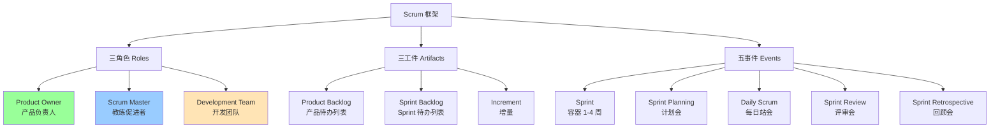
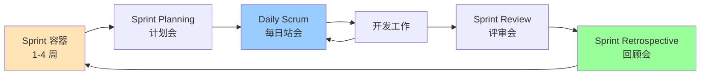

# 10.1 敏捷宣言与 Scrum 框架

传统瀑布方法（[[4.2 关键路径法（CPM）与甘特图]]）在需求稳定的项目中有效，但软件项目常面临需求不确定与变化频繁的挑战。敏捷方法（Agile）以价值观和原则为基础，通过短迭代、自组织团队、持续反馈应对变化。Scrum 是最流行的敏捷框架，定义了三角色、三工件、五事件。本节是第10章基础，为 [[10.2 Sprint计划与执行]] 与 [[10.3 敏捷估算与团队实践]] 奠定框架。

## 敏捷宣言四大价值观

> [!definition] 敏捷宣言
> 2001 年 17 位软件实践者发布《敏捷软件开发宣言》（Agile Manifesto），提出四大价值观，奠定了敏捷方法的共同基础。

### 四大价值观

> [!quote] 敏捷宣言
> 我们在通过亲身实践与帮助他人实践，揭示更好的软件开发方法。在此过程中，我们更重视：
>
> - **个体与互动** 高于 流程与工具
> - **可工作软件** 高于 详尽的文档
> - **客户协作** 高于 合同谈判
> - **响应变化** 高于 遵循计划
>
> 也就是说，虽然右项也有价值，但我们更重视左项。

| 价值观 | 左侧（更重视） | 右侧（仍有价值） | 实践含义 |
| --- | --- | --- | --- |
| 1 | 个体与互动 | 流程与工具 | 面对面沟通优于文档流转，团队协作优于工具堆砌 |
| 2 | 可工作软件 | 详尽的文档 | 交付可运行软件是首要度量，文档服务于沟通而非替代 |
| 3 | 客户协作 | 合同谈判 | 与客户持续协作优于依赖合同条款博弈 |
| 4 | 响应变化 | 遵循计划 | 拥抱变化优于死守计划，计划是引导而非束缚 |

> [!warning] 对敏捷宣言的常见误解
> > - “敏捷不要文档”：错误。宣言说“可工作软件高于详尽文档”，不是不要文档，而是文档应精简有用。
> > - “敏捷不要计划”：错误。敏捷有 Sprint 计划与发布计划（[[10.2 Sprint计划与执行]]），只是计划更短、更易调整。
> > - “敏捷没有流程”：错误。Scrum 有严格的角色、事件、工件规则（本节后文）。
> > - “敏捷适合所有项目”：错误。需求稳定、合规要求高的项目（如航天、医疗）仍适合瀑布。

## 敏捷十二原则

敏捷宣言附有 12 条原则，是四大价值观的展开：

> [!note] 敏捷十二原则
> > 1. **尽早持续交付**有价值的软件，频繁交付可工作的软件（数周到数月，越短越好）。
> > 2. **拥抱变化**：即使在开发后期也欢迎需求变化，敏捷过程通过变化为客户赢得竞争优势。
> > 3. **频繁交付**可工作的软件，周期从几周到几个月，倾向于较短的周期。
> > 4. **业务人员与开发人员**每日协作。
> > 5. **围绕有动力的个人**构建项目，给予信任与支持。
> > 6. **面对面沟通**是传递信息最有效的方式。
> > 7. **可工作软件**是进度的首要度量。
> > 8. **可持续开发**：发起人、开发者和用户应能保持稳定步调。
> > 9. **持续关注技术卓越**与良好设计增强敏捷能力。
> > 10. **简洁**：最大化未完成工作量的艺术——尽量少做。
> > 11. **自组织团队**产出最佳架构、需求与设计。
> > 12. **定期反思**：团队定期反思如何更有效，并相应调整。

### 原则归类

| 类别 | 原则编号 | 核心 |
| --- | --- | --- |
| 交付 | 1, 3, 7 | 尽早、频繁、可工作 |
| 变化 | 2 | 拥抱变化 |
| 协作 | 4, 6, 11 | 业务-开发协作、面对面、自组织 |
| 团队 | 5, 8, 12 | 动力、可持续、反思 |
| 工程 | 9, 10 | 技术卓越、简洁 |

## Scrum 框架

> [!definition] Scrum
> Scrum 是**一种用于管理产品开发的经验性、迭代增量框架**，基于透明、检视、适应三大支柱。Scrum 不是过程或技术，而是团队在其中应用各种过程的框架。

### Scrum 三大支柱

| 支柱 | 含义 | 实践 |
| --- | --- | --- |
| 透明 Transparency | 过程与产物对所有人可见 | Product Backlog 公开、DoD 明确 |
| 检视 Inspection | 频繁检查进展与产物 | Daily Scrum、Sprint Review |
| 适应 Adaptation | 偏差时及时调整 | Sprint Retrospective、Backlog 调整 |

### Scrum 框架图

## 三个角色

### Product Owner 产品负责人

> [!definition] Product Owner
> **Product Owner（PO）** 是**负责最大化产品价值、管理 Product Backlog**的唯一责任人。PO 代表客户与业务方利益，是产品决策的最终拍板者。

| 职责 | 说明 |
| --- | --- |
| 管理 Product Backlog | 创建、排序、细化需求项 |
| 确定优先级 | 按业务价值排序 Backlog |
| 明确需求 | 撰写用户故事、验收标准 |
| 拍板发布 | 决定何时发布、发布什么 |
| 沟通愿景 | 向团队传达产品愿景与目标 |

> [!warning] PO 的常见问题
> > - **PO 缺位**：PO 不参加 Sprint 评审，团队无法及时获得反馈；
> > - **多头 PO**：多个业务方各自提需求，无统一优先级；
> > - **PO 越权**：PO 干预技术决策（应由开发团队决定）；
> > - **PO 不决策**：Backlog 不排序，团队无法选择。

### Scrum Master

> [!definition] Scrum Master
> **Scrum Master（SM）** 是**Scrum 流程的教练与促进者**，负责确保团队理解并实践 Scrum，消除障碍，是服务型领导（servant leader）。SM 不指挥团队，而是服务团队。

| 职责 | 说明 |
| --- | --- |
| 教练 Scrum | 培训团队与组织理解 Scrum |
| 促进事件 | 主持 Scrum 事件（计划会、站会等） |
| 消除障碍 | 帮助团队移除进度障碍 |
| 守护流程 | 确保 Scrum 规则被遵守 |
| 协调 PO 与团队 | 帮助 PO 管理 Backlog |

> [!note] Scrum Master vs 项目经理
> > | 维度 | Scrum Master | 项目经理 |
> > | --- | --- | --- |
> > | 领导方式 | 服务型领导 | 指挥控制型 |
> > | 决策权 | 无，团队自决策 | 有，分配任务与资源 |
> > | 关注 | 流程与团队 | 计划与交付 |
> > | 任务分配 | 不分配，团队自组织 | 分配任务 |
> > | 报告 | 不向高层报告进度 | 向高层报告 |

### Development Team 开发团队

> [!definition] Development Team
> **Development Team（开发团队）** 是**自组织、跨功能、负责交付增量的团队**。规模 3–9 人（不含 PO 与 SM），跨功能（开发、测试、设计等技能齐全），自组织（决定如何完成工作）。

| 特征 | 说明 |
| --- | --- |
| 自组织 | 团队决定如何完成 Sprint Backlog |
| 跨功能 | 技能齐全，无需外部依赖 |
| 规模 | 3–9 人（避免沟通复杂度，[[9.1 项目沟通管理]] N(N-1)/2） |
| 无头衔 | 成员都是开发者，无“组长” |
| 共担责任 | 团队整体对交付负责 |

## 三个工件

> [!definition] 工件
> Scrum 工件是**代表价值或工作的可检视对象**，设计目的是实现透明——任何人都能了解工件的状态。

### Product Backlog 产品待办列表

> [!definition] Product Backlog
> **Product Backlog** 是**项目所有需求的有序列表**，由 PO 管理与排序。它是产品需求的唯一来源，演进式变化。

- 每项称为 **Product Backlog Item（PBI）**，常见形式为用户故事；
- 按**业务价值**排序，高价值在上；
- 持续**细化**（Refinement）：补充细节、估算、验收标准；
- 类比：传统项目的需求清单（[[2.1 需求收集与范围定义]]），但动态变化。

### Sprint Backlog

> [!definition] Sprint Backlog
> **Sprint Backlog** 是**当前 Sprint 选中的 PBI 加上交付它们的计划**，是开发团队的预测。Sprint 期间只接受 PO 协商后的范围调整。

- 来源：Sprint Planning 中从 Product Backlog 选取；
- 包含：选中的 PBI + 任务拆分；
- 仅开发团队可修改；
- 详见 [[10.2 Sprint计划与执行]]。

### Increment 增量

> [!definition] Increment
> **Increment** 是**一个 Sprint 结束时完成的所有 Product Backlog 项的总和**，加上之前所有 Sprint 的增量。增量必须满足**完成的定义（Definition of Done, DoD）**，是可工作、可交付的。

- 每个 Sprint 必须产出增量；
- 增量必须满足 DoD（如：编码、测试、评审、文档、部署到测试环境）；
- 增量是累积的，每个 Sprint 在前一个增量基础上构建；
- 增量是“可工作软件高于详尽文档”价值观的体现。

### 完成的定义 DoD

> [!definition] DoD
> **完成的定义（Definition of Done, DoD）** 是**团队对“完成”的统一标准**，确保增量质量。DoD 由团队共同制定，对所有 PBI 适用。

| DoD 示例条目 | 说明 |
| --- | --- |
| 代码已编写 | 满足功能需求 |
| 单元测试通过 | 覆盖率 ≥ 80% |
| 代码评审通过 | 至少 1 人评审（[[7.3 评审管理与质量度量]]） |
| 集成测试通过 | 与系统集成无冲突 |
| 文档已更新 | 用户文档、API 文档 |
| 部署到测试环境 | 可演示 |

## 五个事件

### 事件总览

### Sprint

> [!definition] Sprint
> **Sprint** 是**Scrum 的容器事件**，一个固定长度（1–4 周）的迭代周期。所有其他事件发生在 Sprint 内。Sprint 长度一经确定，整个项目保持一致，不更改。

- 长度：1–4 周，常用 2 周；
- 一旦开始，范围不可更改（除 PO 协商取消）；
- 每个 Sprint 必须产出增量；
- 只有 PO 可取消 Sprint（极少发生）。

### Sprint Planning 计划会

详见 [[10.2 Sprint计划与执行]]。

| 要素 | 说明 |
| --- | --- |
| 时长 | 最多 4 小时（1 周 Sprint）到 8 小时（1 月 Sprint） |
| 输入 | Product Backlog、速度、团队能力 |
| 输出 | Sprint 目标、Sprint Backlog |
| 三问题 | 为什么、做什么、怎么做 |

### Daily Scrum 每日站会

> [!definition] Daily Scrum
> **Daily Scrum** 是**开发团队每日举行的 15 分钟同步会**，检视进展并调整 Sprint Backlog。

| 要素 | 说明 |
| --- | --- |
| 时长 | 15 分钟 |
| 参与者 | 开发团队（PO、SM 可旁听） |
| 时机 | 同一时间、同一地点 |
| 三问题 | 见下 |

**Daily Scrum 三问题**：

> [!question] 每日站会三问题
> > 1. **昨天**我为 Sprint 目标做了什么？
> > 2. **今天**我打算为 Sprint 目标做什么？
> > 3. 有什么**障碍**阻止我或团队达成目标？

> [!warning] 站会的常见误区
> > - **向领导汇报**：站会不是汇报会，是团队同步；
> > - **解决问题**：站会只识别问题，不解决问题（会后讨论）；
> > - **超时**：严格 15 分钟，复杂讨论会后进行；
> > - **迟到缺席**：影响同步效率，应建立规则；
> > - **SM 主持**：应由团队自组织，SM 仅促进。

### Sprint Review 评审会

> [!definition] Sprint Review
> **Sprint Review** 是**Sprint 结束时检视增量并调整 Product Backlog**的事件。团队展示增量，获取反馈，调整下一步优先级。

| 要素 | 说明 |
| --- | --- |
| 时长 | 最多 4 小时（1 月 Sprint） |
| 参与者 | 团队 + PO + 利益相关者 |
| 内容 | 演示增量、讨论完成情况、调整 Backlog |
| 输出 | 更新的 Product Backlog |

### Sprint Retrospective 回顾会

> [!definition] Sprint Retrospective
> **Sprint Retrospective** 是**团队反思 Sprint 过程并制定改进计划**的事件。关注“如何工作”而非“做了什么”，是持续改进的引擎。

| 要素 | 说明 |
| --- | --- |
| 时长 | 最多 3 小时（1 月 Sprint） |
| 参与者 | 团队 + SM（PO 可选） |
| 三问题 | 做得好的、需改进的、下一步行动 |
| 输出 | 改进行动计划 |

> [!tip] 回顾会与建设性冲突
> > 回顾会是制度化建设性冲突（[[9.3 冲突管理]]）——团队反思问题、提出改进。它把冲突引导为任务导向的改进讨论，避免破坏性人际冲突。敏捷团队通过回顾会持续保持在规范/成熟阶段（[[9.2 团队建设与激励]]）。

## 小结

敏捷宣言提出四大价值观：个体与互动 > 流程工具、可工作软件 > 详尽文档、客户协作 > 合同谈判、响应变化 > 遵循计划，十二原则是其展开。Scrum 框架基于透明、检视、适应三大支柱，包含三角色（PO 价值最大化、SM 教练促进、Dev Team 自组织交付）、三工件（Product Backlog、Sprint Backlog、Increment）、五事件（Sprint、Planning、Daily Scrum、Review、Retrospective）。增量必须满足 DoD，回顾会是持续改进的引擎。

## 关联

- 上一级：[[MOC - 第10章]]
- 下一节：[[10.2 Sprint计划与执行]]
- 关联概念：[[9.2 团队建设与激励]]（自组织团队是成熟阶段）；[[9.3 冲突管理]]（回顾会制度化建设性冲突）；[[9.1 项目沟通管理]]（团队规模源于沟通效率）；[[2.1 需求收集与范围定义]]（Product Backlog 是需求来源）；[[7.3 评审管理与质量度量]]（DoD 与评审）；[[1.2 项目三重约束：范围、时间、成本、质量]]（敏捷范围是演进的）
