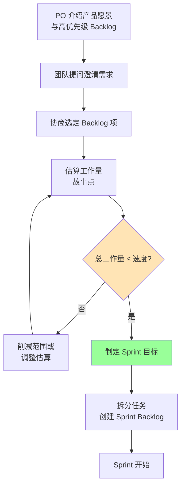
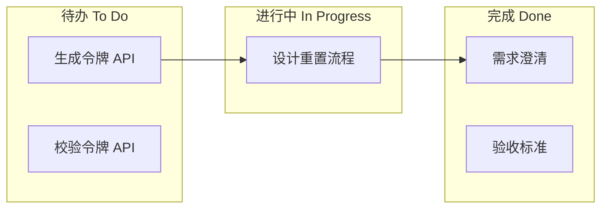
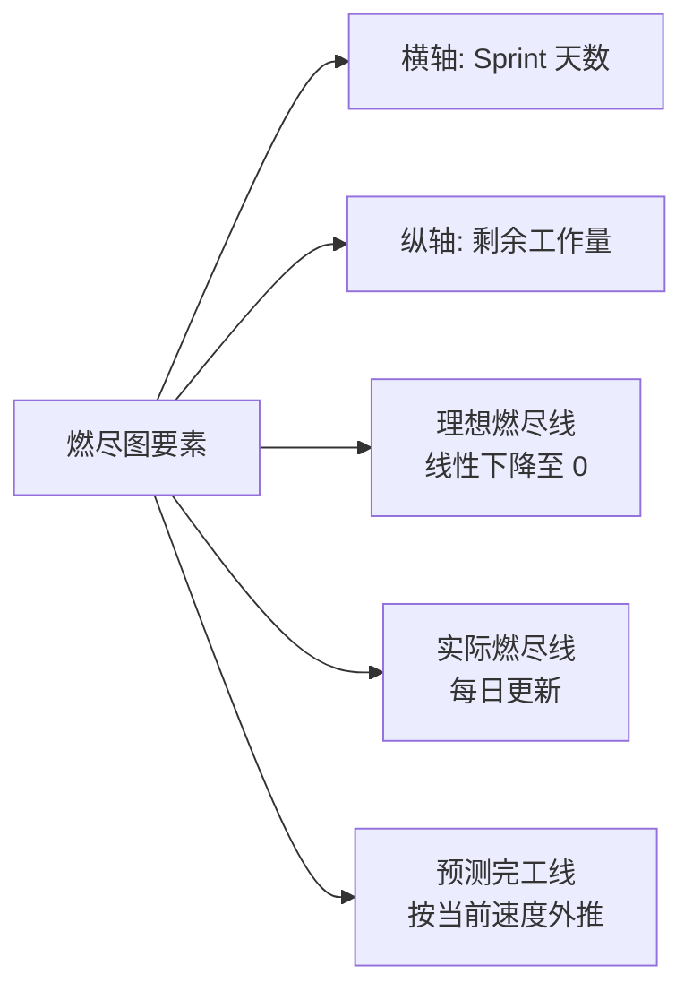
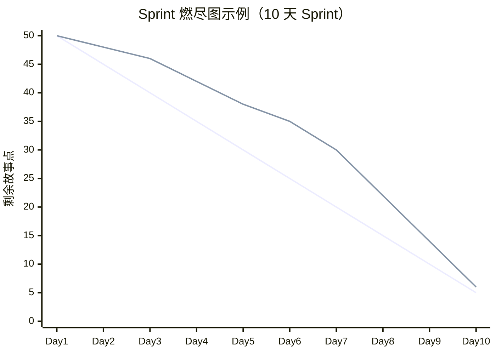
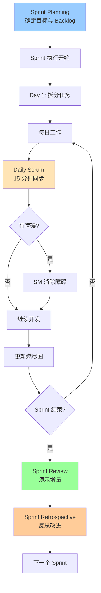

# 10.2 Sprint 计划与执行

Scrum 框架（[[10.1 敏捷宣言与Scrum框架]]）定义了角色、工件与事件，Sprint 是其实践单元。本节阐明 Sprint Planning 如何确定目标与选择 Backlog、用户故事与故事点估算、Sprint Backlog 创建、Daily Scrum 三问题与燃尽图跟踪。Sprint 执行是敏捷方法落地的核心环节，与传统项目跟踪（[[8.1 项目跟踪方法与进度监控]]）形成对照。

## Sprint Planning

> [!definition] Sprint Planning
> **Sprint Planning** 是**Sprint 开始时的计划会议**，团队共同确定 Sprint 目标、选择 Product Backlog 项、估算工作量并制定交付计划。输出 Sprint 目标与 Sprint Backlog。

### Sprint Planning 三问题

| 问题 | 回答 | 责任方 |
| --- | --- | --- |
| 为什么（Why） | Sprint 目标——本 Sprint 要达成的业务价值 | PO 提出，团队共识 |
| 做什么（What） | 选中的 Product Backlog 项 | PO 与团队协商 |
| 怎么做（How） | 任务拆分与交付计划 | 开发团队决定 |

### Sprint Planning 流程

### Sprint 目标

> [!definition] Sprint 目标
> **Sprint Goal** 是**Sprint 要达成的业务目标**，是团队协作的焦点。所有 Backlog 项服务于目标，目标为团队提供灵活性——可调整具体项只要服务于目标。

**示例**：
- “完成用户登录与注册功能，支持邮箱与手机号”；
- “优化首页加载性能，将首屏时间降至 2 秒以内”。

### Sprint Backlog 创建

> [!definition] Sprint Backlog
> **Sprint Backlog** 是**Sprint 选中的 Product Backlog 项加上交付它们的任务计划**。它是开发团队的预测，仅团队可修改。

| 组成 | 说明 |
| --- | --- |
| 选中的 PBI | 从 Product Backlog 选取的用户故事 |
| 任务 | PBI 拆分为可执行任务（编码、测试、文档） |
| Sprint 目标 | 所有 PBI 服务的目标 |
| 工作量估算 | 任务时长（小时或故事点） |

> [!warning] Sprint 范围的稳定性
> > Sprint 一旦开始，范围应稳定：
> > - 不接受新需求（除非 PO 取消等量工作）；
> > - 范围变更需 PO 与团队协商；
> > - 团队发现工作量超出能力时，可与 PO 协商削减 PBI；
> > - 不可在 Sprint 中途加入 PBI 而不削减（避免范围蔓延，[[2.3 范围确认与范围控制]]）。

## 用户故事与故事点估算

### 用户故事

> [!definition] 用户故事
> **用户故事（User Story）** 是**从用户视角描述需求的简短叙述**，格式为：
> > As a \<角色\>, I want \<功能\>, so that \<价值\>。
> > 作为\<角色\>，我想要\<功能\>，以便\<价值\>。

**示例**：
> 作为**注册用户**，我想要**通过邮箱重置密码**，以便**在忘记密码时能重新登录**。

**用户故事要素（3C）**：

| 要素 | 含义 |
| --- | --- |
| Card 卡片 | 故事写在卡片上，简短描述 |
| Conversation 对话 | 团队与 PO 讨论细节 |
| Confirmation 确认 | 验收标准（Acceptance Criteria） |

### 验收标准

> [!definition] 验收标准
> **验收标准（Acceptance Criteria, AC）** 是**用户故事完成的具体条件**，是 PO 验收 PBI 的依据，也是 DoD（[[10.1 敏捷宣言与Scrum框架]]）的补充。

**示例**（续上）：
- 输入注册邮箱可收到重置链接；
- 链接 30 分钟内有效；
- 重置后可用新密码登录；
- 旧密码失效。

### 故事点估算

> [!definition] 故事点
> **故事点（Story Point）** 是**对工作量相对大小的估算单位**，综合考虑复杂度、工作量与不确定性，不等于工时。常用斐波那契数列：1, 2, 3, 5, 8, 13, 21。

**为什么用斐波那契数列？**
- 数字间隔增大，反映估算不确定性随规模增加；
- 避免虚假精确（如“7 点”与“8 点”无实质差异）；
- 强迫团队在“8 还是 13”之间做粗略判断。

> [!note] 故事点 vs 工时
> > - **工时**：绝对估算（小时/天），适合短期任务；
> > - **故事点**：相对估算（参考基准故事），适合中长期规划；
> > - 故事点不跨团队比较（每团队基准不同），只用于团队内速度预测（[[10.3 敏捷估算与团队实践]]）。

## Sprint Backlog 创建

### 任务拆分

将用户故事拆分为可执行任务（通常 1–2 天）：

| 用户故事 | 任务 | 估算（小时） |
| --- | --- | --- |
| 邮箱重置密码 | 设计重置流程 | 4 |
|  | 后端：生成令牌 API | 8 |
|  | 后端：校验令牌 API | 6 |
|  | 前端：重置请求页 | 6 |
|  | 前端：新密码输入页 | 4 |
|  | 测试：功能测试用例 | 6 |
|  | 文档：用户文档更新 | 2 |

### Sprint Backlog 看板示例

## Daily Scrum

详见 [[10.1 敏捷宣言与Scrum框架]] 角色事件部分。本节强调其执行要点：

### Daily Scrum 三问题

> [!question] 三问题
> > 1. **昨天**我为 Sprint 目标做了什么？
> > 2. **今天**我打算为 Sprint 目标做什么？
> > 3. 有什么**障碍**阻止我或团队达成目标？

### 站会执行要点

| 要点 | 说明 |
| --- | --- |
| 时间盒 | 15 分钟，严格控时 |
| 地点 | 团队面前 Sprint Backlog 看板 |
| 形式 | 团队成员轮流发言，非汇报 |
| 聚焦 Sprint 目标 | 发言围绕目标进展 |
| 识别障碍 | 第三问题是关键，障碍由 SM 跟进 |
| 会后讨论 | 复杂问题会后小范围讨论 |

> [!tip] 站会与项目跟踪
> > 站会是敏捷版的项目跟踪（对照 [[8.1 项目跟踪方法与进度监控]]）：
> > - 瀑布项目用甘特图跟踪（计划 vs 实际条形）；
> > - 敏捷项目用站会 + 燃尽图跟踪（剩余工作量趋势）；
> > - 站会频次更高（每日 vs 每周），但每次更短（15 分钟 vs 1 小时）。

## 燃尽图

> [!definition] 燃尽图
> **燃尽图（Burndown Chart）** 是**显示 Sprint 内剩余工作量随时间变化的图表**，横轴为 Sprint 天数，纵轴为剩余故事点或小时。理想燃尽线从总量线性降至 0，实际线反映真实进度。

### 燃尽图要素

### 燃尽图判读

| 实际线位置 | 含义 | 行动 |
| --- | --- | --- |
| 在理想线下方 | 进度提前 | 可考虑增加 PBI |
| 接近理想线 | 进度正常 | 继续 |
| 在理想线上方 | 进度落后 | 分析原因、削减范围或加班 |
| 上升 | 工作量增加或估算不足 | 重新评估、与 PO 协商 |

### 燃尽图示例（Mermaid 模拟）

> [!note] 燃尽图 vs 燃起图
> > - **燃尽图**（Burndown）：剩余工作量下降，关注“还剩多少”；
> > - **燃起图**（Burnup）：已完成工作量上升 + 总工作量线，关注“完成多少”与“范围变化”；
> > - 燃起图能显示范围变化（总工作量线移动），更适合发布级别跟踪。

## Sprint 执行流程图

## 小结

Sprint Planning 确定为什么（Sprint 目标）、做什么（选中 PBI）、怎么做（任务拆分），输出 Sprint Backlog。用户故事以“作为...我想要...以便...”格式描述需求，验收标准明确完成条件。故事点用斐波那契数列相对估算，避免虚假精确。Sprint 执行中 Daily Scrum 三问题（昨天、今天、障碍）每日同步，燃尽图跟踪剩余工作量趋势。Sprint 结束时 Review 演示增量、Retrospective 反思改进，形成持续改进闭环。

## 关联

- 上一级：[[MOC - 第10章]]
- 上一节：[[10.1 敏捷宣言与Scrum框架]]
- 下一节：[[10.3 敏捷估算与团队实践]]
- 关联概念：[[8.1 项目跟踪方法与进度监控]]（燃尽图 vs 甘特图跟踪）；[[2.1 需求收集与范围定义]]（用户故事是需求形式）；[[2.3 范围确认与范围控制]]（Sprint 范围稳定性）；[[9.3 冲突管理]]（Retrospective 制度化建设性冲突）；[[6.1 配置管理基本概念与版本控制]]（增量是配置项）
