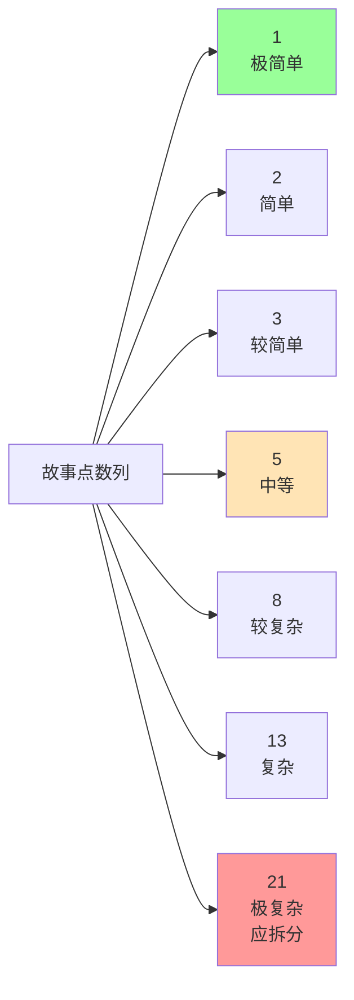
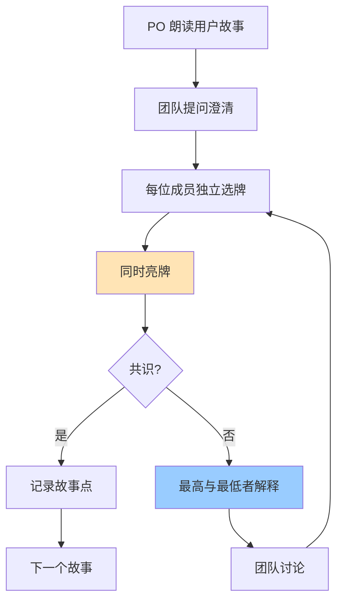
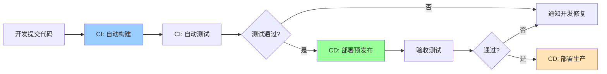
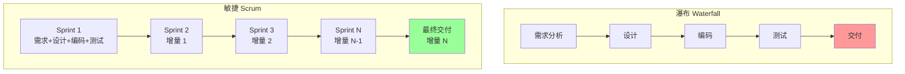

# 10.3 敏捷估算与团队实践

Sprint 计划（[[10.2 Sprint计划与执行]]）依赖估算，敏捷估算与传统估算（[[3.2 工作量估算：COCOMO模型]]）理念不同——用相对估算代替绝对估算，用团队估算代替专家估算。本节阐明故事点估算、Planning Poker 团队估算游戏、速度 Velocity 预测，以及持续集成/持续交付在敏捷中的应用，并对比敏捷与传统项目管理。本节是第10章与第3章估算方法的对照。

## 故事点估算

### 相对估算理念

> [!definition] 相对估算
> **相对估算**（Relative Estimation）是**以一个基准故事为参考，估算其他故事相对其大小**的方法。不做绝对工时估算，只比较“这个比那个大几倍”。

**为什么用相对估算？**
- 人擅长比较不擅长绝对度量（“这个比那个难”比“这个要 13.7 小时”容易）；
- 不同人速度不同，相对估算可跨人员复用；
- 早期信息不足，相对估算容忍模糊；
- 避免虚假精确。

### 斐波那契数列

> [!definition] 故事点数列
> 故事点使用**斐波那契数列**：1, 2, 3, 5, 8, 13, 21, 34, 55。

**斐波那契数列的合理性**：
- 数列间隔递增（1, 1, 2, 3, 5...），反映不确定性随规模增加；
- 小故事差异明显（1 vs 2 vs 3）；
- 大故事趋于模糊（13 vs 21 差异小），鼓励拆分；
- 21 以上应拆分为更小故事（控制不确定性）。

### 基准故事

> [!tip] 设立基准故事
> > 团队选一个大家都熟悉、规模适中的故事作为“5 点”基准。后续故事与基准比较：
> > - 比基准简单 → 1/2/3 点；
> > - 与基准相当 → 5 点；
> > - 比基准复杂 → 8/13 点。
> > 基准故事应在团队共识下确定，并记录供新成员参考。

## Planning Poker

> [!definition] Planning Poker
> **Planning Poker**（计划扑克）是**团队共同估算故事点的游戏**，避免权威影响，鼓励全员参与与讨论。每位成员持一套斐波那契数牌，对每个故事同时亮牌。

### Planning Poker 流程

### Planning Poker 步骤

| 步骤 | 活动 | 关键点 |
| --- | --- | --- |
| 1. 介绍 | PO 朗读故事、回答问题 | 确保理解一致 |
| 2. 选牌 | 每人独立选一张斐波那契牌 | 不互相影响 |
| 3. 亮牌 | 同时亮牌 | 避免锚定效应 |
| 4. 讨论 | 最高分与最低分者解释理由 | 暴露隐藏假设 |
| 5. 重选 | 讨论后重新选牌 | 收敛共识 |
| 6. 记录 | 达成共识后记录故事点 | 进入下一个故事 |

> [!note] Planning Poker 的价值
> > - **避免权威影响**：同时亮牌防止资深成员主导；
> > - **暴露隐藏假设**：最高最低分者解释，揭示不同理解；
> > - **共享知识**：讨论中知识传递，新人学习；
> > - **全员参与**：每个人都有发言权，提升投入感（[[9.2 团队建设与激励]] 自我实现）；
> > - **估算更准**：群体智慧优于个体估算。

> [!warning] Planning Poker 的常见问题
> > - **锚定效应**：若有人先说“我觉得是 8”，其他人会受影响——必须同时亮牌；
> > - **专家主导**：资深成员亮高牌影响团队——主持人应鼓励讨论；
> > - **久议不决**：反复讨论仍不收敛——可设上限（如 3 轮后取中位数）；
> > - **故事过大**：21 点以上——应拆分故事后再估。

## 速度 Velocity

> [!definition] Velocity
> **速度**（Velocity）是**团队一个 Sprint 完成的故事点数总和**（满足 DoD）。速度反映团队实际产能，用于预测未来 Sprint 可完成的工作量。

### 速度计算示例

| Sprint | 计划故事点 | 完成故事点 | 备注 |
| --- | --- | --- | --- |
| Sprint 1 | 25 | 20 | 高估 |
| Sprint 2 | 22 | 24 | 低估 |
| Sprint 3 | 23 | 22 | 接近 |
| **平均** | — | **22** | — |

$$\text{Velocity}_{avg} = \frac{20 + 24 + 22}{3} = 22 \text{ 点/Sprint}$$

### 速度的用途

| 用途 | 方法 |
| --- | --- |
| Sprint Planning | 选 Backlog 总点数 ≤ 平均速度 |
| 发布预测 | 剩余点数 / 速度 = 所需 Sprint 数 |
| 容量规划 | 评估团队能力是否匹配需求 |
| 改进跟踪 | 速度趋势反映团队成熟度 |

> [!example] 发布预测
> > Product Backlog 剩余 200 点，平均速度 22 点/Sprint：
> > $$\text{Sprint 数} = \frac{200}{22} \approx 9.1 \to 10 \text{ 个 Sprint}$$
> > 若 2 周/Sprint，则约 20 周完成。

> [!warning] 速度的误用
> > - **跨团队比较**：不同团队基准不同，速度不可比；
> > - **强制提速**：管理层要求提高速度会导致注水（不满足 DoD 也算完成）；
> > - **早期预测**：前 1–2 个 Sprint 速度波动大，3 个以上才有参考价值；
> > - **作为 KPI**：速度是度量不是目标，提速不等于增效（[[9.2 团队建设与激励]] 绩效评估）。

## 持续集成与持续交付

### 持续集成 CI

> [!definition] 持续集成
> **持续集成**（Continuous Integration, CI）是**开发人员频繁将代码集成到主干，每次集成自动构建与测试**的实践。目标是尽早发现集成问题，避免“集成地狱”。

| 实践 | 说明 |
| --- | --- |
| 频繁提交 | 每天多次提交到主干 |
| 自动构建 | 提交触发自动构建 |
| 自动测试 | 运行单元测试、集成测试 |
| 快速反馈 | 几分钟内反馈结果 |
| 修复优先 | 构建失败立即修复 |

### 持续交付 CD

> [!definition] 持续交付
> **持续交付**（Continuous Delivery/Deployment, CD）是**在 CI 基础上，自动将通过测试的增量部署到生产或类生产环境**的实践。目标是让发布成为常态而非事件。

| 类型 | 含义 |
| --- | --- |
| Continuous Delivery | 自动部署到预发布，人工触发生产发布 |
| Continuous Deployment | 自动部署到生产，无需人工干预 |

### CI/CD 在敏捷中的作用

> [!note] CI/CD 与敏捷价值观
> > CI/CD 是敏捷价值观“可工作软件高于详尽文档”的工程支撑：
> > - **可工作软件**：CI 确保每次提交都构建测试通过；
> > - **频繁交付**：CD 让每个 Sprint 都能发布增量；
> > - **响应变化**：CI/CD 让变更可快速验证部署，降低变化风险；
> > - **可持续开发**：自动化减少手工部署负担。
> > 配置管理（[[6.1 配置管理基本概念与版本控制]]）是 CI/CD 的基础。

## 敏捷与传统项目管理对比

### 对比维度

| 维度 | 传统瀑布 | 敏捷 Scrum |
| --- | --- | --- |
| 需求 | 前期固定（[[2.1 需求收集与范围定义]]） | 演进式（Product Backlog） |
| 范围 | 固定，变更需 CCB（[[6.2 变更控制流程与CCB]]） | 灵活，PO 调整 Backlog |
| 进度 | 关键路径法整体规划（[[4.2 关键路径法（CPM）与甘特图]]） | Sprint 迭代，燃尽图跟踪 |
| 估算 | 绝对估算（[[3.2 工作量估算：COCOMO模型]]） | 相对估算故事点 |
| 团队 | 经理指挥、角色分明（[[1.3 软件项目组织形式与参与角色]]） | 自组织、跨功能 |
| 领导 | 指挥控制型（[[9.2 团队建设与激励]] 权威型） | 服务型领导（SM） |
| 风险 | 前期识别、应对计划（[[5.3 风险应对策略与风险监控]]） | 短迭代快速暴露 |
| 质量 | 末期测试（[[7.1 软件质量保障体系]]） | 每 Sprint 测试 + DoD |
| 交付 | 末期一次性 | 每 Sprint 增量 |
| 沟通 | 文档驱动（[[9.1 项目沟通管理]]） | 面对面 + 站会 |
| 适用 | 需求稳定、合规高 | 需求不确定、变化频繁 |

### 敏捷 vs 传统对比图

### 选择依据

| 场景 | 推荐方法 |
| --- | --- |
| 需求明确、合规要求高（航天、医疗） | 瀑布 |
| 需求不确定、变化频繁（互联网产品） | 敏捷 |
| 大型基础设施项目 | 瀑布或混合 |
| 创新型产品研发 | 敏捷 |
| 强合同约束、固定价格 | 瀑布 |
| 长期演进产品 | 敏捷 |

> [!note] 混合方法
> > 实践中常采用混合方法：
> > - **Scrum + 瀑布**：宏观瀑布（阶段门）+ 微观敏捷（Sprint）；
> > - **Scrum + Kanban**：Sprint 计划 + 看板持续流动；
> > - **SAFe**：大规模敏捷框架，多团队协调。
> > 方法选择应基于项目特征，而非教条。

## 小结

敏捷估算用故事点（斐波那契数列）做相对估算，避免绝对工时的虚假精确。Planning Poker 通过同时亮牌避免权威影响，暴露隐藏假设。速度 Velocity 是团队每 Sprint 完成点数，用于 Sprint Planning 与发布预测，但不可跨团队比较或作为 KPI。CI/CD 自动化构建测试部署，是“可工作软件高于详尽文档”的工程支撑。敏捷与传统瀑布在范围、估算、团队、交付等维度差异显著，应根据项目特征选择或混合使用。

## 关联

- 上一级：[[MOC - 第10章]]
- 上一节：[[10.2 Sprint计划与执行]]
- 关联概念：[[3.2 工作量估算：COCOMO模型]]（传统估算对照）；[[3.3 成本估算与估算方法综合]]（估算方法综合）；[[6.1 配置管理基本概念与版本控制]]（CI/CD 基础）；[[6.2 变更控制流程与CCB]]（敏捷变更 vs CCB）；[[4.2 关键路径法（CPM）与甘特图]]（传统进度规划对照）；[[9.2 团队建设与激励]]（自组织团队绩效）；[[1.2 项目三重约束：范围、时间、成本、质量]]（敏捷范围是演进的）
