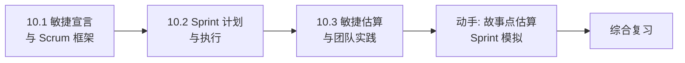

# MOC - 第10章 敏捷项目管理（Scrum）

> [!info] 本章定位
> 第10章回答“在需求不确定、变化频繁的环境中如何管理软件项目”。传统瀑布方法（[[4.2 关键路径法（CPM）与甘特图]]）假设需求稳定，而敏捷方法拥抱变化，通过短迭代、自组织团队、持续反馈交付价值。本章涵盖敏捷宣言与 Scrum 框架、Sprint 计划与执行、敏捷估算与团队实践，是团队敏捷阶段（[[9.2 团队建设与激励]] 自组织团队、[[9.3 冲突管理]] 建设性冲突）的过程化落地，与传统项目管理（[[1.2 项目三重约束：范围、时间、成本、质量]]）形成对照。

## 学习路线图

## 知识点导航

| 节 | 主题 | 核心要点 | 入口 |
| --- | --- | --- | --- |
| 10.1 | 敏捷宣言与 Scrum 框架 | 四大价值观、十二原则、三角色（PO/SM/Dev Team）、三工件、五事件 | [[10.1 敏捷宣言与Scrum框架]] |
| 10.2 | Sprint 计划与执行 | Sprint Planning、用户故事与故事点、Sprint Backlog、Daily Scrum 三问题、燃尽图 | [[10.2 Sprint计划与执行]] |
| 10.3 | 敏捷估算与团队实践 | 故事点估算、Planning Poker、速度 Velocity、CI/CD、敏捷 vs 传统对比 | [[10.3 敏捷估算与团队实践]] |

## 核心考点

> [!warning] 重点掌握
> 1. 敏捷宣言四大价值观：个体与互动 > 流程工具；可工作软件 > 详尽文档；客户协作 > 合同谈判；响应变化 > 遵循计划。
> 2. Scrum 三角色：Product Owner（价值最大化）、Scrum Master（教练与促进者）、Development Team（自组织交付）。
> 3. Scrum 三工件：Product Backlog（产品需求列表）、Sprint Backlog（Sprint 任务列表）、Increment（增量）。
> 4. Scrum 五事件：Sprint（容器）、Sprint Planning（计划）、Daily Scrum（每日站会）、Sprint Review（评审）、Sprint Retrospective（回顾）。
> 5. Daily Scrum 三问题：昨天做了什么、今天打算做什么、有什么障碍。
> 6. 用户故事格式：As a \<角色\>, I want \<功能\>, so that \<价值\>。
> 7. 故事点估算：相对估算，用斐波那契数列（1, 2, 3, 5, 8, 13, 21）。
> 8. Planning Poker：团队共同估算的扑克游戏，避免权威影响。
> 9. 速度 Velocity：团队每 Sprint 完成故事点数，用于预测。
> 10. 燃尽图：剩余工作量随时间变化，理想线 vs 实际线。
> 11. Sprint 长度：1–4 周，固定不更改。
> 12. 完成的定义 Definition of Done (DoD)：团队对“完成”的统一标准。

## 自测题

> [!question] 题1
> 列出敏捷宣言的四大价值观，并说明每条中“左侧胜过右侧”的含义。
> > [!check]- 参考答案
> > | 价值观 | 左侧（更重视） | 右侧（仍有价值） | 含义 |
> > | --- | --- | --- | --- |
> > | 1 | 个体与互动 | 流程与工具 | 人是项目成功的关键，工具服务于人 |
> > | 2 | 可工作软件 | 详尽的文档 | 交付可运行软件优先于文档完备 |
> > | 3 | 客户协作 | 合同谈判 | 与客户持续协作而非依赖合同条款 |
> > | 4 | 响应变化 | 遵循计划 | 拥抱变化而非死守计划 |
> > **关键**：右侧仍有价值，只是左侧更重要。敏捷不否定文档与计划，而是优先级不同。

> [!question] 题2
> 描述 Scrum 的三个角色及其职责，并说明 Scrum Master 与传统项目经理的区别。
> > [!check]- 参考答案
> > | 角色 | 职责 | 类比 |
> > | --- | --- | --- |
> > | Product Owner | 管理 Product Backlog、确定优先级、最大化产品价值 | 产品决策者 |
> > | Scrum Master | 教练、促进者、消除障碍、守护 Scrum 流程 | 服务型领导 |
> > | Development Team | 自组织、跨功能、交付增量 | 执行者 |
> > **Scrum Master vs 项目经理**：
> > - 项目经理：指挥控制型，负责计划、分配、监督；
> > - Scrum Master：服务型领导，教练团队、消除障碍、不直接指挥；
> > - Scrum 团队自组织，无传统“经理”角色。

> [!question] 题3
> 某团队 Sprint 1 完成 20 点，Sprint 2 完成 24 点，Sprint 3 完成 22 点。Product Backlog 剩余 200 点。按平均速度预测还需多少个 Sprint？
> > [!check]- 参考答案
> > **步骤 1：计算平均速度**
> > $$\text{Velocity} = \frac{20 + 24 + 22}{3} = 22 \text{ 点/Sprint}$$
> > **步骤 2：预测剩余 Sprint 数**
> > $$\text{Sprint 数} = \frac{200}{22} \approx 9.1 \to 10 \text{ 个 Sprint}$$
> > **结论**：按当前速度，还需约 10 个 Sprint 完成剩余工作。注意：速度预测需 3 个以上 Sprint 才有参考价值，早期波动大。

> [!question] 题4
> 比较敏捷方法与传统瀑布方法在范围、进度、团队、风险四个维度的差异。
> > [!check]- 参考答案
> > | 维度 | 瀑布方法 | 敏捷方法 |
> > | --- | --- | --- |
> > | 范围 | 前期固定，变更需 CCB（[[6.2 变更控制流程与CCB]]） | 演进式，Product Backlog 持续调整 |
> > | 进度 | 关键路径法（[[4.2 关键路径法（CPM）与甘特图]]）整体规划 | Sprint 迭代，燃尽图跟踪 |
> > | 团队 | 经理指挥、角色分明 | 自组织、跨功能、Scrum Master 服务 |
> > | 风险 | 前期识别、应对计划（[[5.3 风险应对策略与风险监控]]） | 短迭代快速暴露风险、持续调整 |
> > | 估算 | 早期精确估算（[[3.2 工作量估算：COCOMO模型]]） | 相对估算故事点（[[10.3 敏捷估算与团队实践]]） |
> > | 交付 | 末期一次性交付 | 每 Sprint 交付增量 |
> > | 适用 | 需求稳定、合规要求高 | 需求不确定、变化频繁 |

## 章节导航

- 上一级：[[MOC - 软件项目管理]]
- 上一章：[[MOC - 第9章]]
