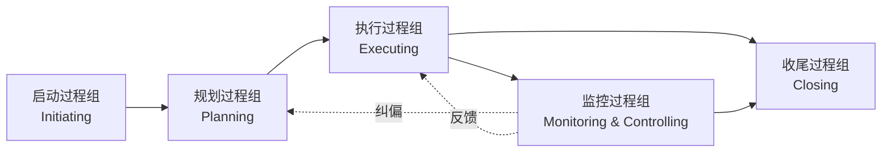

# 1.1 软件项目特征、项目管理目标

要理解为什么软件需要“项目管理”，必须先回答三个问题：项目究竟是什么、软件项目有何特殊性、项目管理“管什么、按什么过程管”。本节从项目的定义与特征出发，剖析软件项目的特殊性，引出项目管理的定义、五大过程组与 PMBOK 十大知识领域，为后续约束平衡（[[1.2 项目三重约束：范围、时间、成本、质量]]）与组织角色（[[1.3 软件项目组织形式与参与角色]]）的讨论奠定概念基础。

## 项目的定义与特征

> [!definition] 项目
> 项目（Project）是为创造独特的产品、服务或成果而进行的**临时性**工作。它有明确的起点和终点，通过一系列相互关联的活动在范围、时间、成本与资源的约束下达成既定目标。

项目具有三大基本特征：

| 特征 | 含义 | 工程含义 |
| --- | --- | --- |
| 临时性 | 有明确的开始与结束时间 | 不同于日常运营，项目是一次性努力；结束以目标达成或项目被终止为标志 |
| 独特性 | 产出物在某种程度上独一无二 | 即使同类项目，其需求、环境、团队、约束均不同，不能简单复制 |
| 渐进明细 | 项目目标与细节随信息积累逐步明确 | 早期信息不全，需通过阶段化推进逐步细化范围与计划 |

> [!note] 临时性 ≠ 短期
> > 临时性指项目有终点，不代表持续时间短——大型软件项目可能延续数年。临时性也意味着项目团队多为临时组建，结束时解散或转入新项目，这对团队建设（[[1.3 软件项目组织形式与参与角色]]）提出特殊要求。

## 软件项目的特征

软件项目除具备一般项目特征外，还因其产物是逻辑实体而具有显著特殊性：

| 特征 | 含义 | 对项目管理的挑战 |
| --- | --- | --- |
| 逻辑产品 | 软件是逻辑符号集合，看不见摸不着 | 进度难以物理度量，需用代码行、功能点等抽象指标 |
| 不可见性 | 软件结构与状态难以直观呈现 | 需建模可视化（DFD、UML）辅助理解与沟通 |
| 复杂度高 | 状态空间庞大，逻辑分支与交互极多 | 分解与抽象是控制复杂度的核心手段（见 [[2.2 WBS工作分解结构创建]]） |
| 需求易变 | 用户需求随业务理解深入而频繁变化 | 必须建立范围控制与变更管理机制（见 [[2.3 范围确认与范围控制]]） |
| 智力密集 | 主要成本是人力智力投入 | 人员能力与协作管理对质量影响巨大（见 [[1.3 软件项目组织形式与参与角色]]） |
| 不可重复测试 | 软件缺陷修复后无法证明“无缺陷” | 需要系统化质量保证与测试策略 |

> [!warning] 软件项目的不可见性陷阱
> > 不可见性使软件项目的进度与质量难以被非技术干系人直观感知，常导致“看似完成了 90%，实则只完成 10%”的错觉（即“90-90 法则”）。这正是软件项目必须借助 WBS、里程碑、可演示原型等手段将不可见进度显性化的根本原因。

## 项目管理的定义

> [!definition] 项目管理
> 项目管理（Project Management）是**将知识、技能、工具与技术应用于项目活动**，以满足项目要求的过程。它通过在范围、时间、成本、质量等约束之间寻求平衡，实现项目干系人的期望。

项目管理的核心任务是在受限的资源与约束下：

- **定义目标**：明确“做什么、做成什么样”；
- **组织资源**：调配人员、工具、预算与时间；
- **控制过程**：对照基准监控偏差，及时纠偏；
- **交付价值**：按既定范围、进度、成本与质量交付成果。

## 项目管理五大过程组

项目管理活动按逻辑时序组织为五大过程组：

> [!definition] 五大过程组
> 项目管理过程组（Process Groups）是按项目管理活动的逻辑时序划分的五个活动集合：**启动、规划、执行、监控、收尾**。过程组不是项目阶段，而是贯穿项目全生命周期的活动类别。

| 过程组 | 主要活动 | 关键产物 |
| --- | --- | --- |
| 启动 | 立项、明确目标、识别干系人、发布项目章程 | 项目章程、干系人登记册 |
| 规划 | 制定项目管理计划，明确范围、进度、成本、质量、风险等基准 | 项目管理计划、WBS、进度计划、预算、风险登记册 |
| 执行 | 按计划开展工作，调配资源，管理团队与沟通 | 可交付物、工作绩效数据、变更请求 |
| 监控 | 对照基准测量绩效，识别偏差，控制变更 | 工作绩效信息、变更控制、纠正措施 |
| 收尾 | 验收交付物，关闭合同，总结经验教训 | 最终产品、归档文档、经验教训总结 |

> [!note] 监控贯穿全程
> > 监控过程组并非只在执行之后，而是与规划、执行并行进行——它以规划产物为基准，实时测量执行绩效，通过变更控制反向修正规划与执行，形成 PDCA（Plan-Do-Check-Act）闭环。这正是挣值分析（见第5章）能在执行中集成监控范围、进度、成本的理论基础。

## PMBOK 十大知识领域

PMBOK（Project Management Body of Knowledge，项目管理知识体系）将项目管理知识组织为十大知识领域，每个领域归属于相应过程组：

| 知识领域 | 管理对象 | 主要过程组 |
| --- | --- | --- |
| 项目整合管理 | 项目整体协调与变更控制 | 全部 |
| 项目范围管理 | 做什么、不做什么 | 启动、规划、监控 |
| 项目进度管理 | 何时完成 | 规划、监控 |
| 项目成本管理 | 花多少钱 | 规划、监控 |
| 项目质量管理 | 达到什么标准 | 规划、执行、监控 |
| 项目资源管理 | 用什么人、什么资源 | 规划、执行、监控 |
| 项目沟通管理 | 如何交流信息 | 规划、执行、监控 |
| 项目风险管理 | 识别与应对不确定因素 | 规划、执行、监控 |
| 项目采购管理 | 外包与合同管理 | 规划、执行、监控 |
| 项目干系人管理 | 管理干系人期望 | 启动、规划、执行、监控 |

> [!tip] 知识领域与课程的对应
> > 本课程章节与知识领域大致对应：第2章对应范围管理、第3–4章对应进度与成本管理（估算与编排）、第5章对应成本管理的挣值监控、第6章对应质量管理、第7章对应风险管理、第8章对应整合管理中的配置与变更控制、第9章对应资源管理、第10章对应敏捷过程下的整合实践。

## 小结

项目是为创造独特成果而进行的临时性工作，具有临时性、独特性与渐进明细特征；软件项目因逻辑产品、不可见性、复杂度高与需求易变而更具管理挑战。项目管理是将知识、技能、工具与技术应用于项目活动以满足要求的过程，其活动按五大过程组（启动-规划-执行-监控-收尾）组织，并按十大知识领域分类。这一概念框架是后续约束平衡、范围分解、估算、进度编排与风险管理的统一坐标系。

## 关联

- 上一级：[[MOC - 第1章]]
- 下一节：[[1.2 项目三重约束：范围、时间、成本、质量]]
- 关联概念：[[1.3 软件项目组织形式与参与角色]]（过程组的执行依赖组织结构与角色分工）；[[2.2 WBS工作分解结构创建]]（规划过程组的核心产物）；[[MOC - 软件工程]]（软件工程第10章项目管理部分的本课程化展开）
