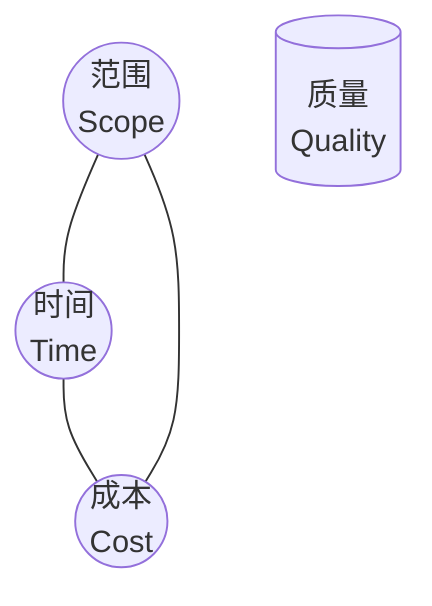
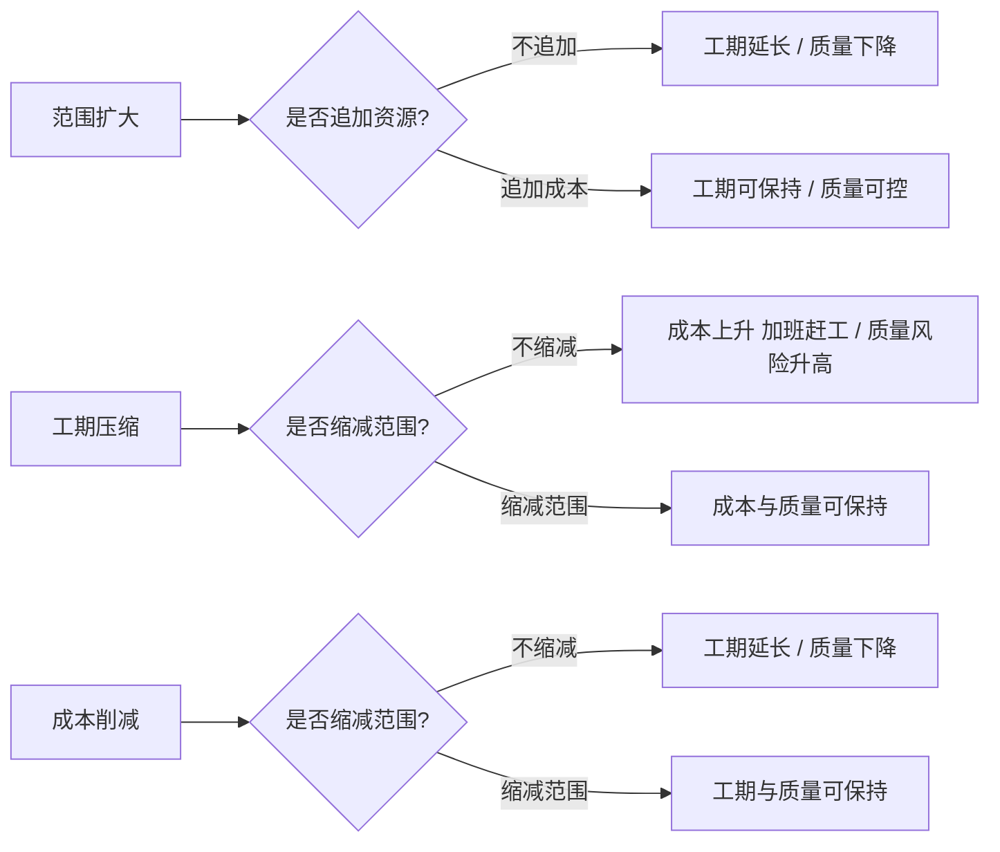

# 1.2 项目三重约束：范围、时间、成本、质量

项目管理的一切活动最终都要回答一个问题：在有限的资源下，如何同时满足范围、时间、成本与质量的要求。本节阐明项目“铁三角”与四重约束的含义、约束之间的相互关系，以及在不同干系人诉求下如何进行约束平衡，为后续范围管理（第2章）、估算（第3章）、进度编排（第4章）与挣值监控（第5章）提供统一的目标框架。

## 项目铁三角

> [!definition] 项目铁三角
> 项目铁三角（Iron Triangle / Triple Constraint）是描述项目三大核心约束——**范围、时间、成本**——相互制约关系的模型。三者构成三角形的三个边，**质量**位于三角形的中心，受三边共同影响。

铁三角的核心命题：

- **三边相互制约**：固定其中两边，第三边随之固定；改变一边，必引起其他一边或多边变化。
- **质量居中受影响**：范围扩大、工期压缩或成本削减，最终都会反映到质量上——质量是三约束平衡的“结果”而非独立变量。
- **三角形面积象征项目产出**：在固定资源下，扩大范围必然延长工期或增加成本；保持质量则必须缩小范围、延长时间或增加成本。

## 四重约束：范围、时间、成本、质量

随着质量管理在软件项目中地位提升，现代项目管理常把质量从三角“中心”提升为与三者并列的第四约束，形成**四重约束**模型：

| 约束 | 含义 | 度量指标 | 主要管理活动 |
| --- | --- | --- | --- |
| 范围 | 项目要完成的工作内容与边界 | WBS 工作包、需求条目 | 需求收集、范围定义、WBS、范围确认 |
| 时间 | 完成项目所需的时间 | 工期、里程碑日期、关键路径长度 | 活动定义与排序、CPM、甘特图、进度压缩 |
| 成本 | 完成项目所需的资源消耗 | 预算、人月、人日、货币金额 | 估算、预算分配、挣值分析 |
| 质量 | 满足明确与隐含需求的程度 | 缺陷密度、测试覆盖率、需求符合度 | 质量计划、质量保证、质量控制 |

> [!note] 四约束不是孤立的
> > 范围决定“做什么”，时间决定“何时做完”，成本决定“投入多少资源”，质量决定“做到什么程度”。四者中任何一个的变化都会传导到其他约束。例如：范围扩展若不增加成本或时间，则质量必然下降。

## 约束间的相互关系

约束之间的关系可以用以下因果链刻画：

常见约束变化场景：

- **范围扩大**（需求增加）：若不增加成本或时间，质量下降；若要保质量，需追加成本或延长工期。
- **工期压缩**（提前交付）：若不缩减范围，则需追加成本（加班/增人）或牺牲质量（测试不足）。
- **成本削减**（预算缩减）：若不缩减范围，则延长工期或降低质量；若保质量，则需缩减范围。
- **质量提升**（提高标准）：通常需扩大成本（更多测试、审查）或延长时间，或缩减范围以集中资源。

> [!warning] 镀金与范围蔓延
> > 范围约束的两种常见破坏形式：①**范围蔓延（Scope Creep）**——未经正式变更控制而不断增加需求；②**镀金（Gold Plating）**——开发人员主动添加客户未要求的功能。二者都打破了铁三角平衡，使成本与工期失控。详见 [[2.3 范围确认与范围控制]]。

## 约束平衡策略

不同项目干系人对四约束的优先级偏好不同，项目经理需在冲突中寻求平衡：

| 项目情境 | 优先约束 | 可妥协约束 | 典型策略 |
| --- | --- | --- | --- |
| 合同制外包项目 | 范围、时间 | 成本（可议价） | 严格按合同范围交付，工期硬约束，必要时追加预算 |
| 创业产品 MVP | 时间、质量 | 范围（可裁剪） | 砍掉非核心功能尽快上线，质量保“可用”即可 |
| 安全关键系统 | 质量 | 时间、成本 | 不惜成本与工期保证可靠性，如航电、医疗 |
| 政府信息化 | 成本、范围 | 时间（可延期） | 预算与范围硬约束，工期相对宽松 |

> [!tip] 平衡原则
> > 1. **先明确优先级**：在项目启动阶段与干系人确认哪个约束最硬、哪个可妥协，避免后期冲突无解。
> > 2. **变更走流程**：任何约束的调整都应通过正式变更控制（见 [[2.3 范围确认与范围控制]]），评估对其他约束的影响。
> > 3. **质量不可简单妥协**：质量虽可被压缩，但技术债务会以指数级维护成本偿还——短期省下的成本会以长期返工与缺陷修复加倍偿还。
> > 4. **以挣值分析量化偏差**：第5章挣值分析（CPI/SPI）是把范围-进度-成本三者集成监控的标准工具。

## 小结

项目铁三角刻画了范围、时间、成本三者的相互制约，质量居中受三边共同影响；现代项目管理将质量提升为第四约束形成四重约束模型。任一约束的变化必然传导到其他约束，项目经理需在干系人优先级明确的前提下，通过正式变更控制与挣值监控维持约束平衡，警惕范围蔓延与镀金对平衡的破坏。

## 关联

- 上一级：[[MOC - 第1章]]
- 上一节：[[1.1 软件项目特征、项目管理目标]]
- 下一节：[[1.3 软件项目组织形式与参与角色]]
- 关联概念：[[2.3 范围确认与范围控制]]（范围约束的执行与控制机制）；[[3.3 成本估算与估算方法综合]]（成本约束的估算基础）；第5章挣值分析（四约束的集成监控，待核实章节）
