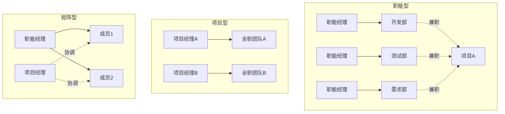
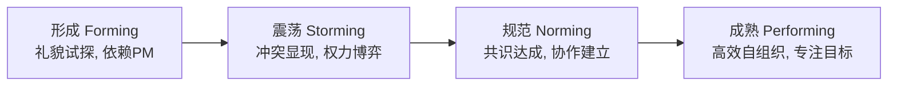

# 1.3 软件项目组织形式与参与角色

项目的计划与控制（[[1.1 软件项目特征、项目管理目标]]）必须由一个合适的组织结构与明确的角色分工来承载。本节阐明项目组织结构的三种基本类型及其矩阵型变体、软件项目的核心角色与职责、用 RACI 矩阵落实责任分配、以及项目团队发展的四阶段模型，为后续范围分解、估算与执行的责任到人提供组织基础。

## 项目组织结构类型

> [!definition] 项目组织结构
> 项目组织结构（Project Organization Structure）是企业为实施项目而划分职权与资源归属的方式。按项目经理权力大小与资源专职程度，分为**职能型、项目型、矩阵型**三类，矩阵型又按 PM 权力强弱分为弱矩阵、平衡矩阵、强矩阵。

| 组织类型 | 项目经理权力 | 资源专职程度 | 沟通效率 | 资源利用 | 适用场景 |
| --- | --- | --- | --- | --- | --- |
| 职能型 | 很弱/无专职 PM | 兼职，归职能经理 | 跨部门困难 | 高（复用） | 技术深度优先的小型项目 |
| 弱矩阵 | 弱 | 兼职 | 一般 | 较高 | 协调需求轻的项目 |
| 平衡矩阵 | 中等 | 兼职 | 较好 | 较高 | 中等规模项目 |
| 强矩阵 | 强 | 较专职 | 好 | 中等 | 大型软件项目（常用） |
| 项目型 | 很强 | 全职 | 高 | 较低（重复建设） | 大型独立、长周期项目 |

> [!note] 软件项目为何偏好矩阵型
> > 软件项目既需要专职项目经理驱动交付，又需要复用职能部门的测试、运维、安全等专业能力——纯职能型缺乏项目驱动力，纯项目型造成专业能力重复建设。强矩阵型在两者之间取得平衡：PM 控制项目进度与范围，职能经理维护专业能力建设与人员培养，是大型软件企业最常用的组织形式。

## 软件项目角色与职责

软件项目的核心角色及其主要职责：

| 角色 | 主要职责 | 关键产物 |
| --- | --- | --- |
| 项目经理（PM） | 项目整体规划、资源调配、进度与成本控制、风险应对、干系人沟通 | 项目章程、项目管理计划、绩效报告 |
| 产品经理（PdM） | 用户需求洞察、产品愿景、需求优先级、需求文档 | 产品需求文档（PRD）、产品路线图 |
| 架构师 | 系统架构设计、技术选型、关键技术决策 | 架构设计文档、技术方案 |
| 开发工程师 | 按设计实现功能、单元测试、代码评审 | 源代码、单元测试、技术文档 |
| 测试工程师 | 测试计划与用例设计、缺陷管理、回归测试 | 测试计划、测试用例、缺陷报告 |
| QA（质量保证） | 过程与质量体系监督、质量度量、审计 | 质量保证计划、质量审计报告 |

> [!tip] PM 与 PdM 的区别
> > 项目经理关注“按时按预算把事情做出来”，对**过程与交付**负责；产品经理关注“做的东西是不是用户要的”，对**价值与方向**负责。在敏捷项目（第10章）中，产品经理角色常由 **Product Owner** 承担。

## RACI 角色职责矩阵

> [!definition] RACI 矩阵
> RACI 矩阵（Responsibility Assignment Matrix）是用于明确每项任务中各角色参与方式的责任分配工具，RACI 取自四种角色：**R 负责执行（Responsible）、A 最终批准（Accountable）、C 被咨询（Consulted）、I 被告知（Informed）**。

| 角色 | 含义 | 数量约束 |
| --- | --- | --- |
| R（Responsible） | 实际执行任务、负责完成 | 可多人 |
| A（Accountable） | 对任务结果最终负责、拍板批准 | **每项任务必须且只能有一个 A** |
| C（Consulted） | 在执行前被征求意见、双向沟通 | 可多人 |
| I（Informed） | 在结果产生后被通知、单向告知 | 可多人 |

软件项目典型 RACI 矩阵示例：

| 任务 | PM | PdM | 架构师 | 开发 | 测试 | QA |
| --- | --- | --- | --- | --- | --- | --- |
| 编写项目章程 | A/R | C | C | I | I | I |
| 需求收集与分析 | C | A/R | C | I | I | I |
| 架构设计 | C | C | A/R | C | I | I |
| 编码实现 | I | I | C | A/R | I | I |
| 测试用例设计 | I | C | I | C | A/R | C |
| 质量审计 | I | I | I | I | C | A/R |
| 范围变更批准 | A | R | C | I | I | C |

> [!warning] RACI 的关键规则
> > 1. **每项任务必须有且只有一个 A**：没有 A 会导致责任真空，多个 A 会导致责任推诿。
> > 2. **A 与 R 可同为一人**：当任务执行者即决策者时，A 与 R 是同一角色。
> > 3. **A 不等于 R**：A 是“最终拍板并负责结果”，R 是“实际干活”，二者可以分离——例如 PM 对范围变更负 A 责，但 PdM 负 R 责起草方案。

## 项目团队发展阶段

> [!definition] Tuckman 团队发展模型
> 项目团队从组建到成熟通常经历四个阶段：**形成（Forming）→ 震荡（Storming）→ 规范（Norming）→ 成熟（Performing）**。

| 阶段 | 团队状态 | PM 工作重点 |
| --- | --- | --- |
| 形成 | 成员初识，礼貌试探，依赖 PM 指令 | 明确目标与角色，建立信任 |
| 震荡 | 冲突显现，意见分歧，权力博弈 | 引导冲突，建立沟通规范 |
| 规范 | 共识达成，协作机制建立 | 授权下放，强化团队规范 |
| 成熟 | 高效自组织，专注目标交付 | 减少干预，专注于障碍清除与对外协调 |

> [!tip] 敏捷团队的成熟期特征
> > 成熟的自组织团队（如 Scrum 团队）能在无需 PM 微干预的情况下自主完成估算、分工与交付——这正是第10章敏捷方法（待核实章节）追求的“成熟期”状态。但团队不会自动进入成熟期，需要 PM 在震荡期主动引导冲突而非压制分歧。

## 小结

项目组织结构按 PM 权力与资源专职度分为职能型、项目型与矩阵型（弱/平衡/强），软件项目多采用强矩阵型以兼顾项目驱动与专业复用。软件项目的核心角色包括项目经理、产品经理、架构师、开发、测试与 QA，其职责通过 RACI 矩阵落实到每项任务——每项任务必须有且只有一个 A。项目团队从组建到成熟经历形成、震荡、规范、成熟四阶段，PM 的工作风格需随阶段演进而调整。

## 关联

- 上一级：[[MOC - 第1章]]
- 上一节：[[1.2 项目三重约束：范围、时间、成本、质量]]
- 关联概念：[[2.1 需求收集与范围定义]]（PdM 主导的需求收集）；第9章项目团队与人员管理（团队阶段的深化，待核实章节）；第10章 Scrum（自组织团队，待核实章节）
