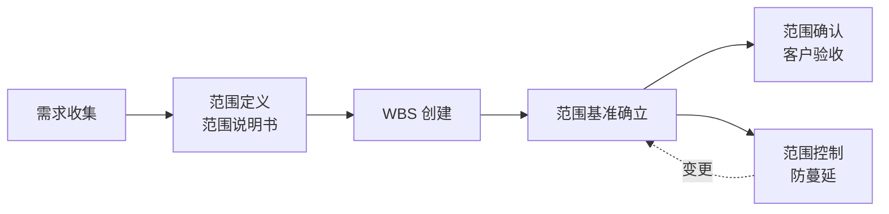

# 2.1 需求收集与范围定义

范围管理的第一步是“搞清楚到底要做什么”。本节阐明需求收集的主要方法及其适用场景、项目范围说明书的内容结构、以及范围基准的组成，为后续 WBS 工作分解（[[2.2 WBS工作分解结构创建]]）与范围控制（[[2.3 范围确认与范围控制]]）提供明确的项目边界。需求工程的更系统化方法见 [[MOC - 软件工程]] 第3章。

## 范围管理流程

项目范围管理贯穿从需求收集到范围控制的全过程：

> [!note] 产品范围 vs. 项目范围
> > **产品范围**指产品或服务应具备的功能与特性，由需求规格定义；**项目范围**指为交付产品范围而必须完成的工作，由 WBS 体现。产品范围决定项目范围，但项目范围还包含项目管理本身的工作（如计划编制、质量保证、配置管理）。

## 需求收集方法

不同项目情境下应选择合适的需求收集方法：

| 方法 | 含义 | 优点 | 局限 | 适用场景 |
| --- | --- | --- | --- | --- |
| 访谈 | 一对一或小组与干系人交流 | 深入、灵活、可追问 | 耗时、依赖访谈技巧 | 关键干系人、复杂需求 |
| 工作坊（JAD） | 多干系人集中讨论达成共识 | 高效、即时消歧 | 组织成本高 | 需求冲突多、跨部门项目 |
| 原型 | 用界面或可演示原型收集反馈 | 直观、降低误解 | 易被当作最终产品 | 需求不明确、UI 密集型项目 |
| 问卷 | 结构化问题大规模分发 | 覆盖广、可量化 | 深度不足、回收率低 | 大量用户、统计性需求 |

> [!tip] 软件项目常用组合
> > 软件项目通常组合使用：**访谈**收集核心干系人深度需求、**工作坊**消解冲突、**原型**验证界面与交互、**问卷**补充统计性需求。原型在敏捷方法中演化为 Sprint 交付的可演示增量（第10章，待核实）。

## 范围定义

> [!definition] 项目范围说明书
> 项目范围说明书（Project Scope Statement）是详细描述项目范围——包括可交付物与为创建这些可交付物所需工作的文档。它是干系人对项目范围的共同理解，也是 WBS 创建与范围确认的依据。

项目范围说明书的核心内容：

| 要素 | 含义 |
| --- | --- |
| 项目目标 | 项目要达成的可衡量成果（范围、时间、成本、质量目标） |
| 可交付物 | 项目产出物清单（产品、文档、服务等） |
| 项目边界 | 明确“做什么”与“不做什么”，划定范围内外 |
| 约束 | 限制项目选择的因素（预算、工期、技术、法规等） |
| 假设 | 被视为真但未经证实的条件（需记录以便后续验证） |
| 验收标准 | 可交付物被接受的判定条件 |
| 排除项 | 明确不在本项目范围内的工作 |

> [!example] 范围说明书片段示例
> > **项目目标**：6 个月内交付图书借阅管理系统 v1.0，支持 500 并发用户。
> > **可交付物**：Web 应用、管理后台、API 文档、用户手册、测试报告。
> > **项目边界**：包含借阅、归还、续借、逾期提醒功能；不含图书采购与库存管理。
> > **约束**：预算 ≤ 50 万元、Java 技术栈、须通过等保二级。
> > **假设**：图书馆已有 MySQL 数据库环境可用。
> > **验收标准**：核心功能通过 UAT，缺陷密度 ≤ 1/千行代码。

## 范围基准

> [!definition] 范围基准
> 范围基准（Scope Baseline）是经批准的项目范围说明书、WBS 及其 WBS 字典的组合，作为项目范围绩效测量的基准。任何对范围基准的变更都必须通过正式变更控制流程（见 [[2.3 范围确认与范围控制]]）。

范围基准的三要素：

1. **项目范围说明书**——范围边界与可交付物的文字定义；
2. **WBS**——范围的可视化层次分解（见 [[2.2 WBS工作分解结构创建]]）；
3. **WBS 字典**——每个工作包的详细说明。

> [!warning] 基准的严肃性
> > 范围基准一旦确立即成为受控对象，任何调整都需经 CCB（变更控制委员会）评估对时间、成本、质量的影响并正式批准——这正是第5章挣值分析能够用 EV（挣值）对照 PV（计划价值）的前提：EV 的计算依赖于稳定的范围基准。

## 小结

范围管理以需求收集为起点，通过访谈、工作坊、原型、问卷等方法获取干系人需求；将其提炼为项目范围说明书，明确目标、可交付物、边界、约束、假设与验收标准；范围说明书与 WBS、WBS 字典共同构成范围基准，成为后续分解、确认与控制的依据。范围基准的严肃性是项目可控的基础。

## 关联

- 上一级：[[MOC - 第2章]]
- 下一节：[[2.2 WBS工作分解结构创建]]
- 关联概念：[[2.3 范围确认与范围控制]]（基准的确认与变更控制）；[[MOC - 软件工程]]（需求工程的系统化方法，第3章）；[[3.3 成本估算与估算方法综合]]（基准是估算的前提）
