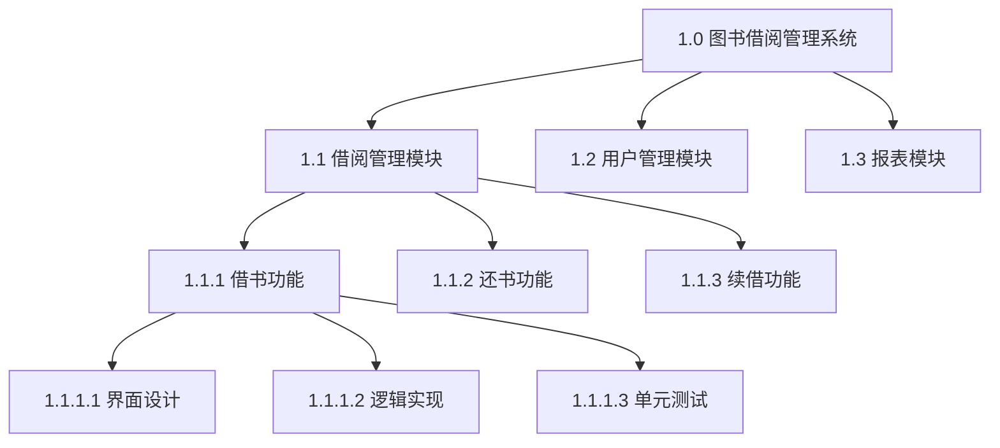

# 2.2 WBS 工作分解结构创建

范围说明书回答“做什么”，WBS 则把“做什么”分解为“怎么做、由谁做、何时做”的最小可控单元。本节阐明 WBS 的定义与 100% 规则、分解层次与编码系统、工作包的特征，为后续估算（[[3.1 软件规模估算：代码行与功能点]]、[[3.2 工作量估算：COCOMO模型]]）与进度编排（第4章）提供可计量的基础单元。

## WBS 定义

> [!definition] WBS
> 工作分解结构（Work Breakdown Structure, WBS）是**将项目可交付物与项目工作分解为更小、更易管理的组件**的层次化结构。WBS 以可交付物为导向，自顶向下逐层细化，最终落到可估算、可分配、可监控的工作包。

WBS 的本质：

- **以可交付物为导向**：分解的依据是“产出什么”，而非“按时间顺序做什么”——后者属于进度计划（第4章）。
- **层次化分解**：从项目总体逐层细化到工作包，每一层是上一层的细化。
- **不表示时间与依赖**：WBS 只刻画“范围结构”，活动顺序与依赖关系由活动定义与排序（第4章）单独处理。

## WBS 分解原则：100% 规则

> [!definition] 100% 规则
> 100% 规则是 WBS 的核心原则：**WBS 中任一父节点所代表的工作，必须等于其所有子节点工作之和**，既不遗漏也不重叠。整个 WBS 自顶向下覆盖项目 100% 的范围。

100% 规则的推论：

1. **不重不漏**：子节点之和既不能小于父节点（漏项），也不能大于父节点（重叠）。
2. **可交付物导向**：每一层分解应基于可交付物或可识别的工作组件，而非随意按职能切分。
3. **工作包可验证**：最底层工作包必须有明确的完成标准，可被验收。

> [!warning] 违反 100% 规则的后果
> > ①子层之和小于父层（遗漏）：部分工作未被纳入计划，执行时才发现漏项，造成返工与工期延误；②子层之和大于父层（重叠）：同一工作被重复估算与执行，资源浪费且责任不清。两者都会导致估算与进度基准失真。

## WBS 分解层次

WBS 自顶向下通常分为以下层次：

```
项目 (Level 1)
└── 阶段/主要可交付物 (Level 2)
    └── 子可交付物 (Level 3)
        └── 工作包 (Level 4, 最底层)
```

| 层次 | 名称 | 示例（图书借阅系统） |
| --- | --- | --- |
| 1 | 项目 | 图书借阅管理系统 v1.0 |
| 2 | 主要可交付物 | 借阅管理模块 / 用户管理模块 / 报表模块 |
| 3 | 子可交付物 | 借阅管理 → 借书功能 / 还书功能 / 续借功能 |
| 4 | 工作包 | 借书功能 → 借书界面设计 / 借书逻辑实现 / 借书单元测试 |

> [!note] 分解到什么粒度合适
> > 工作包的粒度遵循“8/80 规则”经验：单个工作包工作量建议在 8 小时到 80 小时之间（即 1 人日到 2 人周）。过粗则难以估算与监控，过细则分解成本高于管理收益。软件项目中常以“可独立估算、可分配给单人、可在 1–2 周内完成”作为工作包粒度的判据。

## WBS 编码系统

WBS 编码系统为每个节点分配唯一编号，便于引用、估算与跟踪：



> [!tip] 编码规则
> > 编码采用“父编号.子序号”的点分十进制形式，如 1.1.1.1 表示项目 1 下的第 1 个主要可交付物下的第 1 个子可交付物下的第 1 个工作包。这种编码便于在估算表、进度计划与配置项中统一引用，也是 WBS 字典检索的键。

## 工作包

> [!definition] 工作包
> 工作包（Work Package）是 WBS 的最底层节点，是项目工作的最小可控单元。每个工作包具备可估算、可分配、可监控、可验收的特征。

工作包必须具备的属性：

| 属性 | 说明 |
| --- | --- |
| 工作内容 | 明确描述要做什么 |
| 责任人 | 指定唯一的负责人（A 角色，见 [[1.3 软件项目组织形式与参与角色]]） |
| 工期与成本估算 | 工作量与持续时间可估算（第3章输入） |
| 依赖关系 | 与其他工作包的前置后置关系（第4章输入） |
| 完成标准 | 明确的验收准则 |
| 里程碑 | 关键检查点 |

> [!example] 工作包描述示例
> > 工作包 1.1.1.2 借书逻辑实现：
> > - 工作内容：实现借书业务逻辑（校验读者状态、扣减可借数量、记录借阅信息）
> > - 责任人：开发工程师张三
> > - 估算：5 人日
> > - 依赖：1.1.1.1 界面设计完成、数据库表已建
> > - 完成标准：通过借书功能单元测试，覆盖率 ≥ 80%

## WBS 与后续管理活动的关系

WBS 是项目管理的“骨架”，其产物被后续多个管理活动复用：

- **估算**（第3章）：工作包是规模与工作量估算的最小单元，COCOMO 与功能点估算以工作包为基础汇总。
- **进度编排**（第4章）：工作包转化为活动，活动间排序构成网络图与关键路径。
- **挣值分析**（第5章）：EV（挣值）按工作包完成百分比累加，PV 按工作包计划分配。
- **配置管理**（第8章）：配置项标识常以 WBS 编码为前缀，便于追溯。

## 小结

WBS 是以可交付物为导向的工作层次化分解，遵循 100% 规则——任一父节点的子节点之和等于父节点。WBS 自顶向下分为项目、阶段、可交付物、工作包四层，工作包是最小可控单元，具备可估算、可分配、可监控、可验收的特征。WBS 编码系统为每个节点分配唯一编号，是估算、进度编排、挣值分析与配置管理的统一引用基础。

## 关联

- 上一级：[[MOC - 第2章]]
- 上一节：[[2.1 需求收集与范围定义]]
- 下一节：[[2.3 范围确认与范围控制]]
- 关联概念：[[3.1 软件规模估算：代码行与功能点]]（工作包是估算单元）；[[3.2 工作量估算：COCOMO模型]]（按工作包汇总工作量）；[[1.3 软件项目组织形式与参与角色]]（工作包责任到人的 RACI 基础）
