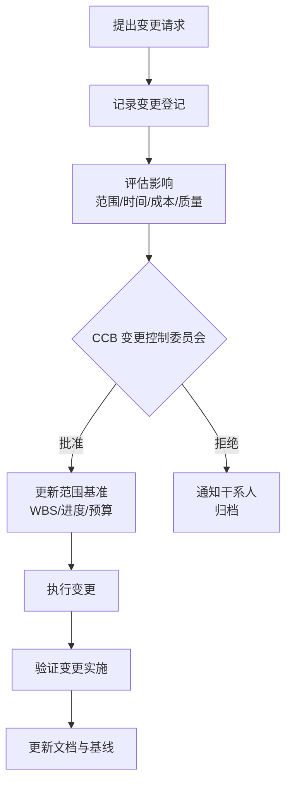

# 2.3 范围确认与范围控制

范围基准（[[2.1 需求收集与范围定义]]）建立后，项目管理面临两类持续挑战：交付物是否被客户接受、范围是否在执行中被悄悄改变。本节阐明范围确认（客户验收）与范围控制（防蔓延）的区别、范围蔓延与镀金的成因与防范，以及正式的变更控制流程，保障范围基准在项目全生命周期内有效。

## 范围确认

> [!definition] 范围确认
> 范围确认（Validate Scope）是**客户或发起人正式验收已完成的可交付物**的过程。它关注“做出来的东西客户接不接受”，是面向交付物的验收活动，属于监控过程组。

范围确认的特点：

- **客户主导**：由客户或其代表对可交付物进行正式接收。
- **面向交付物**：验收对象是已完成的产品、文档、服务等，而非过程。
- **阶段性与最终**：可在每个阶段末进行部分验收，项目收尾时进行最终验收。
- **依据验收标准**：对照范围说明书与 WBS 字典中的验收标准判定。

> [!note] 范围确认 vs. 质量控制
> > 范围确认是“客户接受不接受”，由客户主导；质量控制（第6章）是“符合不符合质量标准”，由项目团队主导。通常先做质量控制（内部检查是否符合质量要求），再做范围确认（交付客户验收），二者不可混淆。

## 范围控制

> [!definition] 范围控制
> 范围控制（Control Scope）是**监控项目范围状态、管理范围基准变更**的过程。它关注“范围有没有被未经授权地改变”，防止范围蔓延与镀金，属于监控过程组。

范围控制的核心目标：

1. **识别偏差**：对比实际范围与基准，发现范围偏离。
2. **管理变更**：所有范围变更必须经正式变更控制流程。
3. **防止蔓延与镀金**：识别并阻止未经授权的范围扩展。

## 范围蔓延与镀金

| 概念 | 定义 | 源头 | 危害 |
| --- | --- | --- | --- |
| 范围蔓延（Scope Creep） | 未经正式变更控制，范围在项目执行中被逐渐增加 | 外部（客户、干系人不断提新需求） | 工期延长、成本超支、质量下降 |
| 镀金（Gold Plating） | 开发人员主动添加客户未要求的功能 | 内部（开发者“善意”自作主张） | 浪费资源、引入未经验证的功能、扩大测试面 |

> [!warning] 范围蔓延的隐蔽性
> > 范围蔓延通常以“小改动”形式累积——每次只增加一个“小功能”，单看影响不大，但累积后严重偏离基准。项目经理必须对任何范围调整保持警觉，即使是客户口头提出的小需求，也必须经变更控制流程评估影响后方可决定是否纳入。

## 范围变更控制流程

变更控制流程的关键步骤：

1. **提出变更请求**：任何干系人可提出，须以书面形式（变更请求单）。
2. **记录登记**：纳入变更日志，分配编号与状态。
3. **评估影响**：分析对范围、时间、成本、质量、风险的影响（见 [[1.2 项目三重约束：范围、时间、成本、质量]]）。
4. **CCB 审批**：变更控制委员会（Change Control Board, CCB）基于影响评估决定批准、拒绝或延期。
5. **更新基准**：批准的变更更新范围基准、WBS、进度计划与预算。
6. **执行与验证**：执行变更并验证实施效果。
7. **归档**：更新文档与配置项（第8章配置管理配合）。

> [!definition] CCB
> 变更控制委员会（Change Control Board, CCB）是**正式批准或拒绝项目变更请求的指定干系人小组**。其组成通常包括项目经理、客户代表、技术负责人、质量负责人等，职责是评估变更对项目的影响并作出决策。CCB 是范围基准严肃性的制度保障。

## 镀金问题的处理

镀金虽出于“善意”，但同样破坏项目：

- **浪费资源**：未计划的功能消耗了本可用于核心功能的预算与工期。
- **未经验证**：镀金功能未经需求分析与测试，可能引入缺陷。
- **扩大测试面**：增加的功能扩大了回归测试范围，拖慢交付。
- **客户预期失控**：客户可能把镀金功能当作“应有功能”，后续变更反而成为负担。

> [!tip] 防范镀金
> > 1. 明确团队纪律：禁止未经批准的功能添加。
> > 2. 代码评审（Code Review）中识别镀金代码并要求移除。
> > 3. 将“善意改进”引导为变更请求，经评估后纳入下一迭代（敏捷方法中的产品待办列表）。

## 小结

范围确认是客户对已完成可交付物的正式验收，范围控制是防止范围基准被未经授权地改变。范围蔓延源于外部干系人不断增加需求，镀金源于内部开发人员主动添加功能——二者都破坏三重约束平衡，须通过正式变更控制流程加以管理。CCB（变更控制委员会）是变更决策的制度保障，所有范围调整经影响评估、CCB 审批、基准更新、执行验证后方可落实。

## 关联

- 上一级：[[MOC - 第2章]]
- 上一节：[[2.2 WBS工作分解结构创建]]
- 关联概念：[[2.1 需求收集与范围定义]]（范围基准的来源）；[[1.2 项目三重约束：范围、时间、成本、质量]]（变更须评估对其他约束的影响）；第8章配置管理（变更与配置项同步，待核实章节）
