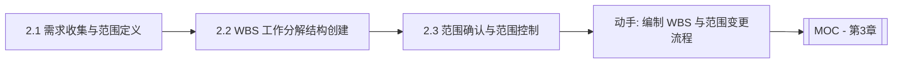

# MOC - 第2章 范围管理与WBS工作分解

> [!info] 本章定位
> 第2章回答“项目到底要做什么、不做什么”。范围管理是项目管理的起点：只有明确了边界并把它分解为可估算、可分配、可验证的工作包，后续的估算（第3章）、进度编排（第4章）与挣值监控（第5章）才有可靠的基准。本章贯穿需求收集、范围定义、WBS 工作分解、范围确认与范围控制，构建起项目的范围基准。

## 学习路线图

## 知识点导航

| 节 | 主题 | 核心要点 | 入口 |
| --- | --- | --- | --- |
| 2.1 | 需求收集与范围定义 | 需求收集方法、范围说明书内容、范围基准 | [[2.1 需求收集与范围定义]] |
| 2.2 | WBS 工作分解结构创建 | WBS 定义、100% 规则、分解层次、工作包、编码系统 | [[2.2 WBS工作分解结构创建]] |
| 2.3 | 范围确认与范围控制 | 范围确认（客户验收）、范围蔓延与镀金、变更控制流程 | [[2.3 范围确认与范围控制]] |

## 核心考点

> [!warning] 重点掌握
> 1. 需求收集的四种方法（访谈、工作坊、原型、问卷）及适用场景。
> 2. 项目范围说明书的内容：目标、可交付物、边界、约束、假设。
> 3. 范围基准的组成：范围说明书 + WBS + WBS 字典。
> 4. WBS 的定义与 100% 规则：子层工作之和等于父层，不重不漏。
> 5. WBS 分解层次：项目 → 阶段 → 可交付物 → 工作包。
> 6. 工作包的特征：WBS 最底层、可估算、可分配、可监控。
> 7. 范围确认与范围控制的区别：验收 vs. 防蔓延。
> 8. 范围蔓延（Scope Creep）与镀金（Gold Plating）的区分。
> 9. 范围变更控制流程与 CCB（变更控制委员会）的作用。

## 自测题

> [!question] 题1
> 简述范围基准的组成，并说明 WBS 字典的作用。
> > [!check]- 参考答案
> > 范围基准由三部分组成：项目范围说明书、WBS、WBS 字典。范围说明书定义项目边界与可交付物；WBS 把可交付物分解为层次化的工作包；WBS 字典为每个工作包提供详细说明——包括工作内容、责任人、里程碑、成本与进度估算、质量要求、依赖关系等。WBS 字典的作用是把 WBS 上抽象的工作包节点落实为可执行、可验收的具体描述，避免“看图不知细节”的歧义。

> [!question] 题2
> 解释 WBS 的 100% 规则，并指出违反该规则的两种典型后果。
> > [!check]- 参考答案
> > 100% 规则：WBS 中任一父节点的全部子节点之和必须等于且恰好等于父节点所代表的工作范围，既不遗漏也不重叠。违反规则会有两种后果：①子节点之和小于父节点（遗漏），导致部分工作未被纳入计划与估算，执行时才发现“漏项”造成返工与工期延误；②子节点之和大于父节点（重叠），导致同一工作被重复估算与执行，浪费资源并造成责任不清。

> [!question] 题3
> 区分范围确认与范围控制，并说明二者在过程组中的归属。
> > [!check]- 参考答案
> > 范围确认（Validate Scope）是客户或发起人对已完成的可交付物进行正式验收的过程，关注“做出来的东西客户接不接受”，属于监控过程组；范围控制（Control Scope）是监控项目范围状态、管理范围变更的过程，关注“范围有没有被悄悄改变”，防止范围蔓延与镀金，同样属于监控过程组。前者是面向交付物的验收活动，后者是面向基准的变更控制活动，二者互补共同保障范围基准的有效性。

> [!question] 题4
> 比较范围蔓延与镀金的异同，并说明防范措施。
> > [!check]- 参考答案
> > 相同点：二者都导致项目范围超出原定基准，破坏三重约束平衡。不同点：范围蔓延（Scope Creep）是范围在未经正式变更控制的情况下被外部干系人（通常是客户）不断增加，源头在外部；镀金（Gold Plating）是开发人员主动添加客户未要求的功能，源头在内部。防范措施：建立正式变更控制流程，所有范围调整经 CCB 评估对时间、成本、质量的影响后批准；明确验收标准与范围边界；加强团队纪律，禁止“自作主张”的善意添加。

## 章节导航

- 上一级：[[MOC - 软件项目管理]]
- 上一章：[[MOC - 第1章]]
- 下一章：[[MOC - 第3章]]
