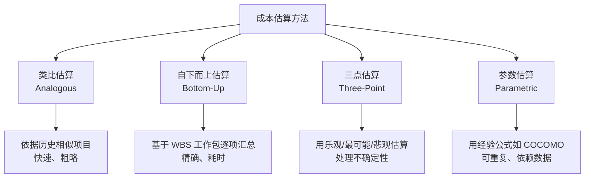
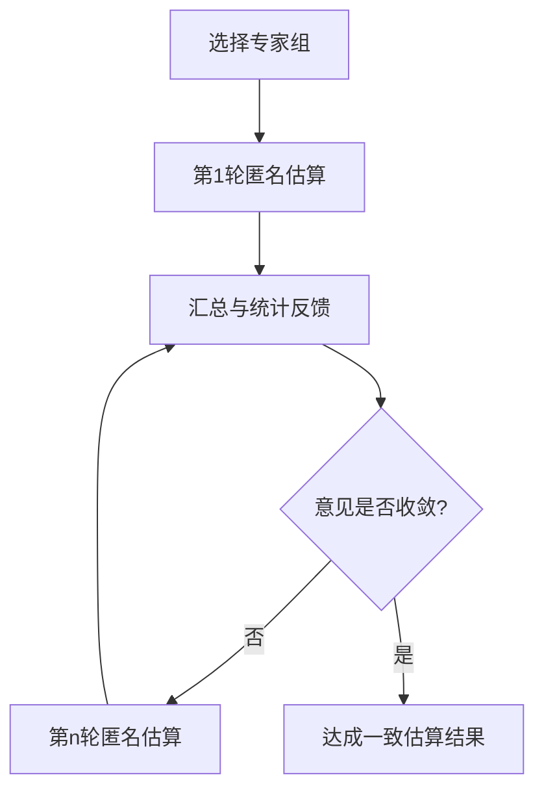

# 3.3 成本估算与估算方法综合

COCOMO（[[3.2 工作量估算：COCOMO模型]]）属于参数估算法，但项目估算在不同阶段与不同信息条件下应采用不同方法。本节综合阐明四种主流估算方法（类比、自下而上、三点、参数）、三点估算与德尔菲法的具体公式与流程、估算精度锥形曲线现象，以及成本预算的分配方法，构建起项目估算方法选择的全景视图。

## 成本估算方法分类

| 方法 | 原理 | 优点 | 缺点 | 适用阶段 |
| --- | --- | --- | --- | --- |
| 类比估算 | 参考历史相似项目的实际成本 | 快速、成本低 | 依赖历史数据质量与相似性 | 早期、信息不足 |
| 自下而上估算 | 对 WBS 每个工作包逐项估算后汇总 | 精确度最高 | 耗时长、工作量大 | 详细设计后、WBS 完成时 |
| 三点估算 | 用乐观 O、最可能 M、悲观 P 计算期望值 | 量化不确定性 | 依赖专家判断质量 | 各阶段均可，尤其中期 |
| 参数估算 | 用经验公式（如 COCOMO）由规模推算工作量 | 可重复、可校准 | 依赖模型与参数准确性 | 有历史数据与模型时 |

> [!note] 方法不是互斥的
> > 实际项目常组合使用：早期用类比估算快速判断可行性，中期用参数估算（COCOMO）得到量化工作量，详细阶段用自下而上估算精细化预算，全过程用三点估算标注不确定性范围。第5章挣值分析的 PV（计划价值）即以这些估算结果为基础。

## 三点估算

> [:definition] 三点估算
> 三点估算（Three-Point Estimating）通过给出三个估计值——**乐观（Optimistic, O）、最可能（Most Likely, M）、悲观（Pessimistic, P）**——并加权计算期望值，量化估算的不确定性。源于 PERT（Program Evaluation and Review Technique）。

### 三点估算公式

> [!formula] PERT 期望值与标准差
> $$E = \frac{O + 4M + P}{6}$$
> $$\sigma = \frac{P - O}{6}$$
>
> 其中：
> - $E$：期望工作量（或工期）；
> - $\sigma$：标准差，反映估算离散程度；
> - $O$：乐观估计（最好情况）；
> - $M$：最可能估计；
> - $P$：悲观估计（最坏情况）。

公式原理：假设工作量服从 Beta 分布（PERT 假设），最可能值 $M$ 出现概率最高，故权重最大（4），乐观与悲观各占权重 1，总权重 6。标准差 $\sigma = (P-O)/6$ 近似 Beta 分布的标准差。

> [!example] 三点估算示例
> 某工作包：O = 4 人日，M = 6 人日，P = 14 人日。
> $$E = (4 + 4 \times 6 + 14)/6 = 42/6 = 7 \text{ 人日}$$
> $$\sigma = (14 - 4)/6 = 1.67 \text{ 人日}$$
> 工作量落在 $[E - \sigma, E + \sigma] = [5.33, 8.67]$ 人日内的概率约 68%。

### 三点估算的概率区间

基于正态近似，工作量落在不同区间的概率：

| 区间 | 概率（近似） |
| --- | --- |
| $E \pm \sigma$ | 68% |
| $E \pm 2\sigma$ | 95% |
| $E \pm 3\sigma$ | 99.7% |

> [!tip] 应急储备的确定
> > 三点估算可为应急储备（Contingency Reserve）提供量化依据。例如取 $E + 1.5\sigma$ 作为有 86% 把握的预算值，超出部分由管理储备承担。这正是风险管理（第7章）与成本预算的结合点。

## 德尔菲法

> [!definition] 德尔菲法
> 德尔菲法（Delphi Method）是一种**通过多轮匿名专家问卷调查达成一致估算**的方法，旨在避免群体讨论中的权威效应与从众心理。

德尔菲法流程：

德尔菲法特点：

- **匿名性**：专家互不知晓彼此身份与具体估计，避免权威影响。
- **多轮迭代**：通过反馈与重新估计逐步收敛。
- **统计汇总**：以中位数、四分位数等汇总，而非简单平均。
- **受控反馈**：每轮告知上一轮的统计结果，不直接公开个人意见。

> [!note] 德尔菲法 vs. 头脑风暴
> > 头脑风暴鼓励自由发言、相互激发，适合需求收集与创意发散；德尔菲法强调匿名与收敛，适合需要独立判断后达成一致的估算场景。二者目的不同，不可混用。

## 估算精度与项目阶段：锥形曲线

> [!definition] 锥形曲线
> 锥形曲线（Cone of Uncertainty）描述软件项目估算误差随项目阶段推进而收窄的现象。项目越早期，不确定性越大，估算误差越宽；随需求与设计明确，误差逐步收窄。由 Steve McConnell 推广。

| 项目阶段 | 估算误差范围 |
| --- | --- |
| 项目构思 | ±400%（实际可达估算的 0.25–8 倍） |
| 需求分析 | ±100% |
| 系统设计 | ±50% |
| 详细设计 | ±25% |
| 编码完成 | ±10% |

> [!warning] 锥形曲线的启示
> > ①早期估算只能用于可行性判断，不可作为硬性预算承诺；②应分阶段滚动估算，随信息增加不断修正基准；③早期应保留充足应急储备（如 ±50%）应对不确定性；④尽早通过原型、需求细化等手段收敛不确定性；⑤任何阶段都应注明估算误差范围，而非给出单一数字。

## 成本预算分配

成本估算是“项目总共要花多少钱”，成本预算则是“这些钱如何分配到各时间阶段与工作包”。预算分配的关键步骤：

1. **按 WBS 工作包分配成本**：将总估算成本按工作包权重分配，形成成本基准。
2. **按时间维度分配**：结合进度计划（第4章），把成本分摊到各时段，形成 S 曲线（累计成本曲线）。
3. **建立应急与管理储备**：应急储备应对已识别风险，管理储备应对未识别风险。
4. **形成成本基准**：经批准的预算成为成本基准，由挣值分析（第5章）对照监控。

> [!note] S 曲线
> > S 曲线（S-Curve）是累计成本随时间变化的曲线，呈 S 形——初期投入慢、中期加速、末期收尾。它既是成本基准的可视化，也是挣值分析中 PV（计划价值）的来源。第5章将基于 PV、EV、AC 三个值监控成本与进度偏差。

## 小结

成本估算方法分为类比、自下而上、三点、参数四类，各有所长且常组合使用。三点估算用 $E = (O+4M+P)/6$ 与 $\sigma = (P-O)/6$ 量化不确定性，为应急储备提供依据；德尔菲法通过多轮匿名调查达成专家一致；估算精度锥形曲线说明早期估算误差大、应分阶段滚动修正。成本预算将估算结果按 WBS 与时间维度分配，叠加应急与管理储备形成成本基准，供挣值分析对照监控。

## 关联

- 上一级：[[MOC - 第3章]]
- 上一节：[[3.2 工作量估算：COCOMO模型]]
- 关联概念：[[3.1 软件规模估算：代码行与功能点]]（规模估算是参数估算的输入）；[[2.2 WBS工作分解结构创建]]（自下而上估算的基础）；[[1.2 项目三重约束：范围、时间、成本、质量]]（成本约束与应急储备的关系）；第5章挣值分析（成本基准的监控，待核实章节）；第7章风险管理（应急储备对应已识别风险，待核实章节）
