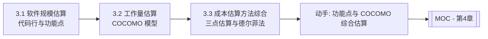

# MOC - 第3章 软件规模、工作量与成本估算

> [!info] 本章定位
> 第3章回答“这个项目有多大、要花多少人、要花多少钱”。估算在范围管理（第2章）的工作包基础上进行，为进度编排（第4章）与成本预算（第5章）提供量化输入。本章涵盖规模估算（代码行与功能点）、工作量估算（COCOMO 模型）与成本估算方法综合（三点估算、德尔菲法、估算精度锥形曲线），是项目“可计划、可监控”的数据基石。

## 学习路线图

## 知识点导航

| 节 | 主题 | 核心要点 | 入口 |
| --- | --- | --- | --- |
| 3.1 | 软件规模估算：代码行与功能点 | LOC 估算、FPA 五要素（EI/EO/EQ/ILF/EIF）、功能点计算公式、完整示例 | [[3.1 软件规模估算：代码行与功能点]] |
| 3.2 | 工作量估算：COCOMO 模型 | COCOMO 基本/中级/高级模型、有机型/半分离型/嵌入型参数、COCOMO II 概述、完整示例 | [[3.2 工作量估算：COCOMO模型]] |
| 3.3 | 成本估算与估算方法综合 | 类比/自下而上/三点/参数估算、三点估算公式、德尔菲法、估算精度锥形曲线、预算分配 | [[3.3 成本估算与估算方法综合]] |

## 核心考点

> [!warning] 重点掌握
> 1. 代码行（LOC）估算的两种方式：直接估算与专家估算。
> 2. 功能点分析（FPA）五要素：EI、EO、EQ、ILF、EIF 的定义与区分。
> 3. 功能点计算公式：$FP = UFP \times TCF$，UFP 与 TCF 的计算方法。
> 4. 代码行与功能点估算的优缺点对比。
> 5. COCOMO 三级模型：基本、中级、高级的公式与适用场景。
> 6. COCOMO 模型参数：有机型（a=2.4, b=1.05）、半分离型（a=3.0, b=1.12）、嵌入型（a=3.6, b=1.20）。
> 7. COCOMO 中级模型 EAF（工作量调整因子）的作用。
> 8. 三点估算公式：期望值 $= (O+4M+P)/6$，标准差 $= (P-O)/6$。
> 9. 德尔菲法的流程与特点。
> 10. 估算精度锥形曲线：项目阶段越早，估算误差越大。

## 自测题

> [!question] 题1
> 说明功能点分析中 EI、EO、EQ、ILF、EIF 的含义，并各举一个软件项目中的例子。
> > [!check]- 参考答案
> > - EI（External Input，外部输入）：处理来自外部的数据或控制信息，如“新增订单”“修改用户信息”。
> > - EO（External Output，外部输出）：向外部发送经过处理或计算的数据，如“生成月度销售报表”“打印发票”。
> > - EQ（External Inquiry，外部查询）：直接检索并返回数据，无实质处理，如“查询图书信息”“查看订单状态”。
> > - ILF（Internal Logical File，内部逻辑文件）：系统内部维护的逻辑数据组，如“用户表”“订单表”。
> > - EIF（External Interface File，外部接口文件）：系统引用但由外部维护的逻辑数据组，如“调用外部支付系统的账户数据”“读取税务系统的税率表”。

> [!question] 题2
> 写出 COCOMO 基本模型公式，并说明有机型、半分离型、嵌入型的参数取值。
> > [!check]- 参考答案
> > COCOMO 基本模型公式：$E = a \times (KLOC)^b$，其中 $E$ 为人月（PM），$KLOC$ 为千行代码。
> > - 有机型（Organic）：a = 2.4，b = 1.05；
> > - 半分离型（Semi-Detached）：a = 3.0，b = 1.12；
> > - 嵌入型（Embedded）：a = 3.6，b = 1.20。
> > 有机型适用于规模小、约束松、团队熟悉的项目；半分离型介于二者之间；嵌入型适用于规模大、约束严、需在硬约束下运行的项目。

> [!question] 题3
> 某工作包乐观估算 4 人日，最可能 6 人日，悲观 14 人日。用三点估算计算期望工作量与标准差，并说明标准差的含义。
> > [!check]- 参考答案
> > 期望值 $E = (O + 4M + P)/6 = (4 + 4 \times 6 + 14)/6 = (4 + 24 + 14)/6 = 42/6 = 7$ 人日。
> > 标准差 $\sigma = (P - O)/6 = (14 - 4)/6 = 10/6 \approx 1.67$ 人日。
> > 标准差反映估算的不确定性：标准差越大，悲观与乐观估计差异越大，估算越不确定。基于 PERT 假设（Beta 分布近似），工作量落在 $E \pm \sigma$（约 5.33–8.67 人日）内的概率约 68%。

> [!question] 题4
> 解释估算精度“锥形曲线”现象，并说明它对项目管理的启示。
> > [!check]- 参考答案
> > 锥形曲线（Cone of Uncertainty）描述软件项目估算误差随项目阶段推进而收窄的现象：项目初期（概念阶段）估算误差可达 ±400%（即实际可达估算的 4–8 倍），随着需求明确、设计细化，误差逐步收窄到 ±10%–25%（开发后期）。启示：①早期估算只能用于可行性判断，不可作为硬性预算承诺；②应分阶段滚动估算，随信息增加不断修正；③早期应保留充足应急储备以应对不确定性；④尽早通过原型、需求细化等手段收敛不确定性。

## 章节导航

- 上一级：[[MOC - 软件项目管理]]
- 上一章：[[MOC - 第2章]]
- 下一章：[[MOC - 第4章]]
