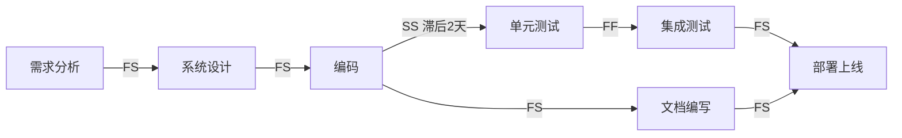

# 4.1 活动定义与活动排序

进度规划的第一步是“把工作包分解为活动，再确定活动之间的逻辑顺序”。活动定义承接第2章 WBS（[[2.2 WBS工作分解结构创建]]）的工作包，活动排序为 [[4.2 关键路径法（CPM）与甘特图]] 的网络计算与 [[4.3 PERT技术与进度压缩]] 的概率估算奠定基础。本节阐明活动定义、活动属性、四种前置关系、三类依赖关系以及提前量与滞后量。

## 活动定义

> [!definition] 活动
> 活动（Activity）是项目工作分解中**为完成工作包而必须实施的工作单元**，是进度编排、成本估算、资源分配的基本单位。活动由工作包进一步分解得到，具有明确的开始与结束。

活动定义的核心任务是把 WBS 的工作包分解为可估算、可调度、可分配的具体活动。

> [!note] 工作包 vs 活动
> 工作包是 WBS 的最底层节点，回答“做什么”；活动是工作包的执行步骤，回答“怎么做、做多久、谁来做”。一个工作包通常分解为多个活动。例如工作包“用户管理模块开发”可分解为“设计用户表、实现注册接口、实现登录接口、单元测试”等活动。

## 活动属性

每个活动应记录以下属性，供进度计算与资源分配使用：

| 属性 | 含义 | 示例 |
| --- | --- | --- |
| 活动标识 | 唯一编号 | A、B、C 或 4.1.1 |
| 活动名称 | 简明描述 | “实现注册接口” |
| 持续时间 | 完成活动所需时间 | 5 工作日 |
| 前置活动 | 必须先完成/开始的活动 | A、B |
| 后续活动 | 依赖本活动的活动 | D、E |
| 资源 | 所需人员与设备 | 后端工程师 ×2 |
| 里程碑标志 | 是否为里程碑 | 否 / 是 |

## 活动排序：四种前置关系

活动排序确定活动间的逻辑依赖关系。**前导图法（Precedence Diagramming Method, PDM）** 是最常用的活动排序方法，定义四种前置关系：

> [!definition] 四种前置关系
> - **FS（Finish-to-Start，完成-开始）**：前置活动完成后，后续活动才能开始。最常见，约 90% 的依赖关系。
> - **FF（Finish-to-Finish，完成-完成）**：前置活动完成后，后续活动才能完成。
> - **SS（Start-to-Start，开始-开始）**：前置活动开始后，后续活动才能开始。
> - **SF（Start-to-Finish，开始-完成）**：前置活动开始后，后续活动才能完成。最少见。

### 软件项目中的实例

| 关系 | 软件项目实例 |
| --- | --- |
| FS | 需求分析完成后开始系统设计 |
| FF | 编码完成后才能完成单元测试 |
| SS | 需求收集开始后，需求文档撰写开始 |
| SF | 新系统开始运行后，老系统停止（系统切换） |

## 三类依赖关系

活动间的依赖按来源分为三类：

> [!definition] 依赖关系分类
> - **强制依赖（Mandatory Dependency，硬逻辑）**：基于工作本身性质或合同/法规要求，必须遵守。例：编码完成后才能测试。
> - **自由依赖（Discretionary Dependency，软逻辑）**：基于最佳实践或团队偏好，可调整。例：先做核心模块再做外围模块。
> - **外部依赖（External Dependency）**：项目活动与非项目活动之间的关系。例：依赖第三方接口交付。

| 类型 | 又名 | 性质 | 可调性 |
| --- | --- | --- | --- |
| 强制依赖 | 硬逻辑 | 工作/合同固有 | 不可调 |
| 自由依赖 | 软逻辑 | 经验/偏好 | 可调 |
| 外部依赖 | — | 跨项目边界 | 需协调外部 |

## 提前量与滞后量

> [!definition] 提前量与滞后量
> - **提前量（Lead）**：后续活动在前置活动完成之前提前开始，相当于负滞后。例：编码完成 80% 时开始测试，提前量 20%。
> - **滞后量（Lag）**：前置活动完成后，等待一段时间后续活动才开始。例：浇筑混凝土后等待 3 天固化。

提前量常用于实现“快速跟进”进度压缩（见 [[4.3 PERT技术与进度压缩]]）；滞后量反映强制性等待。

## 活动排序关系图

> [!tip] 排序的工程意义
> > 活动排序决定了网络图的拓扑，进而决定关键路径与项目工期。错误或遗漏的依赖关系会误导 CPM 计算——遗漏依赖会低估工期，冗余依赖会限制调度灵活性。软件项目中尤其注意“逻辑依赖”（必须遵守）与“资源依赖”（因资源不足被迫串行）的区别，后者可通过加资源缓解。

## 小结

活动定义把 WBS 工作包分解为可调度的活动，活动排序用 PDM 四种关系（FS/FF/SS/SF）建立活动网络。依赖关系按来源分为强制、自由、外部三类，提前量与滞后量用于精细调整依赖时序。活动排序的输出是带依赖的活动清单，是 [[4.2 关键路径法（CPM）与甘特图]] 的输入。

## 关联

- 上一级：[[MOC - 第4章]]
- 下一节：[[4.2 关键路径法（CPM）与甘特图]]
- 关联概念：[[2.2 WBS工作分解结构创建]]（工作包是活动定义的输入）；[[4.3 PERT技术与进度压缩]]（提前量是快速跟进的基础）
