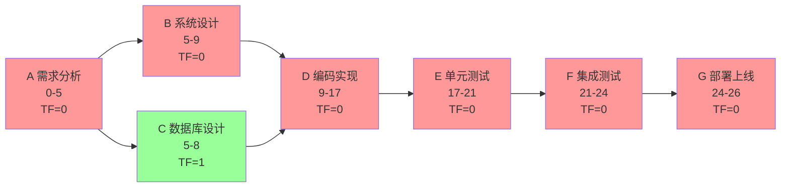

# 4.2 关键路径法（CPM）与甘特图

活动排序（[[4.1 活动定义与活动排序]]）确定了活动网络，接下来要回答“哪条路径决定项目工期、各活动有多少弹性”。关键路径法（Critical Path Method, CPM）通过正向计算最早时间、反向计算最晚时间，识别总时差为零的关键路径；甘特图把网络结果可视化为时间条形图。本节是进度规划的核心，也是挣值分析 SPI（[[MOC - 第5章]]）的进度基线来源。

## 关键路径法定义

> [!definition] 关键路径法
> 关键路径法（Critical Path Method, CPM）是**通过计算所有活动的最早开始/完成时间与最晚开始/完成时间，识别总时差为零的活动路径**的确定性网络分析技术。关键路径是项目中最长的活动路径，决定项目最短工期。

## CPM 时间参数

CPM 涉及四个核心时间参数与一个时差：

| 参数 | 英文 | 含义 |
| --- | --- | --- |
| ES | Earliest Start | 最早开始时间 |
| EF | Earliest Finish | 最早完成时间 = ES + 持续时间 |
| LS | Latest Start | 最晚开始时间 = LF - 持续时间 |
| LF | Latest Finish | 最晚完成时间 |
| TF | Total Float | 总时差 = LS - ES = LF - EF |

> [!formula] 总时差公式
> $$TF = LS - ES = LF - EF$$
>
> - $TF > 0$：活动可延误 TF 时间而不影响项目工期；
> - $TF = 0$：活动为关键活动，延误将直接延误项目；
> - $TF < 0$：进度已落后于计划。

## CPM 计算步骤

### 正向计算（最早时间 ES/EF）

从起点出发，沿网络向前推算：

> [!formula] 正向计算
> - 起始活动：$ES = 0$；
> - $EF = ES + 持续时间$；
> - 后续活动 $ES = \max(\text{所有前置活动的 } EF)$。

### 反向计算（最晚时间 LS/LF）

从终点倒推：

> [!formula] 反向计算
> - 终点活动：$LF = \text{项目工期}$（= 终点 EF）；
> - $LS = LF - 持续时间$；
> - 前置活动 $LF = \min(\text{所有后续活动的 } LS)$。

### 关键路径识别

> [!definition] 关键路径
> 关键路径是**总时差 $TF = 0$ 的活动组成的从起点到终点的路径**。它是最长路径，其总持续时间即为项目工期。一个项目可能有多条关键路径。

## 完整 CPM 计算示例

> [!example] 示例：图书系统开发项目 CPM 计算
> **活动清单**：
>
> | 活动 | 名称 | 工期(天) | 前置 |
> | --- | --- | --- | --- |
> | A | 需求分析 | 5 | — |
> | B | 系统设计 | 4 | A |
> | C | 数据库设计 | 3 | A |
> | D | 编码实现 | 8 | B, C |
> | E | 单元测试 | 4 | D |
> | F | 集成测试 | 3 | E |
> | G | 部署上线 | 2 | F |
>
> **第1步：正向计算 ES/EF**
>
> | 活动 | ES | EF |
> | --- | --- | --- |
> | A | 0 | 5 |
> | B | 5 | 9 |
> | C | 5 | 8 |
> | D | max(9, 8)=9 | 17 |
> | E | 17 | 21 |
> | F | 21 | 24 |
> | G | 24 | 26 |
>
> 项目工期 = 26 天。
>
> **第2步：反向计算 LS/LF**
>
> | 活动 | LF | LS |
> | --- | --- | --- |
> | G | 26 | 24 |
> | F | 24 | 21 |
> | E | 21 | 17 |
> | D | 17 | 9 |
> | B | 9 | 5 |
> | C | 9 | 6 |
> | A | 5 | 0 |
>
> **第3步：计算总时差 TF = LS - ES**
>
> | 活动 | ES | EF | LS | LF | TF |
> | --- | --- | --- | --- | --- | --- |
> | A | 0 | 5 | 0 | 5 | **0** |
> | B | 5 | 9 | 5 | 9 | **0** |
> | C | 5 | 8 | 6 | 9 | 1 |
> | D | 9 | 17 | 9 | 17 | **0** |
> | E | 17 | 21 | 17 | 21 | **0** |
> | F | 21 | 24 | 21 | 24 | **0** |
> | G | 24 | 26 | 24 | 26 | **0** |
>
> **第4步：识别关键路径**
> 关键路径（TF=0）：A → B → D → E → F → G，项目工期 26 天。
> C 活动有 1 天时差，是非关键活动。

## CPM 网络图

> [!note] 关键路径可视化
> 红色为关键活动（TF=0），绿色为非关键活动（TF>0）。关键路径上的任何延误都直接延误项目，项目经理应重点关注。

## 甘特图

> [!definition] 甘特图
> 甘特图（Gantt Chart）是**以横轴为时间、纵轴为活动、用条形表示活动持续时间**的进度可视化工具，由 Henry Gantt 于 1917 年提出。它直观展示各活动的开始、持续与结束时间，可叠加依赖关系、里程碑与进度基线。

```mermaid
gantt
    title 图书系统开发项目甘特图
    dateFormat X
    axisFormat %s
    section 设计阶段
    A 需求分析       :crit, a, 0, 5d
    B 系统设计        :crit, b, after a, 4d
    C 数据库设计      :c, after a, 3d
    section 开发阶段
    D 编码实现        :crit, d, after b, 8d
    section 测试阶段
    E 单元测试        :crit, e, after d, 4d
    F 集成测试        :crit, f, after e, 3d
    section 上线阶段
    G 部署上线        :crit, g, after f, 2d
    里程碑 项目交付   :milestone, m, after g, 0d
```

> [!tip] 甘特图的应用
> > 甘特图是项目进度沟通的核心工具：①向客户/管理层展示项目时间线；②叠加基线对比实际进度偏差；③标注里程碑节点；④与资源直方图结合做资源平衡。但甘特图难以表达复杂依赖关系，复杂网络仍需 CPM/PERT 网络图辅助。

## 时差的类型

> [!note] 总时差 vs 自由时差
> - **总时差（Total Float, TF）**：活动可延误而不影响项目总工期的最大时间 = LS - ES。
> - **自由时差（Free Float, FF）**：活动可延误而不影响任何后续活动最早开始的时间 = $\min(ES_{后续}) - EF$。
> - 关系：自由时差 ≤ 总时差。

## 小结

CPM 通过正向（ES/EF）与反向（LS/LF）计算识别总时差为零的关键路径，关键路径是项目最长路径决定工期。甘特图把网络结果可视化为时间条形图，是项目沟通的核心工具。总时差衡量活动弹性，自由时差衡量不影响后续的弹性。CPM 与甘特图共同构成进度基线。

## 关联

- 上一级：[[MOC - 第4章]]
- 上一节：[[4.1 活动定义与活动排序]]
- 下一节：[[4.3 PERT技术与进度压缩]]
- 关联概念：[[2.2 WBS工作分解结构创建]]（活动源于工作包）；[[MOC - 第5章]]（进度基线用于风险监控）；[[MOC - 第8章]]（CPM 进度基线用于挣值分析 SPI）
