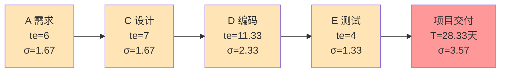
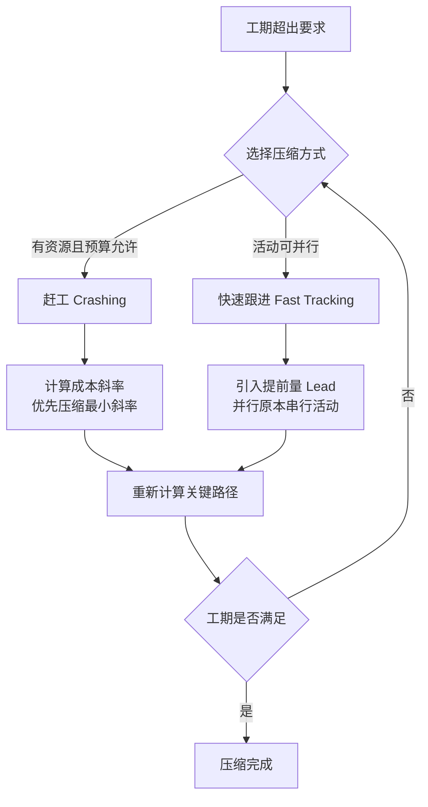

# 4.3 PERT 技术与进度压缩

[[4.2 关键路径法（CPM）与甘特图]] 用确定工期计算关键路径，但现实中活动工期本身存在不确定性。PERT（计划评审技术）引入三点估算处理工期概率性；当项目工期超出要求时，需用赶工或快速跟进进行进度压缩。本节是进度规划的收口，为后续风险监控（[[MOC - 第5章]]）与挣值分析（[[MOC - 第8章]]）提供概率化的进度基线。

## PERT 计划评审技术

> [!definition] PERT
> PERT（Program Evaluation and Review Technique，计划评审技术）是**用三点估算处理活动工期不确定性**的概率型网络分析技术，1958 年由美国海军为北极星导弹项目开发。PERT 假设活动工期服从 Beta 分布，用期望工期与标准差描述概率特征。

## 三点估算

PERT 对每个活动估算三个时间值：

| 参数 | 含义 | 说明 |
| --- | --- | --- |
| O（Optimistic） | 乐观时间 | 一切顺利时的最短工期 |
| M（Most Likely） | 最可能时间 | 正常情况下的工期 |
| P（Pessimistic） | 悲观时间 | 遇到困难时的最长工期 |

> [!formula] PERT 期望工期与标准差
> 期望工期：
> $$te = \frac{O + 4M + P}{6}$$
>
> 标准差：
> $$\sigma = \frac{P - O}{6}$$
>
> 方差：
> $$\sigma^2 = \left(\frac{P - O}{6}\right)^2$$
>
> - $te$ 是加权平均，最可能时间 M 权重为 4；
> - $\sigma$ 反映不确定性，悲观与乐观差距越大，标准差越大；
> - 项目总工期方差 = 关键路径各活动方差之和。

> [!note] Beta 分布假设
> PERT 假设工期服从 Beta 分布而非对称正态分布，加权公式 $te=(O+4M+P)/6$ 是 Beta 分布的近似期望。当活动数量较多时，由中心极限定理，项目总工期近似服从正态分布。

## PERT 与 CPM 区别

| 维度 | CPM 关键路径法 | PERT 计划评审技术 |
| --- | --- | --- |
| 工期性质 | 确定性（单一工期） | 概率性（三点估算） |
| 适用项目 | 工期确定、经验丰富 | 工期不确定、研发项目 |
| 输出 | 确定关键路径与工期 | 期望工期与概率分布 |
| 时间参数 | ES/EF/LS/LF/TF | 同 CPM + te/σ |
| 网络 | 节点活动或箭线活动 | 通常箭线活动（AOA） |
| 起源 | 1957 杜邦公司化工厂 | 1958 美国海军北极星 |

> [!tip] PERT 与 CPM 的工程取舍
> > CPM 适用于活动工期明确的项目（如重复性工程）；PERT 适用于研发型、不确定性高的项目（如软件研发）。现代项目管理常将二者结合：用 PERT 估算期望工期，再以 CPM 方法计算关键路径与时差。

## 完整 PERT 计算示例

> [!example] 示例：研发项目 PERT 计算
> **活动三点估算**（关键路径 A→C→D→E）：
>
> | 活动 | O | M | P | te=(O+4M+P)/6 | σ=(P-O)/6 |
> | --- | --- | --- | --- | --- | --- |
> | A 需求 | 3 | 5 | 13 | (3+20+13)/6=6 | (13-3)/6=1.67 |
> | C 设计 | 4 | 6 | 14 | (4+24+14)/6=7 | (14-4)/6=1.67 |
> | D 编码 | 7 | 10 | 21 | (7+40+21)/6=11.33 | (21-7)/6=2.33 |
> | E 测试 | 2 | 3 | 10 | (2+12+10)/6=4 | (10-2)/6=1.33 |
>
> **第1步：项目期望工期**
> $$T = te_A + te_C + te_D + te_E = 6 + 7 + 11.33 + 4 = 28.33 \text{ 天}$$
>
> **第2步：项目总方差与标准差**
> $$\sigma^2 = 1.67^2 + 1.67^2 + 2.33^2 + 1.33^2 = 2.79 + 2.79 + 5.43 + 1.77 = 12.78$$
> $$\sigma = \sqrt{12.78} \approx 3.57 \text{ 天}$$
>
> **第3步：工期概率计算**（正态分布近似）
> - 35 天内完成概率：$Z = (35 - 28.33)/3.57 \approx 1.87$，$P \approx 0.969$（约 96.9%）；
> - 30 天内完成概率：$Z = (30 - 28.33)/3.57 \approx 0.47$，$P \approx 0.681$（约 68.1%）；
> - 期望工期 28.33 天内完成概率：$Z=0$，$P = 0.5$（50%）。

## PERT 网络图

> [!note] PERT 概率解读
> > PERT 给出的是概率分布而非单一工期。期望工期 28.33 天只代表 50% 完成概率；若承诺给客户，通常取 $T + 1.645\sigma$（约 95% 概率）= 28.33 + 5.87 = 34.2 天作为承诺工期。

## 进度压缩

当项目工期超出要求时，需进行进度压缩。两种主要方法：

### 赶工（Crashing）

> [!definition] 赶工
> 赶工（Crashing）是**通过增加资源（加班、加人、外包）缩短关键活动工期**的进度压缩技术，通常增加成本。

赶工的关键是选择**赶工成本斜率最小**的关键活动优先压缩：

> [!formula] 赶工成本斜率
> $$\text{Cost Slope} = \frac{\text{赶工成本} - \text{正常成本}}{\text{正常工期} - \text{赶工工期}}$$
>
> 单位：元/天。斜率越小，压缩一天增加的成本越少，优先压缩。

### 快速跟进（Fast Tracking）

> [!definition] 快速跟进
> 快速跟进（Fast Tracking）是**将原本串行的活动并行或重叠执行**的进度压缩技术，通常不增加直接成本但增加返工风险。基于 [[4.1 活动定义与活动排序]] 的提前量（Lead）实现。

### 两种方法对比

| 维度 | 赶工 Crashing | 快速跟进 Fast Tracking |
| --- | --- | --- |
| 原理 | 加资源缩短工期 | 并行化原本串行的活动 |
| 成本影响 | 增加直接成本 | 通常不增直接成本，增返工成本 |
| 风险 | 沟通成本↑，效率↓ | 返工风险↑，协调难度↑ |
| 适用前提 | 关键活动可压缩、资源可获 | 活动间存在软逻辑依赖 |
| 选择策略 | 优先压缩成本斜率最小的关键活动 | 仅在依赖非强制时使用 |

> [!warning] 压缩的副作用
> > 压缩关键路径可能产生新的关键路径。压缩后必须重新计算 CPM，确认关键路径变化。过度赶工违反“布鲁克斯定律”（加人反而延期），过度并行导致返工激增。

## 小结

PERT 用三点估算 $te=(O+4M+P)/6$、$\sigma=(P-O)/6$ 处理工期不确定性，给出期望工期与概率分布；与 CPM 的确定性工期形成互补。进度压缩包括赶工（加资源增成本）与快速跟进（并行化增风险），压缩后需重新识别关键路径。三者共同构成进度规划的完整工具集。

## 关联

- 上一级：[[MOC - 第4章]]
- 上一节：[[4.2 关键路径法（CPM）与甘特图]]
- 关联概念：[[4.1 活动定义与活动排序]]（提前量是快速跟进基础）；[[MOC - 第5章]]（PERT 概率为风险量化提供输入）；[[3.3 成本估算与估算方法综合]]（三点估算法同源）
