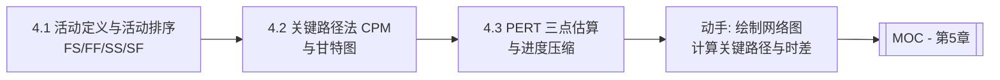

# MOC - 第4章 进度规划：甘特图、关键路径、PERT

> [!info] 本章定位
> 第4章回答“项目什么时候做完、各活动如何排序、哪条路径决定工期”。进度规划在第3章规模与工作量估算（[[3.2 工作量估算：COCOMO模型]]）给出的人月基础上，把工作包编排为带时间、依赖与里程碑的活动网络。本章涵盖活动定义与排序（FS/FF/SS/SF 四种逻辑关系）、关键路径法（CPM）与甘特图、PERT 三点估算与进度压缩（赶工与快速跟进），是项目“可调度、可监控、可压缩”的核心方法集，也为后续挣值分析（SPI）与风险监控提供进度基线。

## 学习路线图

## 知识点导航

| 节 | 主题 | 核心要点 | 入口 |
| --- | --- | --- | --- |
| 4.1 | 活动定义与活动排序 | 活动定义（WBS→活动）、活动属性、四种前置关系（FS/FF/SS/SF）、三类依赖（强制/自由/外部）、提前量与滞后量 | [[4.1 活动定义与活动排序]] |
| 4.2 | 关键路径法（CPM）与甘特图 | ES/EF/LS/LF 计算、总时差 TF=LS-ES=LF-EF、关键路径识别、甘特图绘制、完整 CPM 示例 | [[4.2 关键路径法（CPM）与甘特图]] |
| 4.3 | PERT 技术与进度压缩 | PERT 三点估算 te=(O+4M+P)/6、σ=(P-O)/6、PERT 与 CPM 区别、赶工与快速跟进 | [[4.3 PERT技术与进度压缩]] |

## 核心考点

> [!warning] 重点掌握
> 1. 活动定义与 WBS 工作包的关系：活动是工作包的进一步分解，是可估算、可调度、可分配的最小执行单元。
> 2. 四种前置关系（PDM 前导图法）：FS 完成-开始、FF 完成-完成、SS 开始-开始、SF 开始-完成，能识别图例与含义。
> 3. 三类依赖关系：强制依赖（硬逻辑）、自由依赖（软逻辑）、外部依赖。
> 4. CPM 正向计算 ES/EF、反向计算 LS/LF，总时差 $TF = LS - ES = LF - EF$。
> 5. 关键路径：总时差为零的活动组成的路径，是项目最长路径，决定项目最短工期。
> 6. 甘特图要素：横轴时间、纵轴活动、条形表示持续时间，可叠加依赖箭头、里程碑、基线对比。
> 7. PERT 三点估算：期望工期 $te = (O + 4M + P)/6$，标准差 $\sigma = (P - O)/6$，方差 $\sigma^2 = ((P-O)/6)^2$。
> 8. PERT 概率性 vs CPM 确定性：PERT 给出工期概率分布，CPM 给出确定工期。
> 9. 进度压缩：赶工（Crashing，加资源换时间，增成本）、快速跟进（Fast Tracking，并行化，增风险）。
> 10. 时差概念辨析：总时差 TF 与自由时差 FF 的区别。

## 自测题

> [!question] 题1
> 用 PDM 前导图法说明四种活动逻辑关系（FS/FF/SS/SF）的含义，并各举一个软件项目中的例子。
> > [!check]- 参考答案
> > - **FS 完成-开始**（Finish-to-Start）：前置活动完成后，后续活动才能开始。最常见。例：需求分析完成后才能开始系统设计。
> > - **FF 完成-完成**（Finish-to-Finish）：前置活动完成后，后续活动才能完成。例：编码完成后才能完成单元测试。
> > - **SS 开始-开始**（Start-to-Start）：前置活动开始后，后续活动才能开始。例：需求收集开始后，需求文档撰写才能开始。
> > - **SF 开始-完成**（Start-to-Finish）：前置活动开始后，后续活动才能完成。最罕见。例：新系统开始运行后，老系统才能停止。

> [!question] 题2
> 某项目有 5 个活动，依赖关系与工期如下：A(3 天)→C(4 天)、B(5 天)→C(4 天)、C→D(2 天)、C→E(6 天)、D→F(3 天)、E→F(3 天)。计算各活动的 ES/EF/LS/LF，并指出关键路径与项目工期。
> > [!check]- 参考答案
> > 正向计算（ES/EF）：
> > - A：ES=0，EF=3；B：ES=0，EF=5；
> > - C：ES=max(EF_A, EF_B)=5，EF=5+4=9；
> > - D：ES=9，EF=11；E：ES=9，EF=15；
> > - F：ES=max(EF_D, EF_E)=15，EF=15+3=18。
> > 项目工期 = 18 天。反向计算（LS/LF）：
> > - F：LF=18，LS=15；
> > - D：LF=LS_F=15，LS=15-2=13；E：LF=LS_F=15，LS=15-6=9；
> > - C：LF=min(LS_D, LS_E)=9，LS=9-4=5；
> > - A：LF=LS_C=5，LS=5-3=2；B：LF=LS_C=5，LS=5-5=0。
> > 总时差 TF：A=2-0=2，B=0-0=0，C=5-5=0，D=13-9=4，E=9-9=0，F=15-15=0。
> > 关键路径（TF=0）：B→C→E→F，项目工期 18 天。

> [!question] 题3
> 某活动乐观工期 6 天，最可能 9 天，悲观 18 天。用 PERT 计算期望工期与标准差，并计算项目在 15 天内完成的概率（设工期服从正态分布，Z 值：1σ≈0.84，1.5σ≈0.93）。
> > [!check]- 参考答案
> > 期望工期 $te = (O + 4M + P)/6 = (6 + 4 \times 9 + 18)/6 = (6 + 36 + 18)/6 = 60/6 = 10$ 天。
> > 标准差 $\sigma = (P - O)/6 = (18 - 6)/6 = 12/6 = 2$ 天。
> > 计算 15 天内完成概率：$Z = (15 - 10)/2 = 2.5$，查正态分布表 $P(Z \le 2.5) \approx 0.9938$，即约 99.38%。
> > 说明：标准差 2 天反映工期不确定性；期望工期 10 天，但 PERT 给出的是概率分布而非确定值。

> [!question] 题4
> 比较赶工（Crashing）与快速跟进（Fast Tracking）两种进度压缩策略的原理、成本与风险。
> > [!check]- 参考答案
> > | 维度 | 赶工 Crashing | 快速跟进 Fast Tracking |
> > | --- | --- | --- |
> > | 原理 | 增加资源（加班、加人、外包）缩短关键活动工期 | 将原本串行的活动并行或重叠执行 |
> > | 成本影响 | 通常增加成本（资源费用、加班费） | 通常不增加直接成本，但增加返工成本 |
> > | 风险 | 增加沟通成本，可能因人数增加反而降低效率 | 增加返工与协调风险，依赖关系被打破 |
> > | 适用前提 | 关键活动有可压缩空间且资源可获取 | 活动间存在可并行的软逻辑依赖 |
> > | 选择原则 | 优先选择赶工成本斜率最小的关键活动 | 仅在依赖非强制时使用 |

## 章节导航

- 上一级：[[MOC - 软件项目管理]]
- 上一章：[[MOC - 第3章]]
- 下一章：[[MOC - 第5章]]
