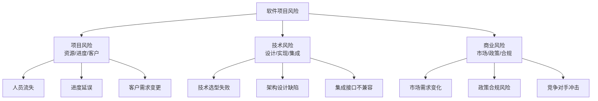
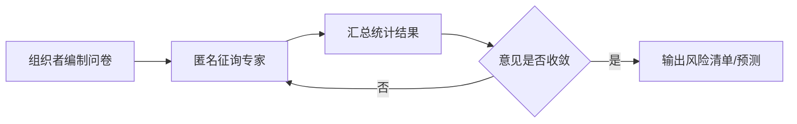
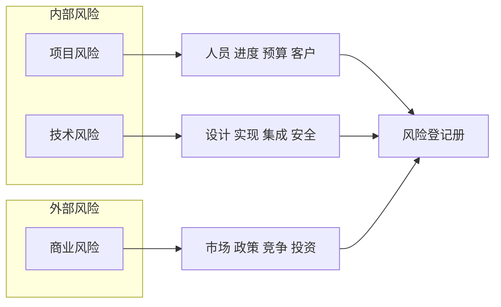

# 5.1 风险识别与风险分类

风险管理的第一步是“发现并分类风险”。风险识别在项目全生命周期持续进行，输出是风险登记册。本节阐明风险定义、三类风险分类、四种识别方法、风险条目要素与常见软件风险清单，为 [[5.2 风险评估与风险量化]] 的分析提供输入。

## 风险定义

> [!definition] 风险
> 风险（Risk）是**一个不确定的事件或条件，一旦发生会对项目目标（范围、进度、成本、质量）产生正面或负面影响**。风险包含三个要素：
> - **事件**：发生什么；
> - **概率**：发生的可能性（0–1 或百分比）；
> - **影响**：发生后的后果程度。

> [!note] 风险的两个面向
> - **威胁（Threat）**：负面风险，对目标有不利影响。
> - **机会（Opportunity）**：正面风险，对目标有利好影响。
> 传统风险管理聚焦威胁，现代项目管理（PMBOK）同时关注机会。

## 风险分类

软件项目风险按来源分为三类：

| 类别 | 含义 | 典型风险 |
| --- | --- | --- |
| 项目风险 | 项目管理层面的不确定性 | 人员流失、进度延误、预算超支、客户需求变更、供应商违约 |
| 技术风险 | 技术方案与实现层面的不确定性 | 技术选型不当、架构设计缺陷、性能不达标、集成失败、安全漏洞 |
| 商业风险 | 商业环境层面的不确定性 | 市场需求变化、政策法规变化、竞争对手冲击、投资撤回 |

## 风险识别方法

> [!definition] 风险识别方法
> 常用风险识别方法包括：头脑风暴、检查表、德尔菲法、SWOT 分析。

### 头脑风暴（Brainstorming）

团队集合自由讨论，鼓励提出尽可能多的潜在风险，不评判。

| 优点 | 缺点 |
| --- | --- |
| 简单快速、激发创意 | 易受强势成员主导 |
| 适合项目早期 | 依赖团队经验，可能遗漏 |

### 检查表（Checklist）

基于历史项目经验编制风险检查表，逐项核对。

| 优点 | 缺点 |
| --- | --- |
| 系统全面、不易遗漏 | 可能遗漏新类型风险 |
| 可复用 | 易流于形式 |

### 德尔菲法（Delphi Method）

> [!definition] 德尔菲法
> 德尔菲法是**通过匿名、多轮问卷收集专家意见并逐步收敛**的风险识别与预测方法，避免群体压力与权威效应。

| 优点 | 缺点 |
| --- | --- |
| 避免权威效应、匿名独立 | 周期长、成本高 |
| 多轮收敛，结果可靠 | 依赖专家质量 |

### SWOT 分析

分析项目的优势（Strengths）、劣势（Weaknesses）、机会（Opportunities）、威胁（Threats），从内部和外部识别风险。

| 内部 | 外部 |
| --- | --- |
| 优势 S：技术积累、团队经验 | 机会 O：新市场、政策支持 |
| 劣势 W：人员不足、经验缺乏 | 威胁 T：竞争、需求变化 |

## 风险条目要素

风险登记册中每个风险条目应记录：

| 要素 | 含义 |
| --- | --- |
| 风险描述 | 风险事件的具体描述（条件-结果式） |
| 类别 | 项目/技术/商业 |
| 概率 | 发生可能性（高/中/低或百分比） |
| 影响 | 发生后对目标的影响程度 |
| 时间框架 | 风险可能发生的时间段 |
| 触发条件 | 风险即将发生的预警信号 |
| 应对策略 | 规避/转移/减轻/接受（见 [[5.3 风险应对策略与风险监控]]） |
| 责任人 | 风险负责人 |

## 常见软件项目风险清单

> [!example] 软件项目常见风险（Top 10）
> 1. **需求变更频繁**：客户需求不稳定，导致范围蔓延。
> 2. **人员流失**：核心开发人员离职，知识断层。
> 3. **进度估算过低**：COCOMO/PERT 估算误差大（见 [[3.3 成本估算与估算方法综合]] 锥形曲线）。
> 4. **技术选型失败**：新技术不成熟，无法满足性能要求。
> 5. **架构设计缺陷**：扩展性差，后期维护成本高。
> 6. **集成失败**：模块接口不兼容，集成阶段暴露问题。
> 7. **测试不充分**：覆盖率低，缺陷遗留到生产环境。
> 8. **客户验收不通过**：交付物不符合期望。
> 9. **供应商违约**：外包组件延期或质量不达标。
> 10. **政策合规变化**：法规调整导致需重做部分功能。

## 风险分类图

## 小结

风险是不确定事件对项目目标的潜在影响，分威胁与机会两面。按来源分为项目、技术、商业三类风险。识别方法包括头脑风暴、检查表、德尔菲法、SWOT 分析，输出风险登记册。识别是持续过程，贯穿项目全生命周期。

## 关联

- 上一级：[[MOC - 第5章]]
- 下一节：[[5.2 风险评估与风险量化]]
- 关联概念：[[3.3 成本估算与估算方法综合]]（估算误差本身是风险源）；[[5.3 风险应对策略与风险监控]]（识别结果用于制定应对策略）
