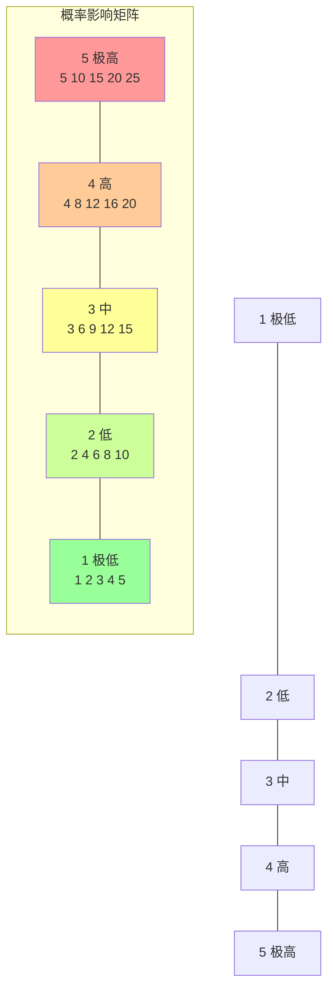
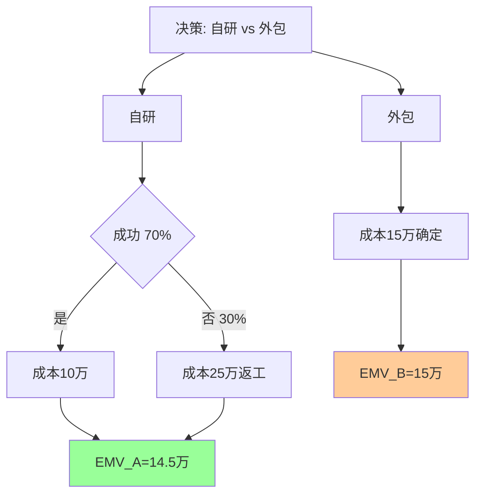
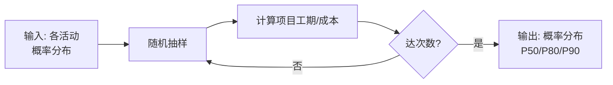

# 5.2 风险评估与风险量化

风险识别（[[5.1 风险识别与风险分类]]）输出风险登记册后，需评估每个风险的概率与影响，确定优先级。本节阐明定性分析（概率-影响矩阵）与定量分析（EMV、决策树、蒙特卡洛模拟）两类方法，为 [[5.3 风险应对策略与风险监控]] 的应对策略选择提供量化依据。

## 风险评估方法分类

> [!definition] 风险评估方法
> 风险评估分为两级：
> - **定性分析**：快速对风险概率与影响进行主观分级（高/中/低），输出风险优先级排序；
> - **定量分析**：对高优先级风险进行数值化建模，输出风险量化指标（EMV、概率分布）。

| 维度 | 定性分析 | 定量分析 |
| --- | --- | --- |
| 方法 | 概率-影响矩阵 | EMV/决策树/蒙特卡洛 |
| 输入 | 主观判断 | 历史数据、概率分布 |
| 输出 | 优先级排序 | 量化指标 |
| 适用 | 所有风险 | 高优先级风险 |
| 成本 | 低 | 高 |

## 风险值与优先级

> [!formula] 风险值
> $$RV = P \times I$$
>
> - $P$：概率（0–1 或 1–5 评级）；
> - $I$：影响（金额或 1–5 评级）；
> - $RV$：风险值，用于排序与比较。

风险值越大，优先级越高，越需要重点应对。

## 定性分析：概率-影响矩阵

概率-影响矩阵（Probability-Impact Matrix）是 5×5 网格，横轴影响等级（1-5），纵轴概率等级（1-5），每个风险按 $RV = P \times I$ 落入对应单元格。

> [!note] 风险分级区域
> - **红区（RV ≥ 15）**：高优先级，需立即制定应对策略。
> - **黄区（5 ≤ RV < 15）**：中优先级，监控并准备应对预案。
> - **绿区（RV < 5）**：低优先级，接受或观察。

### 矩阵示例

| 影响↓ / 概率→ | 1 极低 | 2 低 | 3 中 | 4 高 | 5 极高 |
| --- | --- | --- | --- | --- | --- |
| 5 极高 | 5 黄 | 10 黄 | 15 红 | 20 红 | 25 红 |
| 4 高 | 4 绿 | 8 黄 | 12 黄 | 16 红 | 20 红 |
| 3 中 | 3 绿 | 6 黄 | 9 黄 | 12 黄 | 15 红 |
| 2 低 | 2 绿 | 4 绿 | 6 黄 | 8 黄 | 10 黄 |
| 1 极低 | 1 绿 | 2 绿 | 3 绿 | 4 绿 | 5 黄 |

## 定量分析

### 期望货币值（EMV）

> [!formula] 期望货币值
> $$EMV = \sum_{i} P_i \times V_i$$
>
> - $P_i$：第 $i$ 种结果的概率；
> - $V_i$：第 $i$ 种结果的货币值（损失为负，收益为正）。
> EMV 是所有可能结果的概率加权平均，用于量化风险期望损失或收益。

> [!example] EMV 示例
> 某模块开发有两种方案：
> - 方案 A（自研）：成功概率 70%，成本 10 万；失败概率 30%，成本 25 万（返工）。
>   $EMV_A = 0.7 \times 10 + 0.3 \times 25 = 7 + 7.5 = 14.5$ 万
> - 方案 B（外包）：成本固定 15 万，$EMV_B = 15$ 万。
> 由于 $EMV_A < EMV_B$，从期望成本看自研更优（14.5 万 < 15 万）。

### 决策树

决策树用树状结构表达多阶段决策与概率事件，计算每条路径的期望值，选择期望值最优的方案。

> [!tip] 决策树的应用
> > 决策树适合多阶段、含概率分支的决策场景。计算时从叶节点向根反向累加期望值，每层取期望（机会节点）或最优（决策节点）。软件项目常用于技术方案选型、外包与自研决策。

### 蒙特卡洛模拟（Monte Carlo）

> [!definition] 蒙特卡洛模拟
> 蒙特卡洛模拟是**通过对不确定变量进行大量随机抽样（通常 1000+ 次），统计输出结果分布**的定量风险分析方法。它给出项目目标（成本/工期）的概率分布而非单一值。

> [!note] 蒙特卡洛与 PERT 的关系
> 蒙特卡洛是 [[4.3 PERT技术与进度压缩]] 三点估算的扩展：PERT 给出期望工期与标准差，蒙特卡洛对所有活动同时抽样，得到项目总工期的完整分布（如 P50=30 天、P90=38 天，即 90% 概率 38 天内完成）。蒙特卡洛精度更高但需软件工具支持。

## 风险优先级排序

按风险值 RV 排序，结合定性分级与定量分析：

| 优先级 | 处理原则 | 资源投入 |
| --- | --- | --- |
| 高（红区） | 制定明确应对策略，分配资源，重点监控 | 高 |
| 中（黄区） | 准备应对预案，定期监控 | 中 |
| 低（绿区） | 接受或观察，记录备查 | 低 |

## 小结

风险评估分定性（概率-影响矩阵，输出优先级）与定量（EMV/决策树/蒙特卡洛，输出量化指标）两级。风险值 $RV = P \times I$ 是排序依据。定性分析覆盖所有风险，定量分析聚焦高优先级风险。评估结果是 [[5.3 风险应对策略与风险监控]] 应对策略选择的依据。

## 关联

- 上一级：[[MOC - 第5章]]
- 上一节：[[5.1 风险识别与风险分类]]
- 下一节：[[5.3 风险应对策略与风险监控]]
- 关联概念：[[4.3 PERT技术与进度压缩]]（三点估算与蒙特卡洛同源）；[[3.3 成本估算与估算方法综合]]（EMV 用于成本估算）
