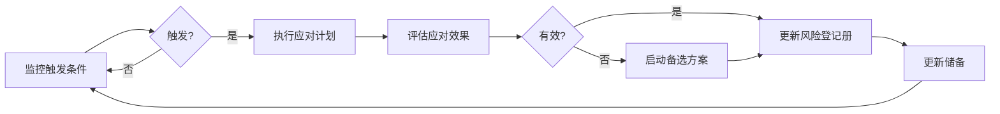
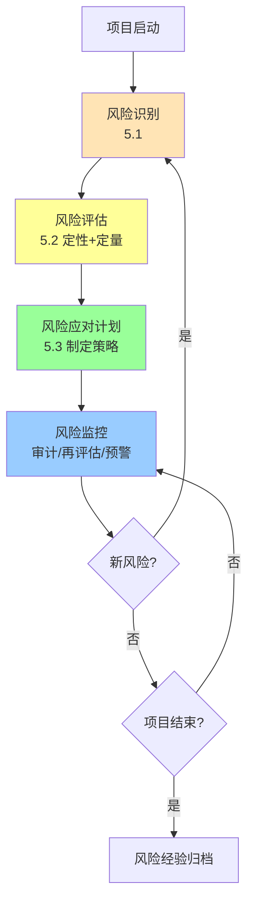

# 5.3 风险应对策略与风险监控

风险评估（[[5.2 风险评估与风险量化]]）确定了风险优先级后，需为每个高优先级风险制定应对策略，并在项目执行中持续监控。本节阐明威胁与机会各四种应对策略、应急储备与管理储备、风险监控活动，构成风险管理的闭环。

## 风险应对策略

### 威胁应对策略（负面风险）

> [!definition] 威胁四策略
> 对负面风险（威胁）有四种应对策略：
> - **规避（Avoid）**：消除威胁或保护目标不受影响。如修改计划、降低目标、放弃高风险功能。
> - **转移（Transfer）**：将风险责任转给第三方。如外包、购买保险、签订固定价格合同。
> - **减轻（Mitigate）**：降低风险概率或影响。如增加测试、采用成熟技术、增加冗余。
> - **接受（Accept）**：主动或被动承担风险。主动接受指预留应急储备，被动接受指不采取行动。

| 策略 | 原理 | 成本 | 软件项目实例 |
| --- | --- | --- | --- |
| 规避 | 消除风险源 | 改变计划成本 | 放弃新技术改用成熟方案 |
| 转移 | 转嫁给第三方 | 保险费/外包溢价 | 外包非核心模块、买保险 |
| 减轻 | 降低概率或影响 | 预防投入 | 增加测试用例、代码评审 |
| 接受 | 承担后果 | 应急储备 | 预留缓冲时间接受延误 |

### 机会应对策略（正面风险）

> [!definition] 机会四策略
> 对正面风险（机会）有四种应对策略：
> - **开拓（Exploit）**：确保机会发生。如分配最佳资源、采用新技术。
> - **分享（Share）**：与第三方合作共享机会。如建立合作伙伴关系、联合开发。
> - **提高（Enhance）**：提升机会概率或正面影响。如增加投入推动技术突破。
> - **接受（Accept）**：不主动追求，待其自然发生。

| 策略 | 原理 | 软件项目实例 |
| --- | --- | --- |
| 开拓 | 确保机会实现 | 调配顶尖团队确保创新功能按期交付 |
| 分享 | 合作共享收益 | 与合作伙伴联合开拓新市场 |
| 提高 | 提升概率/影响 | 增加研发投入提升技术突破可能 |
| 接受 | 不主动追求 | 不刻意追求，机会自然到来则利用 |

## 风险应对计划

风险应对计划是风险登记册的延伸，为每个高优先级风险明确：

| 要素 | 内容 |
| --- | --- |
| 风险描述 | 条件-结果式描述 |
| 应对策略 | 规避/转移/减轻/接受 |
| 具体行动 | 落实策略的具体步骤 |
| 责任人 | 风险负责人 |
| 触发条件 | 风险发生的预警信号 |
| 应急储备 | 预留的时间/成本 |
| 备选方案 | 主方案失效时的后备 |

## 应急储备与管理储备

> [!definition] 储备类型
> - **应急储备（Contingency Reserve）**：为**已知-未知风险**（已识别但概率/影响不确定）预留的资源，包含在成本基准内，项目经理可控。
> - **管理储备（Management Reserve）**：为**未知-未知风险**（未识别的突发风险）预留的资源，不在成本基准内，需高层审批使用。

| 维度 | 应急储备 | 管理储备 |
| --- | --- | --- |
| 对应风险 | 已知-未知 | 未知-未知 |
| 计入基准 | 是（成本基准内） | 否（成本基准外） |
| 管理层 | 项目经理 | 高层管理 |
| 使用条件 | 风险触发按计划动用 | 突发事件需高层审批 |
| 动用依据 | 风险登记册与应对计划 | 应急响应 |

> [!tip] 储备的工程意义
> > 应急储备对应“可预见但不可控”的风险（如常见的需求变更），按风险值 EMV 估算；管理储备对应“不可预见且不可控”的风险（如自然灾害、政策突变），按总成本 5%–15% 经验预留。储备不是“备用预算”，而是基于风险量化的科学预留。

## 风险监控

> [!definition] 风险监控
> 风险监控是**在项目执行中持续跟踪已识别风险、识别新风险、评估应对有效性并执行应对计划**的过程，贯穿项目全生命周期。

### 风险监控活动

| 活动 | 含义 | 频率 |
| --- | --- | --- |
| 风险审计 | 检查风险应对计划执行情况与有效性 | 阶段末 |
| 风险再评估 | 识别新风险、更新概率与影响 | 定期 |
| 储备消耗跟踪 | 监控应急储备使用情况 | 持续 |
| 预警触发监控 | 监控风险触发条件是否出现 | 持续 |
| 风险状态报告 | 报告风险状态变化 | 周期性 |

### 风险触发条件与预警

> [!definition] 风险触发条件
> 风险触发条件（Risk Trigger）是**风险即将发生或已发生的预警信号**，是风险监控的关键。例如“核心开发人员连续请假”是“人员流失”风险的触发条件。

## 风险管理全流程图

> [!note] 风险管理的迭代性
> > 风险管理不是一次性活动，而是贯穿项目全生命周期的迭代过程。每个阶段都应重新识别风险、更新评估、调整应对策略。敏捷项目通常在每个迭代（Sprint）回顾时更新风险登记册（见 [[MOC - 软件项目管理]] 第10章 Scrum）。

## 小结

风险应对策略分威胁（规避/转移/减轻/接受）与机会（开拓/分享/提高/接受）各四种。应急储备对应已知-未知风险，管理储备对应未知-未知风险。风险监控包括风险审计、再评估、储备跟踪、预警触发，构成风险管理的闭环。风险管理是迭代过程，贯穿项目全生命周期。

## 关联

- 上一级：[[MOC - 第5章]]
- 上一节：[[5.2 风险评估与风险量化]]
- 关联概念：[[5.1 风险识别与风险分类]]（识别结果用于应对策略）；[[4.3 PERT技术与进度压缩]]（进度储备与风险储备呼应）；[[MOC - 软件项目管理]]（敏捷风险监控）
