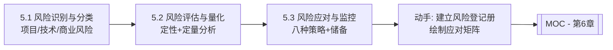

# MOC - 第5章 软件项目风险管理

> [!info] 本章定位
> 第5章回答“项目可能出什么问题、问题有多大、怎么应对”。软件项目因需求多变、技术新颖、人员流动等因素，不确定性远高于传统工程项目。本章涵盖风险识别与分类（项目/技术/商业风险）、风险评估与量化（定性概率-影响矩阵与定量 EMV/决策树/蒙特卡洛）、风险应对策略（威胁规避/转移/减轻/接受，机会开拓/分享/提高/接受）与风险监控（储备、审计、预警），与 [[4.3 PERT技术与进度压缩]] 的概率估算一脉相承，为项目全程提供不确定性管理框架。

## 学习路线图

## 知识点导航

| 节 | 主题 | 核心要点 | 入口 |
| --- | --- | --- | --- |
| 5.1 | 风险识别与风险分类 | 风险定义、三类风险（项目/技术/商业）、识别方法（头脑风暴/检查表/德尔菲/SWOT）、风险条目要素、常见软件风险清单 | [[5.1 风险识别与风险分类]] |
| 5.2 | 风险评估与风险量化 | 定性分析（概率-影响矩阵）、定量分析（EMV/决策树/蒙特卡洛）、风险优先级排序、风险值=概率×影响 | [[5.2 风险评估与风险量化]] |
| 5.3 | 风险应对策略与风险监控 | 威胁四策略（规避/转移/减轻/接受）、机会四策略（开拓/分享/提高/接受）、应急储备与管理储备、风险监控 | [[5.3 风险应对策略与风险监控]] |

## 核心考点

> [!warning] 重点掌握
> 1. 风险定义：不确定事件，对项目目标有正面（机会）或负面（威胁）影响。
> 2. 风险三要素：事件、概率、影响；风险值 $RV = P \times I$。
> 3. 三类风险：项目风险（资源/进度/客户）、技术风险（设计/实现/集成）、商业风险（市场/政策/合规）。
> 4. 风险识别方法：头脑风暴、检查表、德尔菲法（匿名多轮）、SWOT 分析。
> 5. 定性分析工具：概率-影响矩阵（5×5），风险分级为红/黄/绿。
> 6. 定量分析方法：EMV $= \sum(P_i \times V_i)$、决策树期望值、蒙特卡洛模拟。
> 7. 威胁应对四策略：规避、转移、减轻、接受；机会应对四策略：开拓、分享、提高、接受。
> 8. 应急储备（已知未知风险）与管理储备（未知未知风险）的区别。
> 9. 风险监控：风险审计、风险再评估、风险储备消耗跟踪、预警触发条件。
> 10. 风险登记册的内容：风险描述、类别、概率、影响、优先级、应对策略、责任人、触发条件。

## 自测题

> [!question] 题1
> 区分“威胁”与“机会”的风险应对策略，并各举一个软件项目中的例子。
> > [!check]- 参考答案
> > **威胁（负面风险）四策略**：
> > - 规避：消除威胁或保护目标。例：因技术不成熟放弃某功能改用成熟方案。
> > - 转移：将风险责任转给第三方。例：将开发外包给专业公司、购买保险。
> > - 减轻：降低概率或影响。例：增加测试用例降低缺陷概率。
> > - 接受：主动或被动承担。例：预留应急储备接受已知风险。
> > **机会（正面风险）四策略**：
> > - 开拓：确保机会发生。例：分配最佳资源确保新功能按期交付。
> > - 分享：与第三方合作共享收益。例：与合作伙伴联合开发新市场。
> > - 提高：提升概率或正面影响。例：增加研发投入提升技术突破可能。
> > - 接受：不主动追求，待其自然发生。

> [!question] 题2
> 某风险概率 20%，若发生将造成 50000 元损失。计算期望货币值（EMV）。若购买保险转移，保费 12000 元，是否值得？
> > [!check]- 参考答案
> > $EMV = P \times I = 0.2 \times 50000 = 10000$ 元。
> > 比较方案：
> > - 接受风险：期望损失 10000 元；
> > - 购买保险转移：确定支出 12000 元。
> > 由于保险费（12000）> EMV（10000），从纯期望值看不值得购买。但若考虑风险承受能力（50000 元损失可能致命）或风险规避偏好，仍可能选择转移。决策应结合量化结果与风险偏好。

> [!question] 题3
> 说明应急储备与管理储备的区别，并指出各自对应的风险类型。
> > [!check]- 参考答案
> > | 维度 | 应急储备 | 管理储备 |
> > | --- | --- | --- |
> > | 对应风险 | 已知-未知风险（已识别但概率/影响不确定） | 未知-未知风险（未识别的突发风险） |
> > | 管理层 | 项目经理可控 | 高层管理可控 |
> > | 计入范围 | 包含在成本基准内 | 不在成本基准内，属组织储备 |
> > | 使用条件 | 风险触发时按计划动用 | 需高层审批 |
> > | 动用依据 | 风险登记册与应对计划 | 突发事件应急 |

> [!question] 题4
> 用概率-影响矩阵说明如何对风险进行优先级排序，并解释“高概率低影响”与“低概率高影响”风险的处理差异。
> > [!check]- 参考答案
> > 概率-影响矩阵是 5×5 网格，横轴影响（1-5），纵轴概率（1-5），每个风险按 $RV=P \times I$ 落入对应单元格，按区域分级：红区（高优先级）需重点应对，黄区（中优先级）监控，绿区（低优先级）接受。
> > - 高概率低影响（如常见小缺陷）：属黄/绿区，采取减轻策略，建立标准流程降低处理成本。
> > - 低概率高影响（如核心人员离职、自然灾害）：属红/黄区边界，采取转移或规避，购买保险或建立备份机制，因单次损失巨大需重点防范。

## 章节导航

- 上一级：[[MOC - 软件项目管理]]
- 上一章：[[MOC - 第4章]]
- 下一章：[[MOC - 第6章]]
