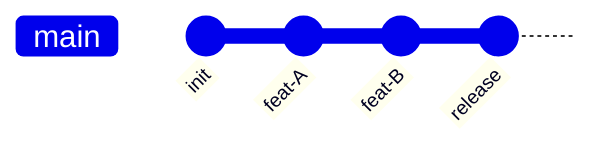
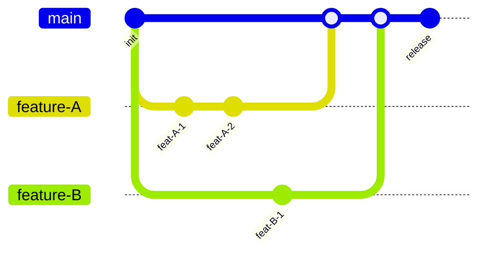
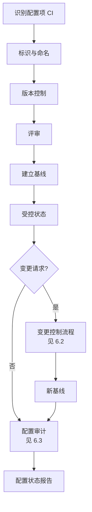

# 6.1 配置管理基本概念与版本控制

软件项目产物（需求、设计、代码、文档、环境）随项目演进不断变化，若无系统管理将陷入版本混乱。配置管理（SCM）通过标识、控制、记录、报告配置项的变化，保证产物的完整性、一致性与可追溯性。本节阐明配置管理定义、配置项、基线、版本控制与 Git 工作流，为 [[6.2 变更控制流程与CCB]] 的变更控制提供基础。

## 配置管理定义

> [!definition] 软件配置管理
> 软件配置管理（Software Configuration Management, SCM）是**通过标识、控制、记录、报告配置项的变化，保证软件产品在整个生命周期中完整性、一致性与可追溯性**的系统性管理活动。

配置管理的四项核心活动：

| 活动 | 含义 |
| --- | --- |
| 标识 | 识别并唯一命名每个配置项及版本 |
| 控制 | 通过变更控制流程管理对配置项的修改 |
| 记录 | 记录配置项的状态与变更历史 |
| 报告 | 生成配置状态报告，向相关方通报 |

## 配置项（CI）

> [!definition] 配置项
> 配置项（Configuration Item, CI）是**配置管理的对象，是项目中需要标识与控制的任何产物**。配置项可以是文件、文档、代码、环境配置、数据等。

| 类型 | 示例 |
| --- | --- |
| 代码 | 源代码、编译产物、脚本 |
| 文档 | 需求规格、设计文档、测试计划、用户手册 |
| 环境配置 | 编译器版本、依赖库、部署配置 |
| 数据 | 测试数据、初始化数据、配置文件 |
| 测试资产 | 测试用例、测试脚本、测试数据 |

每个配置项应记录：唯一标识、名称、版本、状态（草稿/评审中/基线/受控/废弃）、责任人、关联关系。

## 基线（Baseline）

> [!definition] 基线
> 基线（Baseline）是**经过正式评审与批准的配置项快照，作为后续变更的基准**。基线一旦建立，任何修改必须通过变更控制流程（见 [[6.2 变更控制流程与CCB]]）。

> [!note] 基线的作用
> ① 提供变更基准——变更必须相对基线提出；
> ② 提供可追溯点——可对比当前状态与基线差异；
> ③ 提供回退点——变更失败可回退到基线；
> ④ 提供审计依据——审计基于基线检查完整性。

常见的基线类型：
- **功能基线**：需求评审通过后建立；
- **分配基线**：设计评审通过后建立；
- **产品基线**：产品交付前建立。

## 版本控制

> [!definition] 版本控制
> 版本控制（Version Control）是**管理文件与目录随时间变化的技术**，记录每次修改的历史，支持版本回溯、分支与合并。版本控制是配置管理的核心工具。

### Git 与 SVN 对比

| 维度 | Git（分布式） | SVN（集中式） |
| --- | --- | --- |
| 仓库结构 | 每个开发者有完整本地仓库 | 单一中央仓库 |
| 离线操作 | 支持（本地提交、分支） | 不支持 |
| 分支成本 | 低（轻量指针） | 高（复制目录） |
| 合并能力 | 强大（自动合并） | 较弱 |
| 学习曲线 | 较陡 | 平缓 |
| 适用场景 | 开源、分布式团队 | 集中式企业 |

> [!tip] Git 与 SVN 的选择
> > 现代软件项目普遍采用 Git（GitHub/Gitee/GitLab）。SVN 适合需要严格集中管控的传统企业。Git 的分布式特性支持离线工作与高效分支，更契合敏捷与 DevOps 实践。

## Git 工作流

> [!definition] Git 工作流
> Git 工作流（Git Workflow）是**团队协作使用 Git 的规范模式**，定义分支结构、命名规则与合并策略。常见工作流包括集中式、功能分支、Git Flow。

### 集中式工作流

所有开发者直接向 master 分支提交，类似 SVN 模式。

### 功能分支工作流

每个功能建立独立分支，完成后合并到主分支。

### Git Flow 工作流

Git Flow 是最完整的分支模型，由 Vincent Driessen 提出，定义五类分支：

| 分支 | 用途 | 来源 | 合并目标 |
| --- | --- | --- | --- |
| master | 生产环境代码，稳定可发布 | — | — |
| develop | 开发主线，集成各功能 | master | master |
| feature | 功能开发 | develop | develop |
| release | 发布准备与最后修复 | develop | master + develop |
| hotfix | 生产环境紧急修复 | master | master + develop |

## 配置管理流程图

> [!note] 配置管理的工程意义
> > 配置管理是软件工程的“基础设施”：①支持多人协作——版本控制解决并发修改冲突；②支持变更受控——基线保证变更可追溯；③支持持续集成——版本控制是 CI/CD 的前提；④支持故障回退——可快速回退到稳定版本。缺乏配置管理的项目常陷入“谁的版本最新、改了什么、为何改”的混乱。

## 小结

配置管理通过标识、控制、记录、报告配置项变化，保证产物完整性、一致性与可追溯性。配置项是管理对象，基线是变更基准。版本控制（Git/SVN）是配置管理的核心工具，Git 工作流规范团队协作。配置管理是 [[6.2 变更控制流程与CCB]] 变更控制与 [[6.3 配置审计与状态报告]] 审计的基础。

## 关联

- 上一级：[[MOC - 第6章]]
- 下一节：[[6.2 变更控制流程与CCB]]
- 关联概念：[[2.2 WBS工作分解结构创建]]（工作包产物成为配置项）；[[6.3 配置审计与状态报告]]（基线是审计依据）；[[MOC - 软件工程]]（软件过程的基础设施）
