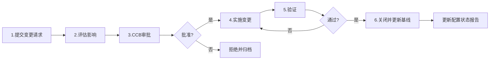
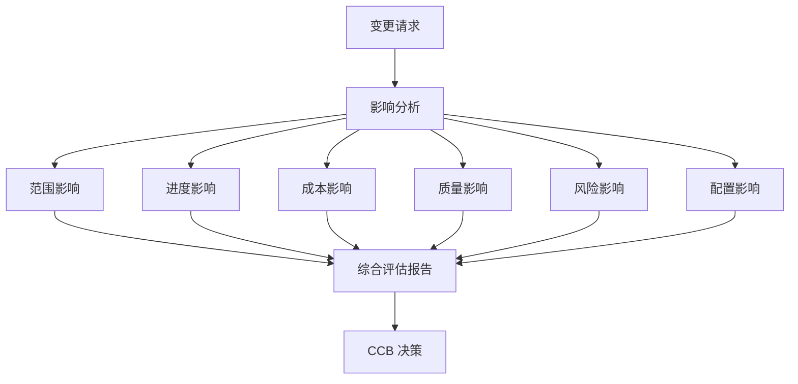
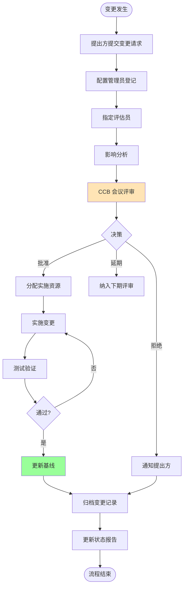

# 6.2 变更控制流程与CCB

基线建立后（[[6.1 配置管理基本概念与版本控制]]），任何对基线的修改必须通过变更控制流程。本节阐明变更控制定义、六步流程、CCB 变更控制委员会、变更分类与影响分析，是配置管理的核心控制环节，也是 [[5.1 风险识别与风险分类]] 范围蔓延风险防控的关键。

## 变更控制定义

> [!definition] 变更控制
> 变更控制（Change Control）是**通过标准化流程管理对基线的变更**的配置管理活动，确保每个变更都经过评估、审批、实施与验证，避免变更失控导致项目混乱。

变更控制的目标：
- 保证变更的必要性与可行性；
- 评估变更对范围、进度、成本、质量的影响；
- 确保变更经过授权审批；
- 记录变更历史，保证可追溯。

## 变更控制六步流程

### 流程详解

| 步骤 | 活动 | 责任方 | 输出 |
| --- | --- | --- | --- |
| 1. 提交 | 填写变更请求单，描述变更内容与原因 | 变更提出方 | 变更请求单 |
| 2. 评估 | 评估对范围、进度、成本、质量的影响 | 变更评估员/PM | 影响分析报告 |
| 3. 审批 | CCB 审批，决定批准/拒绝/延期 | CCB | 审批决议 |
| 4. 实施 | 按批准方案实施变更 | 开发团队 | 变更后的配置项 |
| 5. 验证 | 验证变更效果与副作用 | QA/测试团队 | 验证报告 |
| 6. 关闭 | 归档记录，更新基线与状态报告 | 配置管理员 | 更新后的基线 |

## CCB 变更控制委员会

> [!definition] CCB
> CCB（Change Control Board，变更控制委员会）是**负责审批变更请求的正式机构**，由项目经理、技术负责人、质量代表、客户代表等相关方组成，依据变更影响分析决定是否批准变更。

| 成员 | 职责 |
| --- | --- |
| 项目经理 | 评估进度与成本影响，主持 CCB |
| 技术负责人 | 评估技术可行性与架构影响 |
| 质量代表 | 评估质量与测试影响 |
| 客户代表 | 评估需求价值与优先级 |
| 配置管理员 | 记录决议，维护变更记录 |

> [!note] CCB 的决策原则
> CCB 不是“否决委员会”，而是“受控决策机构”。原则：①基于影响分析而非主观判断；②权衡变更收益与成本；③确保变更可追溯；④紧急变更走快速通道但不绕过审批。小型项目可由项目经理兼任 CCB 角色。

## 变更分类

| 类型 | 含义 | 审批流程 | 时效 |
| --- | --- | --- | --- |
| 常规变更 | 非紧急、可计划的变更 | 标准六步流程 | 按计划周期 |
| 紧急变更 | 生产环境故障等需立即处理的变更 | 快速通道：先实施后补审批 | 立即 |

> [!warning] 紧急变更的风险
> > 紧急变更（Hotfix）允许先实施后补审批以减少停机损失，但必须：①事后补全变更记录；②由授权人员实施；③尽快回归标准流程；④复盘紧急变更原因，预防频繁紧急变更。频繁紧急变更通常是变更管理失效的信号。

## 变更影响分析

变更影响分析是评估的核心，需从多维度评估：

| 影响维度 | 评估问题 |
| --- | --- |
| 范围 | 变更是否影响 WBS 工作包？是否引入新工作？ |
| 进度 | 变更是否影响关键路径？延误多少？（见 [[4.2 关键路径法（CPM）与甘特图]]） |
| 成本 | 变更增加多少成本？是否超预算？ |
| 质量 | 变更是否引入新缺陷风险？是否影响测试计划？ |
| 风险 | 变更是否引入新风险？（见 [[5.1 风险识别与风险分类]]） |
| 配置 | 变更影响哪些配置项？是否需建立新基线？ |
| 依赖 | 变更是否影响其他模块或外部接口？ |

## 变更控制流程图

> [!tip] 变更控制与范围控制的关系
> > 变更控制是范围控制（[[2.3 范围确认与范围控制]]）的工程实现：范围控制识别“是否需要变更”，变更控制管理“变更如何实施”。二者共同防止范围蔓延（Scope Creep）——未经控制的范围扩张是项目失败的主因之一。

## 小结

变更控制通过六步流程（提交→评估→审批→实施→验证→关闭）管理对基线的修改，CCB 是审批权威机构。变更分常规与紧急两类，紧急变更走快速通道但需补审批。变更影响分析是决策依据，需评估范围、进度、成本、质量、风险、配置等多维度影响。

## 关联

- 上一级：[[MOC - 第6章]]
- 上一节：[[6.1 配置管理基本概念与版本控制]]
- 下一节：[[6.3 配置审计与状态报告]]
- 关联概念：[[2.3 范围确认与范围控制]]（变更控制是范围控制的工程实现）；[[5.1 风险识别与风险分类]]（变更引入新风险）；[[4.2 关键路径法（CPM）与甘特图]]（变更影响关键路径）
