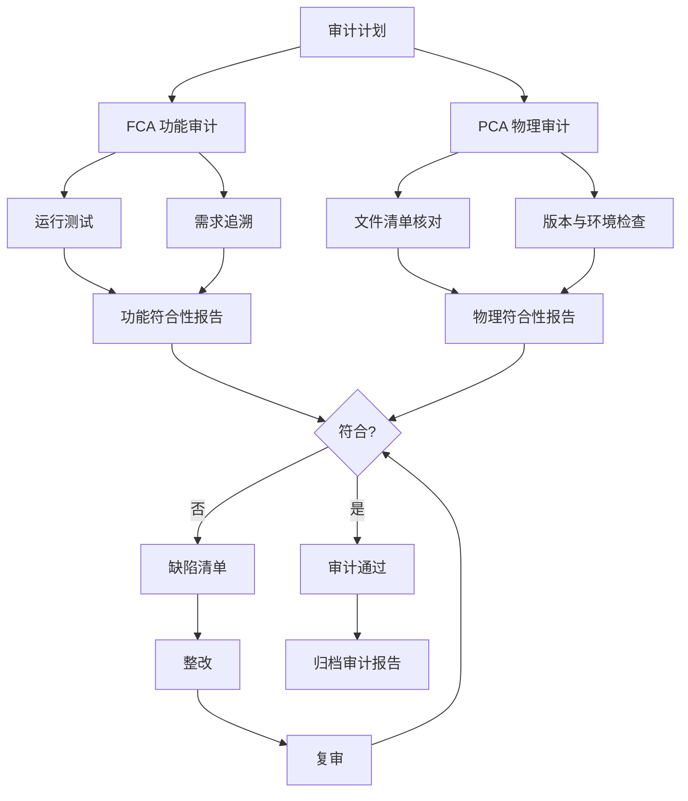
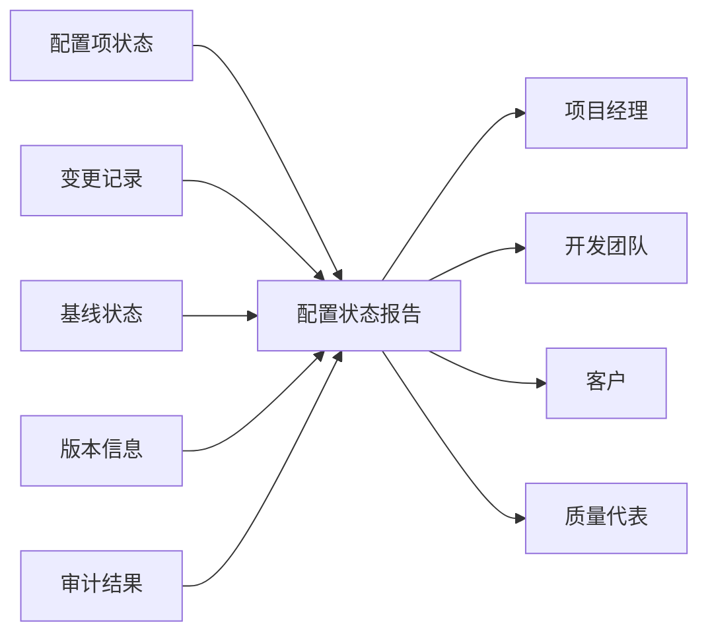
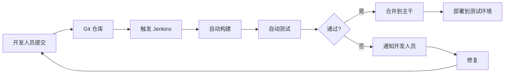

# 6.3 配置审计与状态报告

变更控制（[[6.2 变更控制流程与CCB]]）确保变更受控，但需通过审计验证变更是否正确实施、基线是否完整。配置审计是配置管理的验证环节，配置状态报告是配置管理的沟通环节。本节阐明功能/物理配置审计、配置状态报告与配置管理工具，是配置管理的收口，也为 DevOps 与 CI/CD 实践提供支撑。

## 配置审计

> [!definition] 配置审计
> 配置审计（Configuration Audit）是**独立检查配置项是否符合需求与设计文档，验证配置管理过程有效性**的活动，是配置管理的验证环节。

### 配置审计类型

| 类型 | 全称 | 审计对象 | 审计目的 | 时机 |
| --- | --- | --- | --- | --- |
| FCA | 功能配置审计 | 配置项的功能特性 | 验证实际功能是否符合需求规格 | 系统测试后、交付前 |
| PCA | 物理配置审计 | 配置项的物理特性 | 验证实际物理形态是否符合设计文档 | 交付前、基线建立时 |

> [!definition] 功能配置审计（FCA）
> 功能配置审计（Functional Configuration Audit, FCA）验证**配置项的实际功能是否符合需求规格说明书**，通过运行测试、对照需求确认功能完整性、正确性与性能达标。

> [!definition] 物理配置审计（PCA）
> 物理配置审计（Physical Configuration Audit, PCA）验证**配置项的实际物理形态是否符合设计文档**，检查文件清单、版本号、目录结构、编译环境、依赖配置是否与文档一致。

### FCA 与 PCA 对比

| 维度 | FCA 功能审计 | PCA 物理审计 |
| --- | --- | --- |
| 审计问题 | 功能缺失、性能不达标、行为错误 | 文件遗漏、版本不符、环境配置错误 |
| 检查方法 | 运行测试、需求追溯 | 文件比对、清单核对 |
| 输入 | 需求规格、测试报告 | 设计文档、配置清单 |
| 输出 | 功能符合性报告 | 物理符合性报告 |

## 配置审计流程图

> [!note] 配置审计与质量审计的区别
> > 配置审计聚焦“产物是否符合基线与文档”，是配置管理活动；质量审计聚焦“过程是否符合质量规程”，是质量管理活动（见 [[7.1 软件质量保障体系]]）。二者互补：配置审计保证产物正确，质量审计保证过程正确。

## 配置状态报告

> [!definition] 配置状态报告
> 配置状态报告（Configuration Status Report, CSR）是**定期向相关方通报配置项状态、变更记录与基线状态**的配置管理活动，是配置管理的沟通环节。

### 报告内容

| 内容 | 说明 |
| --- | --- |
| 配置项状态 | 各 CI 的当前状态（草稿/评审中/基线/受控/废弃） |
| 变更记录 | 已批准、实施中、已关闭的变更统计 |
| 基线状态 | 各基线的版本、建立时间、所含 CI |
| 版本信息 | 各 CI 的当前版本与历史版本 |
| 审计结果 | 最近审计的发现与整改情况 |

> [!tip] 配置状态报告的价值
> > 配置状态报告回答“我们现在有什么、改了什么、基线在哪”。它是项目可视性的关键：①让 PM 掌握变更节奏；②让团队知道当前基线；③让客户了解交付状态；④让 QA 跟踪审计整改。缺乏状态报告的配置管理是“黑箱”，无法支撑决策。

## 配置管理工具

| 工具 | 类型 | 主要用途 | 适用场景 |
| --- | --- | --- | --- |
| Git | 分布式版本控制 | 源码版本管理、分支协作 | 所有软件项目 |
| SVN | 集中式版本控制 | 源码与文档版本管理 | 传统企业、集中管控 |
| Jenkins | CI/CD 服务器 | 持续集成、自动化构建部署 | DevOps 实践 |
| GitLab CI | CI/CD 平台 | 代码托管+CI/CD 一体化 | 现代 DevOps |
| Jira | 缺陷与变更跟踪 | 变更请求、缺陷管理 | 变更控制流程化 |
| Nexus | 制品仓库 | 构建产物管理 | 配置项扩展到二进制 |

## 持续集成与配置管理

> [!definition] 持续集成
> 持续集成（Continuous Integration, CI）是**开发人员频繁地将代码集成到主干，每次集成通过自动化构建与测试验证**的实践，是配置管理在现代 DevOps 中的延伸。

> [!note] CI 与配置管理的关系
> > 持续集成是配置管理的工程化升级：
> > ①CI 以版本控制为基础——每次提交都是配置项变更；
> > ②CI 自动化变更验证——替代部分人工审计；
> > ③CI 产生可追溯的构建——每次构建对应一个基线候选；
> > ④CI 支撑频繁变更——使变更控制更高效而非更繁琐。
> > 现代 DevOps 将配置管理、变更控制、持续集成融合为自动化流水线，但配置管理的基本原则（标识、控制、记录、报告）不变。

## 配置审计与质量保障的衔接

配置审计是质量保障（[[7.1 软件质量保障体系]]）的输入：
- FCA 验证功能符合需求，为质量评审提供证据；
- PCA 验证物理形态，为交付评审提供清单；
- 审计发现的缺陷进入缺陷管理流程（[[MOC - 软件测试技术]]）。

## 小结

配置审计分功能配置审计（FCA，验证功能）与物理配置审计（PCA，验证物理特性），是配置管理的验证环节。配置状态报告定期通报配置项、变更与基线状态，是配置管理的沟通环节。现代配置管理工具（Git、Jenkins、Jira）与持续集成融合，形成 DevOps 自动化流水线，但配置管理基本原则不变。

## 关联

- 上一级：[[MOC - 第6章]]
- 上一节：[[6.2 变更控制流程与CCB]]
- 关联概念：[[6.1 配置管理基本概念与版本控制]]（基线是审计依据）；[[7.1 软件质量保障体系]]（配置审计是质量保障输入）；[[MOC - 软件测试技术]]（缺陷管理衔接）
