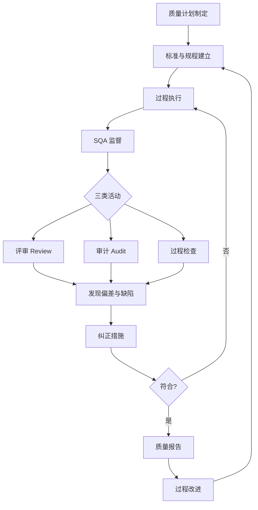
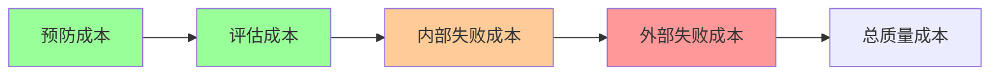

# 7.1 软件质量保障体系

软件质量是项目三重约束（[[1.2 项目三重约束：范围、时间、成本、质量]]）的核心维度。传统质量管理聚焦“事后检验”，现代软件质量保障（SQA）将质量推进到“全过程预防”。本节阐明质量定义、SQA 定义与活动、质量成本模型，为 [[7.2 CMMI能力成熟度模型]] 的过程改进与 [[7.3 评审管理与质量度量]] 的评审活动奠定基础。

## 软件质量定义

> [!definition] 软件质量
> 软件质量是**软件产品满足明确与隐含需求的程度**，包含功能、性能、可靠性、可用性、可维护性、可移植性等多个属性。

软件质量属性（参考 ISO/IEC 25010）：

| 类别 | 属性 | 含义 |
| --- | --- | --- |
| 功能性 | 功能完整性 | 实现所有需求功能 |
|  | 功能正确性 | 输出正确结果 |
|  | 适合性 | 满足使用目的 |
| 性能效率 | 时间效率 | 响应时间、吞吐量 |
|  | 资源效率 | 内存、CPU 占用 |
| 可靠性 | 成熟性 | 故障频率低 |
|  | 可恢复性 | 故障后恢复能力 |
| 可维护性 | 模块性 | 模块独立、低耦合 |
|  | 可分析性 | 定位缺陷的难易 |
| 可移植性 | 适应性 | 适应不同环境 |

## SQA 软件质量保证

> [!definition] SQA
> 软件质量保证（Software Quality Assurance, SQA）是**通过计划、标准、规程的系统性保障，确保软件过程与产品符合质量要求**的活动。SQA 关注过程质量而非仅产品质量，目标是预防缺陷而非仅发现缺陷。

### SQA 与 SQC 的区别

| 维度 | SQA 质量保证 | SQC 质量控制 |
| --- | --- | --- |
| 关注点 | 过程质量 | 产品质量 |
| 时机 | 全过程预防 | 事后检验 |
| 方法 | 评审、审计、过程检查 | 测试、检查 |
| 目标 | 预防缺陷产生 | 发现并修复缺陷 |
| 责任方 | QA 团队 | 测试团队 |

> [!note] SQA 的工程意义
> > SQA 的核心理念是“质量是过程造的，不是检验出来的”。通过保证过程质量（按标准规程开发）来保证产品质量，而非仅靠测试发现缺陷。这与 [[7.2 CMMI能力成熟度模型]] 的过程改进思想一脉相承。

## SQA 活动

> [!definition] SQA 三类活动
> SQA 活动分为三类：
> - **评审**：对需求、设计、代码等产物进行正式技术评审（FTR，见 [[7.3 评审管理与质量度量]]）；
> - **审计**：检查过程是否符合标准与规程（如配置审计，见 [[6.3 配置审计与状态报告]]）；
> - **过程检查**：监督开发过程是否按既定流程执行。

### 评审（Review）

对软件产物（需求规格、设计文档、代码、测试计划）进行正式评审，发现缺陷与改进点。详见 [[7.3 评审管理与质量度量]]。

### 审计（Audit）

| 审计类型 | 审计内容 | 关联 |
| --- | --- | --- |
| 配置审计 | 验证配置项符合基线与文档 | [[6.3 配置审计与状态报告]] |
| 过程审计 | 验证开发过程符合标准规程 | SQA 核心 |
| 标准符合性审计 | 验证是否符合行业标准（如 ISO） | 合规要求 |

### 过程检查

监督开发活动是否按既定流程执行：
- 是否执行了需求评审？
- 是否进行了配置管理？
- 是否遵循了编码规范？
- 是否执行了测试计划？

## SQA 活动流程图

> [!tip] SQA 的独立性
> > SQA 团队应独立于开发团队，直接向高层汇报，避免“既当运动员又当裁判”。独立性保证 SQA 能客观报告问题，不受项目进度压力妥协质量。在小型项目中，可由项目经理兼任，但需明确质量职责。

## 质量成本

> [!definition] 质量成本
> 质量成本（Cost of Quality, COQ）是**为保证与达成质量所投入的成本及因质量不达标所产生的损失之和**，分为四类。

### 质量成本四分类

| 类型 | 含义 | 示例 | 时机 |
| --- | --- | --- | --- |
| 预防成本 | 防止缺陷产生的投入 | 培训、过程改进、评审、质量计划 | 全过程 |
| 评估成本 | 检测是否产生缺陷的投入 | 测试、审计、检查、代码审查 | 开发与测试 |
| 内部失败成本 | 交付前发现缺陷的修复成本 | 返工、重新测试、重新设计 | 交付前 |
| 外部失败成本 | 交付后发现缺陷的成本 | 维护、赔偿、声誉损失、客户流失 | 交付后 |

### 质量成本关系

> [!formula] 质量成本最优策略
> $$COQ_{总} = COQ_{预防} + COQ_{评估} + COQ_{内部失败} + COQ_{外部失败}$$
>
> 最优质量成本点在总成本最小处。规律：**增加预防与评估投入，可显著降低失败成本**（尤其是外部失败成本，可达预防成本的 10–100 倍）。最优策略是“预防为主”，将缺陷拦截在交付前。

> [!warning] 外部失败成本的连锁效应
> > 外部失败成本不仅包含直接修复成本，还包含隐性损失：客户信任流失、品牌声誉受损、合同违约赔偿、市场份额下降。软件项目的外部失败成本常被低估，应通过预防与评估投入将其最小化。

## 与测试技术的衔接

SQA 与软件测试技术（[[MOC - 软件测试技术]]）互补：
- SQA 关注过程质量，通过评审与审计预防缺陷；
- 测试关注产品质量，通过测试用例发现缺陷；
- 二者共同构成质量保障体系，SQA 的输出（过程符合性）为测试提供信心，测试的输出（缺陷数据）为 SQA 改进提供依据。

## 小结

软件质量是满足需求的程度，包含功能、性能、可靠性等多属性。SQA 通过评审、审计、过程检查三类活动保证过程质量，预防缺陷产生。质量成本分预防、评估、内部失败、外部失败四类，最优策略是增加预防投入降低失败成本。SQA 与测试技术互补，共同构成质量保障体系。

## 关联

- 上一级：[[MOC - 第7章]]
- 下一节：[[7.2 CMMI能力成熟度模型]]
- 关联概念：[[6.3 配置审计与状态报告]]（配置审计是 SQA 审计的一部分）；[[7.3 评审管理与质量度量]]（评审是 SQA 活动）；[[MOC - 软件测试技术]]（测试技术补充 SQA）；[[1.2 项目三重约束：范围、时间、成本、质量]]（质量是约束之一）
