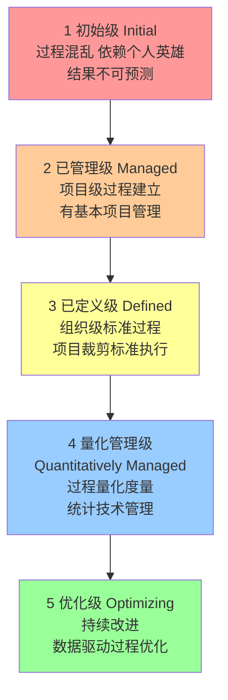
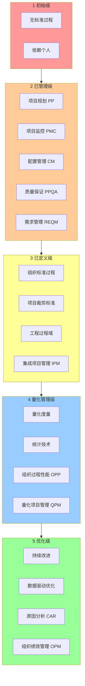

# 7.2 CMMI 能力成熟度模型

[[7.1 软件质量保障体系]] 阐明 SQA 关注过程质量，但“如何评估与改进过程质量”需要框架。CMMI（能力成熟度模型集成）是软件工程领域最权威的过程改进框架，由卡内基梅隆大学软件工程研究所（SEI）提出。本节阐明 CMMI 五级模型、阶段式与连续式两种表示法、过程域，为组织过程改进提供路径。

## CMMI 概述

> [!definition] CMMI
> CMMI（Capability Maturity Model Integration，能力成熟度模型集成）是**用于评估组织过程成熟度并指导过程改进**的框架，由 SEI（软件工程研究所）开发，是 CMM（软件能力成熟度模型）的集成升级版。CMMI 提供从“混沌”到“持续优化”的五级成熟度路径。

## CMMI 五级成熟度模型

### 各级别关键特征

| 级别 | 名称 | 关键特征 | 典型表现 |
| --- | --- | --- | --- |
| 1 | 初始级 Initial | 过程混乱、依赖个人英雄 | 无标准流程、结果不可预测、常延期超预算 |
| 2 | 已管理级 Managed | 项目级过程建立 | 有需求管理、项目计划、配置管理、质量保证 |
| 3 | 已定义级 Defined | 组织级标准过程 | 组织有标准过程库、项目裁剪标准过程执行 |
| 4 | 量化管理级 Quantitatively Managed | 过程量化度量 | 用统计与量化技术管理、设定量化目标 |
| 5 | 优化级 Optimizing | 持续改进 | 用数据驱动过程优化、持续改进机制 |

### 级别跃迁的本质

> [!note] 成熟度跃迁的规律
> > CMMI 五级反映过程成熟度的递进：
> > - 1→2：从“个人依赖”到“项目受控”——建立基本项目管理；
> > - 2→3：从“项目级”到“组织级”——建立组织标准过程；
> > - 3→4：从“定性”到“定量”——用数据管理过程；
> > - 4→5：从“管理”到“优化”——持续改进成为常态。
> > 跃迁不可跳级，每一级是下一级的基础。

## CMMI 表示法

CMMI 提供两种表示法：

| 表示法 | 评估对象 | 等级名称 | 等级范围 | 适用 |
| --- | --- | --- | --- | --- |
| 阶段式 | 组织整体成熟度 | 成熟度等级（ML） | 1–5 级 | 组织级评估与改进路径 |
| 连续式 | 单个过程域能力 | 能力等级（CL） | 0–3 级 | 针对性过程改进 |

### 阶段式（Staged Representation）

评估组织整体成熟度，给出 1–5 级成熟度等级。每个级别对应一组过程域，需全部满足才能达到该级别。

### 连续式（Continuous Representation）

评估单个过程域的能力，给出 0–3 级能力等级：
- CL0 不完整：未实现过程目标；
- CL1 已执行：过程已执行；
- CL2 已管理：过程已制度化并受管理；
- CL3 已定义：过程已制度化并按组织标准定义。

> [!tip] 两种表示法的选择
> > 阶段式适合“组织整体成熟度评估”，是招投标与认证常用；连续式适合“针对性改进某个过程域”，是过程改进的精细工具。CMMI 1.3 及以后版本支持两种表示法互换。

## CMMI 过程域

CMMI 定义 22 个过程域（CMMI-DEV），按类别分为四组：

| 类别 | 过程域 | 关联级别 |
| --- | --- | --- |
| 过程管理 | 组织过程定义 OPD、组织过程焦点 OPF、组织培训 OT、组织过程性能 OPP、组织绩效管理 OPM | 3/4/5 级 |
| 项目管理 | 项目规划 PP、项目监控 PMC、需求管理 REQM、供应商协议管理 SAM、集成项目管理 IPM、风险管理 RSKM、集成团队 IT、集成供应商管理 ISM | 2/3 级 |
| 工程 | 需求开发 RD、技术解决方案 TS、产品集成 PI、验证 VER、确认 VAL | 3 级 |
| 支持 | 配置管理 CM、过程与产品质量 PPQA、度量与分析 MA、决策分析与解决方案 DAR、原因分析与解决方案 CAR、组织级集成环境 OEI | 2/3/5 级 |

> [!note] 过程域与章节的对应
> > CMMI 过程域与本课程章节呼应：
> > - 配置管理 CM → [[MOC - 第6章]] 软件配置管理；
> > - 风险管理 RSKM → [[MOC - 第5章]] 软件项目风险管理；
> > - 过程与产品质量 PPQA → [[7.1 软件质量保障体系]] SQA；
> > - 项目规划 PP → [[MOC - 第2章]] 范围管理与 [[MOC - 第4章]] 进度规划；
> > - 需求开发 RD / 需求管理 REQM → [[2.1 需求收集与范围定义]]。

## CMMI 五级模型图

## CMMI 与 SQA 的关系

CMMI 是 SQA（[[7.1 软件质量保障体系]]）的框架支撑：
- CMMI 提供过程成熟度评估标准——SQA 据此评估过程质量；
- CMMI 提供过程改进路径——SQA 据此推动改进；
- CMMI 的 PPQA 过程域直接对应 SQA 活动；
- 高成熟度级别（4–5 级）要求量化管理与持续改进，是 SQA 的高级目标。

> [!warning] CMMI 认证的误区
> > CMMI 认证不等于质量保证。CMMI 评估的是“过程成熟度”而非“产品质量”。一个 CMMI 3 级组织仍可能交付有缺陷的产品，但其过程更可控、缺陷可追溯、改进有机制。CMMI 是质量保障的“过程框架”，需与测试、评审等工程实践结合才有效。

## 小结

CMMI 是评估与改进组织过程成熟度的框架，分五个成熟度级别：初始级(1)→已管理级(2)→已定义级(3)→量化管理级(4)→优化级(5)。两种表示法：阶段式（成熟度等级）评估组织整体，连续式（能力等级）评估单个过程域。22 个过程域覆盖过程管理、项目管理、工程、支持四类。CMMI 是 SQA 的过程框架支撑。

## 关联

- 上一级：[[MOC - 第7章]]
- 上一节：[[7.1 软件质量保障体系]]
- 下一节：[[7.3 评审管理与质量度量]]
- 关联概念：[[7.1 软件质量保障体系]]（SQA 是 CMMI 的 PPQA 过程域）；[[6.1 配置管理基本概念与版本控制]]（CM 过程域）；[[5.1 风险识别与风险分类]]（RSKM 过程域）
