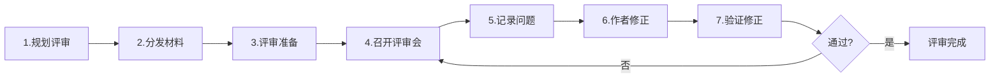
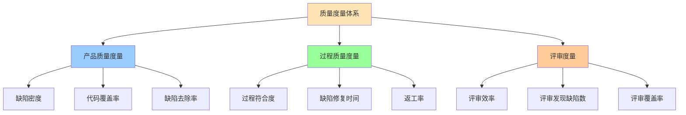
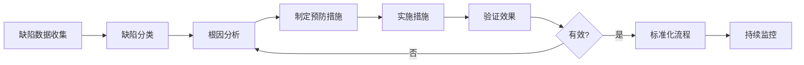
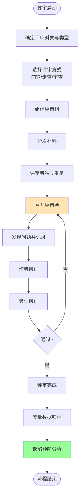

# 7.3 评审管理与质量度量

SQA（[[7.1 软件质量保障体系]]）的三类活动中，评审是最直接的缺陷预防手段。本节阐明评审类型（FTR/走查/审查）、FTR 正式技术评审流程、质量度量指标与缺陷预防策略，是质量保障的工程实现，也是 CMMI（[[7.2 CMMI能力成熟度模型]]）高成熟度级别量化管理的基础。

## 评审类型

> [!definition] 软件评审
> 软件评审（Software Review）是**由人工对软件产物（需求、设计、代码、文档）进行检查，发现缺陷与改进点**的质量活动。评审在测试之前进行，是缺陷预防的关键手段。

### 评审类型对比

| 类型 | 正式程度 | 主导者 | 目标 | 数据收集 | 适用 |
| --- | --- | --- | --- | --- | --- |
| 正式技术评审 FTR | 中等 | 评审组长 | 发现问题、评估质量 | 部分 | 设计与代码评审 |
| 走查 Walkthrough | 低 | 作者本人 | 教育、发现问题 | 否 | 早期需求讨论 |
| 审查 Inspection | 高 | 主持人（非作者） | 定量发现缺陷、过程改进 | 是 | 关键代码、安全代码 |
| 非正式评审 | 极低 | 任意 | 自由讨论 | 否 | 日常交流 |

> [!note] 评审与测试的区别
> > 评审由人工检查产物，发现“设计与逻辑缺陷”，成本低、发现早；测试由机器执行程序，发现“运行时缺陷”，成本高、发现晚。评审能发现测试难以覆盖的缺陷（如架构问题、需求遗漏），二者互补。经验表明，评审发现的缺陷数可达测试的 2–3 倍，且成本更低。

## FTR 正式技术评审

> [!definition] FTR
> 正式技术评审（Formal Technical Review, FTR）是**由评审组对软件产物进行结构化检查**的评审方式，目标是发现缺陷、评估质量、确保产物符合标准。FTR 是 SQA 评审活动的代表。

### FTR 流程

### FTR 流程详解

| 步骤 | 活动 | 责任方 | 输出 |
| --- | --- | --- | --- |
| 1. 规划 | 确定评审对象、参与者、时间 | 评审组长 | 评审计划 |
| 2. 分发 | 提前分发材料给评审者 | 作者 | 评审材料 |
| 3. 准备 | 评审者独立阅读、记录问题 | 评审者 | 准备记录 |
| 4. 召开 | 集体讨论、发现问题 | 评审组长主持 | 问题清单 |
| 5. 记录 | 记录所有问题与决议 | 记录员 | 评审记录 |
| 6. 修正 | 作者修正问题 | 作者 | 修正后产物 |
| 7. 验证 | 验证修正是否有效 | 评审组长 | 验证报告 |

### FTR 角色与规则

| 角色 | 职责 |
| --- | --- |
| 评审组长 | 主持评审、控制流程、签发结论 |
| 作者 | 提供材料、回答问题、修正缺陷 |
| 评审者 | 独立准备、发现问题、提出建议 |
| 记录员 | 记录问题与决议 |

> [!warning] FTR 的规则
> > FTR 应遵守以下规则：
> > ①**问题导向**：发现缺陷而非评价作者，对事不对人；
> > ②**不解决**：评审会发现问题，不在会上解决（解决留给作者）；
> > ③**限时**：单次评审不超过 2 小时，避免疲劳降低效率；
> > ④**准备充分**：评审者必须提前准备，未准备者不参加；
> > ⑤**记录完整**：所有问题与决议必须记录。

## 质量度量

> [!definition] 质量度量
> 质量度量是**用定量指标衡量软件质量与质量活动有效性**的方法，是 CMMI 4 级量化管理的基础（见 [[7.2 CMMI能力成熟度模型]]）。

### 核心质量度量指标

| 指标 | 公式 | 含义 | 应用 |
| --- | --- | --- | --- |
| 缺陷密度 | 缺陷数 / KLOC | 每千行代码缺陷数 | 评估代码质量、对比模块 |
| 代码覆盖率 | 已执行路径 / 总路径 | 测试覆盖比例 | 评估测试充分性 |
| 评审效率 | 发现缺陷数 / 评审人时 | 单位时间发现缺陷数 | 评估评审投入产出 |
| 缺陷去除率 | 评审发现缺陷 / 总缺陷 | 评审发现缺陷占比 | 评估评审有效性 |
| 缺陷修复时间 | 总修复时间 / 缺陷数 | 平均修复一个缺陷时间 | 评估维护效率 |

> [!formula] 缺陷密度
> $$\text{缺陷密度} = \frac{\text{缺陷总数}}{\text{KLOC}}$$
>
> 单位：缺陷数/千行代码。缺陷密度越低，代码质量越高。可用于对比不同模块、不同项目，但需注意缺陷定义与统计口径一致。

> [!example] 缺陷密度示例
> 某模块 5000 行代码，测试发现 25 个缺陷。
> $$\text{缺陷密度} = \frac{25}{5} = 5 \text{ 缺陷/KLOC}$$
> 行业经验：商业软件缺陷密度约 1–25 缺陷/KLOC，高质量软件 < 1 缺陷/KLOC。

## 质量度量体系图

## 缺陷预防策略

> [!definition] 缺陷预防
> 缺陷预防是**通过分析缺陷根因，采取系统性措施防止同类缺陷再次发生**的活动，是 CMMI 5 级优化级的核心实践。

### 缺陷预防流程

### 缺陷预防措施

| 措施 | 含义 | 示例 |
| --- | --- | --- |
| 过程改进 | 修改开发流程 | 增加评审环节、强化测试 |
| 培训 | 提升人员能力 | 编码规范培训、安全培训 |
| 工具支持 | 自动化检查 | 静态代码分析、代码规范检查 |
| 标准化 | 建立标准 | 编码标准、设计模式规范 |
| 检查表 | 防止遗漏 | 评审检查表、测试检查表 |

> [!tip] 缺陷预防与质量成本的关系
> > 缺陷预防是降低质量成本的关键（见 [[7.1 软件质量保障体系]] 质量成本）。预防投入属于“预防成本”，但可显著降低“内部失败成本”与“外部失败成本”。CMMI 5 级的“原因分析与解决方案 CAR”过程域就是系统化的缺陷预防实践。

## 评审流程图

## 小结

评审分 FTR 正式技术评审、走查、审查、非正式评审四类，FTR 是 SQA 评审活动的代表，遵循规划→准备→召开→修正→验证流程。质量度量包括缺陷密度、代码覆盖率、评审效率等指标，是 CMMI 量化管理的基础。缺陷预防通过根因分析与系统性措施防止缺陷再发生，是 CMMI 5 级的核心实践。

## 关联

- 上一级：[[MOC - 第7章]]
- 上一节：[[7.2 CMMI能力成熟度模型]]
- 关联概念：[[7.1 软件质量保障体系]]（评审是 SQA 活动）；[[7.2 CMMI能力成熟度模型]]（度量是 4 级量化管理基础）；[[6.3 配置审计与状态报告]]（FTR 与配置审计互补）；[[MOC - 软件测试技术]]（评审与测试互补发现缺陷）
