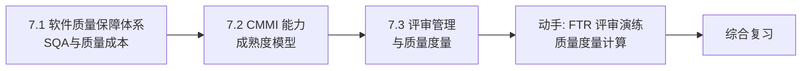

# MOC - 第7章 软件质量保障与评审管理

> [!info] 本章定位
> 第7章回答“如何保证交付的软件满足需求、过程可改进”。软件质量是项目三重约束（[[1.2 项目三重约束：范围、时间、成本、质量]]）的核心维度。本章涵盖软件质量保障体系（SQA 活动与质量成本）、CMMI 能力成熟度模型（五级过程改进框架）与评审管理（FTR 正式技术评审与质量度量），将质量从“事后检验”推进到“过程保证与持续改进”，与 [[6.3 配置审计与状态报告]] 的配置审计、[[MOC - 软件测试技术]] 的测试技术共同构成质量保障体系。

## 学习路线图

## 知识点导航

| 节 | 主题 | 核心要点 | 入口 |
| --- | --- | --- | --- |
| 7.1 | 软件质量保障体系 | 质量定义、SQA 定义、SQA 活动（评审/审计/过程检查）、质量成本四类（预防/评估/内部失败/外部失败） | [[7.1 软件质量保障体系]] |
| 7.2 | CMMI 能力成熟度模型 | CMMI 五级（初始/已管理/已定义/量化管理/优化）、阶段式与连续式表示、过程域 | [[7.2 CMMI能力成熟度模型]] |
| 7.3 | 评审管理与质量度量 | 评审类型（FTR/走查/审查）、FTR 流程、质量度量（缺陷密度/覆盖率/评审效率）、缺陷预防 | [[7.3 评审管理与质量度量]] |

## 核心考点

> [!warning] 重点掌握
> 1. 软件质量定义：满足明确与隐含需求的程度，包含功能、性能、可靠性、可维护性等属性。
> 2. SQA 定义：计划、标准、规程的系统性保障，关注过程质量而非仅产品质量。
> 3. SQA 活动三类：评审、审计、过程检查。
> 4. 质量成本四类：预防成本、评估成本、内部失败成本、外部失败成本；关系：预防投入越多失败成本越低。
> 5. CMMI 五级：初始级(1)→已管理级(2)→已定义级(3)→量化管理级(4)→优化级(5)。
> 6. 每个级别的关键特征：1 级混沌、2 级项目级管理、3 级组织级标准、4 级量化、5 级持续优化。
> 7. CMMI 两种表示法：阶段式（成熟度等级）、连续式（能力等级）。
> 8. 评审类型：正式技术评审（FTR）、走查（Walkthrough）、审查（Inspection）、非正式评审。
> 9. FTR 流程：规划→准备→召开→修正→验证。
> 10. 质量度量：缺陷密度（缺陷数/KLOC）、代码覆盖率、评审效率。

## 自测题

> [!question] 题1
> 解释软件质量保证（SQA）与软件质量控制（SQC）的区别，并说明 SQA 的三类活动。
> > [!check]- 参考答案
> > | 维度 | SQA 质量保证 | SQC 质量控制 |
> > | --- | --- | --- |
> > | 关注点 | 过程质量 | 产品质量 |
> > | 时机 | 全过程预防 | 事后检验 |
> > | 方法 | 评审、审计、过程检查 | 测试、检查 |
> > | 目标 | 预防缺陷产生 | 发现并修复缺陷 |
> > **SQA 三类活动**：
> > - **评审**：对需求、设计、代码等产物进行正式技术评审（FTR）；
> > - **审计**：检查过程是否符合标准与规程（如配置审计，见 [[6.3 配置审计与状态报告]]）；
> > - **过程检查**：监督开发过程是否按既定流程执行。

> [!question] 题2
> 描述质量成本的四种类型，并说明它们之间的关系与最优投入策略。
> > [!check]- 参考答案
> > | 类型 | 含义 | 示例 |
> > | --- | --- | --- |
> > | 预防成本 | 防止缺陷产生的投入 | 培训、过程改进、评审 |
> > | 评估成本 | 检测是否产生缺陷的投入 | 测试、审计、检查 |
> > | 内部失败成本 | 交付前发现缺陷的修复成本 | 返工、重新测试 |
> > | 外部失败成本 | 交付后发现缺陷的成本 | 维护、赔偿、声誉损失 |
> > **关系**：预防与评估投入越多，内部与外部失败成本越低；反之预防不足导致失败成本激增（外部失败成本最高，可达预防成本的 10–100 倍）。
> > **最优策略**：增加预防与评估投入，将缺陷拦截在交付前。最优质量成本点在预防+评估成本与失败成本之和最小处，通常预防成本占比应提升。

> [!question] 题3
> 列出 CMMI 五个成熟度级别，并说明每个级别的关键特征。
> > [!check]- 参考答案
> > | 级别 | 名称 | 关键特征 |
> > | --- | --- | --- |
> > | 1 | 初始级 | 过程混乱、依赖个人英雄、结果不可预测 |
> > | 2 | 已管理级 | 项目级过程建立、有基本项目管理（需求、进度、配置管理） |
> > | 3 | 已定义级 | 组织级标准过程、所有项目裁剪标准过程执行 |
> > | 4 | 量化管理级 | 过程量化度量、用统计与量化技术管理 |
> > | 5 | 优化级 | 持续改进、用数据驱动过程优化 |
> > 跃迁规律：从“个人依赖”到“项目受控”到“组织标准化”到“量化管理”到“持续优化”，是过程成熟度的递进。

> [!question] 题4
> 比较正式技术评审（FTR）、走查（Walkthrough）与审查（Inspection）三种评审方式。
> > [!check]- 参考答案
> > | 维度 | FTR 正式技术评审 | Walkthrough 走查 | Inspection 审查 |
> > | --- | --- | --- | --- |
> > | 正式程度 | 中等 | 低 | 高（最严格） |
> > | 主导者 | 评审组长 | 作者本人 | 主持人（非作者） |
> > | 目标 | 发现问题、评估质量 | 教育、发现问题 | 定量发现缺陷、过程改进 |
> > | 准备 | 有 | 较少 | 严格（检查表） |
> > | 数据收集 | 部分 | 否 | 是（缺陷统计） |
> > | 适用 | 设计与代码评审 | 早期需求讨论 | 关键代码、安全代码 |

## 章节导航

- 上一级：[[MOC - 软件项目管理]]
- 上一章：[[MOC - 第6章]]
