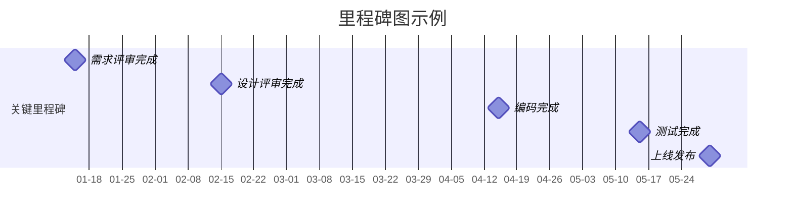
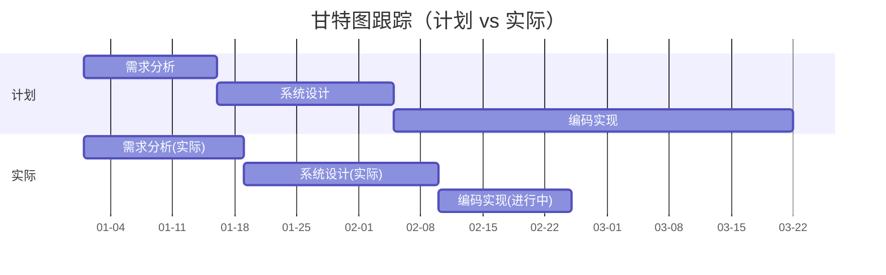
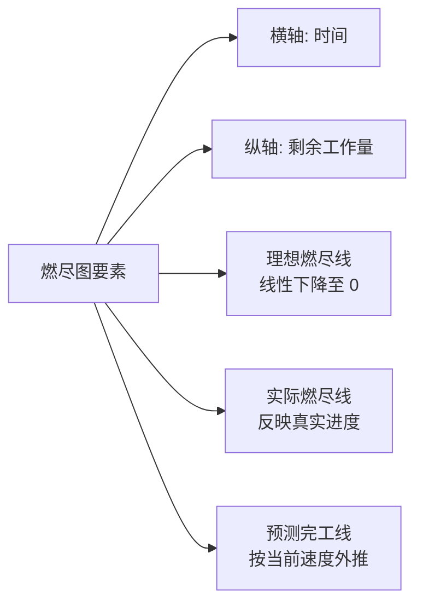
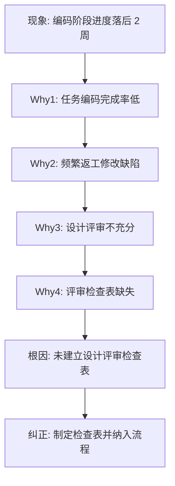
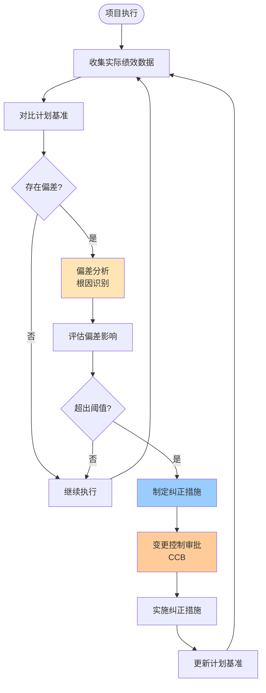

# 8.1 项目跟踪方法与进度监控

项目计划（[[4.2 关键路径法（CPM）与甘特图]]、[[3.3 成本估算与估算方法综合]]）制定后，必须在执行阶段持续监控实际进展与计划的偏差，才能在失控前采取纠正措施。本节阐明项目跟踪的定义、跟踪方法（里程碑图、甘特图跟踪、燃尽图）、进度偏差分析与纠正措施，为 [[8.2 挣值分析（EVA）核心指标]] 的量化绩效测量奠定基础。

## 项目跟踪定义

> [!definition] 项目跟踪
> 项目跟踪是**监控项目实际进展，对比计划与实际，识别偏差并采取纠正措施**的过程。其目标是确保项目按计划推进，或在偏差超出阈值时及时调整。

项目跟踪是项目监控过程组的核心活动，对应 PDCA 循环中的“Check”环节。跟踪对象包括：

| 跟踪对象 | 计划基准 | 关联章节 |
| --- | --- | --- |
| 范围 | 范围基准、WBS | [[2.2 WBS工作分解结构创建]] |
| 进度 | 进度基准、甘特图 | [[4.2 关键路径法（CPM）与甘特图]] |
| 成本 | 成本基准、预算 | [[3.3 成本估算与估算方法综合]] |
| 质量 | 质量标准 | [[7.1 软件质量保障体系]] |
| 风险 | 风险登记册 | [[5.3 风险应对策略与风险监控]] |

## 跟踪方法

### 里程碑图

> [!definition] 里程碑
> 里程碑（Milestone）是**项目中具有重大意义的检查点事件**，通常标志一个阶段的开始或结束，持续时间为 0。

里程碑图只显示关键节点，不显示具体任务，适合向高层汇报。

**特点**：粒度粗、信息密度低，适合高层管理；无法反映过程细节，需配合甘特图使用。

### 甘特图跟踪

在原甘特图（[[4.2 关键路径法（CPM）与甘特图]]）基础上叠加“实际进度条”，对比计划与实际。

**判读规则**：
- 实际条形长于计划 → 进度落后；
- 实际条形短于计划 → 进度正常或提前；
- 实际开始时间晚于计划 → 启动延误。

### 燃尽图

> [!definition] 燃尽图
> 燃尽图（Burndown Chart）是**显示剩余工作量随时间变化的折线图**，横轴为时间，纵轴为剩余工作量（故事点或人时）。理想曲线从总量线性下降至 0，实际曲线反映真实进度。燃尽图源于敏捷开发（详见 [[10.2 Sprint计划与执行]]），也可用于瀑布项目的迭代监控。

**判读规则**：
- 实际线在理想线之上 → 进度落后；
- 实际线在理想线之下 → 进度提前；
- 实际线上升 → 工作量增加或估算不足（scope creep）。

## 进度偏差分析

### 偏差识别

> [!definition] 进度偏差
> 进度偏差是**实际进度与计划进度的差值**。在挣值体系中用 SV（Schedule Variance）量化，详见 [[8.2 挣值分析（EVA）核心指标]]。

| 偏差类型 | 含义 | 判断 |
| --- | --- | --- |
| 进度提前 | 实际进度快于计划 | SV > 0 或 SPI > 1 |
| 进度正常 | 实际进度符合计划 | SV = 0 或 SPI = 1 |
| 进度落后 | 实际进度慢于计划 | SV < 0 或 SPI < 1 |

### 偏差原因分析

> [!note] 偏差根源分类
> > 找到偏差后必须分析根因，否则纠正措施会失效。常见原因：
> > - **估算偏差**：工作量估算过低（[[3.2 工作量估算：COCOMO模型]] 估算误差）；
> > - **资源问题**：人员流失、技能不足、设备故障；
> > - **范围蔓延**：未受控的需求增加（[[2.3 范围确认与范围控制]]）；
> > - **技术风险**：未预见的技术难题（[[5.1 风险识别与风险分类]]）；
> > - **依赖延误**：上游任务延误导致下游无法开始；
> > - **沟通问题**：信息不畅导致返工（[[9.1 项目沟通管理]]）；
> > - **质量问题**：缺陷返工占用工时（[[7.3 评审管理与质量度量]]）。

### 5 Why 根因分析示例

## 纠正措施

> [!definition] 纠正措施
> 纠正措施是为**使项目重新与计划一致而采取的针对性动作**，分为进度纠正、成本纠正、范围调整、资源调整四类。

### 纠正措施类型

| 类型 | 措施 | 关联 |
| --- | --- | --- |
| 进度压缩 | 赶工（Crash，加资源）、快速跟进（Fast-tracking，并行） | [[4.3 PERT技术与进度压缩]] |
| 资源调整 | 增加人力、调整任务分配、引入外部资源 | [[1.3 软件项目组织形式与参与角色]] |
| 范围调整 | 与客户协商缩减非核心范围、分期交付 | [[2.3 范围确认与范围控制]] |
| 成本控制 | 优化流程、减少非关键路径投入 | [[8.2 挣值分析（EVA）核心指标]] |
| 风险应对 | 启动应急储备、执行风险响应计划 | [[5.3 风险应对策略与风险监控]] |
| 流程改进 | 强化评审、引入工具自动化 | [[7.1 软件质量保障体系]] |

> [!warning] 纠正措施的权衡
> > 纠正措施常带来副作用：
> > - **赶工**增加成本且边际效益递减（Brooks 定律：向延期项目加人只会更延期）；
> > - **快速跟进**增加风险（并行任务依赖被打破）；
> > - **范围调整**影响客户满意度，需变更控制流程（[[6.2 变更控制流程与CCB]]）。
> > 纠正措施需经变更控制审批后实施，避免随意调整破坏基准。

## 项目跟踪流程图

> [!tip] 跟踪频率建议
> > 跟踪频率应与项目周期匹配：
> > - **短周期项目（<3 月）**：每周跟踪，关键路径每日站会；
> > - **中等周期项目（3–12 月）**：每两周跟踪，里程碑节点专项评审；
> > - **长周期项目（>1 年）**：每月跟踪，阶段评审；
> > - **敏捷项目**：每日站会 + Sprint 燃尽图（详见 [[10.2 Sprint计划与执行]]）。

## 小结

项目跟踪是监控实际进展、对比计划、识别偏差并纠正的过程。跟踪方法包括里程碑图（关键节点）、甘特图跟踪（任务级对比）、燃尽图（剩余工作量趋势）。发现偏差后需进行根因分析，常见原因有估算偏差、资源问题、范围蔓延等。纠正措施包括进度压缩、资源调整、范围调整等，需经变更控制审批后实施。本节为 [[8.2 挣值分析（EVA）核心指标]] 的量化监控奠定基础。

## 关联

- 上一级：[[MOC - 第8章]]
- 下一节：[[8.2 挣值分析（EVA）核心指标]]
- 关联概念：[[4.2 关键路径法（CPM）与甘特图]]（甘特图基准）；[[4.3 PERT技术与进度压缩]]（纠正措施：赶工与快速跟进）；[[2.3 范围确认与范围控制]]（范围变更）；[[6.2 变更控制流程与CCB]]（纠正措施审批）；[[10.2 Sprint计划与执行]]（燃尽图敏捷应用）
