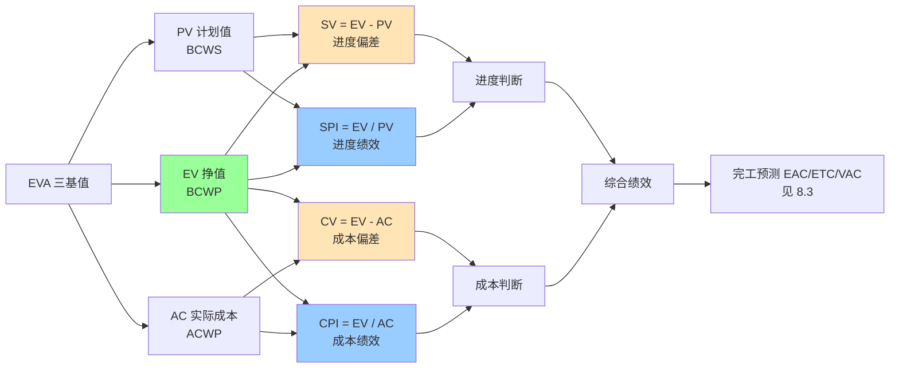

# 8.2 挣值分析（EVA）核心指标

传统的项目跟踪（[[8.1 项目跟踪方法与进度监控]]）只能分别看进度或成本，无法回答“花掉的钱到底完成了多少预算工作”。挣值分析（Earned Value Analysis, EVA）将范围、进度、成本三者集成，通过 PV/EV/AC 三个基本指标量化项目绩效，是项目监控最权威的量化方法。本节是本章核心，为 [[8.3 预测与项目收尾]] 的完工预测奠定基础。

## 挣值分析定义

> [!definition] 挣值分析
> 挣值分析（Earned Value Analysis, EVA）是**综合范围、时间与成本的绩效测量方法**，通过比较计划完成工作的预算成本（PV）、实际完成工作的预算成本（EV）与实际完成工作的实际成本（AC），量化项目进度与成本绩效。

> [!note] EVA 的工程意义
> > EVA 解决了“只看钱不看进度”或“只看进度不看钱”的盲区。例如：AC < PV 看似省钱，但若 EV < AC 则说明花掉的钱没换来等量工作，成本实际超支。EVA 把“做了多少”与“花了多少”统一到预算口径下比较，是项目三重约束（[[1.2 项目三重约束：范围、时间、成本、质量]]）的集成测量。

## 三个基本指标

### PV 计划值

> [!definition] PV
> **计划值（Planned Value, PV）**：截至某时点，**计划完成工作的预算成本**。PV 是进度基准与成本基准的乘积，回答“到这时点应该完成多少预算的工作”。

- 又称 **BCWS**（Budgeted Cost of Work Scheduled）；
- PV 来源于 WBS（[[2.2 WBS工作分解结构创建]]）与成本估算（[[3.3 成本估算与估算方法综合]]）；
- 累计 PV 曲线称为 **S 曲线**（前期慢、中期快、后期慢）。

### EV 挣值

> [!definition] EV
> **挣值（Earned Value, EV）**：截至某时点，**实际完成工作的预算成本**。EV 回答“到这时点实际完成了多少预算的工作”，是 EVA 的核心。

- 又称 **BCWP**（Budgeted Cost of Work Performed）；
- EV = ∑（已完成工作包的预算成本）；
- “挣值”得名于“完成多少工作就挣多少预算”，与实际花费无关。

> [!example] EV 计算示例
> > 某任务预算 10 万元，截至当前实际完成 60%，则：
> > $$EV = 10 \times 60\% = 6 \text{ 万元}$$
> > 无论实际花费是 5 万还是 8 万，EV 始终是 6 万元——这是“挣到”的预算价值。

### AC 实际成本

> [!definition] AC
> **实际成本（Actual Cost, AC）**：截至某时点，**实际完成工作的实际成本**。AC 回答“到这时点实际花了多少钱”。

- 又称 **ACWP**（Actual Cost of Work Performed）；
- AC 来源于财务系统、工时系统、采购记录；
- AC 只统计已完工作的成本，未完工作的承诺成本不计入。

### 三指标对比

| 指标 | 全称 | 含义 | 别名 | 口径 |
| --- | --- | --- | --- | --- |
| PV | Planned Value | 计划完成工作的预算成本 | BCWS | 预算 × 计划进度 |
| EV | Earned Value | 实际完成工作的预算成本 | BCWP | 预算 × 实际进度 |
| AC | Actual Cost | 实际完成工作的实际成本 | ACWP | 实际花费 |

### BAC 完工预算

> [!definition] BAC
> **完工预算（Budget at Completion, BAC）**：项目全部计划工作的预算总成本，是 PV 累计的最大值。BAC 是 [[8.3 预测与项目收尾]] 中 EAC、ETC、VAC 计算的基准。

## 偏差指标

### SV 进度偏差

> [!formula] 进度偏差
> $$SV = EV - PV$$
>
> - **SV > 0**：进度提前（实际完成多于计划）；
> - **SV = 0**：进度符合计划；
> - **SV < 0**：进度落后（实际完成少于计划）。
>
> 单位与 PV、EV、BAC 一致（万元或人时）。SV 是绝对量，不便于跨项目比较。

### CV 成本偏差

> [!formula] 成本偏差
> $$CV = EV - AC$$
>
> - **CV > 0**：成本节约（实际花费低于预算）；
> - **CV = 0**：成本符合预算；
> - **CV < 0**：成本超支（实际花费高于预算）。

> [!warning] 偏差判断的常见误区
> > - 误把 AC < PV 当作“省钱”。正确判断须用 CV = EV - AC：若 EV < AC，即使 AC < PV 也是超支。
> > - 误把 SV > 0 当作“项目一定好”。若同时 CV < 0，可能是靠多花钱换来的进度提前，需综合判断。

## 绩效指标

### SPI 进度绩效指数

> [!formula] 进度绩效指数
> $$SPI = \frac{EV}{PV}$$
>
> - **SPI > 1**：进度提前；
> - **SPI = 1**：进度符合计划；
> - **SPI < 1**：进度落后。
>
> SPI 是相对量，便于跨项目比较。SPI = 0.8 表示实际只完成计划工作量的 80%。

### CPI 成本绩效指数

> [!formula] 成本绩效指数
> $$CPI = \frac{EV}{AC}$$
>
> - **CPI > 1**：成本节约；
> - **CPI = 1**：成本符合预算；
> - **CPI < 1**：成本超支。
>
> CPI = 0.8 表示每花 1 元只完成 0.8 元的预算工作。CPI 是 [[8.3 预测与项目收尾]] 中 EAC 预测的关键参数。

### 绩效指数判读

| SPI \ CPI | CPI > 1 节约 | CPI = 1 持平 | CPI < 1 超支 |
| --- | --- | --- | --- |
| **SPI > 1 提前** | 理想：快且省 | 进度快，成本正常 | 快但贵：靠加钱换进度 |
| **SPI = 1 持平** | 成本节约，进度正常 | 完美执行 | 进度正常但超支 |
| **SPI < 1 落后** | 慢但省钱：可能资源不足 | 进度慢，成本正常 | 最差：又慢又超支 |

## 挣值分析图

## 完整挣值计算示例

> [!example] 综合案例
> > 某软件项目 BAC = 200 万元，工期 10 个月。截至第 4 月末：
> > - 计划完成 40% 的工作（PV）；
> > - 实际完成 30% 的工作（EV）；
> > - 实际花费 90 万元（AC）。
> >
> > **步骤 1：计算三基值**
> > $$PV = BAC \times 40\% = 200 \times 0.4 = 80 \text{ 万元}$$
> > $$EV = BAC \times 30\% = 200 \times 0.3 = 60 \text{ 万元}$$
> > $$AC = 90 \text{ 万元}$$
> >
> > **步骤 2：计算偏差**
> > $$SV = EV - PV = 60 - 80 = -20 \text{ 万元（落后）}$$
> > $$CV = EV - AC = 60 - 90 = -30 \text{ 万元（超支）}$$
> >
> > **步骤 3：计算绩效指数**
> > $$SPI = \frac{EV}{PV} = \frac{60}{80} = 0.75 \text{（进度效率 75%）}$$
> > $$CPI = \frac{EV}{AC} = \frac{60}{90} \approx 0.67 \text{（成本效率 67%）}$$
> >
> > **步骤 4：判读**
> > - 进度落后 25%（少完成 20 万元预算工作）；
> > - 成本超支 33%（每花 1 元只完成 0.67 元工作）；
> > - 项目处于“又慢又超支”的最差状态，需立即纠正。
> >
> > **步骤 5：完工预测**（详见 [[8.3 预测与项目收尾]]）
> > $$EAC = AC + \frac{BAC - EV}{CPI} = 90 + \frac{200 - 60}{0.67} \approx 90 + 209 = 299 \text{ 万元}$$
> > 预计完工成本 299 万元，远超 200 万预算，需采取重大纠正措施或申请追加预算。

## EVA 实施条件

> [!note] 实施 EVA 的前提
> > EVA 依赖以下条件，否则数据失真：
> > 1. **WBS 完备**：工作包可度量（[[2.2 WBS工作分解结构创建]]）；
> > 2. **成本基准明确**：每个工作包有预算（[[3.3 成本估算与估算方法综合]]）；
> > 3. **进度基准明确**：PV 曲线可计算（[[4.2 关键路径法（CPM）与甘特图]]）；
> > 4. **实际成本可归集**：财务/工时系统能按工作包统计 AC；
> > 5. **进度可客观度量**：完成百分比有统一口径（0/100、50/50 等规则）。

### 完成百分比规则

| 规则 | 含义 | 适用 |
| --- | --- | --- |
| 0/100 | 开始计 0%，完成计 100% | 短任务、里程碑 |
| 50/50 | 开始计 50%，完成计 50% | 中等任务 |
| 25/75 | 开始计 25%，完成计 75% | 长任务 |
| 加权里程碑 | 按里程碑权重分配 | 大型项目 |
| 完成百分比 | 按实际完成度估 | 需客观度量标准 |

## 小结

挣值分析是综合范围、进度、成本的绩效测量方法，核心是 PV（计划值）、EV（挣值）、AC（实际成本）三个基本指标。SV = EV - PV 衡量进度偏差，CV = EV - AC 衡量成本偏差；SPI = EV / PV 与 CPI = EV / AC 是相对绩效指数，便于跨项目比较。CPI 是完工预测（[[8.3 预测与项目收尾]]）的关键参数。EVA 依赖 WBS、成本基准、进度基准与实际成本归集等前提条件。

## 关联

- 上一级：[[MOC - 第8章]]
- 上一节：[[8.1 项目跟踪方法与进度监控]]
- 下一节：[[8.3 预测与项目收尾]]
- 关联概念：[[2.2 WBS工作分解结构创建]]（工作包是 EV 度量基础）；[[3.3 成本估算与估算方法综合]]（成本基准）；[[4.2 关键路径法（CPM）与甘特图]]（PV 来源）；[[1.2 项目三重约束：范围、时间、成本、质量]]（EVA 是三约束集成测量）
