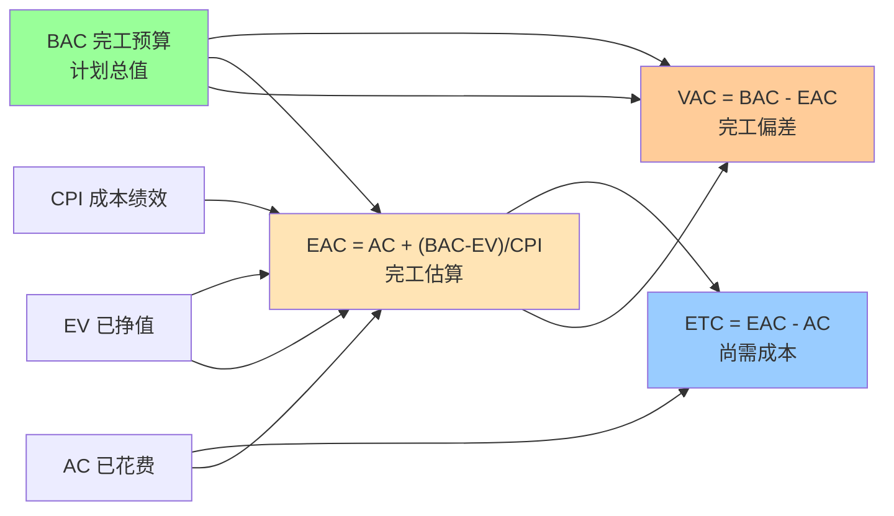
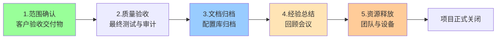
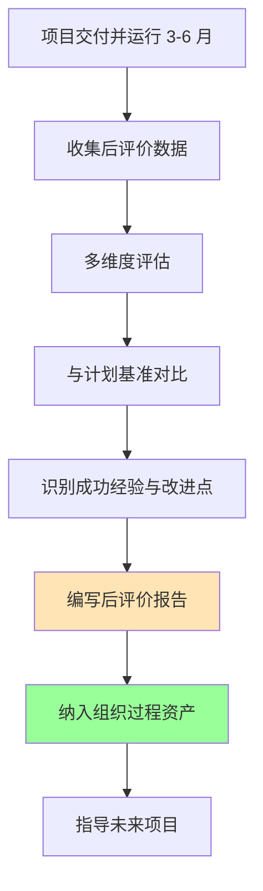

# 8.3 预测与项目收尾

挣值分析（[[8.2 挣值分析（EVA）核心指标]]）不仅衡量当前绩效，还能预测完工成本与偏差，为项目是否需要调整基准提供决策依据。当项目按当前绩效推进到完工时，EAC、ETC、VAC 三个预测指标回答“最终要花多少钱、还要花多少、会超多少”。项目收尾则是项目生命周期的最后一个过程组，确保交付物正式验收、经验沉淀、资源释放。本节完成项目监控与收尾的闭环。

## 完工预测指标

### EAC 完工估算

> [!definition] EAC
> **完工估算（Estimate at Completion, EAC）**：根据当前绩效推算的项目完工总成本。EAC 回答“按现在的效率，最终会花多少钱”。

> [!formula] EAC 典型公式
> $$EAC = AC + \frac{BAC - EV}{CPI}$$
>
> 含义：已花费的 AC + 剩余工作（BAC - EV）按当前成本效率 CPI 推进所需成本。
>
> 这是**假设剩余工作按当前 CPI 推进**的公式，是最常用的 EAC 公式。

**EAC 的其他变体**：

| 假设 | 公式 | 适用场景 |
| --- | --- | --- |
| 剩余按当前 CPI 推进 | $EAC = AC + \frac{BAC - EV}{CPI}$ | 当前偏差具有代表性，将持续到完工 |
| 剩余按原预算推进 | $EAC = AC + (BAC - EV)$ | 当前偏差是偶然的，剩余工作将按计划执行 |
| 进度与成本共同影响 | $EAC = AC + \frac{BAC - EV}{CPI \times SPI}$ | 进度落后也影响成本（加资源赶工） |
| 重新估算剩余 | $EAC = AC + ETC_{自下而上}$ | 原估算失效，重新估算剩余工作 |

### ETC 完工尚需估算

> [!definition] ETC
> **完工尚需估算（Estimate to Complete, ETC）**：从当前到完工还需花费的成本。ETC 回答“还要再花多少钱”。

> [!formula] ETC 公式
> $$ETC = EAC - AC$$
>
> 含义：完工总成本减去已花费成本，即剩余尚需成本。
>
> 若采用自下而上重新估算，则 $ETC_{新}$ 直接得出，再反推 $EAC = AC + ETC_{新}$。

### VAC 完工偏差

> [!definition] VAC
> **完工偏差（Variance at Completion, VAC）**：完工预算与完工估算的差值。VAC 回答“完工时会超多少或省多少”。

> [!formula] VAC 公式
> $$VAC = BAC - EAC$$
>
> - **VAC > 0**：完工时低于预算（节约）；
> - **VAC = 0**：完工时符合预算；
> - **VAC < 0**：完工时超预算（超支）。

### 预测指标关系图

### 预测计算示例

> [!example] 完工预测综合案例
> > 续 [[8.2 挣值分析（EVA）核心指标]] 案例：BAC = 200 万元，EV = 60 万元，AC = 90 万元，CPI = 0.67。
> >
> > **EAC（按当前 CPI 推进）**：
> > $$EAC = AC + \frac{BAC - EV}{CPI} = 90 + \frac{200 - 60}{0.67} \approx 90 + 209 = 299 \text{ 万元}$$
> >
> > **ETC（尚需成本）**：
> > $$ETC = EAC - AC = 299 - 90 = 209 \text{ 万元}$$
> >
> > **VAC（完工偏差）**：
> > $$VAC = BAC - EAC = 200 - 299 = -99 \text{ 万元}$$
> >
> > **结论**：按当前效率，项目完工将花费 299 万元，超预算 99 万元。若无法追加预算，需立即采取纠正措施提高 CPI（如优化流程、缩减范围），或申请变更 BAC。

> [!warning] EAC 预测的可信度
> > EAC 假设“未来按当前绩效推进”，但项目后期的偏差可能与前期不同：
> > - **前期偏差大**：可能是学习曲线、启动成本，后期会改善；
> > - **后期偏差大**：可能是技术债务累积、复杂度上升，后期会更糟；
> > - **建议**：EAC 应结合定性判断，不能机械套用公式。项目进入 20% 以后 EAC 才有参考价值。

## 项目收尾过程

> [!definition] 项目收尾
> 项目收尾是**项目生命周期最后一个过程组**，目标是正式结束项目或阶段，确保交付物被客户接受、经验被沉淀、资源被释放。收尾失败会导致“烂尾项目”与组织资产流失。

### 项目收尾流程图

### 收尾过程详解

| 步骤 | 活动 | 输出 | 关联 |
| --- | --- | --- | --- |
| 1. 范围确认 | 与客户逐项确认 WBS 交付物，获取正式验收签字 | 验收书 | [[2.3 范围确认与范围控制]] |
| 2. 质量验收 | 执行最终系统测试、质量审计，确认满足质量标准 | 质量报告 | [[7.1 软件质量保障体系]] |
| 3. 文档归档 | 整理需求、设计、代码、测试、用户手册等，纳入配置库 | 配置基线 | [[6.1 配置管理基本概念与版本控制]] |
| 4. 经验总结 | 召开项目回顾会，记录成功经验与改进点 | 经验教训登记册 | 组织过程资产 |
| 5. 资源释放 | 解散团队、释放设备与许可证、关闭合同、付款 | 资源释放报告 | 合同收尾 |

> [!note] 合同收尾 vs 行政收尾
> > - **合同收尾**：每个合同完成后进行，包括最终付款、关闭合同档案、解决未决事项；
> > - **行政收尾**：每个阶段或项目结束时进行，包括验收、归档、经验总结、资源释放；
> > - 合同收尾发生在行政收尾之前，二者都完成才算项目正式关闭。

### 文档归档清单

| 类别 | 文档 | 归档位置 |
| --- | --- | --- |
| 需求类 | 需求规格说明书、需求变更记录 | 配置库 |
| 设计类 | 概要设计、详细设计、数据库设计 | 配置库 |
| 代码类 | 源代码、可执行程序、构建脚本 | 版本控制系统 |
| 测试类 | 测试计划、测试用例、测试报告、缺陷记录 | 配置库 |
| 管理类 | 项目计划、进度报告、风险登记册、挣值报告 | 项目档案 |
| 交付类 | 用户手册、运维手册、培训材料 | 客户交付 |

## 项目后评价

> [!definition] 项目后评价
> 项目后评价是**项目交付并运行一段时间后，对项目目标达成度、过程合规性、效益与影响进行的系统性评价**。其目标是沉淀组织过程资产，指导未来项目。

### 后评价维度

| 维度 | 评价内容 | 指标示例 |
| --- | --- | --- |
| 目标达成度 | 范围、进度、成本、质量是否达成 | 需求覆盖率、进度偏差率、CPI、缺陷密度 |
| 过程合规性 | 是否遵循标准与流程 | 过程符合度、变更控制执行率 |
| 客户满意度 | 客户对交付物的满意程度 | NPS、客户满意度评分 |
| 团队成长 | 团队技能与协作提升 | 技能矩阵提升、人员留存率 |
| 财务绩效 | 投资回报与成本效益 | ROI、VAC、回收期 |
| 长期影响 | 业务价值与战略贡献 | 业务收益、用户增长 |

### 后评价流程

> [!tip] 经验教训登记册
> > 经验教训登记册是项目收尾的关键产出，应包含：
> > - **成功经验**：哪些做法有效，可复用到其他项目；
> > - **改进点**：哪些做法无效，如何改进；
> > - **风险案例**：发生了哪些未识别的风险，如何应对；
> > - **估算偏差**：估算与实际的差异，修正估算模型（[[3.2 工作量估算：COCOMO模型]]）；
> > - **工具与流程**：哪些工具/流程有效，需优化。
> > 经验教训应具体可操作，避免“加强沟通”这类空话。

## 小结

完工预测指标包括 EAC（完工估算）、ETC（完工尚需估算）、VAC（完工偏差），核心公式 EAC = AC + (BAC - EV) / CPI 假设剩余工作按当前成本效率推进。项目收尾包括范围确认、质量验收、文档归档、经验总结、资源释放五步，是项目正式关闭的必经过程。项目后评价在交付运行一段时间后进行，从目标达成度、过程合规性、客户满意度等维度沉淀组织过程资产，指导未来项目改进。

## 关联

- 上一级：[[MOC - 第8章]]
- 上一节：[[8.2 挣值分析（EVA）核心指标]]
- 关联概念：[[8.1 项目跟踪方法与进度监控]]（跟踪-预测-收尾闭环）；[[2.3 范围确认与范围控制]]（范围确认收尾）；[[6.1 配置管理基本概念与版本控制]]（文档归档）；[[6.2 变更控制流程与CCB]]（BAC 变更审批）；[[7.1 软件质量保障体系]]（质量验收）；[[3.2 工作量估算：COCOMO模型]]（经验教训修正估算模型）
