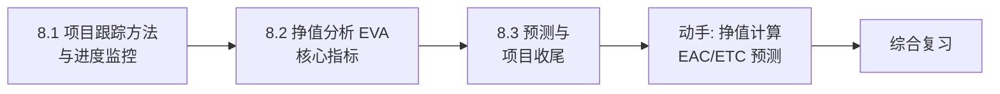

# MOC - 第8章 项目跟踪、挣值分析与控制

> [!info] 本章定位
> 第8章回答“项目执行过程中如何知道进度和成本是否在轨、是否需要纠正”。挣值分析（Earned Value Analysis, EVA）是项目三重约束（[[1.2 项目三重约束：范围、时间、成本、质量]]）中范围、进度、成本三者集成的绩效测量方法，是项目监控（[[4.2 关键路径法（CPM）与甘特图]] 进度计划、[[3.3 成本估算与估算方法综合]] 成本估算）在执行阶段的数据闭环。本章涵盖项目跟踪方法、挣值分析核心指标与预测及项目收尾，将“计划-执行-检查-行动”的 PDCA 闭环在项目管理层面落地。

## 学习路线图

## 知识点导航

| 节 | 主题 | 核心要点 | 入口 |
| --- | --- | --- | --- |
| 8.1 | 项目跟踪方法与进度监控 | 跟踪定义、里程碑图/甘特图跟踪/燃尽图、进度偏差分析、偏差原因、纠正措施 | [[8.1 项目跟踪方法与进度监控]] |
| 8.2 | 挣值分析（EVA）核心指标 | PV/EV/AC 三基值、SV/CV 偏差、SPI/CPI 绩效指数、挣值计算示例 | [[8.2 挣值分析（EVA）核心指标]] |
| 8.3 | 预测与项目收尾 | EAC/ETC/VAC 预测公式、项目收尾过程、项目后评价 | [[8.3 预测与项目收尾]] |

## 核心考点

> [!warning] 重点掌握
> 1. 项目跟踪定义：监控项目进展，对比计划与实际，识别偏差并采取纠正措施。
> 2. 跟踪方法：里程碑图（关键节点）、甘特图跟踪（计划-实际条形对比）、燃尽图（剩余工作量随时间变化，敏捷常用）。
> 3. 挣值分析三基值：PV 计划值（Planned Value，计划完成工作的预算成本）、EV 挣值（Earned Value，实际完成工作的预算成本）、AC 实际成本（Actual Cost，实际完成工作的实际成本）。
> 4. 偏差指标：SV = EV - PV（进度偏差，>0 进度提前）、CV = EV - AC（成本偏差，>0 成本节约）。
> 5. 绩效指数：SPI = EV / PV（进度绩效指数，>1 提前）、CPI = EV / AC（成本绩效指数，>1 节约）。
> 6. 完工预测：EAC = AC + (BAC - EV) / CPI；ETC = EAC - AC；VAC = BAC - EAC。
> 7. BAC（Budget at Completion）完工预算：项目全部计划工作的预算总成本。
> 8. 项目收尾过程：范围确认 → 质量验收 → 文档归档 → 经验总结 → 资源释放。
> 9. 项目后评价维度：目标达成度、过程合规性、客户满意度、团队成长、财务绩效。
> 10. CPI 含义：每消耗 1 元成本完成的预算工作量，CPI=0.8 表示每花 1 元只完成 0.8 元的工作，成本超支。

## 自测题

> [!question] 题1
> 某项目 BAC=100 万元，截至当前 PV=40 万元、EV=30 万元、AC=50 万元。计算 SV、CV、SPI、CPI，并判断项目进度与成本状况。
> > [!check]- 参考答案
> > - **SV** = EV - PV = 30 - 40 = **-10 万元**（进度落后，少完成 10 万元预算的工作）
> > - **CV** = EV - AC = 30 - 50 = **-20 万元**（成本超支，多花 20 万元）
> > - **SPI** = EV / PV = 30 / 40 = **0.75**（进度效率 75%，落后 25%）
> > - **CPI** = EV / AC = 30 / 50 = **0.6**（成本效率 60%，每花 1 元只完成 0.6 元工作）
> > **结论**：项目进度落后且成本超支，需分析原因并采取纠正措施（如赶工、调整范围）。

> [!question] 题2
> 续上题，按当前绩效预测完工成本。计算 EAC、ETC、VAC，并判断项目是否会超预算。
> > [!check]- 参考答案
> > 假设剩余工作按当前 CPI 推进：
> > - **EAC** = AC + (BAC - EV) / CPI = 50 + (100 - 30) / 0.6 = 50 + 116.67 ≈ **166.67 万元**
> > - **ETC** = EAC - AC = 166.67 - 50 = **116.67 万元**（还需花费约 116.67 万元）
> > - **VAC** = BAC - EAC = 100 - 166.67 = **-66.67 万元**（完工时超预算 66.67 万元）
> > **结论**：按当前绩效，项目将严重超预算，需立即采取成本控制措施或与干系人协商调整 BAC。

> [!question] 题3
> 比较里程碑图、甘特图跟踪与燃尽图三种项目跟踪方法的适用场景。
> > [!check]- 参考答案
> > | 方法 | 展示内容 | 适用场景 | 局限 |
> > | --- | --- | --- | --- |
> > | 里程碑图 | 关键节点（0/100 完成） | 向高层汇报、关键节点把控 | 粒度粗，无法反映过程细节 |
> > | 甘特图跟踪 | 计划条形 vs 实际条形 | 瀑布项目进度对比、任务级监控 | 任务多时图面拥挤，难反映工作量 |
> > | 燃尽图 | 剩余工作量随时间变化 | 敏捷 Sprint、迭代项目 | 需稳定的故事点估算 |
> > 三者可结合使用：里程碑图管关键节点，甘特图管任务进度，燃尽图管迭代工作量消耗。

> [!question] 题4
> 描述项目收尾的完整过程，并说明项目后评价的核心维度。
> > [!check]- 参考答案
> > **项目收尾过程**（5 步）：
> > 1. **范围确认**：与客户确认全部范围已交付，获取正式验收（衔接 [[2.3 范围确认与范围控制]]）；
> > 2. **质量验收**：完成最终测试与质量审计，确认满足质量标准（衔接 [[7.1 软件质量保障体系]]）；
> > 3. **文档归档**：整理需求、设计、代码、测试、用户手册等文档，纳入配置库（衔接 [[6.1 配置管理基本概念与版本控制]]）；
> > 4. **经验总结**：召开回顾会，记录成功经验与改进点，沉淀为组织过程资产；
> > 5. **资源释放**：解散团队、释放设备与许可证、关闭合同。
> > **项目后评价维度**：目标达成度（范围/进度/成本/质量）、过程合规性、客户满意度、团队成长、财务绩效（ROI）。

## 章节导航

- 上一级：[[MOC - 软件项目管理]]
- 上一章：[[MOC - 第7章]]
- 下一章：[[MOC - 第9章]]
