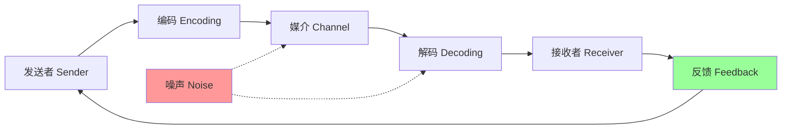
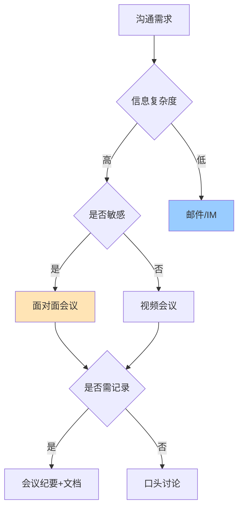

# 9.1 项目沟通管理

软件项目失败的首要原因常不是技术而是沟通失效——需求误解、进度不透明、变更未传达。项目沟通管理确保信息及时、准确、完整地传递给干系人，是项目跟踪（[[8.1 项目跟踪方法与进度监控]]）与团队协作（[[9.2 团队建设与激励]]）的基础。本节阐明沟通模型、沟通方式、沟通渠道数量公式与沟通管理计划。

## 沟通管理定义

> [!definition] 项目沟通管理
> 项目沟通管理是**确保项目信息及时、准确、完整地生成、收集、分发、存储与处置**的过程。其目标是让相关干系人在正确的时间获得正确的信息，支撑决策与协作。

PMBOK 沟通管理包含三个过程：

| 过程 | 所属过程组 | 核心活动 |
| --- | --- | --- |
| 规划沟通管理 | 计划 | 制定沟通管理计划 |
| 管理沟通 | 执行 | 按计划生成与分发信息 |
| 监督沟通 | 监控 | 检查沟通有效性并调整 |

## 沟通模型

> [!definition] 沟通模型
> 沟通模型描述信息从发送者到接收者的传递过程，包含发送者、编码、媒介、解码、接收者、反馈六个要素，受噪声干扰。

### 基本沟通模型

### 沟通要素

| 要素 | 含义 | 示例 |
| --- | --- | --- |
| 发送者 | 信息发起方 | 项目经理 |
| 编码 | 将意图转化为可传递的符号 | 撰写邮件、说话 |
| 媒介 | 信息载体 | 邮件、会议、电话、文档 |
| 解码 | 接收者理解符号 | 阅读邮件、听讲 |
| 接收者 | 信息接收方 | 团队成员 |
| 反馈 | 接收者对信息的回应 | 回复邮件、提问 |
| 噪声 | 干扰信息传递的因素 | 语言障碍、技术术语、情绪、设备故障 |

> [!warning] 沟通失效的常见原因
> > - **编码失真**：发送者表达不清、用错术语；
> > - **媒介不当**：复杂技术问题用邮件讨论（应开会）；
> > - **解码失真**：接收者理解偏差、先入为主；
> > - **噪声干扰**：情绪化、文化差异、术语壁垒；
> > - **缺乏反馈**：单向沟通，无法确认是否理解。
> >
> > 有效沟通需“闭环反馈”——接收者复述理解，发送者确认一致。

### 沟通有效性的关键

> [!tip] 提升沟通有效性的方法
> > 1. **明确目标**：每次沟通先明确目的（告知/说服/协商）；
> > 2. **匹配媒介**：复杂/敏感信息用面对面，简单信息用邮件；
> > 3. **简洁表达**：金字塔原理——结论先行，再展开论据；
> > 4. **主动倾听**：听清、复述、提问，不急于评价；
> > 5. **闭环反馈**：要求接收者确认理解，避免“我以为你懂了”。

## 沟通方式

### 沟通方式分类

| 维度 | 类型 | 特点 | 适用 |
| --- | --- | --- | --- |
| 正式度 | 正式沟通 | 有记录、可追溯、流程化 | 变更通知、合同、评审纪要 |
|  | 非正式沟通 | 灵活、快速、无记录 | 日常讨论、问题澄清 |
| 载体 | 口头沟通 | 即时、双向、有语气 | 会议、站会、电话 |
|  | 书面沟通 | 持久、可检索、精确 | 邮件、文档、报告 |
| 方向 | 垂直沟通 | 上下级之间 | 汇报、指令、辅导 |
|  | 水平沟通 | 同级之间 | 跨部门协作、协商 |

### 沟通方式选择矩阵

> [!note] 55-38-7 法则（麦拉宾）
> > 面对面沟通中信息传递的比例约为：
> > - **55%** 肢体语言（表情、姿态）；
> > - **38%** 语音语调；
> > - **7%** 语言内容。
> > 这意味着复杂或情绪敏感的信息应优先面对面沟通，邮件只适合传递事实性内容。该比例为经验法则，具体数值有争议，但方向性结论成立。

## 沟通渠道数量公式

> [!formula] 沟通渠道数量
> $$\text{沟通渠道数} = \frac{N(N-1)}{2}$$
>
> 其中 N 为参与沟通的人数。公式推导：N 人中任两人之间有一条双向渠道，组合数为 $C_N^2 = \frac{N(N-1)}{2}$。

### 渠道数计算示例

| 人数 N | 渠道数 N(N-1)/2 | 增量 |
| --- | --- | --- |
| 2 | 1 | — |
| 3 | 3 | +2 |
| 5 | 10 | +7 |
| 7 | 21 | +11 |
| 10 | 45 | +24 |
| 12 | 66 | +21 |
| 15 | 105 | +39 |
| 20 | 190 | +85 |

> [!example] 渠道数计算
> > - 5 人团队：$5 \times 4 / 2 = 10$ 条渠道
> > - 10 人团队：$10 \times 9 / 2 = 45$ 条渠道
> > - 从 10 人增至 13 人：原 45 条，新 $13 \times 12 / 2 = 78$ 条，增加 33 条

> [!warning] 团队规模与沟通复杂度
> > 沟通渠道数随人数平方级增长。10 人团队的沟通复杂度是 5 人团队的 4.5 倍。这是敏捷团队建议规模 7±2 人（[[10.1 敏捷宣言与Scrum框架]]）的根本原因——保持沟通效率。Brooks 定律也指出“向延期项目加人会增加沟通成本而进一步延期”。

### 减少沟通复杂度的策略

| 策略 | 做法 | 效果 |
| --- | --- | --- |
| 控制团队规模 | 7±2 人 | 渠道数 < 36 |
| 角色分层 | 设组长对接其他组 | 减少 N |
| 标准化接口 | 定义模块间 API/文档 | 减少口头沟通 |
| 工具支持 | 用 Jira/Confluence 异步沟通 | 减少会议 |
| 信息广播 | 站会/周报一对多 | 替代多对多 |

## 沟通管理计划

> [!definition] 沟通管理计划
> 沟通管理计划是**描述项目沟通需求、方式、频率、责任方与格式的文档**，是规划沟通管理的输出，纳入项目管理计划。

### 沟通管理计划内容

| 要素 | 内容 | 示例 |
| --- | --- | --- |
| 干系人沟通需求 | 谁需要什么信息 | 客户需进度周报、团队需任务看板 |
| 沟通方式 | 信息载体与形式 | 周报邮件、每日站会、月度评审会 |
| 沟通频率 | 多久一次 | 站会每日、周报每周、评审每月 |
| 责任方 | 谁负责发送 | PM 发周报、Scrum Master 主持站会 |
| 接收方 | 谁接收 | 客户、发起人、团队 |
| 格式 | 信息模板 | 周报模板、会议纪要模板 |
| 升级机制 | 异常如何上报 | 风险超阈值 24 小时内上报发起人 |
| 归档要求 | 信息如何存档 | 配置库归档（[[6.1 配置管理基本概念与版本控制]]） |

### 干系人沟通矩阵示例

| 干系人 | 信息需求 | 方式 | 频率 | 责任方 |
| --- | --- | --- | --- | --- |
| 项目发起人 | 进度、风险、预算 | 月报 + 评审会 | 每月 | PM |
| 客户 | 交付进度、变更 | 周报 + 评审会 | 每周 | PM |
| 开发团队 | 任务、阻塞、依赖 | 站会 + 看板 | 每日 | Scrum Master |
| 质量团队 | 缺陷、评审计划 | 缺陷系统 + 评审会 | 持续 | QA Lead |
| 配置管理 | 变更、基线 | 变更系统 + CCB | 按变更 | CM |

## 小结

项目沟通管理确保信息及时准确传递，沟通模型包含发送者-编码-媒介-解码-接收者-反馈六要素，受噪声干扰。沟通方式分正式/非正式、口头/书面、垂直/水平，应根据信息复杂度与敏感度选择。沟通渠道数公式 N(N-1)/2 揭示团队规模对沟通复杂度的平方级影响，是控制团队规模的依据。沟通管理计划明确谁需要什么信息、何时以何种方式传递，是项目协作的纲领。

## 关联

- 上一级：[[MOC - 第9章]]
- 下一节：[[9.2 团队建设与激励]]
- 关联概念：[[1.3 软件项目组织形式与参与角色]]（组织形式决定沟通结构）；[[8.1 项目跟踪方法与进度监控]]（跟踪依赖沟通）；[[9.3 冲突管理]]（沟通失效引发冲突）；[[10.1 敏捷宣言与Scrum框架]]（敏捷团队规模源于沟通效率）；[[6.2 变更控制流程与CCB]]（变更沟通）
