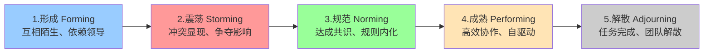
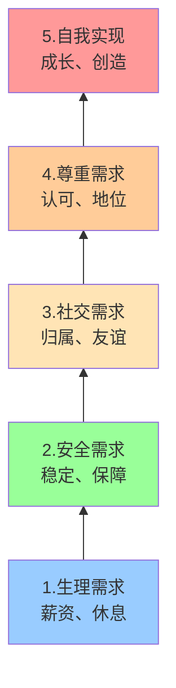
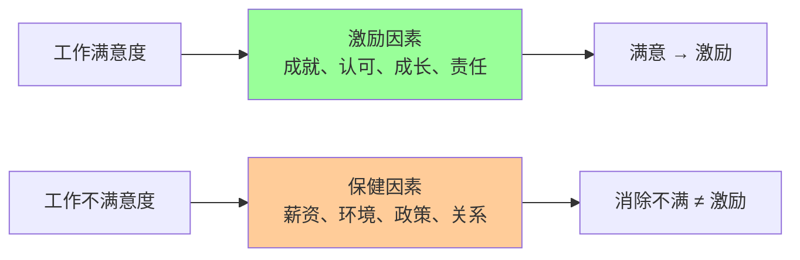
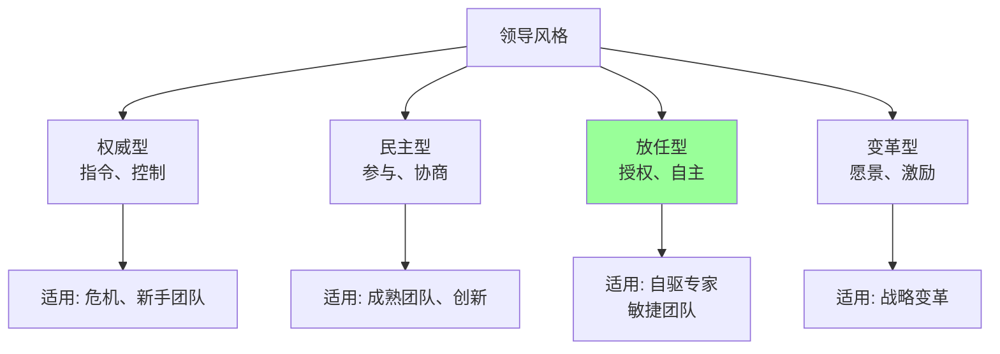

# 9.2 团队建设与激励

项目团队不是人员的简单集合，而是经过发展阶段形成的协作体。沟通管理（[[9.1 项目沟通管理]]）解决了信息传递，团队建设解决“人如何成为高效集体”。本节阐明塔克曼团队发展五阶段、激励理论（马斯洛/赫茨伯格/期望）、领导风格与团队绩效评估，为 [[9.3 冲突管理]] 与 [[10.1 敏捷宣言与Scrum框架]] 的自组织团队奠定基础。

## 团队发展阶段

> [!definition] 塔克曼模型
> 塔克曼（Tuckman）团队发展模型描述团队从组建到解散的五个阶段：**形成（Forming）→ 震荡（Storming）→ 规范（Norming）→ 成熟（Performing）→ 解散（Adjourning）**。每个阶段有不同特征与管理重点。

### 团队发展阶段图

### 各阶段特征与管理重点

| 阶段 | 特征 | 行为表现 | 项目经理角色 | 管理重点 |
| --- | --- | --- | --- | --- |
| 形成 Forming | 互相陌生、礼貌、依赖领导 | 试探、观望、不冲突 | 指导型 | 明确目标、规则、角色 |
| 震荡 Storming | 冲突显现、表达分歧 | 争论、抗拒、争夺影响力 | 教练型 | 化解冲突（[[9.3 冲突管理]]）、建立信任 |
| 规范 Norming | 达成共识、规则内化 | 协作、互相支持、有凝聚力 | 协调型 | 放权、强化规范 |
| 成熟 Performing | 高效协作、自驱动 | 主动承担、产出最大化 | 授权型 | 消除障碍、激励（敏捷自组织团队特征） |
| 解散 Adjourning | 任务完成、情绪波动 | 喜悦与失落、总结告别 | 总结型 | 表彰、知识转移、心理疏导 |

> [!note] 阶段的非线性
> > 团队发展并非严格线性：
> > - **新增成员**会回到震荡阶段（团队重组）；
> > - **外部压力**（如进度危机）可能让团队从成熟退回震荡；
> > - **领导更换**可能重新进入形成阶段；
> > - 敏捷团队的 Sprint 回顾（[[10.2 Sprint计划与执行]]）有助于持续保持在规范/成熟阶段。

> [!warning] 震荡阶段的必然性
> > 震荡阶段不可跳过——团队必须经历冲突才能建立真正的信任与规范。项目经理不应压制冲突，而应引导为建设性冲突（[[9.3 冲突管理]]）。试图跳过震荡的团队会在后期爆发更大问题。

## 激励理论

### 马斯洛需求层次理论

> [!definition] 马斯洛需求层次
> 马斯洛（Maslow）将人类需求分为五层，由低到高：**生理 → 安全 → 社交 → 尊重 → 自我实现**。低层次需求满足后，高层次需求才成为主导动机。

**在软件团队中的应用**：

| 需求层次 | 满足方式 |
| --- | --- |
| 生理 | 有竞争力的薪酬、合理工时 |
| 安全 | 稳定的合同、健康保障、清晰期望 |
| 社交 | 团建活动、归属感、师徒制 |
| 尊重 | 表彰、晋升、公开认可、责任赋予 |
| 自我实现 | 挑战性任务、技术成长、创新空间 |

### 赫茨伯格双因素理论

> [!definition] 双因素理论
> 赫茨伯格（Herzberg）将工作因素分为两类：
> - **保健因素**（Hygiene）：缺失会导致不满，满足只能消除不满但不产生激励。如薪资、工作环境、政策、人际关系、工作安全感。
> - **激励因素**（Motivator）：存在会产生满意与激励，缺失不会导致不满（只是没有满意）。如成就感、认可、工作本身、责任、成长与晋升。

> [!warning] 双因素理论的关键洞见
> > “消除不满”与“产生满意”是两回事。只给钱（保健因素）只能让员工“不抱怨”，无法激发积极性。要激励员工必须提供成就机会、认可与成长空间（激励因素）。这是为什么高薪团队仍可能低效——缺乏激励因素。

### 期望理论

> [!definition] 期望理论
> 弗鲁姆（Vroom）期望理论认为激励力取决于三个因素：
> - **期望值 E**（Expectancy）：努力能否达成绩效的概率（0–1）；
> - **工具性 I**（Instrumentality）：绩效能否带来回报的概率（0–1）；
> - **效价 V**（Valence）：回报对个人的价值（可正可负）。

> [!formula] 激励力公式
> $$M = E \times I \times V$$
>
> - M（Motivation）激励力；
> - E 期望值：努力→绩效；
> - I 工具性：绩效→回报；
> - V 效价：回报价值。
>
> 任一因素为 0，激励力即为 0。例如：员工认为再努力也做不到（E=0），或做到了也没回报（I=0），或回报对自己无意义（V=0），都不会被激励。

**管理启示**：
- 提升 E：培训、提供资源、设定可达目标；
- 提升 I：建立公平的绩效-回报机制，兑现承诺；
- 提升 V：了解员工需求，提供个性化回报。

### 三种激励理论对比

| 维度 | 马斯洛 | 赫茨伯格 | 期望理论 |
| --- | --- | --- | --- |
| 视角 | 需求层次 | 工作因素分类 | 认知过程 |
| 核心 | 需求由低到高 | 保健 vs 激励 | M = E × I × V |
| 应用 | 识别员工当前需求 | 同时满足保健与激励 | 提升期望、工具性、效价 |
| 局限 | 层次并非严格递进 | 因素分类有争议 | 难以量化 E/I/V |

## 领导风格

> [!definition] 领导风格
> 领导风格是领导者在影响团队时表现出的行为模式。常见分类有权威型、民主型、放任型、变革型四种。

### 四种领导风格

| 风格 | 决策方式 | 适用场景 | 局限 |
| --- | --- | --- | --- |
| 权威型 Autocratic | 领导决策、指令下达 | 紧急、危机、新手团队 | 压制创意、依赖领导 |
| 民主型 Democratic | 团队参与决策 | 成熟团队、需创新 | 决策慢、可能议而不决 |
| 放任型 Laissez-faire | 团队自主决策 | 高度自驱专家团队（敏捷） | 缺乏方向、易失控 |
| 变革型 Transformational | 愿景驱动、激励变革 | 战略转型、变革项目 | 依赖领导魅力 |

> [!note] 情境领导
> > 有效的领导者会根据团队成熟度与任务情境调整风格：
> > - **新手团队**：权威型（指导）；
> > - **成长团队**：民主型（参与）；
> > - **成熟团队**：放任型（授权，如敏捷自组织团队）；
> > - **变革项目**：变革型（愿景）。
> > 这与塔克曼阶段对应：形成期权威、震荡期民主、成熟期放任。

## 团队绩效评估

### 绩效评估维度

| 维度 | 指标 | 评估方式 |
| --- | --- | --- |
| 任务绩效 | 完成率、缺陷密度、生产率 | 量化指标（[[7.3 评审管理与质量度量]]、[[8.2 挣值分析（EVA）核心指标]]） |
| 协作绩效 | 沟通及时性、知识分享、互助 | 360 度评价 |
| 成长绩效 | 技能提升、学习曲线 | 技能矩阵 |
| 态度 | 主动性、责任感、敬业度 | 主管评价 + 同侪评价 |

### 绩效评估方法

| 方法 | 含义 | 适用 |
| --- | --- | --- |
| KPI | 关键绩效指标量化 | 任务绩效 |
| 360 度评估 | 上下级、同侪、自评多方评价 | 协作、态度 |
| OKR | 目标与关键结果（敏捷常用） | 成长、创新 |
| 强制分布 | 按比例分级（如 20/70/10） | 大型组织 |

> [!tip] 敏捷团队的绩效评估
> > 敏捷团队（[[10.1 敏捷宣言与Scrum框架]]）强调团队整体绩效而非个人排名，常用：
> > - **速度 Velocity**（[[10.3 敏捷估算与团队实践]]）：团队每 Sprint 完成故事点；
> > - **燃尽图**（[[10.2 Sprint计划与执行]]）：进度趋势；
> > - **Sprint 回顾**：团队自评与改进。
> > 避免个人 KPI 导致内耗，鼓励团队协作。

## 小结

团队发展经历形成、震荡、规范、成熟、解散五阶段，震荡阶段不可跳过。激励理论包括马斯洛需求层次（生理-安全-社交-尊重-自我实现）、赫茨伯格双因素（保健消除不满、激励产生满意）、期望理论（M = E × I × V）。领导风格分权威型、民主型、放任型、变革型，应根据团队成熟度情境选择。团队绩效评估涵盖任务、协作、成长、态度四维度，敏捷团队强调整体绩效。

## 关联

- 上一级：[[MOC - 第9章]]
- 上一节：[[9.1 项目沟通管理]]
- 下一节：[[9.3 冲突管理]]
- 关联概念：[[1.3 软件项目组织形式与参与角色]]（组织形式决定团队结构）；[[9.3 冲突管理]]（震荡阶段必然产生冲突）；[[10.1 敏捷宣言与Scrum框架]]（敏捷自组织团队是成熟阶段理想）；[[10.3 敏捷估算与团队实践]]（速度作为团队绩效指标）；[[5.1 风险识别与风险分类]]（人员风险）
