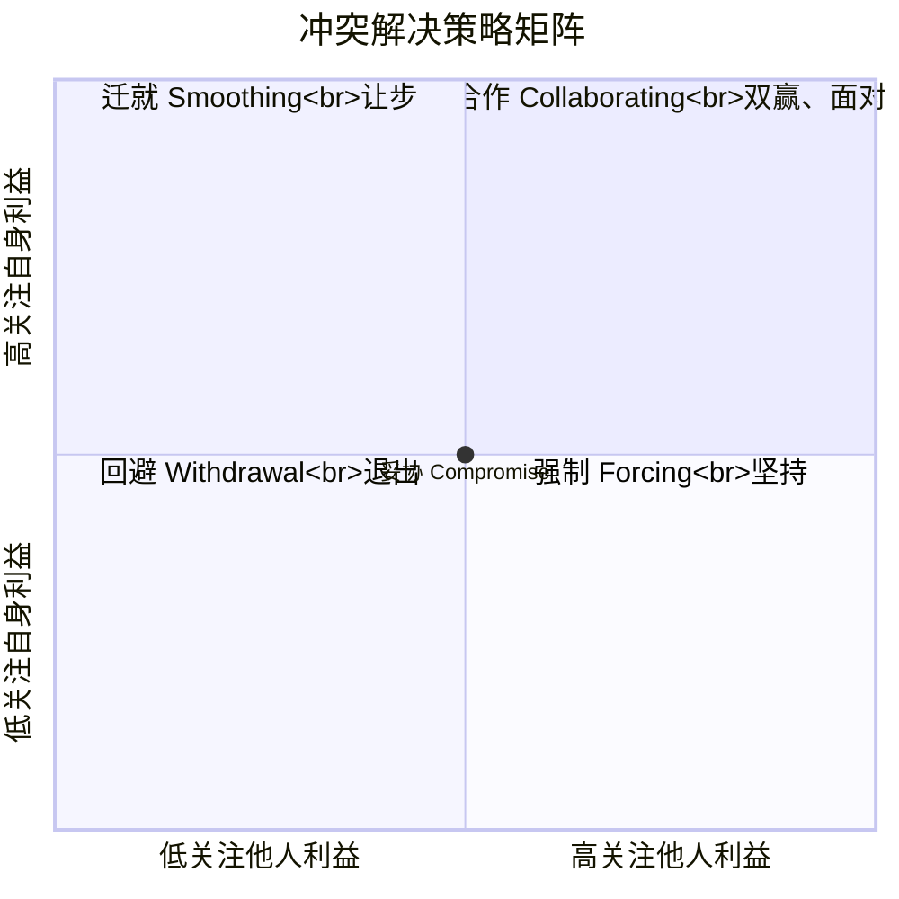
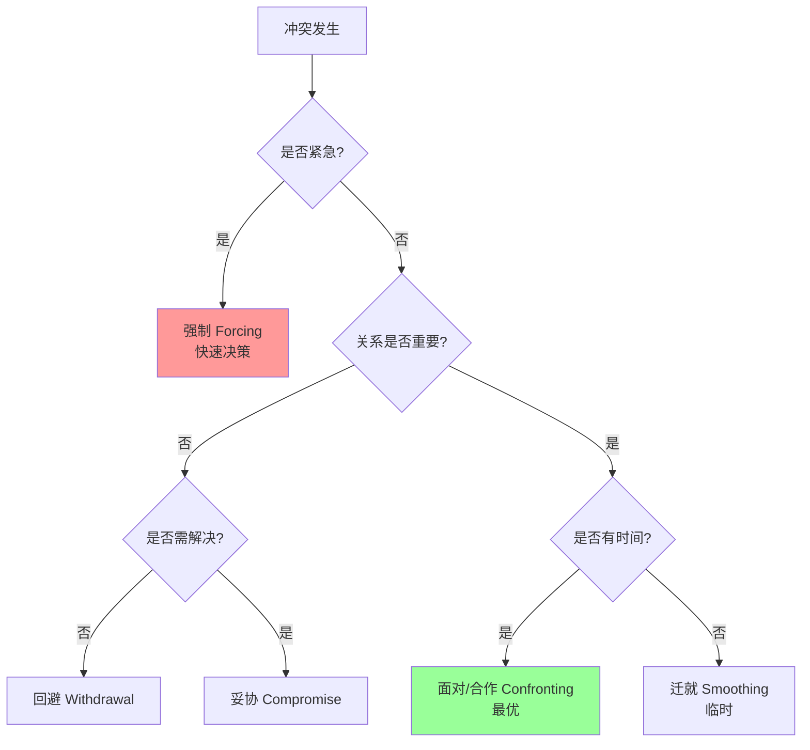
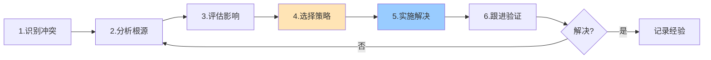
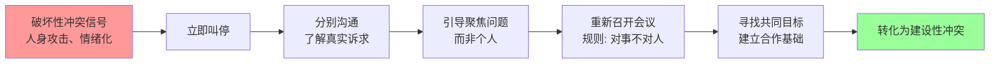

# 9.3 冲突管理

团队在震荡阶段（[[9.2 团队建设与激励]]）必然产生冲突。冲突并非都是坏事——建设性冲突能促进创新，破坏性冲突才损害团队。本节阐明冲突来源、冲突解决策略、冲突管理过程与建设性 vs 破坏性冲突的区分，是团队管理（[[9.2 团队建设与激励]]）与沟通管理（[[9.1 项目沟通管理]]）的工程应用。

## 冲突来源

> [!definition] 项目冲突
> 项目冲突是**两个或多个干系人在目标、利益、观点或行为上不一致的状态**。冲突本身中性，关键在于如何管理。

### 冲突来源七分类

PMBOK 将项目冲突来源归纳为七类，按发生频率排序：

| 排序 | 来源 | 含义 | 典型场景 |
| --- | --- | --- | --- |
| 1 | 进度 Schedule | 任务时间安排分歧 | “这个任务不可能 3 天完成” |
| 2 | 优先级 Priorities | 任务先后顺序分歧 | “先做 A 还是先做 B” |
| 3 | 人力 Human Resources | 人员分配争夺 | “我需要高级开发，但被分到别组” |
| 4 | 技术意见 Technical Opinions | 技术方案分歧 | “用微服务还是单体” |
| 5 | 行政流程 Administrative Procedures | 流程、汇报线分歧 | “审批流程太繁琐” |
| 6 | 成本 Cost | 预算分配分歧 | “测试预算被砍影响质量” |
| 7 | 个性 Personality | 个人性格、价值观冲突 | “他就是难合作” |

> [!note] 冲突来源的演变
> > 项目不同阶段的主要冲突源不同：
> > - **启动阶段**：优先级、流程；
> > - **计划阶段**：优先级、进度；
> > - **执行阶段**：进度、技术、人力；
> > - **收尾阶段**：进度、个性、成本。
> > 项目经理应预判各阶段冲突重点，提前规划应对。

## 冲突解决策略

> [!definition] 冲突解决策略
> 托马斯-基尔曼（Thomas-Kilmann）冲突模式将解决策略归纳为六种，按“关注自身利益”与“关注他人利益”两个维度区分。

### 冲突解决策略矩阵图

### 六种策略详解

| 策略 | 关注自身 | 关注他人 | 含义 | 适用 | 优缺点 |
| --- | --- | --- | --- | --- | --- |
| 回避 Withdrawal | 低 | 低 | 退出冲突，不处理 | 冲突微小、需冷静、无时间 | 问题未解决，可能恶化 |
| 迁就 Smoothing | 低 | 高 | 牺牲自己利益维持关系 | 关系比问题重要、自己错了 | 关系好但问题未解 |
| 强制 Forcing | 高 | 低 | 强制执行一方意见 | 紧急决策、原则问题 | 快但伤关系、败方抵触 |
| 妥协 Compromise | 中 | 中 | 双方各让一步 | 势均力敌、需快速解决 | 双方都不完全满意 |
| 合作 Collaborating | 高 | 高 | 共同寻找双赢方案 | 关系重要、需创新、时间充足 | 最优但耗时 |
| 面对 Confronting | 高 | 高 | 直接讨论问题根源 | 大多数情况 | 最优，与合作类似 |

> [!warning] 面对/合作是最优策略
> > 面对与合作的本质是**直接讨论问题根源，寻找双赢方案**，是 PMBOK 推荐的首选策略。其他策略多为权宜之计：
> > - 回避与迁就是不解决，只是推迟；
> > - 强制是零和博弈，败方会消极抵抗；
> > - 妥协是“双输”，双方都让步。
> > 只有面对/合作能根除冲突根源并维护关系。但需时间与信任，紧急情况可用强制。

### 策略选择决策图

## 冲突管理过程

### 冲突管理流程

### 冲突管理步骤

| 步骤 | 活动 | 关键点 |
| --- | --- | --- |
| 1. 识别冲突 | 察觉冲突信号（争论、消极、推诿） | 早发现早处理 |
| 2. 分析根源 | 5 Why、利益相关方分析 | 区分表象与根因 |
| 3. 评估影响 | 评估对进度、质量、团队的影响 | 量化影响优先级 |
| 4. 选择策略 | 根据紧急性、关系、时间选择 | 优先面对/合作 |
| 5. 实施解决 | 召开会议、调解、协商 | 中立、倾听、引导 |
| 6. 跟进验证 | 跟踪协议执行、效果评估 | 防止复发 |
| 7. 记录经验 | 纳入经验教训登记册 | 沉淀组织资产 |

> [!tip] 冲突调解技巧
> > - **中立立场**：项目经理应中立，不偏袒任何一方；
> > - **倾听双方**：让双方充分表达，理解各自立场与利益；
> > - **聚焦问题**：对人不对事，避免人身攻击；
> > - **寻找共同点**：从共识出发，逐步扩展；
> > - **共赢导向**：引导双方寻找双赢方案，而非零和博弈；
> > - **明确协议**：解决方案书面化，明确责任与时间。

## 建设性冲突 vs 破坏性冲突

> [!definition] 建设性冲突
> 建设性冲突是**以任务为导向、聚焦问题本身的冲突**，能促进创新、暴露风险、改进决策。表现为：讨论激烈但尊重、关注方案而非人身、最终达成更好决策。

> [!definition] 破坏性冲突
> 破坏性冲突是**以人际为导向、针对个人的冲突**，损害团队信任与协作。表现为：人身攻击、结党营私、情绪化对抗、最终两败俱伤。

### 建设性 vs 破坏性对比

| 维度 | 建设性冲突 | 破坏性冲突 |
| --- | --- | --- |
| 导向 | 任务、问题 | 人际、个人 |
| 表达 | 尊重、就事论事 | 攻击、就人论事 |
| 目标 | 寻求更优方案 | 证明自己对、压制对方 |
| 结果 | 创新、改进决策 | 信任破裂、协作瘫痪 |
| 情绪 | 适度紧张、积极 | 愤怒、敌对、消极 |
| 处理 | 鼓励、引导 | 及时制止、调解 |

### 冲突转化策略

> [!note] 敏捷团队与冲突
> > 敏捷团队（[[10.1 敏捷宣言与Scrum框架]]）鼓励建设性冲突：
> > - **Sprint 回顾**（[[10.2 Sprint计划与执行]]）是制度化冲突——团队反思问题、提出改进；
> > - **结对编程**引发技术意见冲突，促进知识共享；
> > - **自组织**让团队内部解决冲突，而非上报。
> > 但需警惕：自组织团队的冲突若未及时引导，可能从技术分歧演变为人际对立。

## 小结

项目冲突来源分七类：进度、优先级、人力、技术意见、行政流程、成本、个性，其中进度与优先级最常见。冲突解决六策略：回避、迁就、强制、妥协、合作、面对，其中面对/合作是最优策略，能根除冲突并维护关系。冲突管理过程包括识别、分析、评估、选择策略、实施、跟进六步。建设性冲突以任务为导向、促进创新，破坏性冲突以人际为导向、损害团队，项目经理应及时将破坏性冲突转化为建设性冲突。

## 关联

- 上一级：[[MOC - 第9章]]
- 上一节：[[9.2 团队建设与激励]]
- 关联概念：[[9.1 项目沟通管理]]（沟通失效引发冲突）；[[9.2 团队建设与激励]]（震荡阶段必然冲突）；[[5.3 风险应对策略与风险监控]]（冲突作为风险源）；[[10.1 敏捷宣言与Scrum框架]]（敏捷鼓励建设性冲突）；[[10.2 Sprint计划与执行]]（Sprint 回顾制度化冲突）
