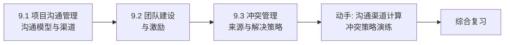

# MOC - 第9章 团队沟通、冲突管理

> [!info] 本章定位
> 第9章回答“项目靠人完成，如何组织人、沟通信息、化解冲突”。软件项目最大的风险源不是技术而是人（[[5.1 风险识别与风险分类]] 中的人员风险）。本章涵盖项目沟通管理（沟通模型与沟通渠道）、团队建设与激励（团队发展阶段与激励理论）、冲突管理（冲突来源与解决策略），与 [[1.3 软件项目组织形式与参与角色]] 的组织形式、[[7.1 软件质量保障体系]] 的过程协作、[[10.1 敏捷宣言与Scrum框架]] 的自组织团队共同构成“人”维度。

## 学习路线图

## 知识点导航

| 节 | 主题 | 核心要点 | 入口 |
| --- | --- | --- | --- |
| 9.1 | 项目沟通管理 | 沟通管理定义、沟通模型（编码-媒介-解码）、沟通方式、沟通渠道公式 N(N-1)/2、沟通管理计划 | [[9.1 项目沟通管理]] |
| 9.2 | 团队建设与激励 | 团队发展五阶段（形成-震荡-规范-成熟-解散）、激励理论（马斯洛/赫茨伯格/期望）、领导风格、绩效评估 | [[9.2 团队建设与激励]] |
| 9.3 | 冲突管理 | 冲突来源七类、解决策略六种（回避/迁就/强制/妥协/合作/面对）、建设性 vs 破坏性冲突 | [[9.3 冲突管理]] |

## 核心考点

> [!warning] 重点掌握
> 1. 沟通管理定义：确保项目信息及时、准确、完整地传递给相关干系人。
> 2. 沟通模型：发送者 → 编码 → 媒介 → 解码 → 接收者 → 反馈，存在噪声干扰。
> 3. 沟通渠道数量公式：$N(N-1)/2$，N 为参与人数。10 人项目有 45 条渠道。
> 4. 团队发展五阶段：形成（Forming）→ 震荡（Storming）→ 规范（Norming）→ 成熟（Performing）→ 解散（Adjourning），塔克曼模型。
> 5. 马斯洛需求层次：生理→安全→社交→尊重→自我实现（五层）。
> 6. 赫茨伯格双因素：保健因素（消除不满，如薪资、环境）vs 激励因素（产生满意，如成就、成长）。
> 7. 期望理论：激励力 = 期望值 × 工具性 × 效价（M = E × I × V）。
> 8. 领导风格四类：权威型、民主型、放任型、变革型。
> 9. 冲突来源七类：进度、优先级、人力、技术意见、行政流程、成本、个性。
> 10. 冲突解决六策略：回避、迁就、强制、妥协、合作、面对（面对/合作是最优）。
> 11. 建设性冲突（任务导向，促进改进）vs 破坏性冲突（人际导向，损害团队）。

## 自测题

> [!question] 题1
> 某 12 人项目团队，计算沟通渠道数量。若新增 3 人，渠道增加多少？
> > [!check]- 参考答案
> > 沟通渠道公式：$N(N-1)/2$
> > - 12 人时：$12 \times 11 / 2 = 66$ 条渠道
> > - 15 人时：$15 \times 14 / 2 = 105$ 条渠道
> > - 增加渠道：$105 - 66 = 39$ 条
> > **结论**：新增 3 人带来 39 条新渠道，沟通复杂度显著上升。这也是敏捷团队建议 7±2 人的原因（[[10.1 敏捷宣言与Scrum框架]]）。

> [!question] 题2
> 描述塔克曼团队发展五阶段及各阶段特征，并说明项目经理在每阶段的角色。
> > [!check]- 参考答案
> > | 阶段 | 特征 | 项目经理角色 |
> > | --- | --- | --- |
> > | 形成 Forming | 互相陌生、礼貌、依赖领导 | 指导、明确目标与规则 |
> > | 震荡 Storming | 冲突显现、表达分歧、争夺影响力 | 引导、化解冲突、建立信任 |
> > | 规范 Norming | 形成共识、规则内化、协作开始 | 协调、放权、强化规范 |
> > | 成熟 Performing | 高效协作、自驱动、产出最大化 | 授权、消除障碍、激励 |
> > | 解散 Adjourning | 任务完成、团队解散、情绪波动 | 总结、表彰、知识转移 |

> [!question] 题3
> 比较马斯洛需求层次与赫茨伯格双因素理论，并说明在软件团队中的应用。
> > [!check]- 参考答案
> > | 维度 | 马斯洛需求层次 | 赫茨伯格双因素 |
> > | --- | --- | --- |
> > | 理论 | 五层需求由低到高 | 保健因素 + 激励因素 |
> > | 层次 | 生理→安全→社交→尊重→自我实现 | 保健消除不满，激励产生满意 |
> > | 关系 | 需求逐层满足 | 两类因素独立作用 |
> > | 应用 | 提供有竞争力薪资（生理/安全）、团建（社交）、表彰（尊重）、挑战性任务（自我实现） | 保证薪资与环境（保健），给予成就机会与成长空间（激励） |
> > **关键区别**：马斯洛是“满足需求产生动力”，赫茨伯格是“消除不满 ≠ 产生满意”。只给钱（保健）不能激励，需有激励因素。

> [!question] 题4
> 列出冲突解决六种策略，并说明各自适用场景。
> > [!check]- 参考答案
> > | 策略 | 含义 | 适用场景 |
> > | --- | --- | --- |
> > | 回避 Withdrawal | 退出冲突，不处理 | 冲突微小、需冷静、无时间 |
> > | 迁就 Smoothing | 牺牲自己利益维持关系 | 关系比问题重要、自己错了 |
> > | 强制 Forcing | 强制执行一方意见 | 紧急决策、原则问题、无共识可能 |
> > | 妥协 Compromise | 双方各让一步 | 双方势均力敌、需快速解决 |
> > | 合作 Collaborating | 共同寻找双赢方案 | 关系重要、需创新方案、时间充足 |
> > | 面对 Confronting | 直接讨论问题根源 | 大多数情况的最优策略 |
> > **最优策略**：面对/合作，能解决根因且维护关系。回避与强制是次优或临时手段。

## 章节导航

- 上一级：[[MOC - 软件项目管理]]
- 上一章：[[MOC - 第8章]]
- 下一章：[[MOC - 第10章]]
