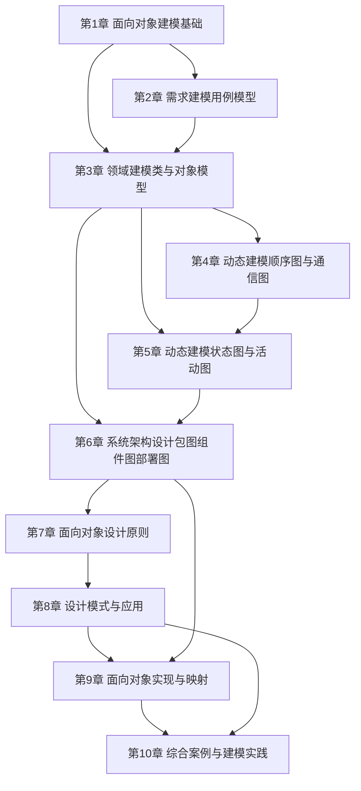

# MOC - 面向对象系统分析与建模

> [!info] 课程定位
> 面向对象系统分析与建模（Object-Oriented System Analysis and Modeling）是软件工程专业的一门核心方法论课程。它解决的核心问题是：**如何用统一的面向对象思想和 UML 这一可视化建模语言，把模糊的现实需求逐步转化为可落地、可验证、可维护的软件系统模型**。课程贯穿 OOA（面向对象分析）、OOD（面向对象设计）两个阶段，覆盖用例建模、领域建模、动态建模、架构设计与综合实践，是连接需求工程与编码实现的桥梁。

## 课程摘要

本课程围绕“**需求—静态—动态—架构—实践**”五条主线展开。学生需要掌握：

1. 面向对象建模的基本思想，及其与传统结构化方法的本质差异；
2. UML 2.5 的 14 种图分类与 4+1 视图模型，能针对不同建模目标选择合适图种；
3. 用例模型：参与者识别、用例抽取、用例描述与 include/extend/generalize 关系；
4. 领域模型：类图、对象图、属性与可见性、关联/聚合/组合等关系的精确表达；
5. 动态模型：顺序图、通信图、状态图、活动图对系统行为的多视角刻画；
6. 架构设计：包图、组件图、部署图与面向对象设计原则、设计模式的应用；
7. 综合运用建模工具完成从需求到设计的完整案例建模。

## 章节结构与依赖关系

> [!note] 依赖说明
> 第1章奠定面向对象与 UML 总览基础；第2–3章构成静态建模核心，第4–5章在其上展开动态行为建模；第6章把静态与动态模型组织为系统架构；第7–8章引入设计原则与模式指导设计决策；第9–10章完成从模型到实现与综合案例的闭环。

## 章节导航

| 章节 | 主题 | 阶段 | 入口 |
| --- | --- | --- | --- |
| 第1章 | 面向对象建模基础 | 基础建模 | [[MOC - 第1章]] |
| 第2章 | 需求建模：用例模型 | 基础建模 | [[MOC - 第2章]] |
| 第3章 | 领域建模：类与对象模型 | 基础建模 | [[MOC - 第3章]] |
| 第4章 | 动态建模：顺序图与通信图 | 动态建模 | [[MOC - 第4章]] |
| 第5章 | 动态建模：状态图与活动图 | 动态建模 | [[MOC - 第5章]] |
| 第6章 | 系统架构设计：包图、组件图与部署图 | 架构设计 | [[MOC - 第6章]] |
| 第7章 | 面向对象设计原则 | 架构设计 | [[MOC - 第7章]] |
| 第8章 | 设计模式与应用 | 架构设计 | [[MOC - 第8章]] |
| 第9章 | 面向对象实现与映射 | 综合实践 | [[MOC - 第9章]] |
| 第10章 | 综合案例与建模实践 | 综合实践 | [[MOC - 第10章]] |

## 分阶段学习目标

> [!example] 基础建模阶段（第1–3章）
> 建立面向对象建模的心智模型，理解 OOA/OOD/OOP 的关系，掌握 UML 总览与 4+1 视图。能独立完成用例模型（参与者、用例、关系、描述规约）与领域类模型（类图、属性、可见性、关联/聚合/组合），把需求转化为静态结构。

> [!example] 动态建模阶段（第4–5章）
> 掌握顺序图、通信图刻画对象交互，状态图刻画对象生命周期，活动图刻画业务流程与算法流程。能在静态类模型基础上补充动态行为，形成静态—动态闭环。

> [!example] 架构设计阶段（第6–8章）
> 掌握包图、组件图、部署图组织系统物理与逻辑架构，理解高内聚低耦合、SOLID 等面向对象设计原则，能识别并应用创建型、结构型、行为型设计模式优化设计。

> [!example] 综合实践阶段（第9–10章）
> 掌握 UML 模型向 Java 代码的映射与反向工程，能使用建模工具完成从需求获取、用例建模、领域建模、动态建模到架构设计的完整案例，形成可交付的建模文档。

## 先修与关联课程

- [[Java程序设计]]：提供 Java 语法、类与对象、继承与多态基础，是模型向代码映射的实现载体（第9章）。
- [[可视化程序设计]]：提供事件驱动、组件体系与界面建模经验，其 GUI 设计可对照用例驱动分析。
- [[面向对象程序设计]]：提供封装、继承、多态与设计模式的编码基础，是 OOD 阶段（第7–8章）的直接先修。
- 关联延伸：软件工程（工程化流程与需求工程）、[[数据结构]]（类之间的关系建模依赖数据结构知识）。

## UML 建模工具推荐

| 工具 | 类型 | 优势 | 适用场景 | 说明 |
| --- | --- | --- | --- | --- |
| StarUML | 桌面建模工具 | 界面友好、支持 UML 2.x 全图、可扩展插件 | 课程作业、中小型项目建模 | 跨平台，支持 Java/C++ 代码生成与反向工程 |
| draw.io (diagrams.net) | 在线/桌面绘图 | 免费、易上手、支持 UML 模板与多人协作 | 快速绘制用例图、类图、流程图 | 无严格模型校验，适合草图与文档配图 |
| PlantUML | 文本驱动建模 | 用文本描述生成图、可纳入版本控制 | DevOps 文档化、Git 友好的图源管理 | 需配合插件预览，适合程序员工作流 |
| Enterprise Architect | 企业级建模平台 | 支持完整建模生命周期、需求追踪、团队协作 | 大型项目、企业级架构设计 | 功能强大但学习成本高，超出课程基本要求 |

> [!tip] 课程选型建议
> 课程练习推荐 **StarUML** 作为主力建模工具（覆盖全部 UML 图且符合教学规范），**draw.io** 作为快速草图补充，**PlantUML** 供有编程基础的同学体验文本驱动建模。

## 复习与查询入口

- 概念速查：[[1.1 面向对象思想与传统结构化方法对比]]、[[1.2 系统分析、系统设计基本概念]]、[[1.3 UML概述、视图、图与建模工具]]
- 用例速查：[[2.1 用例图基本元素与绘制]]、[[2.2 用例描述与需求规约]]、[[2.3 用例关系与需求追踪]]
- 类图速查：[[3.1 类图与对象图]]、[[3.2 属性、操作与可见性]]、[[3.3 关联、聚合与组合关系详解]]
