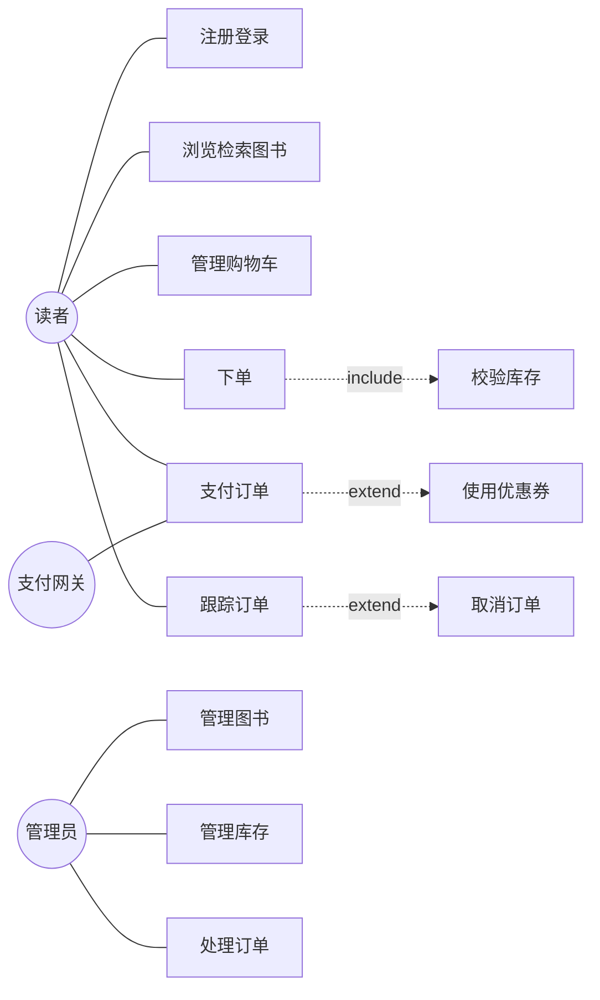
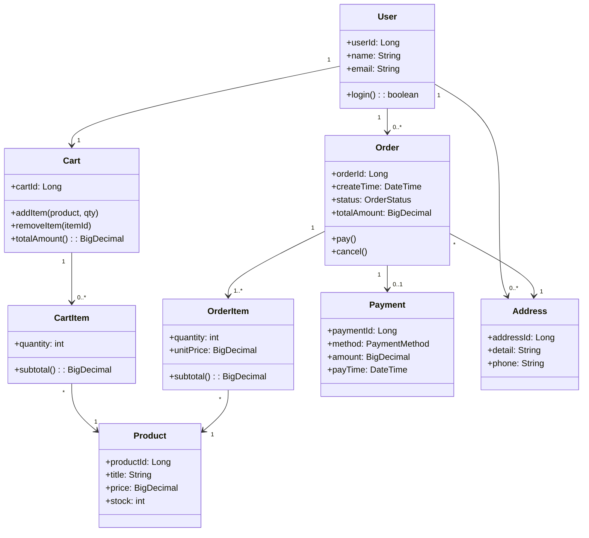
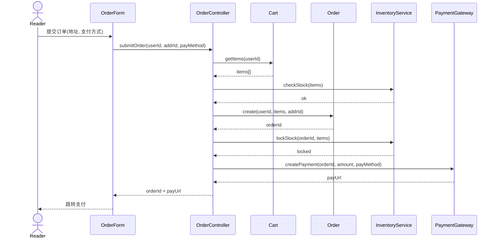
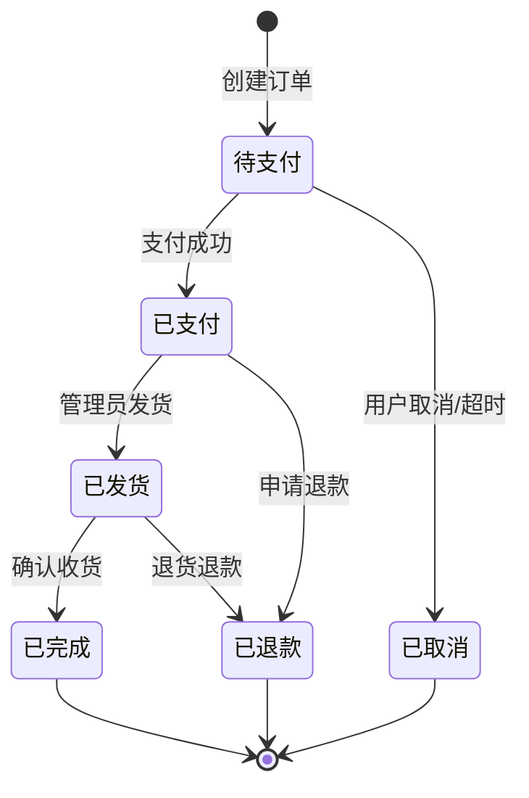
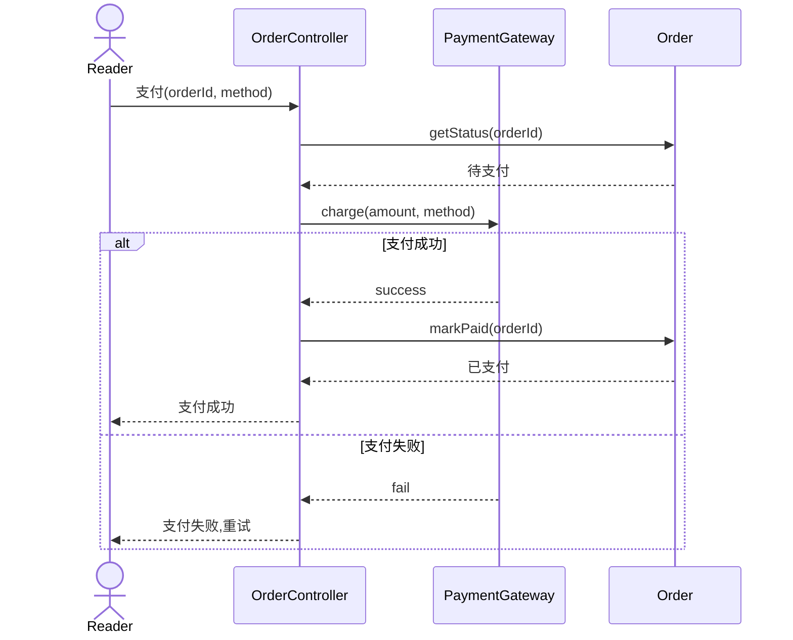
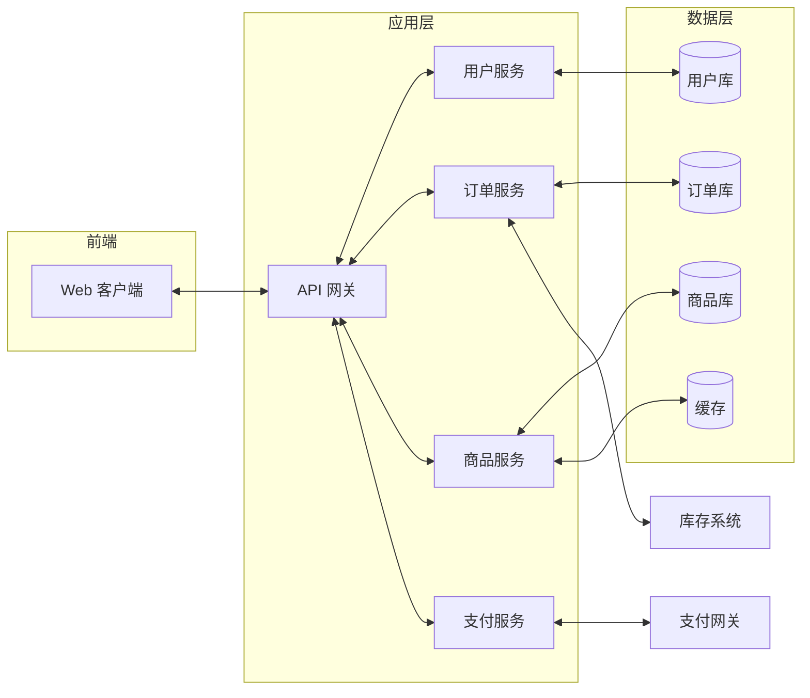
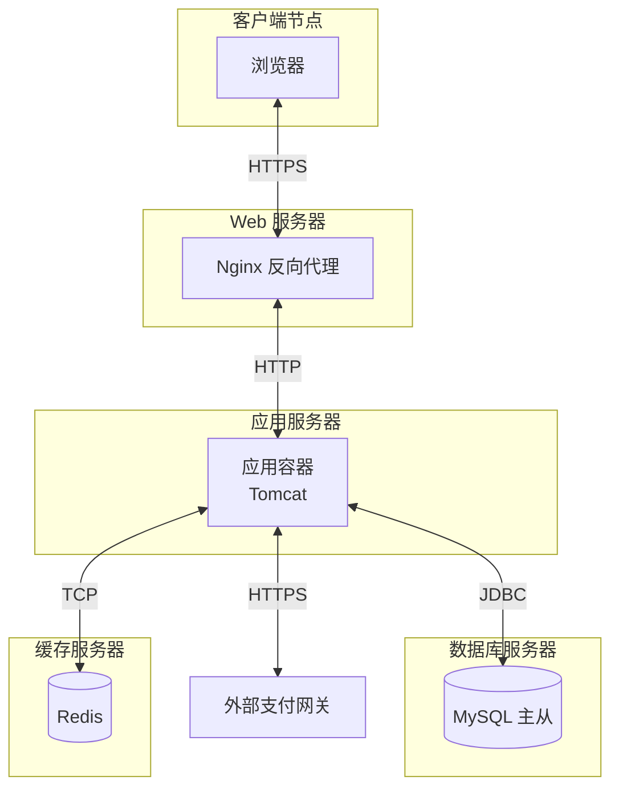

# 10.1 综合案例：在线书店系统建模

本节以“在线书店系统”为综合案例，演示从需求到部署的端到端建模过程。覆盖用例建模、领域建模、动态建模与架构建模四个层次，是前 9 章知识的综合应用。案例聚焦核心业务，省略次要细节以便理解主线。

## 系统需求概述

在线书店系统为读者提供图书浏览、检索、购物车、下单、支付、订单跟踪等功能，为管理员提供图书管理、订单管理、库存管理功能。

**功能性需求**：
- 读者注册/登录、浏览图书、按关键词/分类检索
- 购物车增删改、提交订单
- 在线支付（支持多种支付方式）
- 订单状态跟踪、取消/确认收货
- 管理员管理图书、库存、订单

**非功能性需求**：
- 性能：检索响应 ≤ 2s
- 可用性：7×24，可用率 ≥ 99.5%
- 安全：支付数据加密传输
- 可扩展：支持新增支付方式

## 用例建模

### 参与者识别

| 参与者 | 类型 | 职责 |
| --- | --- | --- |
| 读者 | 主要参与者 | 浏览、下单、支付、跟踪订单 |
| 管理员 | 主要参与者 | 管理图书、库存、订单 |
| 支付网关 | 次要参与者 | 处理在线支付 |
| 库存系统 | 次要参与者 | 同步库存（外部） |

### 用例图

> [!note] 用例关系说明
> - `下单` `«include»` `校验库存`：下单必经库存校验，复用性强；
> - `支付订单` `«extend»` `使用优惠券`：支付时可选使用优惠券，是条件扩展；
> - `跟踪订单` `«extend»` `取消订单`：在特定状态下可取消，是扩展点。

### 用例描述：下单

| 要素 | 内容 |
| --- | --- |
| 用例名 | 提交订单 |
| 参与者 | 读者（主） |
| 前置条件 | 读者已登录且购物车非空 |
| 后置条件 | 创建订单（待支付），库存锁定 |
| 主成功场景 | 1. 读者确认购物车商品 2. 选择收货地址 3. 选择支付方式 4. 系统校验库存 5. 系统创建订单并锁定库存 6. 系统返回订单号与支付链接 |
| 扩展 | 4a. 库存不足：提示并返回购物车；3a. 选择优惠券：计算优惠金额 |
| 业务规则 | 每单最多 50 件商品；下单后 30 分钟未支付自动取消 |

## 领域建模

### 概念类图

> [!tip] 类图要点
> - `User` 与 `Cart` 是 1:1，每个用户一个购物车；
> - `Order` 与 `OrderItem` 是 1:N，订单由多个订单项组成；
> - `Order` 与 `Payment` 是 1:0..1，订单可有零或一次支付（取消则无支付）；
> - `CartItem` 与 `Product` 是 N:1，购物车项引用商品；
> - 状态用枚举 `OrderStatus`、`PaymentMethod` 表示，避免字符串散乱。

## 动态建模

### 下单时序图

### 订单状态图

> [!note] 状态图说明
> 订单生命周期有 6 个状态：待支付、已支付、已发货、已完成、已取消、已退款。转换由事件触发，部分带守卫条件（如“待支付超时 30 分钟”触发自动取消）。状态机封装在 `Order` 实体中，行为随状态变化（状态模式，见 [[5.3 状态模式与代码实现]]）。

### 支付时序图（含异常）

## 架构建模

### 组件图

### 部署图

> [!example]- 架构图说明
> - **组件图**按业务能力拆分微服务，每服务独立数据库（Database-per-service）；
> - **部署图**展示物理节点：浏览器→Nginx 反向代理→应用容器→数据库与缓存；
> - 外部系统（支付网关、库存系统）通过 HTTPS 接入；
> - 缓存提升商品检索性能，主从数据库提升可用性。

## 完整建模图集索引

| 图类型 | 用途 | 节内位置 |
| --- | --- | --- |
| 用例图 | 需求范围与参与者交互 | 用例建模 |
| 概念类图 | 领域结构与关联 | 领域建模 |
| 时序图-下单 | 核心业务对象协作 | 动态建模 |
| 状态图-订单 | 订单生命周期 | 动态建模 |
| 时序图-支付 | 含异常分支的交互 | 动态建模 |
| 组件图 | 系统组件与依赖 | 架构建模 |
| 部署图 | 物理节点部署 | 架构建模 |

## 小结

本案例以在线书店为载体，完整演示了 OOA+OOD 的建模流程：需求概述划定范围 → 用例图识别参与者与用例 → 概念类图建立领域结构 → 时序图与状态图刻画动态行为 → 组件图与部署图表达架构。各图之间互相支撑、交叉验证，共同构成可被开发与评审的系统模型。案例中可看到 SOLID 原则（如 `OrderController` 单一职责）、设计模式（状态模式用于订单状态）与架构建模（微服务+部署）的综合应用。

## 关联

- 上一级：[[MOC - 第10章]]
- 下一节：[[10.2 综合案例：智能停车管理系统建模]]
- 用例建模：[[2.1 用例图基本元素与绘制]]、[[2.3 用例关系与需求追踪]]
- 类图：[[3.1 类图与对象图]]、[[3.3 关联、聚合与组合关系详解]]
- 时序图：[[4.1 时序图基本元素与绘制]]
- 状态图：[[5.1 状态机图基本元素]]、[[5.3 状态模式与代码实现]]
- 架构图：[[7.1 组件图与部署图]]
