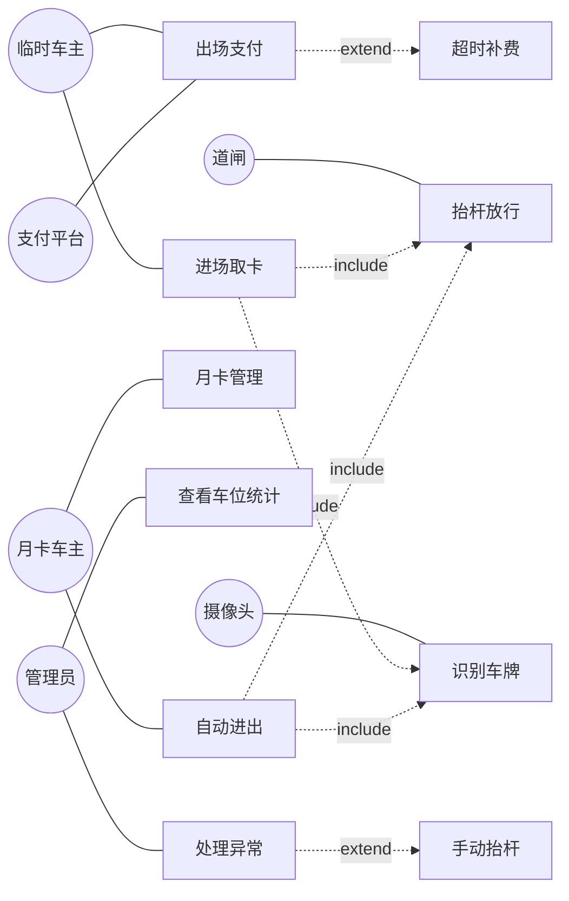
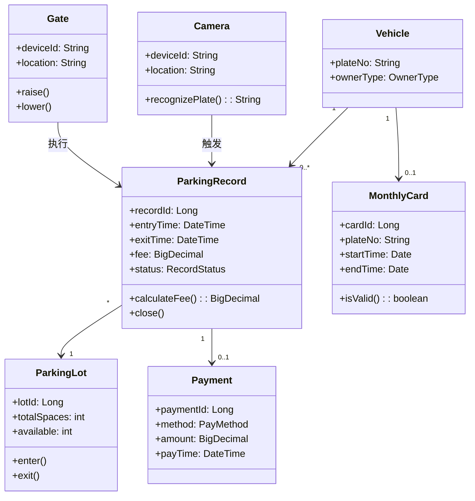
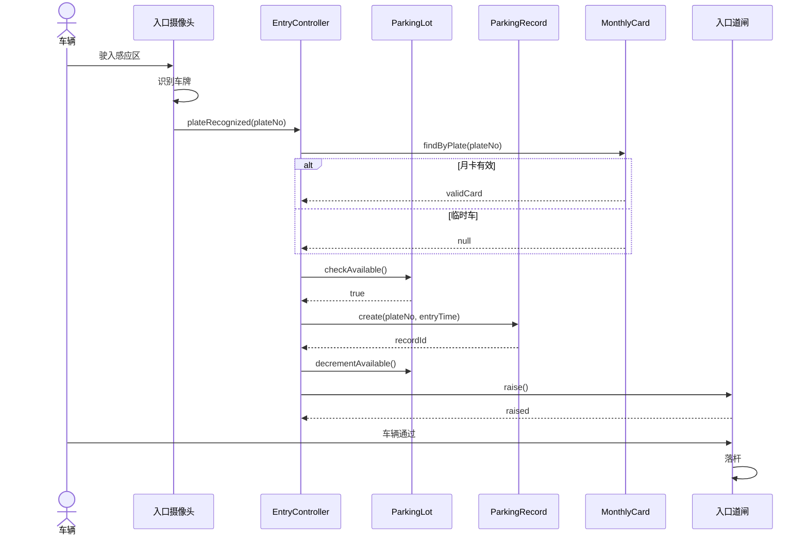
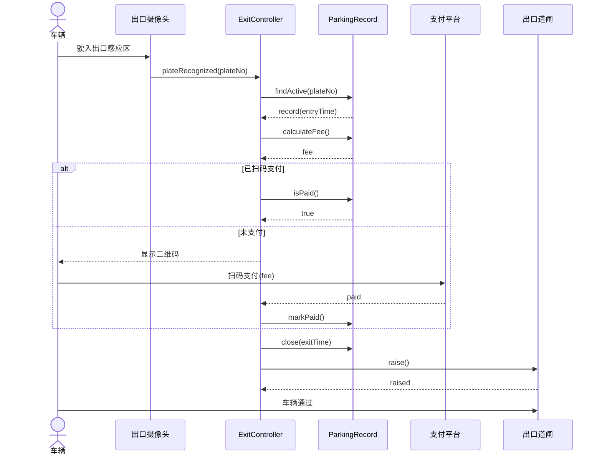
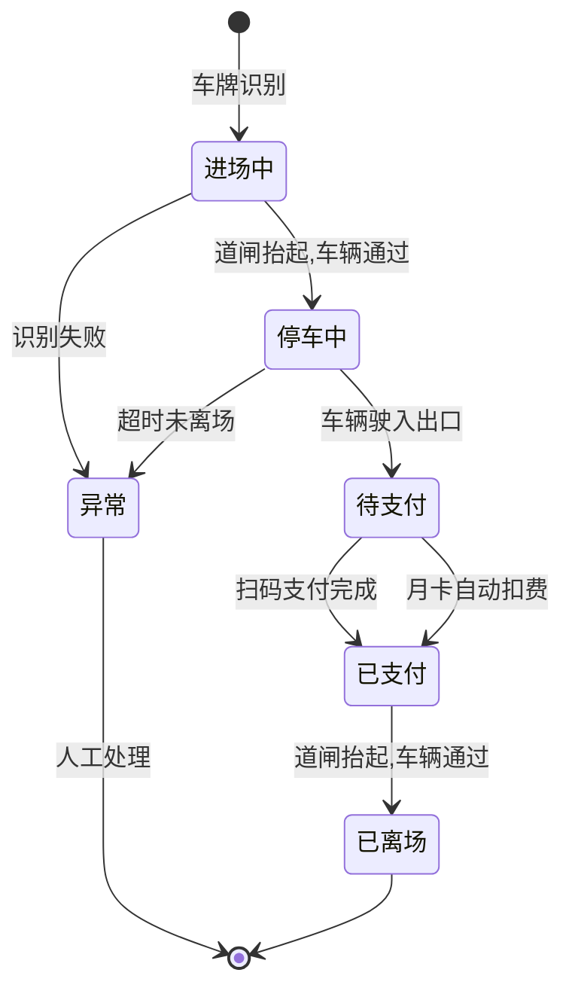
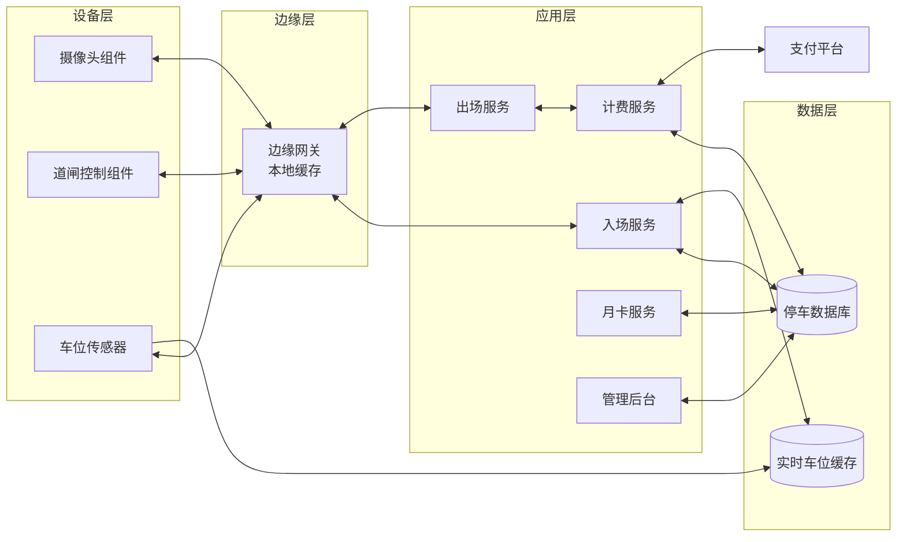
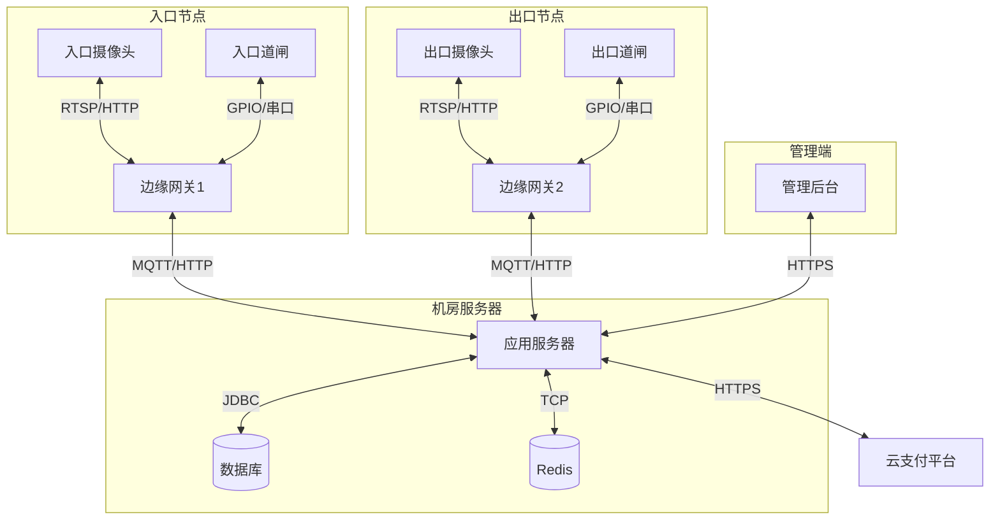

# 10.2 综合案例：智能停车管理系统建模

本节以“智能停车管理系统”为综合案例，演示物联网场景下的系统建模。与在线书店不同，本案例强调硬件设备（摄像头、道闸、传感器）与软件系统的交互、停车流程的实时性与状态机驱动。覆盖用例、领域、动态与架构建模，重点展示停车流程时序图与部署图。

## 系统需求概述

智能停车管理系统为停车场实现无人值守的车辆进出管理、车位调度、计费与支付。

**功能性需求**：
- 车辆进出场自动识别车牌、抬杆放行
- 实时车位计数与引导（剩余车位显示）
- 按时长计费，支持扫码支付、月卡扣费
- 月卡用户管理（开卡、续费、注销）
- 管理员查看车位占用、收费统计、异常告警

**非功能性需求**：
- 实时性：车牌识别到抬杆 ≤ 2s
- 可用性：7×24 运行，设备故障自动降级
- 可靠性：断网时本地缓存，恢复后同步
- 安全：车牌数据隐私保护

## 用例建模

### 参与者识别

| 参计者 | 类型 | 职责 |
| --- | --- | --- |
| 临时车主 | 主要参与者 | 进场取卡、出场扫码支付 |
| 月卡车主 | 主要参与者 | 自动进出、月卡扣费 |
| 管理员 | 主要参与者 | 管理月卡、查看统计、处理异常 |
| 摄像头设备 | 次要参与者 | 识别车牌、上报事件 |
| 道闸设备 | 次要参与者 | 执行抬杆/落杆 |
| 支付平台 | 次要参与者 | 处理扫码支付 |

### 用例图

### 用例描述：车辆进场

| 要素 | 内容 |
| --- | --- |
| 用例名 | 车辆进场 |
| 参与者 | 临时车主/月卡车主（主）、摄像头、道闸（次） |
| 前置条件 | 停车场有空位 |
| 后置条件 | 创建停车记录，车位数 -1，道闸抬起 |
| 主成功场景 | 1. 车辆驶入入口 2. 摄像头识别车牌 3. 系统查询车牌（月卡？） 4. 系统创建停车记录 5. 系统更新剩余车位 6. 系统指令道闸抬杆 7. 车辆通过，道闸落杆 |
| 扩展 | 3a. 月卡有效：直接放行；3b. 无空位：提示已满不放行；2a. 识别失败：人工录入 |

## 领域建模

### 概念类图

> [!note] 类图设计要点
> - `ParkingRecord` 是核心实体，记录进出时间与费用，状态机驱动其生命周期；
> - `Vehicle` 与 `MonthlyCard` 是 1:0..1，临时车无月卡；
> - `Camera` 与 `Gate` 作为设备类，与 `ParkingRecord` 关联但不是实体（无业务生命周期），属边界/设备抽象；
> - 费用计算封装在 `ParkingRecord.calculateFee()`，避免贫血模型。

## 动态建模

### 车辆进场时序图

### 车辆出场时序图

### 停车记录状态图

> [!tip] 状态机驱动设计
> 停车记录是典型的状态机驱动对象：进场中→停车中→待支付→已支付→已离场，每步触发不同行为（计费、抬杆、关闭记录）。用状态模式（见 [[5.3 状态模式与代码实现]]）把每个状态封装为类，状态转换与行为解耦，便于扩展（如新增“VIP 通道”状态）。

## 架构建模

### 组件图

### 部署图

> [!example]- 部署图说明
> - **入口/出口节点**部署摄像头、道闸与边缘网关，边缘网关负责设备协议转换与断网缓存；
> - **机房服务器**部署应用、数据库与缓存，应用通过 MQTT/HTTP 与边缘网关通信；
> - **管理端**通过 HTTPS 访问应用，远程监控与统计；
> - 边缘网关断网时本地缓存进出记录，网络恢复后同步到中心库，保证可靠性。

## 完整建模图集索引

| 图类型 | 用途 | 节内位置 |
| --- | --- | --- |
| 用例图 | 需求范围与设备参与者 | 用例建模 |
| 概念类图 | 领域结构与设备抽象 | 领域建模 |
| 时序图-进场 | 入场流程对象协作 | 动态建模 |
| 时序图-出场 | 出场支付流程 | 动态建模 |
| 状态图-停车记录 | 记录生命周期 | 动态建模 |
| 组件图 | 设备/边缘/应用分层 | 架构建模 |
| 部署图 | 物理节点与协议 | 架构建模 |

## 小结

智能停车管理案例展示了物联网场景建模特点：参与者包含硬件设备（摄像头、道闸、传感器），用例需刻画设备事件触发；领域模型中设备类与业务实体类并存；动态模型强调实时性与状态机驱动（停车记录从进场到离场的状态流转）；架构采用“边缘-应用-数据”三层，边缘网关解决断网可靠性与协议异构。与在线书店对比，本案例更强调实时性、设备交互与可靠性，部署图需标注通信协议（RTSP/MQTT/串口）。

## 关联

- 上一级：[[MOC - 第10章]]
- 上一节：[[10.1 综合案例：在线书店系统建模]]
- 下一节：[[10.3 建模评审与质量保证]]
- 用例建模：[[2.1 用例图基本元素与绘制]]
- 时序图：[[4.1 时序图基本元素与绘制]]
- 状态图：[[5.2 状态建模方法与实践]]、[[5.3 状态模式与代码实现]]
- 部署图：[[7.1 组件图与部署图]]
