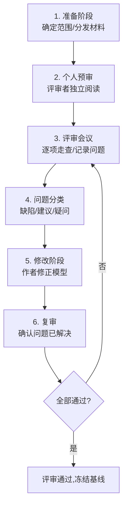
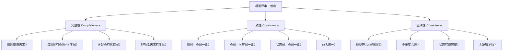
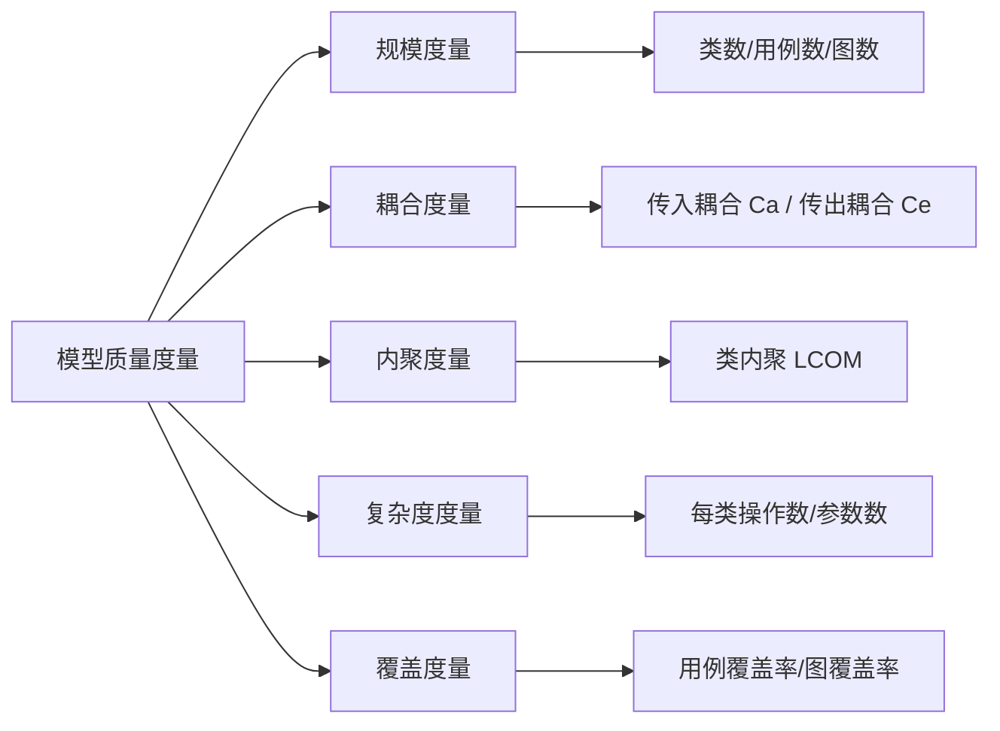
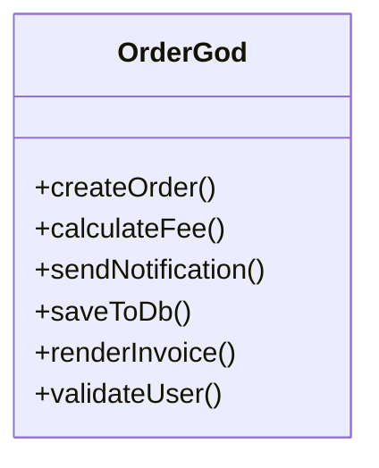
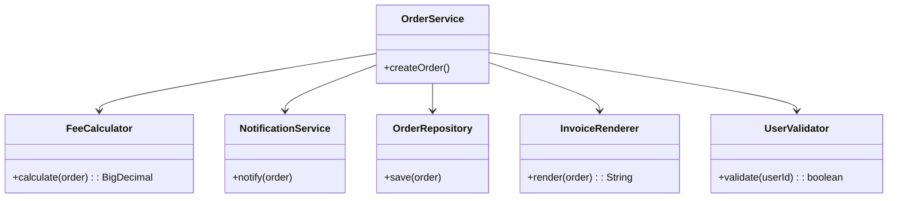
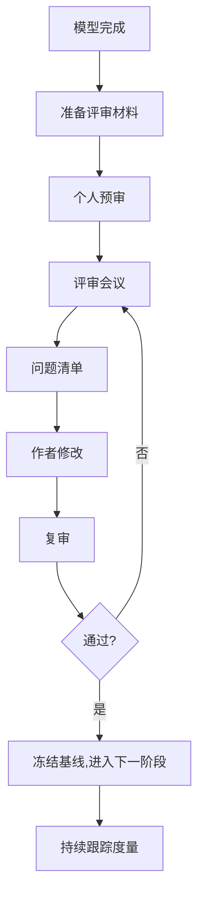

# 10.3 建模评审与质量保证

建模不是“画完图就结束”，模型必须经过评审才能保证质量。本节回答：建模评审的目的与流程是什么、评审检查清单包含哪些维度、UML 模型质量如何度量、常见建模错误如何改进。规范的评审是模型从“草稿”走向“可用”的关键环节。

## 建模评审目的与流程

> [!definition] 建模评审
> 建模评审（Model Review）是由分析者、设计者、领域专家与用户共同对 UML 模型进行结构化检查的过程，目标是发现模型的完整性、一致性、正确性与可维护性问题，在编码前消除缺陷。

### 评审目的

1. **发现遗漏**：识别未覆盖的用例、未定义的类、未画交互的场景；
2. **消除矛盾**：解决不同图之间、图与文档之间的不一致；
3. **验证正确性**：确认模型准确反映需求与业务规则；
4. **评估质量**：度量耦合度、内聚度、复杂度，识别设计坏味道；
5. **促进共识**：让团队对模型有共同理解，降低后续沟通成本。

### 评审流程



| 阶段 | 参与者 | 产出 |
| --- | --- | --- |
| 准备 | 评审组长 | 评审计划、材料分发 |
| 预审 | 评审者 | 预审意见清单 |
| 会议 | 全体 | 问题记录表 |
| 修改 | 模型作者 | 修改后的模型 |
| 复审 | 评审组长 | 复审结论 |

> [!tip] 评审的有效做法
> - **提前分发材料**：会议前给评审者足够时间预审，避免现场临时翻看；
> - **聚焦问题而非风格**：评审查缺陷，不争论命名偏好；
> - **限定会议时长**：每次 1-2 小时，过长效率下降；
> - **问题分级**：缺陷（必须改）、建议（可改）、疑问（待讨论）；
> - **闭环跟踪**：每个问题有负责人与截止日期，复审确认。

## 评审检查清单

评审从三个核心维度检查模型：**完整性、一致性、正确性**。



### 完整性检查清单

| 检查项 | 说明 |
| --- | --- |
| 用例覆盖 | 需求规约中的每条功能性需求都有对应用例 |
| 图覆盖 | 每个用例至少有概念类图与时序图支撑 |
| 状态覆盖 | 有复杂生命周期的类（订单、记录）有状态图 |
| 参与者覆盖 | 识别的参与者都出现在至少一个用例中 |
| 非功能体现 | 性能、安全、可用性在架构与接口中有体现 |
| 异常路径 | 用例扩展与异常分支在时序图中有表达 |

### 一致性检查清单

| 检查项 | 说明 |
| --- | --- |
| 用例↔类图 | 每个用例有对应控制类，用例实体都在类图 |
| 类图↔时序图 | 时序图消息对应类操作，时序图对象都是类图的类 |
| 状态图↔类图 | 状态转换触发事件对应类操作 |
| 命名统一 | 同一概念在所有图中名字一致 |
| 多重度一致 | 类图关联端多重度与业务规则吻合 |
| 接口一致 | 组件图接口与类图接口定义匹配 |

### 正确性检查清单

| 检查项 | 说明 |
| --- | --- |
| 业务规则 | 模型符合领域业务规则（如借阅上限、计费规则） |
| 多重度合理 | 关联端多重度符合现实（如订单 1:1..N 订单项） |
| 状态完整 | 状态机覆盖所有可能状态与转换，无死状态 |
| 逻辑无矛盾 | 图中无相互冲突的约束或行为 |
| 边界合理 | 系统边界划分符合需求，外部参与者正确 |

## UML 模型质量度量

除了人工评审，还可用度量指标量化模型质量。



| 度量 | 含义 | 健康区间 |
| --- | --- | --- |
| 类数（NC） | 模型中类的总数 | 与系统规模匹配 |
| 用例数（NUC） | 用例总数 | 覆盖所有功能需求 |
| 传入耦合（Ca） | 被其他类依赖的次数 | 适中，过高表示核心类过载 |
| 传出耦合（Ce） | 依赖其他类的次数 | 越低越好，高耦合难维护 |
| 类内聚度（LCOM） | 类内属性与方法的内聚程度 | 越低越好（高内聚） |
| 每类操作数（NOM） | 单个类的操作数量 | < 20 为宜，过高疑上帝类 |
| 用例覆盖率 | 已建模用例 / 需求用例 | 100% |
| 状态覆盖率 | 已画状态图的复杂类 / 应画类 | 100% |

> [!note] 度量的使用原则
> 度量是辅助手段，不能替代人工判断。指标异常（如某类 NOM=50、Ce=15）是“坏味道”信号，需人工核查是否上帝类或过度耦合。度量应持续跟踪，对比版本演化趋势，而非单次绝对值。

## 常见建模错误与改进

| 错误类型 | 症状 | 改进方向 |
| --- | --- | --- |
| 上帝类 | 单个类操作数多、依赖广 | 按 SRP 拆分，行为下放到实体 |
| 贫血模型 | 实体类只有属性无操作 | 把业务行为从控制类移回实体 |
| 过度设计 | 简单场景滥用模式 | 移除不必要的抽象层，遵循 KISS |
| 缺少动态模型 | 只有类图无时序图/状态图 | 为关键用例补时序图，复杂类补状态图 |
| 用例过细 | 把一个操作当一个用例 | 合并为有价值的业务用例 |
| 关联泛滥 | 类间关联过多过密 | 引入中间类或聚合，降低耦合 |
| 命名混乱 | 同一概念多个名字 | 建立术语表，统一命名 |
| 状态机不全 | 状态缺转换或死状态 | 补全转换，确保每个状态可达可终 |

### 反例：上帝类与改进





> [!example]- 改进说明
> 左侧 `OrderGod` 承担 5 项职责，违反 SRP。改进后按职责拆分为 `OrderService`（协调）+ `FeeCalculator`（计费）+ `NotificationService`（通知）+ `OrderRepository`（持久化）+ `InvoiceRenderer`（发票）+ `UserValidator`（校验）。每个类单一职责，可独立测试与替换，符合 SOLID。

## 评审报告模板

```markdown
# 建模评审报告

## 基本信息
- 项目：在线书店系统
- 评审日期：2026-07-31
- 评审组长：XXX
- 评审者：XXX、XXX
- 模型版本：v1.0

## 评审范围
- 用例图、概念类图、关键时序图、订单状态图、组件图、部署图

## 评审结论
- [ ] 通过  [x] 有条件通过  [ ] 不通过
- 主要问题：3 项缺陷，2 项建议

## 问题清单

| 编号 | 类型 | 维度 | 问题描述 | 位置 | 负责人 | 截止 | 状态 |
| --- | --- | --- | --- | --- | --- | --- | --- |
| 1 | 缺陷 | 一致性 | 时序图调用 Cart.clear() 但类图无此操作 | 下单时序图 | 张三 | 08-02 | 待修改 |
| 2 | 缺陷 | 完整性 | 订单状态图缺"已退款"状态 | 订单状态图 | 李四 | 08-02 | 待修改 |
| 3 | 缺陷 | 正确性 | Order与Payment应为1:0..1，图中标1:1 | 概念类图 | 王五 | 08-03 | 待修改 |
| 4 | 建议 | 质量 | OrderController 操作数达 12，建议拆分 | 类图 | 张三 | 08-05 | 待讨论 |
| 5 | 建议 | 命名 | User 与 Account 指同一概念，建议统一 | 全局 | 李四 | 08-05 | 待讨论 |

## 度量摘要
- 类数：18  用例数：9  时序图：3  状态图：1
- 最高 NOM：OrderController = 12（建议拆分）
- 用例覆盖率：100%  状态覆盖率：80%（缺 1 个复杂类状态图）

## 复审记录
- 复审日期：____
- 复审结论：____
```

## 评审流程总览图



## 小结

建模评审通过完整性、一致性、正确性三维度检查模型质量，配合规模、耦合、内聚、复杂度、覆盖五类度量量化评估。常见错误包括上帝类、贫血模型、过度设计、缺少动态模型等，需通过 SRP 拆分、行为回归实体、补全动态图等方式改进。评审应遵循“准备-预审-会议-修改-复审”闭环流程，输出结构化问题清单与评审报告，确保每个问题闭环跟踪。评审通过后冻结模型基线，作为后续设计与编码的依据。

## 关联

- 上一级：[[MOC - 第10章]]
- 上一节：[[10.2 综合案例：智能停车管理系统建模]]
- 评审对象：[[10.1 综合案例：在线书店系统建模]]、[[10.2 综合案例：智能停车管理系统建模]]
- 设计原则：[[9.1 面向对象设计原则SOLID]]
- 一致性检查：[[8.3 OOA文档与建模规范]]
