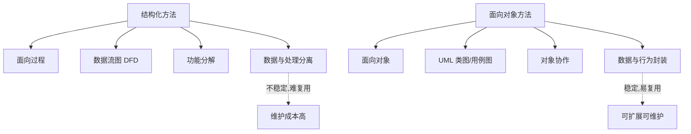

# 1.1 面向对象思想与传统结构化方法对比

软件建模方法决定了我门“如何看待系统”。传统结构化方法以过程为中心，把系统分解为一组函数；面向对象方法以对象为中心，把系统分解为一组协作的对象。理解两者差异，是选择合适建模策略、读懂 UML 表达意图的前提。

## 结构化分析方法

> [!definition] 结构化分析（Structured Analysis, SA）
> 结构化分析方法是一种**面向过程**的需求分析方法，核心是用数据流图（DFD）描述数据在系统中的流动与加工，用数据字典（DD）定义数据项，通过功能分解（Functional Decomposition）把系统层层拆分为子功能。

结构化方法的代表产物与工具：

- **数据流图（DFD）**：用外部实体、加工、数据流、数据存储四要素描述系统功能流；
- **数据字典（DD）**：对 DFD 中所有数据项的精确定义；
- **实体关系图（ER 图）**：描述数据存储的结构；
- **过程规格说明**：描述每个加工的算法（如伪代码、判定表）。

其建模思路是“自顶向下、逐步求精”的功能分解：系统 → 子系统 → 模块 → 过程。

> [!note] 结构化方法的局限
> 数据与处理分离，导致一处数据结构变动需修改多处函数；功能与数据结构的耦合使系统难以应对需求变化，复用性差，维护成本随规模上升而急剧增加。

## 面向对象方法

> [!definition] 面向对象方法（Object-Oriented Method）
> 面向对象方法以“对象”为基本建模单元，把描述事物状态的数据（属性）与改变状态的行为（操作）封装在一起，通过对象间的消息传递协作完成系统功能。其建立在三大特性之上：封装、继承、多态。

面向对象三大特性：

- **封装（Encapsulation）**：将属性与操作捆绑为对象，对外隐藏内部实现细节，仅通过公开接口交互，降低耦合。
- **继承（Inheritance）**：子类自动获得父类的属性与操作，并可在其上扩展或重写，实现复用与层次建模。
- **多态（Polymorphism）**：同一消息可被不同类型的对象以各自方式响应（运行时动态绑定），提升扩展性与可替换性。

> [!concept] 面向对象建模的核心思想
> 识别问题域中的“对象”→ 抽象出“类”→ 建立类之间的关系 → 通过对象协作描述行为。建模过程与现实世界认知一致，称为“问题域到解空间的自然映射”。

## 两种方法对比

| 维度 | 结构化方法 | 面向对象方法 |
| --- | --- | --- |
| 思维方式 | 面向过程，以函数为中心 | 面向对象，以对象为中心 |
| 建模角度 | 数据流 + 功能分解 | 对象 + 类 + 关系 + 协作 |
| 数据与处理 | 分离（数据流在被加工） | 封装在一起（对象拥有数据与行为） |
| 复用单位 | 函数/过程 | 类、组件、设计模式 |
| 需求变化适应性 | 弱（牵一发动全身） | 强（封装隔离变化、多态扩展开放） |
| 建模产物 | DFD、DD、结构图 | 用例图、类图、顺序图等 UML 图 |
| 适用场景 | 小型、过程稳定、批处理系统 | 中大型、需求易变、交互密集型系统 |
| 与现实世界映射 | 间接（需抽象为过程） | 直接（对象对应现实实体） |

## 面向对象建模优势

1. **认知自然性**：对象直接对应现实实体，分析与设计的概念一致，降低沟通成本；
2. **稳定性**：现实问题域中的对象比功能更稳定，需求变化往往只影响少数对象；
3. **可复用性**：类、继承与多态支持代码与设计复用，设计模式进一步沉淀经验；
4. **可扩展性**：封装隔离变化，多态允许新增子类而不修改原有代码（开闭原则）；
5. **可维护性**：高内聚低耦合的对象结构更易理解、测试与演化；
6. **建模与实现一致**：从 OOA 到 OOD 再到 OOP 始终围绕对象，模型可直接映射为代码（详见 [[1.2 系统分析、系统设计基本概念]]）。

> [!tip] 不要绝对化
> 面向对象并非“银弹”。对于算法密集、流程固定或性能极致的场合（如编译器后端、嵌入式实时控制），结构化或函数式方法可能更合适。建模方法应依据问题特征选择，而非一刀切。

## 小结

结构化方法以过程为中心，适合功能稳定的小型系统；面向对象方法以对象为中心，通过封装、继承、多态实现与现实世界的自然映射，在应对变化、复用与维护方面优势显著。UML 正是面向对象建模的标准化表达工具，后续章节将围绕它展开。

## 关联

- 上一级：[[MOC - 第1章]]
- 下一节：[[1.2 系统分析、系统设计基本概念]]
- 关联课程：[[面向对象程序设计]]、[[Java程序设计]]
