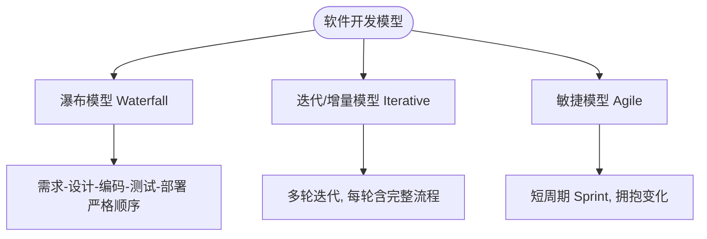
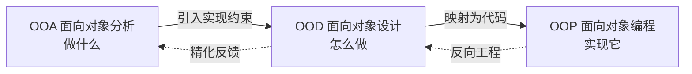

# 1.2 系统分析、系统设计基本概念

建模发生在软件开发的“分析”与“设计”阶段。理解系统分析与系统设计的边界、它们在软件生命周期中的位置，以及面向对象方法如何贯穿分析、设计与编程，才能知道每种 UML 图“为什么在这个阶段画、解决什么问题”。

## 系统分析

> [!definition] 系统分析（System Analysis）
> 系统分析是软件开发中“**弄清系统应该做什么**”的阶段。它在问题域中获取需求、理解业务、识别对象与用例，产出独立于实现技术的需求模型。

系统分析的核心任务：

1. **需求获取**：通过访谈、问卷、观察、文档分析等手段收集用户需求；
2. **需求分析与建模**：把原始需求整理为结构化模型，识别参与者、用例与领域概念；
3. **问题域理解**：明确系统边界、业务规则与约束；
4. **需求规约**：形成《需求规格说明书》及用例模型、领域概念模型。

面向对象分析（OOA）的主要产物是用例图与领域类图（概念模型），强调“做什么”，不涉及具体技术实现。

## 系统设计

> [!definition] 系统设计（System Design）
> 系统设计是软件开发中“**弄清系统怎么做**”的阶段。它在分析模型基础上引入实现约束，进行架构设计与详细设计，产出可指导编码的设计模型。

系统设计分为两个层次：

- **架构设计（总体设计）**：确定系统分层、模块划分、技术选型、组件与部署拓扑，主要产物为包图、组件图、部署图；
- **详细设计**：把分析阶段的类细化为设计类，补充属性类型、方法签名、设计模式与数据结构，主要产物为设计类图、顺序图、状态图。

面向对象设计（OOD）在 OOA 模型上叠加“如何实现”的决策，引入接口、设计类、关系细化与架构组织。

## 软件开发生命周期

软件开发生命周期（Software Development Life Cycle, SDLC）描述软件从构思到退役的整个过程。常见模型：

| 模型 | 特点 | 优点 | 缺点 | 适用场景 |
| --- | --- | --- | --- | --- |
| 瀑布模型 | 阶段顺序推进，文档驱动 | 流程清晰，里程碑明确 | 难以应对需求变化，风险后置 | 需求稳定、技术成熟的项目 |
| 迭代/增量模型 | 分多轮迭代，每轮产出可用增量 | 早期暴露风险，逐步完善 | 需要良好的迭代规划与管理 | 中大型、需求不完全明确的项目 |
| 敏捷模型 | 短周期 Sprint，持续交付，拥抱变化 | 响应变化快，用户反馈及时 | 文档相对薄弱，对团队自组织要求高 | 需求多变、小型高效团队 |

> [!note] 建模与生命周期
> 面向对象建模不绑定特定 SDLC。在瀑布中，分析与设计是两个连续阶段；在迭代/敏捷中，每轮迭代都包含微型分析与设计。UML 模型随迭代演进而精化，而非一次定型。

## OOA/OOD/OOP 三者关系

面向对象方法贯穿分析、设计与编程三个阶段，三者概念一致、层层递进：

| 阶段 | 关注问题 | 核心活动 | 主要产物 |
| --- | --- | --- | --- |
| OOA | 问题域“做什么” | 识别参与者、用例、概念类 | 用例图、概念类图、用例描述 |
| OOD | 解空间“怎么做” | 架构设计、设计类、动态建模、模式应用 | 包图、设计类图、顺序图、状态图、组件图、部署图 |
| OOP | 代码实现 | 用编程语言实现设计模型 | 源代码、单元测试 |

> [!concept] 模型的平滑过渡
> 由于三个阶段都围绕“对象”展开，OOA 的概念类可直接演化为 OOD 的设计类，再映射为 OOP 的代码类。这种平滑过渡是面向对象方法相对结构化方法的核心优势之一——分析与设计的概念鸿沟被消除。

## 小结

系统分析回答“做什么”，系统设计回答“怎么做”，二者共同把需求转化为可实现的设计。在面向对象方法下，OOA、OOD、OOP 共用对象概念，使模型能够平滑流转；UML 则为这三个阶段提供统一的可视化表达。后续章节将依次学习用例模型（OOA 核心）、类图与动态模型（OOD 核心）。

## 关联

- 上一节：[[1.1 面向对象思想与传统结构化方法对比]]
- 下一节：[[1.3 UML概述、视图、图与建模工具]]
- 上一级：[[MOC - 第1章]]
- 关联课程：[[面向对象程序设计]]
