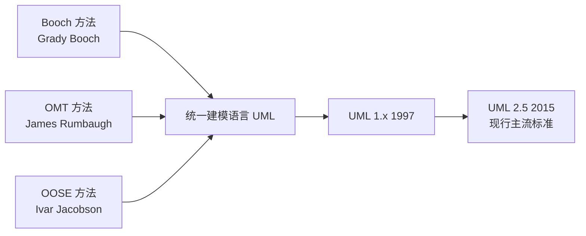
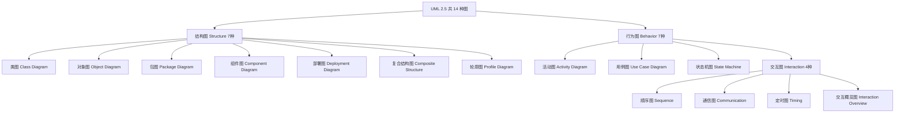
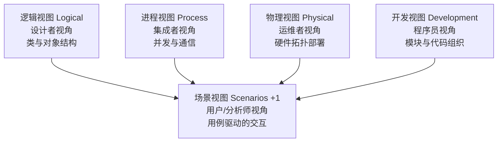

# 1.3 UML概述、视图、图与建模工具

面向对象方法需要一种统一的可视化语言来表达模型。UML（统一建模语言）正是为这一目的而生：它把不同流派的建模符号统一为标准，使分析师、设计师与程序员能用同一套图形交流。本节解决“UML 是什么、有哪些图、如何分类、用什么工具画”这一组基础问题，是后续每章具体图种学习的前置。

## UML 发展历史

UML（Unified Modeling Language，统一建模语言）的诞生是三种面向对象方法融合的结果：

- **Booch 方法**：侧重设计与实现，符号丰富；
- **OMT（Object Modeling Technique）**：侧重分析与数据建模；
- **OOSE（Object-Oriented Software Engineering）**：引入用例驱动思想。

1997 年 OMG（对象管理组织）采纳 UML 1.1 为标准；UML 2.5（2015，现行主流）在结构与语义上做了大幅规范化。三位作者 Booch、Rumbaugh、Jacobson 被合称“三友”（The Three Amigos）。

> [!definition] UML
> UML 是一种**通用的、可视化的、面向对象的建模语言**，通过标准化的图形符号描述软件系统的结构与行为，贯穿需求分析、设计与实现全过程，但不规定具体的开发流程与方法论。

## UML 2.5 的 14 种图分类

UML 2.5 定义了 14 种图，按描述内容分为结构图（7 种）与行为图（7 种）：

### 结构图（7 种）

描述系统的静态结构。

| 图 | 描述 | 典型阶段 |
| --- | --- | --- |
| 类图 | 类的属性、操作及类间关系 | 分析/设计 |
| 对象图 | 某时刻对象实例的快照 | 分析/设计 |
| 包图 | 包的组织与依赖 | 设计 |
| 组件图 | 组件接口与依赖 | 设计/架构 |
| 部署图 | 软件到硬件节点的部署 | 架构/部署 |
| 复合结构图 | 类内部结构、端口、连接器 | 设计 |
| 轮廓图 | UML 扩展机制（stereotype） | 元建模 |

### 行为图（7 种）

描述系统的动态行为，其中 4 种交互图是行为图的子集。

| 图 | 描述 | 典型阶段 |
| --- | --- | --- |
| 用例图 | 参与者与用例，刻画功能需求 | 分析 |
| 活动图 | 业务/算法流程，类似流程图 | 分析/设计 |
| 状态机图 | 对象生命周期状态变迁 | 设计 |
| 顺序图 | 按时间顺序的对象消息交互 | 设计 |
| 通信图 | 强调对象结构关系的消息交互 | 设计 |
| 定时图 | 强调时间约束的交互 | 实时系统设计 |
| 交互概览图 | 活动图 + 交互图的组合 | 设计 |

> [!tip] 课程重点图种
> 本课程重点掌握：用例图（第2章）、类图/对象图（第3章）、顺序图与通信图（第4章）、状态图与活动图（第5章）、包图/组件图/部署图（第6章）。其余图种了解用途即可。

## 4+1 视图模型

4+1 视图模型由 Philippe Kruchten 提出，用五个互补视图从不同干系人视角描述同一系统架构：

| 视图 | 关注 | 主要 UML 图 | 干系人 |
| --- | --- | --- | --- |
| 逻辑视图 | 功能需求如何被类与对象实现 | 类图、对象图、交互图 | 设计者 |
| 进程视图 | 并发、同步、性能、可扩展性 | 活动图、通信图（并发部分） | 系统集成者 |
| 物理视图 | 软件到硬件节点的部署、网络拓扑 | 部署图、组件图 | 运维者 |
| 开发视图 | 代码组织、模块分层、配置管理 | 包图、组件图 | 程序员 |
| 场景视图（+1） | 关键用例的交互场景，验证其他视图 | 用例图、顺序图 | 用户、分析师 |

> [!concept] 为什么叫“+1”
> 场景视图（用例）是其余四个视图的“粘合剂”：它从用户角度出发，用典型交互场景串联逻辑、进程、物理、开发四个视图，验证架构是否满足核心需求，故称“+1”。

## 建模工具介绍

UML 是规范，建模工具负责把规范落地为可编辑、可校验、可导出的模型。

| 工具 | 类型 | 主要特点 | 适用场景 |
| --- | --- | --- | --- |
| StarUML | 桌面建模工具 | 支持 UML 2.x 全图、界面友好、可扩展、支持代码生成与反向工程 | 课程作业、中小型项目建模 |
| PlantUML | 文本驱动建模 | 用纯文本描述生成图，Git 友好，可纳入 CI/CD 文档 | DevOps 文档、程序员工作流 |
| draw.io (diagrams.net) | 在线/桌面绘图 | 免费、易上手、模板丰富、支持协作 | 快速草图、文档配图 |
| Enterprise Architect | 企业级建模平台 | 完整生命周期、需求追踪、团队协作、可追溯 | 大型企业级架构设计 |

> [!tip] 选型建议
> 课程练习推荐 StarUML 作为主力工具（覆盖全部 UML 图且符合教学规范）；draw.io 适合快速绘制草图；PlantUML 适合有编程基础、希望图源版本化的同学。工具只是载体，掌握 UML 语义才是核心。

## 小结

UML 起源于 Booch、OMT、OOSE 三法融合，是面向对象建模的标准可视化语言。UML 2.5 的 14 种图按结构（7）与行为（7）分类，4+1 视图模型从五个干系人视角组织架构描述。建模工具（StarUML、PlantUML、draw.io、Enterprise Architect）各有侧重，按场景选型即可。后续章节将逐一深入用例图、类图与动态图。

## 关联

- 上一节：[[1.2 系统分析、系统设计基本概念]]
- 下一章：[[2.1 用例图基本元素与绘制]]
- 上一级：[[MOC - 第1章]]
