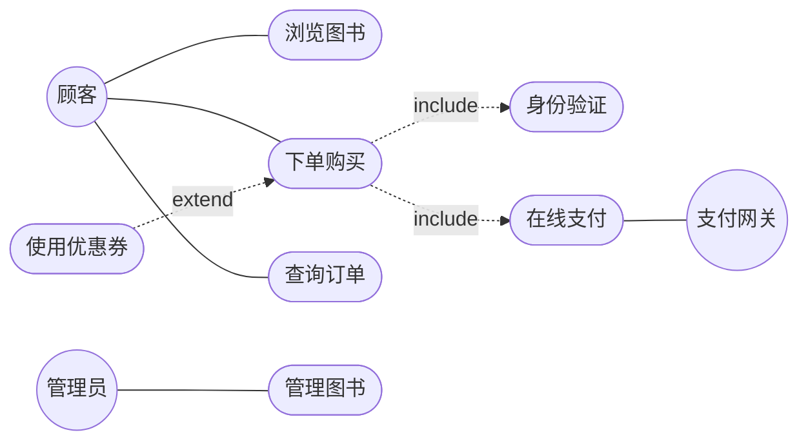

# 2.1 用例图基本元素与绘制

用例图（Use Case Diagram）是 UML 中刻画功能需求的图种，它回答“系统能为谁做什么”。用例图由参与者、用例及其关系构成，是从用户视角描述系统功能边界的第一手模型，也是 4+1 视图中场景视图的核心载体。

## 参与者（Actor）

> [!definition] 参与者
> 参与者是与系统交互的**外部实体**，代表一类角色而非具体个人。参与者可以是人、外部系统、硬件设备或时间触发器。

### 参与者的识别方法

1. **谁使用系统的主要功能？** → 主要参与者（如顾客）；
2. **谁需要系统支持其日常工作？** → 业务参与者（如管理员）；
3. **谁维护、管理系统？** → 次要参与者（如运维）；
4. **系统需要与哪些外部系统交互？** → 外部系统参与者（如支付网关）；
5. **是否有定时触发的事件？** → 时间参与者（如每日对账任务）。

### 主要参与者与次要参与者

| 类型 | 特征 | 例子 |
| --- | --- | --- |
| 主要参与者 | 主动发起用例，获取业务价值 | 顾客下单、读者借书 |
| 次要参与者 | 被动响应系统请求，提供服务 | 支付网关、库存系统、定时任务 |

> [!tip] 一个用户多种角色
> 同一个人可能扮演多个参与者（如既是顾客又是管理员）。参与者代表角色而非身份，应按“在系统中扮演什么角色”命名。

## 用例（Use Case）

> [!definition] 用例
> 用例是系统为参与者提供的一个**完整、可观察、有价值的交互序列**。它描述“系统能做什么”，而非“系统怎么实现”。

### 用例的命名规范

- 采用**动宾结构**（动词 + 宾语）：`下单`、`查询订单`、`管理库存`；
- 站在**参与者视角**，描述用户目标而非系统动作；
- 名字应能回答“参与者想要达成什么”；
- 避免技术化、实现化的命名（如避免“打开数据库连接”）。

> [!warning] 用例粒度
> 用例应描述一个对参与者有价值的完整目标，不要过细（如“点击按钮”不是用例）也不要过泛（如“使用系统”）。判断标准：该用例完成后，参与者是否获得了明确的价值。

### 用例描述

用例图中的椭圆只给出用例名，详细的行为通过用例描述（规约）文档补充（详见 [[2.2 用例描述与需求规约]]）。用例描述包含前置条件、主成功场景、扩展场景、后置条件等。

## 关系

用例图中有四种关系：参与者与用例之间的关联，以及用例之间的包含、扩展、泛化。

### 1. 关联（Association）

参与者与用例之间的通信关系，用**实线**连接，表示参与者参与该用例的执行。

### 2. 包含（Include）

基用例**必然**执行被包含用例，用带 `«include»` 的虚线箭头从基用例指向被包含用例。用于提取多个用例的公共行为。

### 3. 扩展（Extend）

扩展用例在**特定条件**下插入基用例，用带 `«extend»` 的虚线箭头从扩展用例指向基用例。基用例本身完整，扩展是可选增量。

### 4. 泛化（Generalization）

用例之间的继承关系，子用例继承父用例并可特化，用**空心三角实线**表示。参与者之间也可泛化。

> [!note] include 与 extend 方向
> 这是一个高频易错点：`«include»` 箭头从**基用例**指向**被包含用例**（基依赖被包含）；`«extend»` 箭头从**扩展用例**指向**基用例**（扩展依赖基）。详见 [[2.3 用例关系与需求追踪]]。

## 用例图示例：在线书店系统

> [!example]- 图例说明
> - 顾客（主要参与者）可浏览图书、下单购买、查询订单；
> - 下单购买**必然**包含身份验证与在线支付（include）；
> - 使用优惠券是下单的可选扩展（extend）；
> - 支付网关（次要参与者）参与在线支付；
> - 管理员管理图书。

## 小结

用例图由参与者、用例与四种关系构成，从用户视角刻画系统功能边界。参与者按角色识别并区分主次；用例以动宾结构命名、保持合适粒度；关联连接参与者与用例，include 提取公共行为，extend 描述条件增量，generalize 表达继承。下一节将学习如何用规约文档详细描述每个用例。

## 关联

- 上一级：[[MOC - 第2章]]
- 上一章：[[1.3 UML概述、视图、图与建模工具]]
- 下一节：[[2.2 用例描述与需求规约]]
- 进阶关系：[[2.3 用例关系与需求追踪]]
