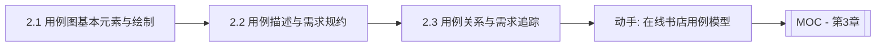

# MOC - 第2章 需求建模：用例模型

> [!info] 本章定位
> 第2章进入 OOA 的核心——用例建模。用例模型是 4+1 视图中的“场景视图”，它从用户视角回答“系统能为谁做什么”。本章解决三个问题：用例图怎么画（元素与关系）、用例怎么写得清楚（描述规约）、用例之间如何组织与追踪（关系与矩阵）。掌握用例模型是后续领域建模与动态建模的需求依据。

## 学习路线图

## 知识点导航

| 节 | 主题 | 核心要点 | 入口 |
| --- | --- | --- | --- |
| 2.1 | 用例图基本元素与绘制 | 参与者识别、用例命名、关联/包含/扩展/泛化关系 | [[2.1 用例图基本元素与绘制]] |
| 2.2 | 用例描述与需求规约 | 前置/后置条件、主成功场景、扩展场景、用例粒度与优先级 | [[2.2 用例描述与需求规约]] |
| 2.3 | 用例关系与需求追踪 | include/extend/generalize 语义、需求追踪矩阵 | [[2.3 用例关系与需求追踪]] |

## 核心考点

> [!warning] 重点掌握
> 1. 参与者（Actor）的识别方法，主要参与者与次要参与者的区分。
> 2. 用例的定义与命名规范（动宾结构、用户视角）。
> 3. 四种关系：关联、包含（include）、扩展（extend）、泛化（generalize）的语义与图符。
> 4. 用例描述模板的组成（前置条件、主成功场景、扩展场景、后置条件）。
> 5. include 与 extend 的本质区别（强制 vs 条件可选）。
> 6. 需求追踪矩阵的作用与构建方法。

## 自测题

> [!question] 题1
> 什么是参与者？如何区分主要参与者与次要参与者？
> > [!check]- 参考答案
> > 参与者（Actor）是与系统交互的外部实体，可以是人、外部系统、时间触发器等。主要参与者是从系统获取业务价值、主动发起用例的一方（如顾客下单）；次要参与者是被动为系统提供服务的参与者（如支付网关、定时任务）。区分依据是“谁主动发起并获取价值”。

> [!question] 题2
> 说明 include 与 extend 两种关系的区别，并各举一例。
> > [!check]- 参考答案
> > include（包含）：基用例在执行中**必然**调用被包含用例，用于提取多个用例的公共行为。例：“下单”必然包含“身份验证”。extend（扩展）：扩展用例在特定条件下**可选**插入基用例，基用例独立完整。例：“下单”在用户选择优惠券时扩展“使用优惠券”。核心区别：include 是强制的公共提取，extend 是条件可选的增量行为。

> [!question] 题3
> 用例描述中的“主成功场景”与“扩展场景”分别指什么？
> > [!check]- 参考答案
> > 主成功场景（Main Success Scenario）是参与者在无异常情况下达成目标的标准路径，描述“一切顺利”时的交互步骤序列。扩展场景（Extensions）是主场景中某步骤出现异常或条件分支时的备选处理路径，通常以“条件→处理”形式列出。两者共同覆盖用例的全部正常与异常流程。

> [!question] 题4
> 需求追踪矩阵的作用是什么？它通常包含哪些列？
> > [!check]- 参考答案
> > 需求追踪矩阵用于建立需求条目与用例（及后续设计、测试用例）之间的双向可追溯关系，确保需求不被遗漏、变更影响可评估。典型列包括：需求编号、需求描述、关联用例编号、用例名、优先级、状态、关联设计/测试用例。它支持正向追踪（需求→用例）与反向追踪（用例→需求）。

## 章节导航

- 上一级：[[MOC - 面向对象系统分析与建模]]
- 上一章：[[MOC - 第1章]]
- 下一章：[[MOC - 第3章]]
